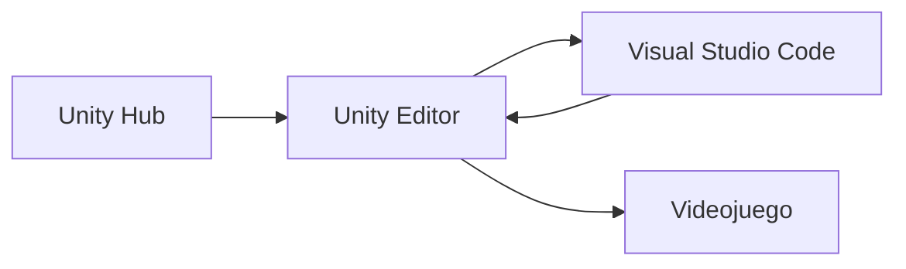

# Learning Unity 🎮

Proyecto didáctico para aprender Unity creando un videojuego paso a paso, con C#, buenas prácticas, arquitectura sencilla y pruebas.

## 🧰 Herramientas

- **Unity Hub:** instala y administra Unity Editor y los proyectos.
- **Unity Editor:** permite construir y ejecutar el videojuego.
- **Visual Studio Code:** permite escribir y depurar el código C#.
- **Git y GitHub:** guardan el historial y permiten colaborar.
- **Node.js:** permite utilizar las capacidades locales de Codex mediante `npx skills`.



## 🚀 Preparar Windows

Abre PowerShell y ejecuta los pasos en orden.

### 1. Comprobar `winget`

```powershell
winget --version
```

### 2. Instalar Git

```powershell
winget install --id Git.Git --exact --source winget
git --version
```

### 3. Instalar Node.js LTS

```powershell
winget install --id OpenJS.NodeJS.LTS --exact --source winget
node --version
npx --version
```

### 4. Instalar Visual Studio Code y la extensión de Unity

```powershell
winget install --id Microsoft.VisualStudioCode --exact --source winget
code --install-extension visualstudiotoolsforunity.vstuc
code --version
```

### 5. Clonar el repositorio

```powershell
git clone https://github.com/jcarrenogallego/learning-unity.git
cd learning-unity
code .
```

Si ya estás dentro del repositorio, no vuelvas a clonarlo.

### 6. Comprobar las capacidades locales de Codex

```powershell
npx skills list --json
```

Deben aparecer con `"scope": "project"`:

- `new-unity-project`
- `unity-cli`
- `unity-package-management`

### 7. Instalar Unity Hub

```powershell
winget install --id Unity.UnityHub --exact --source winget
winget list --id Unity.UnityHub --exact
```

Después:

1. Abre Unity Hub.
2. Inicia sesión o crea una cuenta.
3. Utiliza Unity Personal; no necesitas comprar Unity Pro para este aprendizaje.

⚠️ Elegiremos la versión de Unity Editor, la plantilla y los módulos cuando definamos la idea del juego.

## ✅ Comprobación final

```powershell
git --version
node --version
npx --version
code --version
npx skills list --json
winget list --id Unity.UnityHub --exact
```
