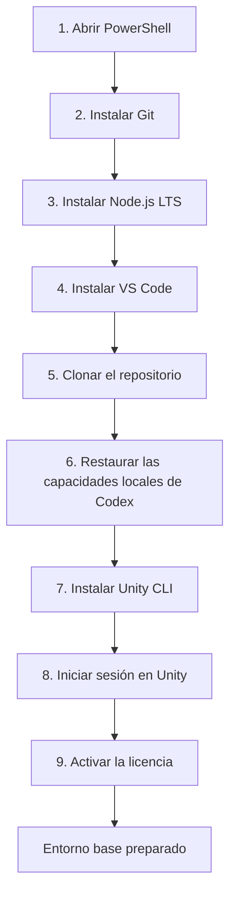
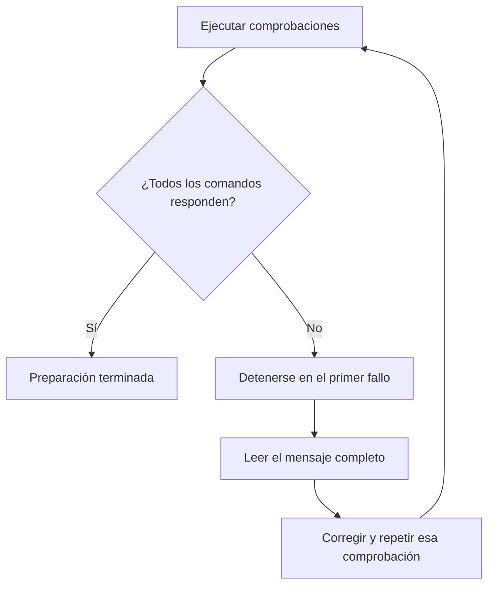
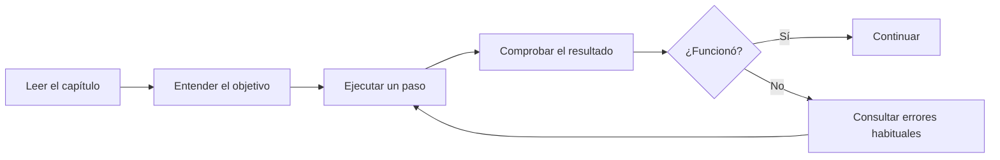

# Learning Unity

Repositorio didáctico para aprender Unity creando un videojuego y entendiendo qué ocurre en cada paso. Está escrito desde la perspectiva de un desarrollador con experiencia en .NET, pero utiliza lenguaje sencillo y no presupone experiencia previa con motores de videojuegos.

El propósito no es terminar un prototipo deprisa. Queremos aprender a trabajar con Unity de forma profesional: programación en C#, diseño de sistemas, arquitectura pragmática, pruebas, depuración, rendimiento, arte y generación de versiones ejecutables.

Aquí no damos nada por sabido sobre Unity. Cada paso explica:

1. qué vamos a hacer;
2. por qué lo hacemos;
3. cómo comprobar que ha funcionado;
4. qué errores son habituales;
5. qué concepto equivalente existe —o no existe— en .NET.

## Primeros pasos técnicos — preparar Windows

Esta primera preparación instala las herramientas comunes a cualquier juego. Todavía **no instalaremos una versión concreta del Editor de Unity ni crearemos el proyecto**: esas decisiones dependen de la idea del juego, la plataforma y si será 2D o 3D.

### Vista general



### Antes de empezar: cómo usar esta guía

Los comandos siguientes se ejecutan en **PowerShell**. Ejecuta un bloque, comprueba el resultado y solo entonces continúa con el siguiente.

Puedes abrir PowerShell buscando `PowerShell` en el menú Inicio. Los comandos de instalación pueden mostrar una ventana de permisos de Windows; lee el mensaje antes de aceptarlo.

### Paso 1 — Comprobar `winget`

`winget` es el instalador de aplicaciones incluido en las versiones modernas de Windows.

```powershell
winget --version
```

El resultado correcto muestra un número de versión. Si Windows no reconoce el comando, instala o actualiza **Instalador de aplicación** desde Microsoft Store antes de continuar.

### Paso 2 — Instalar Git

Git guarda el historial del proyecto y permite colaborar mediante GitHub.

```powershell
winget install --id Git.Git --exact --source winget
```

Cierra PowerShell, vuelve a abrirlo y comprueba la instalación:

```powershell
git --version
```

El resultado esperado se parece a `git version 2.x.x`.

### Paso 3 — Instalar Node.js LTS

No utilizaremos Node.js para programar el juego. Lo necesitamos para ejecutar `npx skills`, la herramienta que restaura las capacidades de Codex incluidas en este repositorio.

```powershell
winget install --id OpenJS.NodeJS.LTS --exact --source winget
```

Cierra y abre PowerShell y comprueba los tres comandos:

```powershell
node --version
npm --version
npx --version
```

Los tres deben mostrar una versión sin producir errores. Elegimos la edición **LTS** porque prioriza estabilidad y mantenimiento prolongado.

### Paso 4 — Instalar Visual Studio Code

VS Code será inicialmente nuestro editor para Markdown, Git y C#. Más adelante configuraremos su integración con la versión de Unity que elijamos.

```powershell
winget install --id Microsoft.VisualStudioCode --exact --source winget
```

Comprueba que funciona:

```powershell
code --version
```

No instalaremos todavía extensiones de Unity: primero elegiremos el Editor y comprobaremos qué integración recomienda esa versión.

### Paso 5 — Clonar y abrir el repositorio

Elige una carpeta de trabajo y ejecuta:

```powershell
git clone https://github.com/jcarrenogallego/learning-unity.git
cd learning-unity
code .
```

`code .` abre en VS Code la carpeta actual. En el explorador de archivos debes ver `README.md`, `docs`, `.agents` y `skills-lock.json`.

> Si ya estás trabajando dentro de este repositorio, no vuelvas a clonarlo. Continúa con el paso siguiente.

### Paso 6 — Restaurar las capacidades locales de Codex

Las capacidades especializadas —denominadas `skills` por Codex— pertenecen al repositorio y se encuentran bajo `.agents/skills`. No deben instalarse globalmente en el ordenador.

Desde la raíz de `learning-unity`, ejecuta:

```powershell
npx skills experimental_install
```

Comprueba el resultado:

```powershell
npx skills list --json
```

Debes ver estas tres capacidades con el valor literal `"scope": "project"`:

- `new-unity-project`;
- `unity-cli`;
- `unity-package-management`.

Sus rutas deben estar dentro de `learning-unity\.agents\skills`. `scope`, `project` y `global` se mantienen en inglés porque son valores literales producidos por la herramienta. Si aparece `"scope": "global"`, detente: la instalación no se hizo desde la raíz del repositorio.

### Paso 7 — Instalar Unity CLI

Unity CLI permite instalar y comprobar versiones del Editor, manejar licencias, abrir proyectos, ejecutar pruebas y generar versiones ejecutables desde la terminal.

Primero comprueba si ya está instalada:

```powershell
unity --version
```

Si PowerShell indica que `unity` no existe, ejecuta el instalador oficial:

```powershell
$env:UNITY_CLI_CHANNEL = 'beta'
irm https://public-cdn.cloud.unity3d.com/hub/prod/cli/install.ps1 | iex
```

La variable `UNITY_CLI_CHANNEL` es necesaria mientras Unity CLI permanezca en beta. Al terminar, cierra PowerShell, abre una ventana nueva y comprueba:

```powershell
unity --version
```

Si continúa sin reconocer el comando, no avances: reinicia la terminal y revisa el mensaje producido por el instalador.

### Paso 8 — Iniciar sesión en Unity

Necesitas una cuenta de Unity para administrar la licencia del Editor.

Comprueba primero el estado:

```powershell
unity auth status --format json
```

Si no has iniciado sesión:

```powershell
unity auth login
```

El comando muestra una dirección y abre el navegador. Completa allí el acceso y vuelve a PowerShell. Comprueba de nuevo:

```powershell
unity auth status --format json
```

Las credenciales se guardan en el almacén seguro del sistema. Nunca deben escribirse en el repositorio.

### Paso 9 — Comprobar o activar la licencia

Comprueba si el ordenador ya tiene una licencia activa:

```powershell
unity license status --format json
```

Si vas a utilizar Unity Personal y todavía no hay licencia:

```powershell
unity license activate --personal --accept-eula
```

Utiliza Unity Personal únicamente si cumples sus condiciones. Si tu empresa dispone de otra licencia, activa la asignada a tu cuenta en lugar de elegir `--personal`.

Comprueba una vez más:

```powershell
unity license status --format json
```

### Comprobación final



Ejecuta:

```powershell
git --version
node --version
npx --version
code --version
npx skills list --json
unity --version
unity auth status --format json
unity license status --format json
```

Con estas comprobaciones quedan preparadas las herramientas comunes. La idea del juego determinará después la versión LTS del Editor, los módulos de plataforma, la plantilla y los paquetes de Unity estrictamente necesarios.

## Cómo leer este repositorio



Empieza aquí:

- [Ruta de aprendizaje](docs/00-ruta-de-aprendizaje.md)
- [Capacidades de Codex instaladas y criterio de selección](docs/01-skills.md)
- [Cómo colaboramos con Git y GitHub](docs/02-git-y-github.md)
- [Mapa mental de Unity para desarrolladores .NET](docs/03-unity-para-desarrolladores-dotnet.md)

## Principios

- Aprendemos construyendo, pero entendiendo cada decisión.
- No elegimos arquitectura antes de conocer el problema.
- No instalamos paquetes “por si acaso”.
- El código debe ser fácil de leer, probar y cambiar.
- Los diagramas Mermaid acompañan los flujos que resultan más fáciles de entender visualmente.
