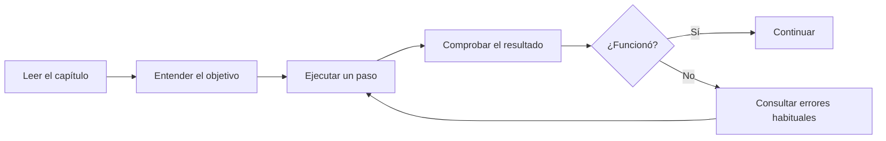

# Learning Unity

Repositorio didáctico para aprender Unity paso a paso desde la perspectiva de un desarrollador .NET.

Aquí no damos nada por sabido sobre Unity. Cada paso explica:

1. qué vamos a hacer;
2. por qué lo hacemos;
3. cómo comprobar que ha funcionado;
4. qué errores son habituales;
5. qué concepto equivalente existe —o no existe— en .NET.

> Estado actual: preparación del entorno. Todavía no se ha elegido ni creado el juego.

## Cómo leer este repositorio

Empieza aquí:

- [Ruta de aprendizaje](docs/00-ruta-de-aprendizaje.md)
- [Skills instaladas y criterio de selección](docs/01-skills.md)
- [Cómo colaboramos con Git y GitHub](docs/02-git-y-github.md)
- [Mapa mental de Unity para desarrolladores .NET](docs/03-unity-para-desarrolladores-dotnet.md)

## Principios

- Aprendemos construyendo, pero entendiendo cada decisión.
- No elegimos arquitectura antes de conocer el problema.
- No instalamos paquetes “por si acaso”.
- El código debe ser fácil de leer, probar y cambiar.
- Los diagramas Mermaid acompañan los flujos que resultan más fáciles de entender visualmente.

## Próximo paso

Definir contigo la idea del juego. Esa decisión determinará si el proyecto será 2D o 3D, el render pipeline, la plantilla de Unity y los paquetes necesarios.
