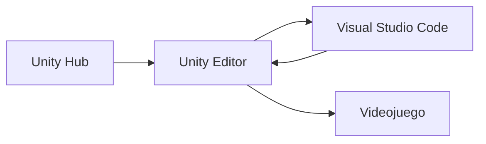

# Learning Unity 🎮

Proyecto didáctico para aprender Unity creando un videojuego paso a paso, con C#, buenas prácticas, arquitectura sencilla y pruebas.

## 🕹️ El juego

**Kogi: El lazo del destino** será un juego de acción y plataformas 2D para un jugador.

- Kogi puede avanzar, retroceder, agacharse y saltar.
- Utiliza espada, dagas y un lazo para atacar, balancearse y alcanzar muros.
- Tiene tres vidas para superar obstáculos y enemigos.
- El estilo será 2D ilustrado, colorido y con animaciones expresivas.
- Nivel 1: un reino desértico.
- Nivel 2: islas y barcos en el mar.
- Nivel 3: el inframundo y el enfrentamiento con el jefe final.
- El objetivo es derrotar al jefe y rescatar a la princesa.

Los personajes pertenecerán a un mundo fantástico inspirado visualmente en Oriente Medio, sin representar una cultura o religión real como enemiga.

## 🧰 Herramientas

- **Unity Hub:** instala y administra Unity Editor y los proyectos.
- **Unity Editor:** permite construir y ejecutar el videojuego.
- **Visual Studio Code:** permite escribir y depurar el código C#.
- **Git y GitHub:** guardan el historial y permiten colaborar.
- **Node.js:** permite utilizar las capacidades locales de Codex mediante `npx skills`.



## 🚀 Preparar Windows

Abre PowerShell y ejecuta los pasos en orden.

### 1. Comprobar `winget`

```powershell
winget --version
```

### 2. Instalar Git

```powershell
winget install --id Git.Git --exact --source winget
git --version
```

### 3. Instalar Node.js LTS

```powershell
winget install --id OpenJS.NodeJS.LTS --exact --source winget
node --version
npx --version
```

### 4. Instalar Visual Studio Code y la extensión de Unity

```powershell
winget install --id Microsoft.VisualStudioCode --exact --source winget
code --install-extension visualstudiotoolsforunity.vstuc
code --version
```

### 5. Clonar el repositorio

```powershell
git clone https://github.com/jcarrenogallego/learning-unity.git
cd learning-unity
code .
```

Si ya estás dentro del repositorio, no vuelvas a clonarlo.

### 6. Comprobar las capacidades locales de Codex

```powershell
npx skills list --json
```

Deben aparecer con `"scope": "project"`:

- `new-unity-project`
- `unity-cli`
- `unity-package-management`

### 7. Instalar Unity Hub

```powershell
winget install --id Unity.UnityHub --exact --source winget
winget list --id Unity.UnityHub --exact
```

## 📚 Sesiones

1. [Conocer Unity y crear la primera escena](docs/sesiones/01-primera-escena.md)
2. [Mover a Kogi horizontalmente con C#](docs/sesiones/02-movimiento-horizontal.md)
3. [Añadir gravedad, colisiones y salto](docs/sesiones/03-gravedad-colisiones-salto.md)
4. [Hacer que la cámara siga a Kogi](docs/sesiones/04-camara-que-sigue-a-kogi.md)
5. [Construir plataformas reutilizables](docs/sesiones/05-plataformas-reutilizables.md)
6. [Detectar una caída y hacer reaparecer a Kogi](docs/sesiones/06-caida-y-reaparicion.md)
7. [Añadir tres vidas y reiniciar el nivel](docs/sesiones/07-tres-vidas-y-reinicio.md)
8. [Mostrar las vidas en pantalla](docs/sesiones/08-mostrar-vidas-en-pantalla.md)
9. [Realizar el primer ataque](docs/sesiones/09-primer-ataque.md)
10. [Mirar y atacar en ambas direcciones](docs/sesiones/10-direccion-y-ataque.md)
11. [Hacer que Kogi se agache](docs/sesiones/11-agacharse.md)
12. [Hacer que un guardia patrulle](docs/sesiones/12-patrulla-del-guardia.md)
13. [Hacer que el contacto con un guardia quite una vida](docs/sesiones/13-dano-por-contacto.md)
14. [Añadir invulnerabilidad temporal después de recibir daño](docs/sesiones/14-invulnerabilidad-temporal.md)
15. [Lanzar una daga contra los guardias](docs/sesiones/15-lanzar-daga.md)
16. [Hacer que los guardias disparen a Kogi](docs/sesiones/16-disparo-del-guardia.md)
17. [Comprobar la línea de visión de los guardias](docs/sesiones/17-linea-de-vision.md)
18. [Organizar al guardia con una máquina de estados](docs/sesiones/18-estados-del-guardia.md)
19. [Integrar daño y muerte en los estados del guardia](docs/sesiones/19-dano-y-muerte-del-guardia.md)
20. [Avisar antes de que el guardia dispare](docs/sesiones/20-anticipacion-del-disparo.md)
21. [Conectar las acciones de Kogi con Animator](docs/sesiones/21-animator-de-kogi.md)
22. [Importar la primera identidad visual de Kogi](docs/sesiones/22-primer-sprite-de-kogi.md)
23. [Crear profundidad con un fondo parallax](docs/sesiones/23-fondo-parallax-del-desierto.md)
24. [Limitar la cámara dentro del nivel](docs/sesiones/24-limites-de-camara.md)
25. [Crear iluminación 2D ambiental](docs/sesiones/25-iluminacion-2d-ambiental.md)
26. [Proyectar sombras con Shadow Caster 2D](docs/sesiones/26-sombras-2d.md)
27. [Crear partículas ambientales](docs/sesiones/27-particulas-ambientales.md)
28. [Aplicar posprocesado con Global Volume](docs/sesiones/28-posprocesado-global.md)

Consulta también la [referencia actual de NivelDesierto](docs/referencia-nivel-desierto.md) antes de añadir o mover elementos de la escena.

La dirección artística y el futuro rig están definidos en el [plan de producción visual](docs/diseno/plan-produccion-visual.md).

Después:

1. Abre Unity Hub.
2. Inicia sesión o crea una cuenta.
3. Utiliza Unity Personal; no necesitas comprar Unity Pro para este aprendizaje.

### 8. Instalar Unity Editor

Desde Unity Hub:

1. Entra en **Installs**.
2. Pulsa **Install Editor**.
3. Elige la versión estable más reciente de Unity 6.
4. Añade **Windows Build Support (IL2CPP)**.
5. Pulsa **Install** y espera a que termine.

### 9. Crear el proyecto Kogi

Desde Unity Hub:

1. Entra en **Projects** y pulsa **New project**.
2. Selecciona la plantilla **Universal 2D**.
3. Escribe `Kogi` como nombre.
4. Elige la carpeta de este repositorio como ubicación.
5. Marca **Use Unity CLI**.
6. Deja desmarcado **Use AI Assistant**.
7. En proveedor, elige **Do not select any**: ya utilizamos Git y GitHub.
8. Pulsa **Create project**.
9. Espera a que Unity importe y compile todo sin errores rojos en **Console**.

El proyecto quedará dentro de la carpeta `Kogi`.

## ✅ Comprobación final

```powershell
git --version
node --version
npx --version
code --version
npx skills list --json
winget list --id Unity.UnityHub --exact
```
