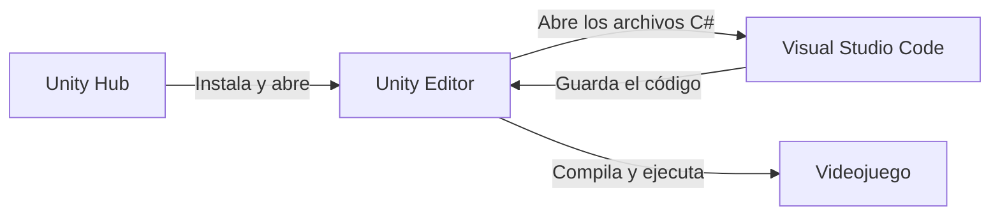
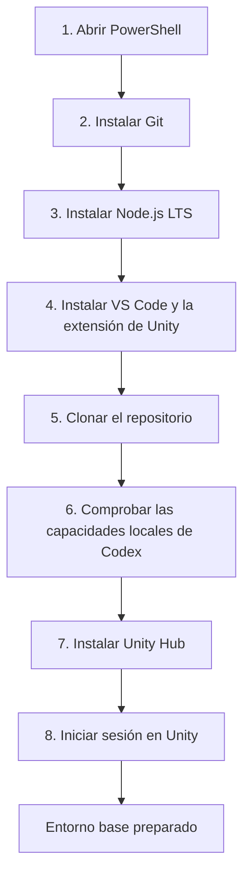
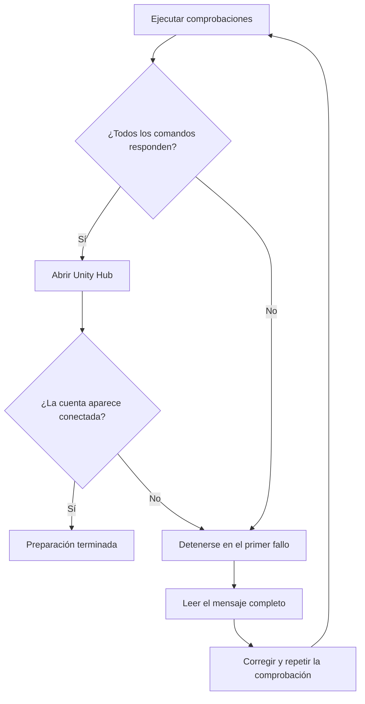
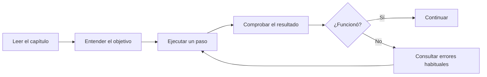

# Learning Unity

Repositorio didáctico para aprender Unity creando un videojuego y entendiendo qué ocurre en cada paso. Está escrito desde la perspectiva de un desarrollador con experiencia en .NET, pero utiliza lenguaje sencillo y no presupone experiencia previa con motores de videojuegos.

El propósito no es terminar un prototipo deprisa. Queremos aprender a trabajar con Unity de forma profesional: programación en C#, diseño de sistemas, arquitectura pragmática, pruebas, depuración, rendimiento, arte y generación de versiones ejecutables.

Aquí no damos nada por sabido sobre Unity. Cada paso explica:

1. qué vamos a hacer;
2. por qué lo hacemos;
3. cómo comprobar que ha funcionado;
4. qué errores son habituales;
5. qué concepto equivalente existe —o no existe— en .NET.

## 🧭 Herramientas y responsabilidades

Unity Hub, Unity Editor y Visual Studio Code son aplicaciones diferentes. Se complementan; ninguna sustituye completamente a las otras.

| Herramienta | Para qué la utilizaremos | Lo que no hace |
|---|---|---|
| **Unity Hub** | Instalar y administrar versiones de Unity Editor, módulos, proyectos y cuenta | No permite diseñar ni ejecutar el juego |
| **Unity Editor** | Crear escenas, colocar GameObjects, configurar componentes, importar assets y ejecutar el juego en Play Mode | No es nuestro editor principal para escribir C# |
| **Visual Studio Code** | Escribir, navegar y depurar el código C# | No reemplaza las herramientas visuales de Unity Editor |



💡 Durante el trabajo diario tendremos Unity Editor y Visual Studio Code abiertos al mismo tiempo: construiremos el mundo del juego en Unity y escribiremos el código en VS Code.

## Primeros pasos técnicos — preparar Windows

Esta primera preparación instala las herramientas comunes a cualquier juego. Todavía **no instalaremos una versión concreta del Editor de Unity ni crearemos el proyecto**: esas decisiones dependen de la idea del juego, la plataforma y si será 2D o 3D.

### Vista general



### Antes de empezar: cómo usar esta guía

Los comandos siguientes se ejecutan en **PowerShell**. Ejecuta un bloque, comprueba el resultado y solo entonces continúa con el siguiente.

Puedes abrir PowerShell buscando `PowerShell` en el menú Inicio. Los comandos de instalación pueden mostrar una ventana de permisos de Windows; lee el mensaje antes de aceptarlo.

### Paso 1 — Comprobar `winget`

`winget` es el instalador de aplicaciones incluido en las versiones modernas de Windows.

```powershell
winget --version
```

El resultado correcto muestra un número de versión. Si Windows no reconoce el comando, instala o actualiza **Instalador de aplicación** desde Microsoft Store antes de continuar.

### Paso 2 — Instalar Git

Git guarda el historial del proyecto y permite colaborar mediante GitHub.

```powershell
winget install --id Git.Git --exact --source winget
```

Cierra PowerShell, vuelve a abrirlo y comprueba la instalación:

```powershell
git --version
```

El resultado esperado se parece a `git version 2.x.x`.

### Paso 3 — Instalar Node.js LTS

No utilizaremos Node.js para programar el juego. Lo necesitamos para ejecutar `npx skills`, la herramienta que permite comprobar y gestionar las capacidades de Codex incluidas en este repositorio.

```powershell
winget install --id OpenJS.NodeJS.LTS --exact --source winget
```

Cierra y abre PowerShell y comprueba los tres comandos:

```powershell
node --version
npm --version
npx --version
```

Los tres deben mostrar una versión sin producir errores. Elegimos la edición **LTS** porque prioriza estabilidad y mantenimiento prolongado.

### Paso 4 — Instalar Visual Studio Code y la extensión de Unity

VS Code será nuestro editor para Markdown, Git y C#. La extensión oficial de Unity añade navegación, análisis y depuración de los scripts del juego.

```powershell
winget install --id Microsoft.VisualStudioCode --exact --source winget
```

Comprueba que funciona:

```powershell
code --version
```

Instala la extensión oficial **Unity** publicada por Microsoft:

```powershell
code --install-extension visualstudiotoolsforunity.vstuc
```

Esta extensión instala también sus dependencias para trabajar con C#, incluido C# Dev Kit. Comprueba que aparece en la lista:

```powershell
code --list-extensions | Select-String 'visualstudiotoolsforunity.vstuc'
```

✅ El resultado correcto muestra `visualstudiotoolsforunity.vstuc`.

Cuando exista el proyecto, configuraremos VS Code como editor externo desde **Unity > Preferences > External Tools > External Script Editor**. También comprobaremos que el proyecto utiliza el paquete `Visual Studio Editor` compatible; no utilizaremos el antiguo paquete `Visual Studio Code Editor`, porque ya no recibe mantenimiento.

### Paso 5 — Clonar y abrir el repositorio

Elige una carpeta de trabajo y ejecuta:

```powershell
git clone https://github.com/jcarrenogallego/learning-unity.git
cd learning-unity
code .
```

`code .` abre en VS Code la carpeta actual. En el explorador de archivos debes ver `README.md`, `docs`, `.agents` y `skills-lock.json`.

> Si ya estás trabajando dentro de este repositorio, no vuelvas a clonarlo. Continúa con el paso siguiente.

### Paso 6 — Comprobar las capacidades locales de Codex

Las capacidades especializadas —denominadas `skills` por Codex— pertenecen al repositorio y se encuentran bajo `.agents/skills`. Git las descarga junto con el resto de archivos al clonar el repositorio, por lo que no necesitan una instalación adicional ni deben instalarse globalmente en el ordenador.

Desde la raíz de `learning-unity`, comprueba el resultado:

```powershell
npx skills list --json
```

Debes ver estas tres capacidades con el valor literal `"scope": "project"`:

- `new-unity-project`;
- `unity-cli`;
- `unity-package-management`.

Sus rutas deben estar dentro de `learning-unity\.agents\skills`. `scope`, `project` y `global` se mantienen en inglés porque son valores literales producidos por la herramienta. Si no aparecen, comprueba que ejecutaste el comando desde la raíz del repositorio y que la carpeta `.agents` existe.

### Paso 7 — Instalar Unity Hub

Unity Hub es la aplicación estable y habitual para administrar Unity. Desde ella instalaremos el Editor, añadiremos módulos, crearemos y abriremos proyectos y gestionaremos la cuenta.

Instálala desde PowerShell:

```powershell
winget install --id Unity.UnityHub --exact --source winget
```

También puedes descargarla desde la [página oficial de Unity](https://unity.com/download).

Comprueba que Windows reconoce la instalación:

```powershell
winget list --id Unity.UnityHub --exact
```

El resultado debe incluir `Unity Hub`. Ábrela desde el menú Inicio.

> 💡 Unity CLI es una herramienta adicional para automatizar instalaciones, pruebas y versiones ejecutables desde la terminal. Actualmente está en beta y no es necesaria para comenzar, por lo que no la instalamos como requisito.

### Paso 8 — Iniciar sesión en Unity

Unity Hub solicita una cuenta de Unity. Si todavía no tienes una, puedes crearla desde la propia aplicación.

Dentro de Unity Hub:

1. Pulsa el icono de la cuenta.
2. Selecciona **Sign in**.
3. Completa el acceso en el navegador.
4. Regresa a Unity Hub y comprueba que aparece tu cuenta.

Para este aprendizaje utilizaremos Unity Personal, que es la modalidad gratuita siempre que se cumplan sus condiciones económicas. No es necesario comprar Unity Pro.

⚠️ No instales todavía una versión del Editor. Primero definiremos el juego para elegir de forma consciente la versión LTS, la plantilla y los módulos necesarios.

### Comprobación final



Ejecuta:

```powershell
git --version
node --version
npx --version
code --version
code --list-extensions | Select-String 'visualstudiotoolsforunity.vstuc'
npx skills list --json
winget list --id Unity.UnityHub --exact
```

Con estas comprobaciones quedan preparadas las herramientas comunes. La idea del juego determinará después la versión LTS del Editor, los módulos de plataforma, la plantilla y los paquetes de Unity estrictamente necesarios.

## Cómo leer este repositorio



Empieza aquí:

- [Ruta de aprendizaje](docs/00-ruta-de-aprendizaje.md)
- [Capacidades de Codex instaladas y criterio de selección](docs/01-skills.md)
- [Cómo colaboramos con Git y GitHub](docs/02-git-y-github.md)
- [Mapa mental de Unity para desarrolladores .NET](docs/03-unity-para-desarrolladores-dotnet.md)

## Principios

- Aprendemos construyendo, pero entendiendo cada decisión.
- No elegimos arquitectura antes de conocer el problema.
- No instalamos paquetes “por si acaso”.
- El código debe ser fácil de leer, probar y cambiar.
- Los diagramas Mermaid acompañan los flujos que resultan más fáciles de entender visualmente.
