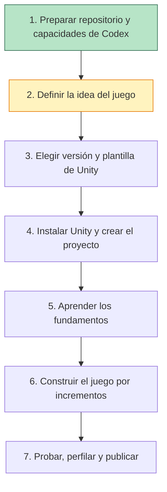
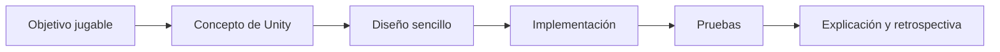

# Ruta de aprendizaje

Esta ruta funciona como una guía de electrodoméstico: una acción pequeña cada vez, una comprobación visible y una explicación clara.

## Estado de las etapas

## Etapa 1 — Preparación

Objetivo: tener un repositorio público, documentación navegable y las herramientas básicas del asistente.

Terminada cuando:

- el repositorio existe en GitHub;
- `main` está protegida;
- las guías se leen correctamente;
- las capacidades oficiales básicas de Unity para Codex están instaladas.

## Etapa 2 — Idea del juego

No empezaremos a programar hasta poder responder con una frase a estas preguntas:

- ¿Qué hace el jugador continuamente?
- ¿Cómo gana o progresa?
- ¿Cómo pierde o falla?
- ¿Será 2D o 3D?
- ¿En qué plataforma se ejecutará primero?
- ¿Cuál es la versión más pequeña que ya resulta jugable?

El resultado será una ficha breve del juego, no un documento enorme.

## Etapa 3 — Decisiones técnicas

Elegiremos la versión estable de Unity, la plantilla y los paquetes después de conocer el juego. Comprobaremos la compatibilidad real de C#: Unity decide qué sintaxis y entorno de ejecución admite, aunque el equipo tenga instalado un SDK de .NET más moderno.

## Etapas posteriores

Cada funcionalidad seguirá este ciclo:

No se introducirá un patrón de diseño solo para demostrar que existe. Primero aparecerá el problema; después compararemos soluciones y aplicaremos la más sencilla que lo resuelva.
