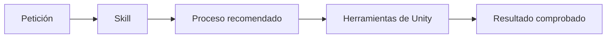

# Skills de Unity

Una skill es una guía especializada que ayuda al asistente a seguir un proceso fiable. No es un paquete que se añade al juego y no modifica Unity por sí sola.

## Skills instaladas

| Skill | Procedencia | Para qué sirve | Cuándo se usa |
|---|---|---|---|
| `unity-cli` | Unity Technologies | Instalar y manejar Unity, abrir proyectos, ejecutar tests y builds | Operaciones con el editor |
| `unity-package-management` | Unity Technologies | Buscar e instalar paquetes compatibles mediante Unity Package Manager | Cuando el juego necesite paquetes |
| `new-unity-project` | Unity Technologies | Guiar la creación de un proyecto sin inventar plantilla ni dependencias | Después de definir el juego |

Se eligieron skills del repositorio oficial `Unity-Technologies/skills`. No se instalaron skills comunitarias de gameplay o arquitectura porque todavía no conocemos el juego y varias candidatas tenían poca adopción o solapaban capacidades ya disponibles.

## Regla de selección

Antes de añadir otra skill comprobaremos:

1. que resuelve una necesidad real;
2. quién la mantiene;
3. cuándo fue actualizada;
4. si es compatible con nuestra versión de Unity;
5. si duplica otra skill;
6. si su código e instrucciones son seguros.

## Importante

Instalar una skill no equivale a instalar un paquete de Unity:

- **Skill:** conocimiento y procedimiento para el asistente.
- **Paquete de Unity:** código que forma parte del proyecto y aparece en `Packages/manifest.json`.
- **Herramienta externa:** programa instalado en el ordenador, como Unity Hub, Git o un editor de código.

Los paquetes de Unity se decidirán más adelante. No editaremos `Packages/manifest.json` a mano: utilizaremos el Package Manager para que Unity resuelva versiones compatibles.
