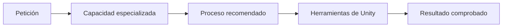

# Capacidades de Unity para Codex

Una capacidad especializada —denominada `skill` por Codex— es una guía que ayuda al asistente a seguir un proceso fiable. No es un paquete que se añade al juego y no modifica Unity por sí sola.

En este proyecto estas capacidades están instaladas **dentro del repositorio**, no globalmente en el ordenador:

```text
learning-unity/
├── .agents/
│   └── skills/
│       ├── new-unity-project/
│       │   └── SKILL.md
│       ├── unity-cli/
│       │   ├── SKILL.md
│       │   └── references/
│       └── unity-package-management/
│           ├── SKILL.md
│           └── references/
└── skills-lock.json
```

Codex descubre las capacidades locales desde `.agents/skills`. Cada una tiene una carpeta propia y un archivo llamado exactamente `SKILL.md`. El archivo `skills-lock.json` registra su origen y versión. Las carpetas completas están guardadas en Git, por lo que se descargan al clonar el repositorio y no necesitan restaurarse mediante un comando experimental.



## Capacidades instaladas

| Capacidad | Procedencia | Para qué sirve | Cuándo se usa |
|---|---|---|---|
| `unity-cli` | Unity Technologies | Instalar y manejar Unity, abrir proyectos, ejecutar pruebas y generar versiones ejecutables | Operaciones con el Editor |
| `unity-package-management` | Unity Technologies | Buscar e instalar paquetes compatibles mediante Unity Package Manager | Cuando el juego necesite paquetes |
| `new-unity-project` | Unity Technologies | Guiar la creación de un proyecto sin inventar plantilla ni dependencias | Después de definir el juego |

Se eligieron capacidades del repositorio oficial `Unity-Technologies/skills`. No se instalaron alternativas comunitarias de programación del juego o arquitectura porque aún no conocemos sus necesidades y varias candidatas tenían poca adopción o repetían capacidades ya disponibles.

## Cómo se instalaron

Desde la raíz del repositorio:

```powershell
npx skills add Unity-Technologies/skills `
  --skill unity-cli unity-package-management new-unity-project `
  --agent codex `
  --yes
```

No se utiliza `--global` ni `-g`. Esas opciones instalarían las capacidades para el usuario completo y harían que estuvieran disponibles también fuera de este proyecto.

Para comprobar el resultado:

```powershell
npx skills list --json
```

Cada resultado debe indicar los valores literales `"scope": "project"` y una ruta dentro de `learning-unity\.agents\skills`.

## Regla de selección

Antes de añadir otra capacidad comprobaremos:

1. que resuelve una necesidad real;
2. quién la mantiene;
3. cuándo fue actualizada;
4. si es compatible con nuestra versión de Unity;
5. si duplica otra capacidad;
6. si su código e instrucciones son seguros.

## Importante

Instalar una capacidad de Codex no equivale a instalar un paquete de Unity:

- **Capacidad de Codex (`skill`):** conocimiento y procedimiento para el asistente.
- **Paquete de Unity:** código que forma parte del proyecto y aparece en `Packages/manifest.json`.
- **Herramienta externa:** programa instalado en el ordenador, como Unity Hub, Git o un editor de código.

Los paquetes de Unity se decidirán más adelante. No editaremos `Packages/manifest.json` a mano: utilizaremos el Package Manager para que Unity resuelva versiones compatibles.
