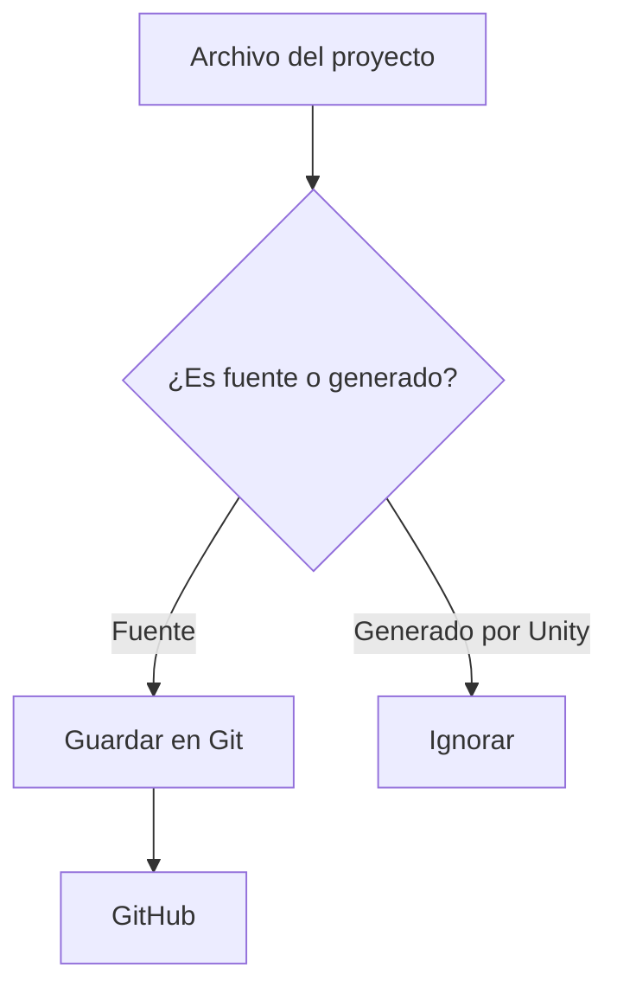
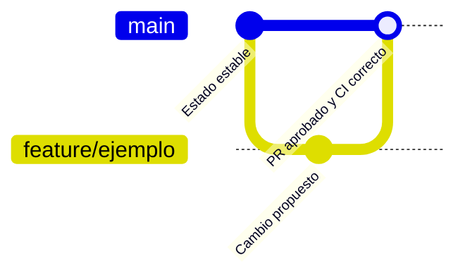
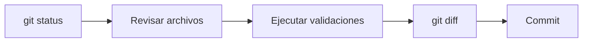

# Git y GitHub, paso a paso

## Qué guardamos

Git guarda código, configuración, documentación y assets necesarios. Unity también genera carpetas grandes que pueden reconstruirse; esas carpetas no deben subirse.



Cuando exista el proyecto, cada asset deberá viajar junto con su archivo `.meta`. El `.meta` contiene el identificador que Unity utiliza para mantener referencias entre escenas, prefabs, scripts y assets.

## Flujo de ramas

`main` representa el estado estable. El propietario puede hacer push directo; cualquier otra persona debe utilizar un pull request.



Para colaboradores:

1. Crear una rama desde `main`.
2. Realizar commits pequeños y descriptivos.
3. Subir la rama.
4. Abrir un pull request.
5. Esperar a que la validación automática termine.
6. Conseguir una aprobación y resolver las conversaciones.
7. Fusionar el PR.

## Conventional Commits

Formato básico:

```text
tipo(área): descripción breve
```

Ejemplos:

```text
docs(git): explica el flujo de pull requests
feat(movement): añade movimiento horizontal
test(health): prueba que la vida nunca sea negativa
fix(input): evita procesar dos veces una pulsación
```

## Comprobación antes de un commit



Nunca deben aparecer credenciales, licencias privadas, `Library/`, `Temp/`, `Logs/`, `obj/` ni builds generados.
