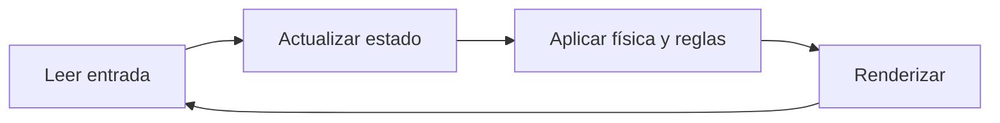

# Unity para desarrolladores .NET

Unity utiliza C#, pero su modelo mental no es el de ASP.NET ni el de una aplicación de consola.

## Comparación inicial

| En .NET empresarial | En Unity |
|---|---|
| Proceso y servicios | Juego ejecutándose por frames |
| Contenedor de dependencias | Escenas, GameObjects y composición de componentes |
| Configuración en JSON/options | Inspector y ScriptableObjects, según el caso |
| Request/response | Ciclo continuo de entrada, simulación y renderizado |
| Tests unitarios habituales | Tests EditMode y PlayMode |

La comparación sirve para orientarse, no para copiar arquitecturas literalmente.

## El ciclo mental básico

Un `MonoBehaviour` es un componente que Unity conecta a un `GameObject`. Unity llama determinados métodos del componente durante su ciclo de vida. No crearemos una jerarquía grande de herencia: favoreceremos componentes pequeños y composición.

## Qué aprenderemos antes de hablar de arquitectura

1. Proyecto, escena y GameObject.
2. Componentes y el Inspector.
3. Assets y archivos `.meta`.
4. Prefabs.
5. Ciclo de vida y frames.
6. Entrada, tiempo y física.
7. Diferencia entre datos, reglas del juego y presentación.

Después de experimentar estos conceptos podremos colocar límites arquitectónicos con razones concretas.

## Versión de C#

La regla será sencilla: usaremos la sintaxis más moderna que soporte oficialmente la versión elegida de Unity. Un SDK moderno instalado en el ordenador no cambia automáticamente el compilador ni el perfil de API usado por Unity.
