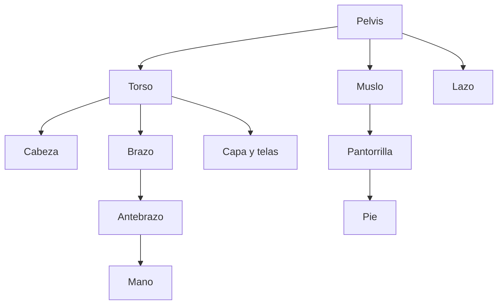

# Plan de producción visual de Kogi 🎨

## Dirección artística

- Juego 2D ilustrado de fantasía.
- Siluetas claras y animaciones expresivas.
- Paleta nocturna con azul, violeta, arena, bronce y acentos cian.
- Mundo inspirado visualmente en Oriente Medio, sin representar pueblos o religiones reales como enemigos.
- Escenarios con profundidad mediante capas y `parallax`.

## Animación híbrida de Kogi

Kogi no se construirá como una única imagen rígida. Prepararemos una fuente gráfica separada en piezas y la conectaremos mediante huesos 2D.

### Piezas previstas

- Cabeza, cabello y pañuelo.
- Cuello, torso y pelvis.
- Brazos, antebrazos y manos de ambos lados.
- Muslos, pantorrillas y pies de ambos lados.
- Capa, faldones y telas secundarias.
- Lazo, dagas y espada como accesorios independientes.

### Técnica prevista

- Paquete **2D Animation** de Unity.
- Huesos y pesos mediante `Skinning Editor`.
- Deformación con `Sprite Skin`.
- `2D IK` cuando ayude a colocar manos o pies.
- Movimiento secundario para tela, cabello y lazo.
- Capas y máscaras del `Animator` cuando torso y piernas necesiten acciones diferentes.

### Enfoque híbrido

- Animación esquelética para `Idle`, caminar, correr y movimientos continuos.
- Poses o sprites específicos para ataques fuertes y acciones muy expresivas.
- Efectos separados para dagas, golpes y energía del lazo.
- Transiciones suaves en el `Animator`, sin mezclar la animación con la física.

## Orden de producción

1. Validar mecánicas con recursos provisionales.
2. Establecer identidad, escala y paleta.
3. Construir los escenarios por capas.
4. Diseñar a Kogi específicamente para animación, con piezas solapadas.
5. Crear el rig y comprobar sus articulaciones.
6. Producir las animaciones principales.
7. Añadir movimiento secundario y efectos.
8. Sustituir progresivamente los recursos provisionales.

La ilustración estática actual sirve como referencia de identidad. No se cortará automáticamente para formar el rig: las piezas definitivas deberán dibujarse con zonas de solapamiento en hombros, codos, cadera y rodillas.
