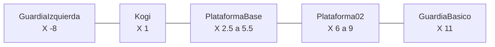

# Referencia actual de NivelDesierto 🗺️

Este documento registra las posiciones de trabajo acordadas. Debe consultarse antes de añadir plataformas, enemigos, obstáculos o puntos interactivos.

## Elementos principales

| GameObject | Position `(X, Y, Z)` | Scale `(X, Y, Z)` | Observación |
|---|---|---|---|
| `Kogi` | `(1, 0, 0)` | `(1, 1, 1)` | Posición inicial |
| `RespawnPoint` | `(1, 0, 0)` | `(1, 1, 1)` | Reaparición de Kogi |
| `Suelo` | `(0, -2, 0)` | `(30, 1, 1)` | Ocupa desde `X = -15` hasta `15` |
| `PlataformaBase` | `(4, -1, 0)` | `(3, 0.5, 1)` | Ocupa desde `X = 2.5` hasta `5.5` |
| `Plataforma02` | `(7.5, -1, 0)` | `(3, 0.5, 1)` | Ocupa desde `X = 6` hasta `9` |
| `Plataforma03` | `(11, -1, 0)` | `(3, 0.5, 1)` | Ocupa desde `X = 9.5` hasta `12.5` |
| `ZonaCaida` | `(0, -5, 0)` | — | Área física desde `X = -20` hasta `20` |

## Guardias

| GameObject | Position inicial | Patrol Distance | Recorrido horizontal | Soporte |
|---|---|---:|---|---|
| `GuardiaIzquierda` | `(-8, -0.75, 0)` | `2` | `X = -10` a `-6` | `Suelo` |
| `GuardiaBasico` | `(11, 0, 0)` | `1` | `X = 10` a `12` | `Plataforma03` |

Los dos guardias utilizan `Detection Range = 6`. Desde la posición inicial de Kogi ninguno puede verlo, por lo que la escena comienza sin disparos inmediatos.

## Regla para las sesiones siguientes

- Actualiza este documento cuando una posición acordada cambie de forma permanente.
- Los objetos temporales de prueba no se registran.
- Antes de colocar un guardia, comprueba su posición, `Patrol Distance`, plataforma de soporte y `Detection Range`.

---

[🏠 Inicio](../README.md)
