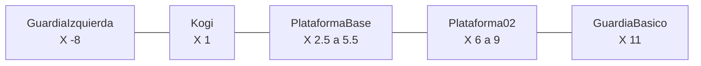

# Referencia actual de NivelDesierto 🗺️

Este documento registra las posiciones de trabajo acordadas. Debe consultarse antes de añadir plataformas, enemigos, obstáculos o puntos interactivos.

## Elementos principales

| GameObject | Position `(X, Y, Z)` | Scale `(X, Y, Z)` | Observación |
|---|---|---|---|
| `Kogi` | `(1, 0, 0)` | `(1, 1, 1)` | Posición inicial |
| `RespawnPoint` | `(1, 0, 0)` | `(1, 1, 1)` | Reaparición de Kogi |
| `Suelo` | `(0, -2, 0)` | `(30, 1, 1)` | Ocupa desde `X = -15` hasta `15` |
| `PlataformaBase` | `(4, -1, 0)` | `(3, 0.5, 1)` | Ocupa desde `X = 2.5` hasta `5.5` |
| `Plataforma02` | `(7.5, -1, 0)` | `(3, 0.5, 1)` | Ocupa desde `X = 6` hasta `9` |
| `Plataforma03` | `(11, -1, 0)` | `(3, 0.5, 1)` | Ocupa desde `X = 9.5` hasta `12.5` |
| `ZonaCaida` | `(0, -5, 0)` | — | Área física desde `X = -20` hasta `20` |

## Guardias

| GameObject | Position inicial | Patrol Distance | Recorrido horizontal | Soporte |
|---|---|---:|---|---|
| `GuardiaIzquierda` | `(-8, -0.75, 0)` | `2` | `X = -10` a `-6` | `Suelo` |
| `GuardiaBasico` | `(11, 0, 0)` | `1` | `X = 10` a `12` | `Plataforma03` |

Los dos guardias utilizan `Detection Range = 6`. Desde la posición inicial de Kogi ninguno puede verlo, por lo que la escena comienza sin disparos inmediatos.

## Iluminación ambiental

| GameObject | Position `(X, Y, Z)` | Tipo | Color | Intensidad | Radio exterior |
|---|---|---|---|---:|---:|
| `Global Light 2D` | Global | `Global` | `#6B79A6` | `0.45` | — |
| `MoonGlow` | `(0, 2.5, 0)` | `Spot` circular | `#63C7FF` | `0.85` | `7` |
| `WarmRuinsLight` | `(-8, 0, 0)` | `Spot` circular | `#FF9A55` | `1.1` | `4.5` |

`MoonGlow` y `WarmRuinsLight` son hijos del contenedor `EnvironmentLighting`. Sus ángulos interior y exterior son de `360°`.

Proyectan sombras mediante `Shadow Caster 2D`: `Kogi`, `GuardiaIzquierda`, `GuardiaBasico`, `PlataformaBase`, `Plataforma02` y `Plataforma03`. El suelo se mantiene sin este componente para evitar una gran sombra innecesaria debajo del nivel.

## Partículas ambientales

| GameObject | Position `(X, Y, Z)` | Área de emisión | Color | Partículas por segundo |
|---|---|---|---|---:|
| `BlueWisps` | `(0, 0.5, 0)` | Caja `(22, 1, 0.1)` | `#63C7FF` | `6` |
| `WarmEmbers` | `(-8, 0, 0)` | Caja `(4, 0.5, 0.1)` | `#FFB56B` | `4` |

Ambos son hijos de `AmbientParticles`, usan el material URP 2D `AmbientParticle` y la textura circular suave `SoftParticleTexture`. Son efectos visuales: no contienen colliders, no aplican daño y no alteran la iluminación ni la física.

## Posprocesado

La escena contiene el GameObject raíz `PostProcessing` con un `Global Volume`. Utiliza el perfil `Assets/Kogi/Settings/PostProcessing/NivelDesiertoPostProcessing.asset`:

| Efecto | Valores principales | Propósito |
|---|---|---|
| `Bloom` | Threshold `0.75`, Intensity `0.3`, Scatter `0.65` | Suavizar el brillo de luces y partículas |
| `Vignette` | Intensity `0.22`, Smoothness `0.45`, color `#080B1A` | Oscurecer discretamente los bordes |

La cámara principal tiene activado el posprocesado. Estos efectos modifican únicamente la imagen final; no cambian las luces, sprites, colliders ni reglas del juego.

## Identidad modular de Kogi

`Kogi` conserva `Rigidbody2D`, collider y scripts en el GameObject raíz. Su apariencia está separada dentro de `KogiRig`, construido con once sprites de `KogiRigParts.asset`. El rig usa articulaciones `Transform` y `KogiRigAnimator`; no altera la física.

La ilustración modular fuente es `Assets/Kogi/Art/Characters/Kogi/KogiPartsSheet.png`. Los sonidos provisionales de salto, ataque y daño están en `Assets/Kogi/Audio/SFX/Player` y los reproduce un único `AudioSource` mediante `KogiAudioFeedback`.

## Regla para las sesiones siguientes

- Actualiza este documento cuando una posición acordada cambie de forma permanente.
- Los objetos temporales de prueba no se registran.
- Antes de colocar un guardia, comprueba su posición, `Patrol Distance`, plataforma de soporte y `Detection Range`.

---

[🏠 Inicio](../README.md)
