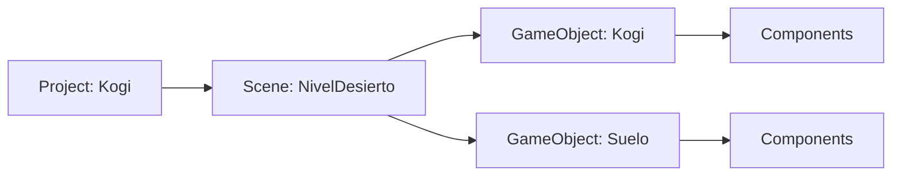

# Sesión 1: conocer Unity y crear la primera escena 🎮

Duración aproximada: **45–60 minutos**.

## 🎯 Objetivo

Al terminar tendrás una escena llamada `NivelDesierto` con dos objetos provisionales: Kogi y el suelo. Todavía no utilizaremos C#, físicas ni arte definitivo.

## 1. Conocer las piezas principales

- **Project:** el proyecto completo que contiene el juego.
- **Scene:** un escenario o pantalla del juego.
- **GameObject:** cualquier objeto colocado dentro de una escena.
- **Component:** una capacidad o dato añadido a un `GameObject`.
- **Prefab:** un objeto preparado para reutilizarlo varias veces.

> 💡 **Qué acabas de aprender:** una escena contiene `GameObjects` y cada `GameObject` obtiene sus características mediante `Components`.

## 2. Reconocer las ventanas de Unity

- **Hierarchy:** objetos que existen en la escena abierta.
- **Scene:** zona de trabajo donde colocas los objetos.
- **Game:** lo que verá el jugador a través de la cámara.
- **Inspector:** propiedades y componentes del objeto seleccionado.
- **Project:** carpetas y archivos guardados dentro de `Assets`.
- **Console:** mensajes, avisos y errores del proyecto.

> 💡 **Qué acabas de aprender:** `Scene` sirve para construir y `Game` para comprobar el resultado.

## 3. Preparar la carpeta de escenas

1. En **Unity Hub**, abre **Projects** y haz doble clic en `Kogi`.
2. Espera a que desaparezcan los indicadores de carga de Unity Editor.
3. En la ventana **Project**, situada normalmente en la parte inferior, haz doble clic en `Assets`.
4. Dentro de `Assets`, haz clic derecho sobre un espacio vacío y selecciona **Create > Folder**.
5. Escribe `Kogi` respetando la mayúscula inicial y pulsa **Enter**.
6. Haz doble clic en la carpeta `Kogi` que acabas de crear.
7. Dentro de ella, haz clic derecho y selecciona **Create > Folder**.
8. Escribe `Scenes` y pulsa **Enter**.

La plantilla ya contiene `Assets/Scenes`, pero no la utilizaremos. Guardaremos nuestro contenido dentro de `Assets/Kogi` para separarlo del contenido inicial de Unity.

Si `Assets/Kogi` o `Assets/Kogi/Scenes` ya existen, no vuelvas a crearlas: simplemente ábrelas.

9. Ve a la **barra de menús situada arriba de Unity Editor**.
10. Pulsa **File > Save As** o utiliza `Ctrl + Shift + S`.
11. En la ventana para guardar que se abre, entra en `Assets`, después en `Kogi` y finalmente en `Scenes`.
12. En el campo del nombre escribe `NivelDesierto`.
13. Pulsa **Save**.

El resultado debe aparecer en **Project** como `Assets/Kogi/Scenes/NivelDesierto`.

> 💡 **Qué acabas de aprender:** las escenas son archivos del proyecto y conviene organizarlas desde el principio.

## 4. Crear un Kogi provisional

1. Ve a la **barra de menús superior** de Unity Editor.
2. Pulsa **GameObject > 2D Object > Sprites > Square**.
3. En la ventana **Hierarchy**, situada normalmente a la izquierda, localiza el nuevo objeto `Square`.
4. Haz clic derecho sobre `Square`, selecciona **Rename**, escribe `Kogi` y pulsa **Enter**.
5. Haz un clic sobre `Kogi` en **Hierarchy**.
6. En la ventana **Inspector**, situada normalmente a la derecha, localiza el componente **Transform**.
7. Escribe los siguientes valores en los campos `X`, `Y` y `Z` de **Position** y **Scale**:

| Propiedad | X | Y | Z |
|---|---:|---:|---:|
| Position | 0 | 0 | 0 |
| Scale | 1 | 2 | 1 |

> 💡 **Qué acabas de aprender:** `Transform` determina la posición, rotación y tamaño de un `GameObject`.

## 5. Crear el suelo provisional

1. En la **barra de menús superior**, pulsa **GameObject > 2D Object > Sprites > Square**.
2. En **Hierarchy**, haz clic derecho sobre el nuevo objeto `Square` y selecciona **Rename**.
3. Escribe `Suelo` y pulsa **Enter**.
4. Selecciona `Suelo` en **Hierarchy**.
5. En **Inspector > Transform**, introduce estos valores:

| Propiedad | X | Y | Z |
|---|---:|---:|---:|
| Position | 0 | -2 | 0 |
| Scale | 12 | 1 | 1 |

6. Pulsa `Ctrl + S` para guardar la escena abierta.

> 💡 **Qué acabas de aprender:** dos objetos pueden usar el mismo tipo de figura y representar cosas distintas mediante su nombre y sus componentes.

## 6. Comprobar la cámara y ejecutar

1. En **Hierarchy**, haz un clic sobre `Main Camera`.
2. En la zona central de Unity Editor, pulsa la pestaña **Game**, junto a la pestaña **Scene**.
3. Comprueba en **Game** que puedes ver a `Kogi` y `Suelo`.
4. En la parte superior y central de Unity Editor, pulsa el botón ▶️ para ejecutar la escena.
5. Observa que el botón ▶️ queda resaltado mientras el juego está ejecutándose.
6. Pulsa otra vez el mismo botón ▶️ para detener la ejecución.

⚠️ Evita editar objetos durante la ejecución: los cambios realizados mientras ▶️ está activo pueden perderse al detenerla.

> 💡 **Qué acabas de aprender:** la cámara decide qué parte de la escena aparece en `Game`.

## 7. Revisar el resultado

1. En la **barra de menús superior**, pulsa **Window > General > Console**.
2. En la ventana **Console**, comprueba que no aparezcan mensajes con un icono rojo.
3. Asegúrate de que el botón ▶️ no esté activo.
4. Pulsa `Ctrl + S` para guardar una vez más.

La sesión está terminada si:

- [ ] Existe la escena `NivelDesierto`.
- [ ] `Kogi` y `Suelo` aparecen en **Hierarchy**.
- [ ] Ambos se ven en **Game**.
- [ ] Puedes ejecutar y detener la escena.
- [ ] **Console** no muestra errores rojos.
- [ ] Puedes explicar la relación `Scene → GameObject → Component`.

## 🧰 Problemas frecuentes

- **No veo un objeto:** selecciónalo en **Hierarchy** y pulsa `F` para enfocarlo en **Scene**.
- **No aparece en Game:** revisa su posición y comprueba qué está mostrando `Main Camera`.
- **Perdí mis cambios:** asegúrate de salir del modo de ejecución antes de editar y guarda con **Ctrl + S**.
- **Veo un error rojo:** no continúes; abre el mensaje en **Console** para conocer su causa.

---

[🏠 Inicio](../../README.md) · [Siguiente: movimiento horizontal ➡️](02-movimiento-horizontal.md)
