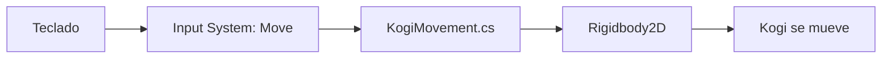

# Sesión 2: mover a Kogi horizontalmente con C# 🏃

Duración aproximada: **60–75 minutos**.

## 🎯 Objetivo

Al terminar, Kogi se moverá hacia la izquierda y la derecha usando `A`, `D` o las flechas del teclado. Utilizaremos C#, `Rigidbody2D` y el `Input System` moderno de Unity.

## 1. Entender el recorrido de la entrada



- **Input System:** traduce las teclas a una acción llamada `Move`.
- **Script:** recibe esa acción y calcula la velocidad horizontal.
- **Rigidbody2D:** aplica el movimiento al objeto Kogi.

> 💡 **Qué acabas de aprender:** el teclado no mueve directamente al personaje; la entrada pasa por componentes con responsabilidades diferentes.

## 2. Abrir la escena correcta

1. Abre el proyecto `Kogi` desde **Unity Hub > Projects**.
2. Espera a que Unity Editor termine de cargar.
3. En la ventana **Project**, abre `Assets > Kogi > Scenes`.
4. Haz doble clic en `NivelDesierto`.
5. Comprueba que `NivelDesierto` aparece como nombre de la escena en **Hierarchy**.
6. Asegúrate de que el botón ▶️ de la barra superior no esté activo.

## 3. Preparar las carpetas de código

1. En la ventana **Project**, abre `Assets > Kogi`.
2. Haz clic derecho sobre un espacio vacío y selecciona **Create > Folder**.
3. Escribe `Scripts` y pulsa **Enter**.
4. Abre `Scripts`, crea dentro otra carpeta y llámala `Player`.

La ruta final debe ser:

```text
Assets/Kogi/Scripts/Player
```

> 💡 **Qué acabas de aprender:** agrupamos el código por función; `Player` contendrá únicamente comportamientos del personaje.

## 4. Crear y abrir el script

1. En **Project**, abre `Assets > Kogi > Scripts > Player`.
2. Haz clic derecho en un espacio vacío.
3. Selecciona **Create > Scripting > MonoBehaviour Script**.
4. Escribe exactamente `KogiMovement` y pulsa **Enter**.
5. Espera a que Unity termine de compilar.
6. Haz doble clic en `KogiMovement` para abrirlo en el editor de código configurado.

Si quieres utilizar Rider y se abre otro editor:

1. Vuelve a Unity Editor.
2. Abre **Edit > Preferences > External Tools**.
3. En **External Script Editor**, selecciona **JetBrains Rider**.
4. Cierra **Preferences** y vuelve a hacer doble clic en el script.

## 5. Escribir el primer comportamiento

En Rider o en tu editor de código, reemplaza todo el contenido de `KogiMovement.cs` por:

```csharp
using UnityEngine;
using UnityEngine.InputSystem;

namespace Kogi.Player
{
    [RequireComponent(typeof(Rigidbody2D))]
    public sealed class KogiMovement : MonoBehaviour
    {
        [SerializeField, Min(0f)]
        private float speed = 5f;

        private Rigidbody2D body;
        private Vector2 movementInput;

        private void Awake()
        {
            body = GetComponent<Rigidbody2D>();
        }

        private void OnMove(InputValue value)
        {
            movementInput = value.Get<Vector2>();
        }

        private void FixedUpdate()
        {
            body.linearVelocity = new Vector2(
                movementInput.x * speed,
                body.linearVelocity.y);
        }
    }
}
```

1. Guarda el archivo con `Ctrl + S`.
2. Regresa a Unity Editor.
3. Espera a que desaparezca el indicador de compilación.
4. Abre **Window > General > Console** y confirma que no haya errores rojos.

### Qué hace cada parte

- `MonoBehaviour` permite añadir el script a un `GameObject`.
- `[RequireComponent]` exige que Kogi tenga un `Rigidbody2D`.
- `[SerializeField]` muestra `speed` en **Inspector** sin hacerlo público.
- `Awake` obtiene la referencia al `Rigidbody2D` una sola vez.
- `OnMove` recibe la acción `Move` del `Input System`.
- `FixedUpdate` aplica la velocidad siguiendo el ritmo del sistema de física.

> 💡 **Qué acabas de aprender:** cada método tiene un momento y una responsabilidad concreta.

## 6. Preparar el objeto Kogi

1. En **Hierarchy**, selecciona el objeto `Kogi`.
2. En **Inspector**, pulsa **Add Component**.
3. Busca `Rigidbody 2D` y selecciónalo.
4. En el componente **Rigidbody 2D**, establece **Gravity Scale** en `0`.
5. Abre **Constraints** y marca **Freeze Rotation Z**.
6. Pulsa otra vez **Add Component**.
7. Busca `Player Input` y selecciónalo.
8. En la ventana **Project**, localiza `Assets > Settings > InputSystem_Actions`.
9. Arrastra `InputSystem_Actions` hasta el campo **Actions** de `Player Input`.
10. En **Default Map**, selecciona `Player`.
11. En **Behavior**, selecciona `Send Messages`.
12. En **Project**, vuelve a `Assets > Kogi > Scripts > Player`.
13. Arrastra `KogiMovement` sobre el objeto `Kogi` de **Hierarchy**.
14. Selecciona otra vez `Kogi` y comprueba en **Inspector** que aparecen estos componentes:

- `Transform`
- `Sprite Renderer`
- `Rigidbody 2D`
- `Player Input`
- `Kogi Movement`

En **Kogi Movement**, deja `Speed` con valor `5`.

> 💡 **Qué acabas de aprender:** el script contiene el comportamiento, pero necesita componentes configurados en Unity para funcionar.

## 7. Probar el movimiento

1. Guarda la escena con `Ctrl + S`.
2. En la zona central, abre la pestaña **Game**.
3. Pulsa ▶️ en la parte superior de Unity Editor.
4. Haz un clic dentro de la ventana **Game** para darle el foco.
5. Mantén pulsada `A` o `←` para mover a Kogi hacia la izquierda.
6. Mantén pulsada `D` o `→` para moverlo hacia la derecha.
7. Suelta las teclas y comprueba que Kogi se detiene.
8. Pulsa ▶️ otra vez para detener la ejecución.

⚠️ Kogi puede salir fuera de la pantalla. En esta sesión todavía no añadiremos límites ni una cámara que lo siga.

## 8. Revisar el resultado

1. Comprueba que ▶️ esté detenido.
2. Abre **Window > General > Console**.
3. Confirma que no existan errores rojos.
4. Guarda la escena con `Ctrl + S`.

La sesión está terminada si:

- [ ] Existe `Assets/Kogi/Scripts/Player/KogiMovement.cs`.
- [ ] Kogi tiene `Rigidbody 2D`, `Player Input` y `Kogi Movement`.
- [ ] `A`, `D`, `←` y `→` permiten mover a Kogi.
- [ ] Kogi se detiene al soltar las teclas.
- [ ] El movimiento no cambia su altura.
- [ ] **Console** no muestra errores rojos.

## 🧰 Problemas frecuentes

- **El script no aparece en Add Component:** abre **Console** y corrige primero cualquier error rojo.
- **Kogi cae:** selecciona Kogi y establece **Rigidbody 2D > Gravity Scale** en `0`.
- **Las teclas no responden:** comprueba que **Player Input > Actions** use `InputSystem_Actions`, que **Default Map** sea `Player` y que **Behavior** sea `Send Messages`.
- **Kogi gira:** activa **Rigidbody 2D > Constraints > Freeze Rotation Z**.
- **Rider no se abre:** revisa **Edit > Preferences > External Tools > External Script Editor**.
- **No se guardan los cambios:** detén ▶️ antes de editar y guarda con `Ctrl + S`.

---

[⬅️ Sesión anterior](01-primera-escena.md) · [🏠 Inicio](../../README.md)
