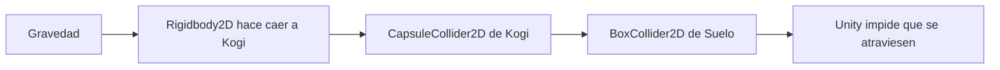
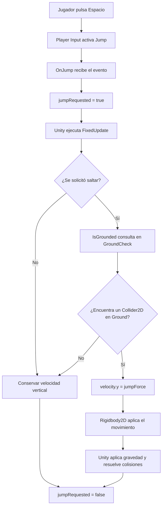
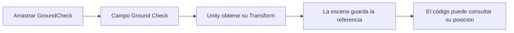

# Sesión 3: añadir gravedad, colisiones y salto 🦘

Duración aproximada: **75–90 minutos**.

## 🎯 Objetivo

Al terminar, Kogi caerá por gravedad, se apoyará sobre el suelo sin atravesarlo y saltará con `Espacio`. Solo podrá saltar cuando esté tocando el suelo.

En esta sesión iremos en este orden: **hacer → observar → entender → comprobar**. Cada concepto se explica justo después de utilizarlo.

## 1. Abrir la escena correcta

1. Abre `Kogi` desde **Unity Hub > Projects**.
2. En la ventana **Project**, abre `Assets > Kogi > Scenes`.
3. Haz doble clic en `NivelDesierto`.
4. Comprueba en **Hierarchy** que aparecen `Kogi` y `Suelo`.
5. Asegúrate de que el botón ▶️ de la barra superior esté detenido.

> 💡 **Qué acabas de aprender:** una escena guardada puede abrirse desde la ventana **Project**. La ventana **Hierarchy** muestra los `GameObjects` que contiene la escena abierta.

## 2. Hacer sólido el suelo

1. Selecciona `Suelo` en **Hierarchy**.
2. En **Inspector**, pulsa **Add Component**.
3. Escribe `Box Collider 2D` en el buscador.
4. Selecciona **Box Collider 2D**.
5. Comprueba que su casilla **Is Trigger** esté desmarcada.

Al seleccionar `Suelo`, Unity muestra el contorno de su nueva zona de colisión.

> 💡 **Qué acabas de aprender:** el suelo podía verse, pero no era sólido hasta añadirle un `Collider2D`.

### ¿Qué acabamos de añadir?

`Sprite Renderer` dibuja el suelo, pero no lo vuelve sólido. `BoxCollider2D` crea su superficie física.

```text
Sprite Renderer → podemos ver el suelo
BoxCollider2D   → Kogi puede chocar con el suelo
```

Todavía no hemos configurado cómo chocará Kogi. Por ahora, solo hemos preparado la superficie física del suelo.

## 3. Dar gravedad y cuerpo físico a Kogi

1. Selecciona `Kogi` en **Hierarchy**.
2. En **Inspector**, expande **Rigidbody 2D**.
3. Establece estos valores:

| Propiedad | Valor |
|---|---|
| Body Type | Dynamic |
| Gravity Scale | 3 |
| Collision Detection | Continuous |
| Interpolate | Interpolate |

4. En **Constraints**, deja marcada **Freeze Rotation Z**.
5. Pulsa **Add Component**.
6. Busca `Capsule Collider 2D` y selecciónalo.
7. Comprueba que **Is Trigger** esté desmarcado.

### ¿Qué hace cada componente?

- `Rigidbody2D` hace que Kogi participe en la física 2D. Unity puede aplicarle gravedad y velocidad.
- `CapsuleCollider2D` define la forma física de Kogi. Elegimos una cápsula porque sus bordes redondeados se comportan bien al desplazarse por el suelo.
- `Freeze Rotation Z` evita que Kogi se tumbe al chocar.
- `Is Trigger` queda desmarcado porque queremos una colisión sólida.

Ahora ya existen dos formas físicas capaces de chocar:



No necesitamos escribir código para detener la caída. El motor de física resuelve la colisión porque Kogi tiene `Rigidbody2D`, y ambos objetos tienen un `Collider2D` sólido.

> 💡 **Qué acabas de aprender:** `Rigidbody2D` controla la participación de Kogi en la física; los `Collider2D` indican qué formas no deben atravesarse.

### Comprobar la caída antes de continuar

1. Guarda la escena con `Ctrl + S`.
2. Pulsa ▶️.
3. Comprueba que Kogi cae y se detiene sobre `Suelo`.
4. Detén la ejecución pulsando ▶️ otra vez.

Si Kogi atraviesa el suelo, corrige este problema antes de seguir.

## 4. Indicar qué objetos cuentan como suelo

La colisión ya impide que Kogi atraviese `Suelo`. Ahora necesitamos que el código pueda responder otra pregunta diferente: **¿Kogi está apoyado sobre algo que consideramos suelo?**

1. Selecciona `Suelo` en **Hierarchy**.
2. En la parte superior de **Inspector**, pulsa el desplegable **Layer**, que inicialmente muestra `Default`.
3. Selecciona **Add Layer...**.
4. En la sección **Layers**, busca la primera fila vacía de **User Layer**.
5. Escribe `Ground` en esa fila.
6. Vuelve a seleccionar `Suelo` en **Hierarchy**.
7. Abre de nuevo **Layer** y selecciona `Ground`.

Si Unity pregunta si debe aplicar la capa a los objetos hijos, pulsa **Yes, change children**.

### ¿Qué es una Layer?

Una `Layer` es una categoría técnica asignada a un `GameObject`. No crea comportamientos ni vuelve sólido al objeto: solamente permite clasificarlo.

```text
BoxCollider2D → hace sólido el suelo
Layer Ground  → permite identificarlo como suelo
```

`Ground` es un nombre elegido por nosotros, no una palabra reservada de Unity. Más adelante, el script buscará objetos que tengan un `Collider2D` y pertenezcan a esta `Layer`.

> 💡 **Qué acabas de aprender:** colisionar con un objeto y reconocerlo como suelo son dos responsabilidades distintas.

## 5. Crear un punto bajo los pies de Kogi

1. En **Hierarchy**, haz clic derecho sobre el objeto `Kogi`.
2. Selecciona **Create Empty**.
3. El nuevo objeto aparecerá dentro de Kogi; renómbralo como `GroundCheck`.
4. Selecciona `GroundCheck` en **Hierarchy**.
5. En **Inspector > Transform**, establece:

| Propiedad | X | Y | Z |
|---|---:|---:|---:|
| Position | 0 | -0.5 | 0 |

Los valores son locales porque `GroundCheck` es hijo de Kogi. Al mover a Kogi, este punto se moverá con él.

```text
Kogi
└── GroundCheck
```

> 💡 **Qué acabas de aprender:** un objeto hijo conserva una posición relativa respecto a su padre.

### ¿Qué es GroundCheck y por qué solo tiene Transform?

`GroundCheck` es un `GameObject` vacío que utilizamos como marcador invisible. Lo colocamos bajo los pies para que acompañe a Kogi y nos indique desde dónde comprobaremos el suelo.

Todo `GameObject` tiene un `Transform`. En este caso es el único componente necesario porque solo nos interesa su posición.

```text
Kogi
└── GroundCheck → indica dónde están los pies
```

No le añadas un `Collider2D`: `GroundCheck` no debe chocar con nada. En el siguiente paso, el código utilizará su posición para buscar suelo en una zona muy pequeña.

```text
       Kogi
    ┌────────┐
    │        │
    └────────┘
         ●       GroundCheck
       (   )     círculo de búsqueda
══════════════   BoxCollider2D del suelo
```

> 💡 **Qué acabas de aprender:** un `GameObject` vacío también es útil. Puede actuar como un punto de referencia que sigue a su objeto padre.

## 6. Enseñar al script cuándo y cómo saltar

1. En **Project**, abre `Assets > Kogi > Scripts > Player`.
2. Haz doble clic en `KogiMovement` para abrirlo en Rider.
3. Reemplaza todo su contenido por este código:

```csharp
using UnityEngine;
using UnityEngine.InputSystem;

namespace Kogi.Scripts.Player
{
    [RequireComponent(typeof(Rigidbody2D))]
    public sealed class KogiMovement : MonoBehaviour
    {
        [SerializeField, Min(0f)]
        private float speed = 5f;

        [SerializeField, Min(0f)]
        private float jumpForce = 8f;

        [SerializeField]
        private Transform groundCheck;

        [SerializeField]
        private LayerMask groundLayer;

        [SerializeField, Min(0f)]
        private float groundCheckRadius = 0.15f;

        private Rigidbody2D body;
        private Vector2 movementInput;
        private bool jumpRequested;

        private void Awake()
        {
            body = GetComponent<Rigidbody2D>();
        }

        private void OnMove(InputValue value)
        {
            movementInput = value.Get<Vector2>();
        }

        private void OnJump(InputValue value)
        {
            if (value.isPressed)
            {
                jumpRequested = true;
            }
        }

        private void FixedUpdate()
        {
            Vector2 velocity = body.linearVelocity;
            velocity.x = movementInput.x * speed;

            if (jumpRequested && IsGrounded())
            {
                velocity.y = jumpForce;
            }

            body.linearVelocity = velocity;
            jumpRequested = false;
        }

        private bool IsGrounded()
        {
            return Physics2D.OverlapCircle(
                groundCheck.position,
                groundCheckRadius,
                groundLayer) is not null;
        }
    }
}
```

4. Guarda el archivo con `Ctrl + S`.
5. Regresa a Unity Editor y espera a que termine de compilar.
6. Abre **Window > General > Console** y comprueba que no haya errores rojos.

### ¿Qué hemos añadido?

- `jumpForce`: velocidad vertical inicial del salto.
- `groundCheck`: referencia al punto situado bajo los pies.
- `groundLayer`: categorías que el código aceptará como suelo.
- `OnJump`: recibe la acción `Jump` de `Player Input`.
- `IsGrounded`: comprueba si existe un `Collider2D` del suelo bajo Kogi.

### ¿Qué representa cada variable?

| Variable | Tipo | Para qué sirve | Cómo obtiene su valor |
|---|---|---|---|
| `speed` | `float` | Velocidad horizontal | Valor editable en Inspector |
| `jumpForce` | `float` | Velocidad vertical inicial del salto | Valor editable en Inspector |
| `groundCheck` | `Transform` | Posición donde buscar el suelo | Arrastramos `GroundCheck` desde Hierarchy |
| `groundLayer` | `LayerMask` | Indica qué `Layers` se aceptan como suelo | Marcaremos `Ground` en Inspector |
| `groundCheckRadius` | `float` | Tamaño del círculo de búsqueda | Valor editable en Inspector |
| `body` | `Rigidbody2D` | Cuerpo físico de Kogi | `GetComponent` lo obtiene en `Awake` |
| `movementInput` | `Vector2` | Dirección solicitada por el jugador | La acción `Move` la actualiza |
| `jumpRequested` | `bool` | Recuerda una solicitud de salto pendiente | `OnJump` la activa y `FixedUpdate` la consume |

Las variables con `[SerializeField]` aparecen en **Inspector** para que podamos configurarlas desde Unity. Las variables internas se completan durante la ejecución y no necesitan configuración manual.

`LayerMask` no es otra `Layer`. Es un filtro que puede contener una o varias `Layers`. En esta práctica solo seleccionaremos `Ground`.

### ¿Por qué el método se llama OnJump?

`OnJump` no está heredado. Como `Player Input` utiliza **Send Messages**, transforma el nombre de cada acción en un mensaje:

```text
Move   → OnMove
Jump   → OnJump
Attack → OnAttack
```

Por eso no podemos cambiarlo libremente mientras utilicemos **Send Messages**.

### IsGrounded es un método, no una variable

Los paréntesis permiten reconocer la llamada:

```text
jumpRequested → variable bool
IsGrounded()  → método que calcula y devuelve un bool
```

La expresión `is not null` devuelve `true` cuando la consulta encuentra un `Collider2D` válido y `false` cuando no encuentra ninguno.

Dentro de `IsGrounded`, `Physics2D.OverlapCircle` realiza una búsqueda circular invisible:

- El centro es `groundCheck.position`.
- El tamaño es `groundCheckRadius`.
- El filtro es `groundLayer`.

No comprueba que dos posiciones sean exactamente iguales. Comprueba si el círculo se superpone con un `Collider2D` perteneciente a una `Layer` aceptada.

### Flujo completo de una pulsación de salto



`OnJump` registra la intención y `FixedUpdate` modifica la física. Esta separación evita aplicar cambios físicos fuera del ciclo de física de Unity.

## 7. Conectar el script con los objetos de la escena

1. Selecciona `Kogi` en **Hierarchy**.
2. En **Inspector**, localiza **Kogi Movement (Script)**.
3. Verás los nuevos campos `Jump Force`, `Ground Check`, `Ground Layer` y `Ground Check Radius`.
4. En **Hierarchy**, mantén pulsado `GroundCheck`.
5. Arrástralo hasta el campo **Ground Check** de **Kogi Movement** y suéltalo.
6. Abre el desplegable **Ground Layer** y marca únicamente `Ground`.
7. Comprueba estos valores:

| Campo | Valor |
|---|---|
| Speed | 5 |
| Jump Force | 8 |
| Ground Check | GroundCheck |
| Ground Layer | Ground |
| Ground Check Radius | 0.15 |

No pulses ▶️ si `Ground Check` muestra `None`: el script necesita esa referencia.

> 💡 **Qué acabas de aprender:** `[SerializeField]` permite conectar referencias desde `Inspector` sin exponer campos públicamente.

### ¿Qué significa arrastrar GroundCheck al campo?

La variable `groundCheck` necesita una referencia a un `Transform`. Al arrastrar el `GameObject` `GroundCheck`, Unity toma automáticamente su componente `Transform` y guarda esa referencia dentro de la escena.



No se copia el objeto. El campo queda apuntando al mismo `GroundCheck` que existe como hijo de Kogi. Es parecido a proporcionar una dependencia desde el Editor.

Al marcar `Ground` en **Ground Layer**, guardamos el filtro que utilizará `IsGrounded()`. De esta forma, otros `Colliders` cercanos no cuentan automáticamente como suelo.

> 💡 **Qué acabas de aprender:** el código declara qué referencias necesita y el **Inspector** permite conectarlas con elementos concretos de la escena.

## 8. Probar la caída y el salto

1. Guarda la escena con `Ctrl + S`.
2. Abre la pestaña **Game** en la zona central.
3. Pulsa ▶️.
4. Comprueba que Kogi cae y se detiene sobre `Suelo`.
5. Haz clic dentro de **Game** para darle el foco.
6. Pulsa `Espacio` una vez: Kogi debe subir y volver a caer.
7. Mientras esté en el aire, pulsa `Espacio` repetidamente: no debe volver a saltar.
8. Prueba `A`, `D`, `←` y `→` mientras Kogi está en el suelo y en el aire.
9. Pulsa ▶️ otra vez para detener la ejecución.

## 9. Revisar el resultado

1. Comprueba que ▶️ esté detenido.
2. Abre **Window > General > Console**.
3. Confirma que no existan errores rojos.
4. Guarda con `Ctrl + S`.

La sesión está terminada si:

- [ ] `Suelo` tiene un `Box Collider 2D` y la capa `Ground`.
- [ ] Kogi tiene gravedad y un `Capsule Collider 2D`.
- [ ] `GroundCheck` es hijo de Kogi.
- [ ] Kogi cae y no atraviesa el suelo.
- [ ] `Espacio` permite saltar desde el suelo.
- [ ] Kogi no puede saltar otra vez mientras está en el aire.
- [ ] El movimiento horizontal continúa funcionando.
- [ ] **Console** no muestra errores rojos.

## 🧰 Problemas frecuentes

- **Kogi atraviesa el suelo:** comprueba que ambos objetos tengan su `Collider2D` y que **Is Trigger** esté desmarcado.
- **Kogi no cae:** revisa que **Rigidbody 2D > Body Type** sea `Dynamic` y **Gravity Scale** sea `3`.
- **Kogi no salta:** comprueba `Player Input`, la referencia `Ground Check` y la selección `Ground Layer`.
- **Puede saltar en el aire:** confirma que `Suelo` use la capa `Ground` y que `GroundCheck` esté bajo los pies.
- **Aparece NullReferenceException:** normalmente falta asignar `GroundCheck` en **Inspector**.
- **El salto es muy alto o bajo:** ajusta `Jump Force` desde **Inspector** después de detener ▶️.

---

[⬅️ Sesión anterior](02-movimiento-horizontal.md) · [🏠 Inicio](../../README.md) · [Siguiente: cámara que sigue a Kogi ➡️](04-camara-que-sigue-a-kogi.md)
