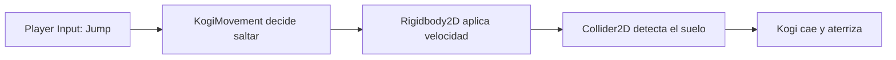

# Sesión 3: añadir gravedad, colisiones y salto 🦘

Duración aproximada: **75–90 minutos**.

## 🎯 Objetivo

Al terminar, Kogi caerá por gravedad, se apoyará sobre el suelo sin atravesarlo y saltará con `Espacio`. Solo podrá saltar cuando esté tocando el suelo.

## 1. Entender las responsabilidades



- `Rigidbody2D` aplica velocidad, gravedad y movimiento físico.
- `Collider2D` define la zona sólida que participa en colisiones.
- `Layer` identifica el tipo de objeto; usaremos una llamada `Ground`.
- `GroundCheck` marca el punto donde comprobaremos si Kogi está sobre el suelo.

> 💡 **Qué acabas de aprender:** el `Rigidbody2D` mueve; el `Collider2D` permite detectar y resolver contactos.

## 2. Abrir la escena correcta

1. Abre `Kogi` desde **Unity Hub > Projects**.
2. En la ventana **Project**, abre `Assets > Kogi > Scenes`.
3. Haz doble clic en `NivelDesierto`.
4. Comprueba en **Hierarchy** que aparecen `Kogi` y `Suelo`.
5. Asegúrate de que el botón ▶️ de la barra superior esté detenido.

## 3. Hacer sólido el suelo

1. Selecciona `Suelo` en **Hierarchy**.
2. En **Inspector**, pulsa **Add Component**.
3. Escribe `Box Collider 2D` en el buscador.
4. Selecciona **Box Collider 2D**.
5. Comprueba que su casilla **Is Trigger** esté desmarcada.

El rectángulo verde visible al seleccionar `Suelo` representa su zona de colisión.

> 💡 **Qué acabas de aprender:** el suelo podía verse, pero no era sólido hasta añadirle un `Collider2D`.

## 4. Crear la capa Ground

1. Mantén seleccionado `Suelo` en **Hierarchy**.
2. En la parte superior de **Inspector**, pulsa el desplegable **Layer**, que inicialmente muestra `Default`.
3. Selecciona **Add Layer...**.
4. En la sección **Layers**, busca la primera fila vacía de **User Layer**.
5. Escribe `Ground` en esa fila.
6. Vuelve a seleccionar `Suelo` en **Hierarchy**.
7. Abre de nuevo **Layer** y selecciona `Ground`.

Si Unity pregunta si debe aplicar la capa a los objetos hijos, pulsa **Yes, change children**.

> 💡 **Qué acabas de aprender:** una `Layer` permite localizar grupos de objetos sin depender de sus nombres.

## 5. Preparar la física de Kogi

1. Selecciona `Kogi` en **Hierarchy**.
2. En **Inspector**, expande **Rigidbody 2D**.
3. Establece estos valores:

| Propiedad | Valor |
|---|---|
| Body Type | Dynamic |
| Gravity Scale | 3 |
| Collision Detection | Continuous |
| Interpolate | Interpolate |

4. En **Constraints**, deja marcada **Freeze Rotation Z**.
5. Pulsa **Add Component**.
6. Busca `Capsule Collider 2D` y selecciónalo.
7. Comprueba que **Is Trigger** esté desmarcado.

> 💡 **Qué acabas de aprender:** Kogi necesita un cuerpo físico para caer y un volumen sólido para chocar con el suelo.

## 6. Crear el punto GroundCheck

1. En **Hierarchy**, haz clic derecho sobre el objeto `Kogi`.
2. Selecciona **Create Empty**.
3. El nuevo objeto aparecerá dentro de Kogi; renómbralo como `GroundCheck`.
4. Selecciona `GroundCheck` en **Hierarchy**.
5. En **Inspector > Transform**, establece:

| Propiedad | X | Y | Z |
|---|---:|---:|---:|
| Position | 0 | -0.5 | 0 |

Los valores son locales porque `GroundCheck` es hijo de Kogi. Al mover a Kogi, este punto se moverá con él.

```text
Kogi
└── GroundCheck
```

> 💡 **Qué acabas de aprender:** un objeto hijo conserva una posición relativa respecto a su padre.

## 7. Añadir el salto al script

1. En **Project**, abre `Assets > Kogi > Scripts > Player`.
2. Haz doble clic en `KogiMovement` para abrirlo en Rider.
3. Reemplaza todo su contenido por este código:

```csharp
using UnityEngine;
using UnityEngine.InputSystem;

[RequireComponent(typeof(Rigidbody2D))]
public sealed class KogiMovement : MonoBehaviour
{
    [SerializeField, Min(0f)]
    private float speed = 5f;

    [SerializeField, Min(0f)]
    private float jumpForce = 8f;

    [SerializeField]
    private Transform groundCheck;

    [SerializeField]
    private LayerMask groundLayer;

    [SerializeField, Min(0f)]
    private float groundCheckRadius = 0.15f;

    private Rigidbody2D body;
    private Vector2 movementInput;
    private bool jumpRequested;

    private void Awake()
    {
        body = GetComponent<Rigidbody2D>();
    }

    private void OnMove(InputValue value)
    {
        movementInput = value.Get<Vector2>();
    }

    private void OnJump(InputValue value)
    {
        if (value.isPressed)
        {
            jumpRequested = true;
        }
    }

    private void FixedUpdate()
    {
        Vector2 velocity = body.linearVelocity;
        velocity.x = movementInput.x * speed;

        if (jumpRequested && IsGrounded())
        {
            velocity.y = jumpForce;
        }

        body.linearVelocity = velocity;
        jumpRequested = false;
    }

    private bool IsGrounded()
    {
        return Physics2D.OverlapCircle(
            groundCheck.position,
            groundCheckRadius,
            groundLayer) is not null;
    }
}
```

4. Guarda el archivo con `Ctrl + S`.
5. Regresa a Unity Editor y espera a que termine de compilar.
6. Abre **Window > General > Console** y comprueba que no haya errores rojos.

### Qué hemos añadido

- `jumpForce`: velocidad vertical inicial del salto.
- `groundCheck`: referencia al punto situado bajo los pies.
- `groundLayer`: capas que se consideran suelo.
- `OnJump`: recibe la acción `Jump` de `Player Input`.
- `IsGrounded`: comprueba si existe un `Collider2D` del suelo bajo Kogi.

## 8. Conectar las referencias del script

1. Selecciona `Kogi` en **Hierarchy**.
2. En **Inspector**, localiza **Kogi Movement (Script)**.
3. Verás los nuevos campos `Jump Force`, `Ground Check`, `Ground Layer` y `Ground Check Radius`.
4. En **Hierarchy**, mantén pulsado `GroundCheck`.
5. Arrástralo hasta el campo **Ground Check** de **Kogi Movement** y suéltalo.
6. Abre el desplegable **Ground Layer** y marca únicamente `Ground`.
7. Comprueba estos valores:

| Campo | Valor |
|---|---|
| Speed | 5 |
| Jump Force | 8 |
| Ground Check | GroundCheck |
| Ground Layer | Ground |
| Ground Check Radius | 0.15 |

No pulses ▶️ si `Ground Check` muestra `None`: el script necesita esa referencia.

> 💡 **Qué acabas de aprender:** `[SerializeField]` permite conectar referencias desde `Inspector` sin exponer campos públicamente.

## 9. Probar la caída y el salto

1. Guarda la escena con `Ctrl + S`.
2. Abre la pestaña **Game** en la zona central.
3. Pulsa ▶️.
4. Comprueba que Kogi cae y se detiene sobre `Suelo`.
5. Haz clic dentro de **Game** para darle el foco.
6. Pulsa `Espacio` una vez: Kogi debe subir y volver a caer.
7. Mientras esté en el aire, pulsa `Espacio` repetidamente: no debe volver a saltar.
8. Prueba `A`, `D`, `←` y `→` mientras Kogi está en el suelo y en el aire.
9. Pulsa ▶️ otra vez para detener la ejecución.

## 10. Revisar el resultado

1. Comprueba que ▶️ esté detenido.
2. Abre **Window > General > Console**.
3. Confirma que no existan errores rojos.
4. Guarda con `Ctrl + S`.

La sesión está terminada si:

- [ ] `Suelo` tiene un `Box Collider 2D` y la capa `Ground`.
- [ ] Kogi tiene gravedad y un `Capsule Collider 2D`.
- [ ] `GroundCheck` es hijo de Kogi.
- [ ] Kogi cae y no atraviesa el suelo.
- [ ] `Espacio` permite saltar desde el suelo.
- [ ] Kogi no puede saltar otra vez mientras está en el aire.
- [ ] El movimiento horizontal continúa funcionando.
- [ ] **Console** no muestra errores rojos.

## 🧰 Problemas frecuentes

- **Kogi atraviesa el suelo:** comprueba que ambos objetos tengan su `Collider2D` y que **Is Trigger** esté desmarcado.
- **Kogi no cae:** revisa que **Rigidbody 2D > Body Type** sea `Dynamic` y **Gravity Scale** sea `3`.
- **Kogi no salta:** comprueba `Player Input`, la referencia `Ground Check` y la selección `Ground Layer`.
- **Puede saltar en el aire:** confirma que `Suelo` use la capa `Ground` y que `GroundCheck` esté bajo los pies.
- **Aparece NullReferenceException:** normalmente falta asignar `GroundCheck` en **Inspector**.
- **El salto es muy alto o bajo:** ajusta `Jump Force` desde **Inspector** después de detener ▶️.

---

[⬅️ Sesión anterior](02-movimiento-horizontal.md) · [🏠 Inicio](../../README.md)
