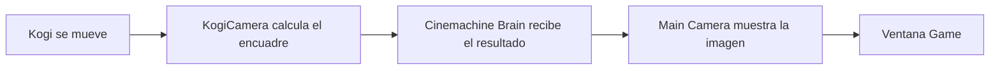

# Sesión 4: hacer que la cámara siga a Kogi 🎥

Duración aproximada: **45–60 minutos**.

## 🎯 Objetivo

Al terminar, la cámara seguirá a Kogi de forma suave mientras camina y salta. Podremos recorrer una escena más ancha sin que el personaje desaparezca de la pantalla.

En esta sesión seguiremos el mismo orden: **hacer → observar → entender → comprobar**.

## 1. Abrir la escena correcta

1. Abre el proyecto `Kogi` desde **Unity Hub > Projects**.
2. Espera a que Unity termine de cargar.
3. En la ventana **Project**, abre `Assets > Kogi > Scenes`.
4. Haz doble clic en `NivelDesierto`.
5. Comprueba en **Hierarchy** que aparecen `Kogi`, `GroundCheck` y `Suelo`.
6. Asegúrate de que el botón ▶️ esté detenido.
7. Guarda la escena con `Ctrl + S`.

> 💡 **Qué acabas de comprobar:** trabajaremos sobre la misma escena y los objetos creados en las sesiones anteriores.

## 2. Hacer el suelo más ancho

Necesitamos espacio para comprobar que la cámara realmente se desplaza.

1. Selecciona `Suelo` en **Hierarchy**.
2. Busca **Transform** en **Inspector**.
3. Cambia únicamente **Scale > X** de `12` a `30`.
4. Mantén **Scale > Y** en `1` y **Scale > Z** en `1`.
5. Guarda la escena con `Ctrl + S`.

El `Sprite Renderer` y el `BoxCollider2D` se ensanchan junto con el `GameObject` porque ambos pertenecen a `Suelo`.

> 💡 **Qué acabas de aprender:** al cambiar la escala de un `GameObject`, también cambia el tamaño de sus componentes visuales y físicos.

## 3. Instalar Cinemachine

1. Abre el menú superior **Window > Package Management > Package Manager**.
2. En la parte superior de **Package Manager**, selecciona **Unity Registry**.
3. Escribe `Cinemachine` en el buscador.
4. Selecciona el paquete **Cinemachine** publicado por Unity.
5. Pulsa **Install**.
6. Espera hasta que el botón cambie a **Remove** o aparezca como instalado.
7. Cierra la ventana **Package Manager**.
8. Abre **Window > General > Console** y comprueba que no existan errores rojos.

Si en tu versión aparece directamente **Window > Package Manager**, utiliza esa opción: abre la misma herramienta.

### ¿Qué acabamos de instalar?

Un `Package` añade herramientas reutilizables al proyecto. `Cinemachine` es el paquete oficial de Unity para controlar cámaras sin programar manualmente todo su movimiento.

La instalación pertenece al proyecto `Kogi`, no a todos los proyectos de tu ordenador. Unity registrará el paquete dentro de `Kogi/Packages`.

> 💡 **Qué acabas de aprender:** `Package Manager` permite añadir capacidades oficiales al proyecto y mantener sus dependencias registradas.

## 4. Crear una Cinemachine Camera

1. En el menú superior, abre **GameObject > Cinemachine > Cinemachine Camera**.
2. Busca el nuevo objeto en **Hierarchy**.
3. Renómbralo como `KogiCamera`.
4. Selecciona `KogiCamera`.
5. Localiza el componente **Cinemachine Camera** en **Inspector**.

### ¿Qué es KogiCamera?

`KogiCamera` no dibuja directamente el juego. Es un `GameObject` que calcula dónde debería colocarse la cámara real y con qué configuración debería mostrar la escena.

Esto permite cambiar después entre cámaras de juego, escenas cinemáticas o cámaras de un jefe sin escribir un sistema completo desde cero.

> 💡 **Qué acabas de aprender:** una `Cinemachine Camera` representa una intención de cámara; todavía debemos indicarle qué debe seguir.

## 5. Indicar que debe seguir a Kogi

1. Mantén seleccionado `KogiCamera` en **Hierarchy**.
2. En **Inspector > Cinemachine Camera**, localiza **Tracking Target**.
3. Arrastra el `GameObject` `Kogi` desde **Hierarchy** hasta el campo **Tracking Target**.
4. Comprueba que el campo ya no muestra `None` y ahora contiene `Kogi`.

### ¿Qué significa Tracking Target?

`Tracking Target` es la referencia al objeto que queremos seguir. Al arrastrar Kogi no lo copiamos ni lo convertimos en hijo de la cámara: guardamos una referencia al mismo `GameObject` de la escena.

```text
Kogi se mueve
      ↓
KogiCamera consulta su posición
      ↓
Calcula dónde debe estar la cámara
```

> 💡 **Qué acabas de aprender:** Cinemachine necesita conocer el objetivo antes de poder calcular el seguimiento.

## 6. Elegir el comportamiento para un juego 2D

1. Mantén seleccionado `KogiCamera`.
2. En **Inspector > Cinemachine Camera**, abre **Position Control**.
3. Selecciona **Position Composer**.
4. En **Rotation Control**, selecciona **None**.
5. Dentro del mismo componente, despliega la sección **Lens**.
6. Comprueba que aparece el campo **Orthographic Size**. Esto confirma que la cámara está utilizando la proyección ortográfica heredada de `Main Camera`.
7. Establece **Orthographic Size** en `5`.
8. Deja **Mode Override** en `None`.

En esta versión de Cinemachine no aparece un campo llamado **Projection** dentro de `KogiCamera`. No tienes que buscarlo ni cambiar la configuración de `Main Camera`.

### ¿Qué hace Position Composer?

`Position Composer` mueve la cámara para conservar a Kogi en una zona concreta de la pantalla. Es apropiado para un juego 2D porque desplaza la cámara sin necesitar rotarla.

- `Position Control` decide cómo se mueve la cámara.
- `Rotation Control` decidiría cómo gira; usamos `None` porque nuestra vista 2D no necesita rotación.
- La proyección ortográfica evita la perspectiva: los objetos no parecen más pequeños por estar más lejos.
- `Orthographic Size` controla cuánto escenario se ve verticalmente.
- `Mode Override: None` indica que `KogiCamera` conserva el modo de proyección configurado en `Main Camera`.

> 💡 **Qué acabas de aprender:** seguir un objetivo, mover la cámara y rotarla son responsabilidades configurables por separado.

## 7. Comprobar la Main Camera

1. Selecciona `Main Camera` en **Hierarchy**.
2. Busca **Cinemachine Brain** en **Inspector**.
3. Si aparece, no cambies sus valores.
4. Si no aparece, pulsa **Add Component**, busca `Cinemachine Brain` y añádelo.

### ¿Por qué seguimos necesitando Main Camera?

`Main Camera` es la cámara real que dibuja la imagen mostrada en **Game**. `Cinemachine Brain` recibe las instrucciones calculadas por `KogiCamera` y las aplica a `Main Camera`.



No deben existir dos `Main Camera` activas para esta práctica.

> 💡 **Qué acabas de aprender:** `KogiCamera` decide el encuadre; `Cinemachine Brain` comunica la decisión; `Main Camera` dibuja el resultado.

## 8. Probar el seguimiento

1. Guarda la escena con `Ctrl + S`.
2. Abre la pestaña **Game**.
3. Pulsa ▶️.
4. Haz clic dentro de **Game** para darle el foco.
5. Mantén `D` o `→` para mover a Kogi hacia la derecha.
6. Comprueba que la cámara avanza y Kogi permanece visible.
7. Mantén `A` o `←` para regresar.
8. Pulsa `Espacio` y comprueba que la cámara acompaña el salto.
9. Pulsa ▶️ otra vez para detener la ejecución.

Si Kogi se mueve pero la imagen permanece quieta, revisa **Tracking Target** antes de continuar.

## 9. Ajustar la suavidad

1. Selecciona `KogiCamera`.
2. En **Inspector**, desplázate hasta el componente **Cinemachine Position Composer**, situado debajo de **Cinemachine Camera**.
3. Dentro de **Cinemachine Position Composer**, busca el grupo **Target Tracking**.
4. Localiza la fila **Damping**. No es una sección desplegable: contiene directamente tres campos llamados `X`, `Y` y `Z`.
5. Establece estos valores iniciales:

| Eje | Valor |
|---|---:|
| X | 0.5 |
| Y | 1 |
| Z | 0 |

6. Guarda con `Ctrl + S`.
7. Ejecuta la escena y vuelve a probar caminar y saltar.
8. Detén ▶️ al terminar.

### ¿Qué es Damping?

`Damping` indica cuánto tarda la cámara en alcanzar al objetivo:

- Un valor bajo produce una respuesta rápida.
- Un valor alto produce un movimiento más suave, pero con mayor retraso.
- Usamos más suavidad en `Y` para que la cámara no copie bruscamente cada salto.

Estos valores son un punto de partida. Más adelante los ajustaremos cuando tengamos arte, animaciones y un nivel real.

> 💡 **Qué acabas de aprender:** una cámara de seguimiento no tiene que copiar instantáneamente cada movimiento; puede reaccionar con suavidad distinta en cada eje.

## 10. Revisar el resultado

1. Comprueba que ▶️ esté detenido.
2. Guarda la escena con `Ctrl + S`.
3. Abre **Window > General > Console**.
4. Confirma que no existan errores rojos.

La sesión está terminada si:

- [ ] `Suelo` tiene una escala de `30` en X.
- [ ] El paquete `Cinemachine` está instalado.
- [ ] Existe `KogiCamera` en **Hierarchy**.
- [ ] `Tracking Target` apunta a Kogi.
- [ ] `Position Control` utiliza `Position Composer`.
- [ ] `Main Camera` tiene `Cinemachine Brain`.
- [ ] La cámara acompaña a Kogi cuando camina y salta.
- [ ] **Console** no muestra errores rojos.

## 🧰 Problemas frecuentes

- **No aparece Cinemachine en el menú:** confirma en **Package Manager** que el paquete terminó de instalarse.
- **La cámara no sigue a Kogi:** revisa que **Tracking Target** contenga `Kogi` y no muestre `None`.
- **La ventana Game queda negra:** comprueba que `Main Camera` siga activa y tenga el componente `Camera`.
- **Hay un mensaje sobre Audio Listeners:** comprueba que solo exista una `Main Camera` activa.
- **La cámara vibra:** aumenta ligeramente el `Damping` de X o comprueba que `Rigidbody2D > Interpolate` esté en `Interpolate`.
- **Kogi sale del suelo:** verifica que cambiaste **Scale > X** del suelo y no su **Position > X**.
- **Los ajustes desaparecieron:** realiza los cambios con ▶️ detenido y guarda con `Ctrl + S`.

---

[⬅️ Sesión anterior](03-gravedad-colisiones-salto.md) · [🏠 Inicio](../../README.md) · [Siguiente: plataformas reutilizables ➡️](05-plataformas-reutilizables.md)
