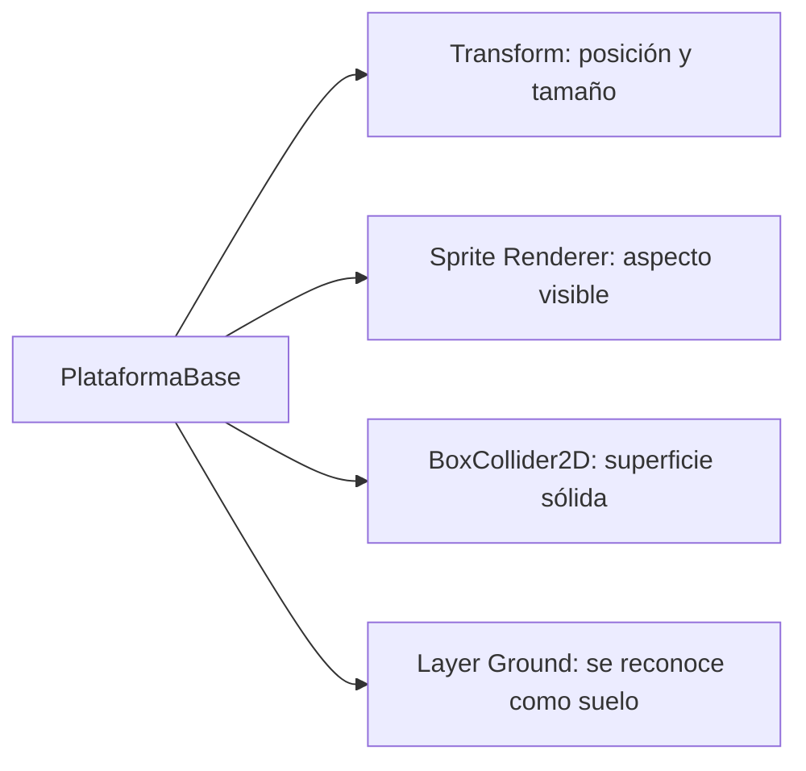
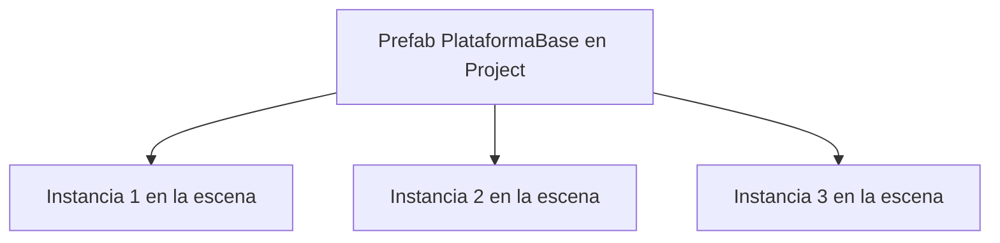

# Sesión 5: construir plataformas reutilizables 🧱

Duración aproximada: **50–65 minutos**.

## 🎯 Objetivo

Al terminar, tendremos un recorrido corto formado por varias plataformas sobre las que Kogi podrá caminar y saltar. Crearemos una sola plataforma y la reutilizaremos mediante un `Prefab`.

En esta sesión seguiremos el orden: **hacer → observar → entender → comprobar**. No añadiremos código nuevo, arte definitivo, peligros ni enemigos.

## 1. Abrir y comprobar la escena

1. Abre `Kogi` desde **Unity Hub > Projects**.
2. En **Project**, abre `Assets > Kogi > Scenes`.
3. Haz doble clic en `NivelDesierto`.
4. Comprueba en **Hierarchy** que aparecen `Kogi`, `Suelo`, `Main Camera` y `KogiCamera`.
5. Asegúrate de que ▶️ esté detenido.
6. Guarda con `Ctrl + S`.

> 💡 **Qué acabas de comprobar:** continuaremos trabajando sobre la escena que ya contiene movimiento, salto, colisiones y seguimiento de cámara.

## 2. Preparar una carpeta para Prefabs

1. En la ventana **Project**, abre `Assets > Kogi`.
2. Haz clic derecho en una zona vacía de la ventana **Project**.
3. Selecciona **Create > Folder**.
4. Nombra la carpeta `Prefabs`.
5. Abre `Prefabs`.
6. Crea dentro otra carpeta llamada `Environment`.

La ruta final debe ser:

```text
Assets
└── Kogi
    └── Prefabs
        └── Environment
```

### ¿Por qué creamos estas carpetas?

- `Prefabs` guardará objetos preparados para reutilizarse.
- `Environment` agrupará los elementos que forman el escenario.

Las carpetas no añaden comportamiento al juego. Solo mantienen el proyecto organizado para que siga siendo fácil encontrar cada elemento cuando crezca.

> 💡 **Qué acabas de aprender:** la ventana **Project** contiene los archivos del proyecto; organizarla no cambia la jerarquía de la escena.

## 3. Crear la primera plataforma

1. En el menú superior de Unity, abre **GameObject > 2D Object > Sprites > Square**.
2. Localiza el nuevo objeto en **Hierarchy**.
3. Renómbralo como `PlataformaBase`.
4. Selecciona `PlataformaBase`.
5. En **Inspector > Transform**, utiliza estos valores:

| Propiedad | X | Y | Z |
|---|---:|---:|---:|
| Position | 4 | -1 | 0 |
| Rotation | 0 | 0 | 0 |
| Scale | 3 | 0.5 | 1 |

6. En **Inspector**, pulsa **Add Component**.
7. Busca `Box Collider 2D` y añádelo.
8. Comprueba que **Is Trigger** esté desmarcado.
9. En la parte superior de **Inspector**, abre **Layer** y selecciona `Ground`.
10. Guarda con `Ctrl + S`.

### ¿Qué acabamos de construir?

`PlataformaBase` es un `GameObject` de la escena con tres responsabilidades:



El `BoxCollider2D` impide que Kogi atraviese la plataforma. La `Layer Ground` permite que `IsGrounded()` la reconozca como un lugar válido desde el que puede saltar.

> 💡 **Qué acabas de aprender:** una plataforma necesita ser visible, tener una superficie física y estar clasificada como suelo.

## 4. Comprobar la plataforma antes de reutilizarla

1. Guarda la escena con `Ctrl + S`.
2. Abre la pestaña **Game**.
3. Pulsa ▶️.
4. Camina hacia la derecha con `D` o `→`.
5. Salta con `Espacio` sobre `PlataformaBase`.
6. Comprueba que Kogi puede apoyarse y volver a saltar desde ella.
7. Detén la ejecución pulsando ▶️ otra vez.

Si Kogi atraviesa la plataforma o no puede volver a saltar desde ella, corrige primero su `BoxCollider2D` y su `Layer Ground`.

> 💡 **Qué acabas de comprobar:** el objeto funciona correctamente antes de utilizarlo como modelo para otras plataformas.

## 5. Convertir la plataforma en Prefab

1. En **Project**, abre `Assets > Kogi > Prefabs > Environment`.
2. En **Hierarchy**, mantén pulsado `PlataformaBase`.
3. Arrástralo hasta una zona vacía de la carpeta `Environment` en **Project**.
4. Suelta el objeto.
5. Comprueba que aparece un recurso llamado `PlataformaBase` en **Project**.
6. Observa que el nombre de `PlataformaBase` en **Hierarchy** ahora aparece en azul.

### ¿Qué es un Prefab?

Un `Prefab` es un modelo reutilizable guardado como archivo dentro del proyecto.

- El elemento de `Project` es el `Prefab` original.
- El elemento de `Hierarchy` es una instancia utilizada en la escena.
- Varias instancias pueden compartir la misma configuración.
- Cada instancia puede conservar una posición diferente.



No se ha movido el `GameObject` desde la escena hasta la carpeta. Unity ha creado un recurso reutilizable y ha conectado con él la instancia existente.

> 💡 **Qué acabas de aprender:** un `Prefab` evita reconstruir y configurar manualmente el mismo tipo de objeto muchas veces.

## 6. Crear más instancias

1. Selecciona `PlataformaBase` en **Hierarchy**.
2. Pulsa `Ctrl + D` para duplicarla.
3. Renombra la copia como `Plataforma02`.
4. En **Inspector > Transform > Position**, establece `(7.5, -1, 0)`.
5. Selecciona otra vez `PlataformaBase` en **Hierarchy**.
6. Pulsa `Ctrl + D`.
7. Renombra la nueva copia como `Plataforma03`.
8. En **Transform > Position**, establece `(11, -1, 0)`.
9. Guarda con `Ctrl + S`.

Comprueba todas las posiciones con esta tabla. Las tres plataformas deben tener la misma altura:

| GameObject | Position X | Position Y | Position Z |
|---|---:|---:|---:|
| `PlataformaBase` | 4 | -1 | 0 |
| `Plataforma02` | 7.5 | -1 | 0 |
| `Plataforma03` | 11 | -1 | 0 |

Mantén **Scale** en `(3, 0.5, 1)` para las tres. Entre una plataforma y la siguiente quedará un hueco pequeño de `0.5` unidades.

### ¿Por qué podemos cambiar sus posiciones?

Cada instancia mantiene su propio `Transform`. Cambiar su posición en la escena no modifica la posición de las demás ni la del `Prefab` original.

La forma visible, el `BoxCollider2D` y la `Layer Ground` siguen procediendo del mismo `Prefab`.

> 💡 **Qué acabas de aprender:** las instancias comparten una plantilla, pero pueden tener valores particulares llamados `Overrides`.

## 7. Reconocer un Override

1. Selecciona `Plataforma02` en **Hierarchy**.
2. Observa **Transform > Position** en **Inspector**.
3. Comprueba que sus valores aparecen destacados respecto a los valores originales del `Prefab`.
4. Busca el control **Overrides** en la parte superior de **Inspector**.
5. Ábrelo únicamente para observar la lista.
6. Cierra la lista sin pulsar **Apply All** ni **Revert All**.

### ¿Qué es un Override?

Un `Override` es una diferencia guardada solamente en una instancia.

En nuestro caso, cada plataforma necesita una posición diferente. Esa diferencia es intencionada y no debemos aplicarla al `Prefab` original.

- **Apply** enviaría un cambio de la instancia al `Prefab`.
- **Revert** descartaría el cambio de la instancia y recuperaría el valor del `Prefab`.

> 💡 **Qué acabas de aprender:** no todos los valores diferentes son errores; la posición particular de cada instancia es un uso normal de `Overrides`.

## 8. Cambiar todas las plataformas desde el Prefab

1. En **Project**, selecciona `Assets > Kogi > Prefabs > Environment > PlataformaBase`.
2. En **Inspector > Sprite Renderer**, abre el selector **Color**.
3. En el campo hexadecimal escribe `D8A45B` y conserva el canal alfa completamente visible.
4. Cierra el selector de color.
5. Guarda con `Ctrl + S`.
6. Regresa a la escena `NivelDesierto`.
7. Comprueba que las tres plataformas muestran el nuevo color.

### ¿Por qué cambiaron las tres?

El color pertenece al `Sprite Renderer` del `Prefab`. Como ninguna instancia había reemplazado ese valor, todas reciben el cambio del modelo original.

Las posiciones no cambian porque son `Overrides` propios de cada instancia.

```text
Cambio en el Prefab: Color        → llega a todas las instancias
Cambio en una instancia: Position → permanece solo en esa instancia
```

> 💡 **Qué acabas de aprender:** los cambios compartidos se realizan en el `Prefab`; las diferencias particulares permanecen en cada instancia.

## 9. Recorrer las plataformas

1. Guarda la escena con `Ctrl + S`.
2. Abre **Game**.
3. Pulsa ▶️.
4. Mueve a Kogi hacia la derecha.
5. Salta desde el suelo hasta `PlataformaBase`.
6. Continúa por `Plataforma02` y `Plataforma03`. Como tienen la misma altura y poca separación, Kogi debe alcanzarlas cómodamente.
7. Comprueba que la cámara acompaña todo el recorrido.
8. Intenta saltar de nuevo desde cada plataforma.
9. Pulsa ▶️ otra vez para detener la ejecución.

No pasa nada si Kogi cae de una plataforma y vuelve al suelo. En una sesión posterior añadiremos zonas de caída, pérdida de vidas y reaparición.

## 10. Revisar el resultado

1. Comprueba que ▶️ esté detenido.
2. Guarda con `Ctrl + S`.
3. Abre **Window > General > Console**.
4. Confirma que no existan errores rojos.

La sesión está terminada si:

- [ ] Existe `Assets/Kogi/Prefabs/Environment`.
- [ ] `PlataformaBase` existe como `Prefab` en **Project**.
- [ ] Hay tres instancias de plataforma en **Hierarchy**.
- [ ] Cada instancia conserva su propia posición.
- [ ] Las tres plataformas comparten el color del `Prefab`.
- [ ] Kogi puede apoyarse y saltar desde todas ellas.
- [ ] La cámara acompaña el recorrido.
- [ ] **Console** no muestra errores rojos.

## 🧰 Problemas frecuentes

- **Kogi atraviesa una plataforma:** comprueba que el `Prefab` tenga `Box Collider 2D` y que **Is Trigger** esté desmarcado.
- **Kogi se apoya pero no vuelve a saltar:** comprueba que la plataforma use la `Layer Ground`.
- **Solo cambia de color una plataforma:** probablemente cambiaste una instancia. Selecciona el `Prefab` desde la ventana **Project**.
- **Todas las plataformas se movieron al mismo lugar:** no apliques el `Override` de posición al `Prefab`. Usa **Revert** si lo aplicaste accidentalmente y vuelve a colocar cada instancia.
- **No aparece el botón Overrides:** confirma que seleccionaste una instancia conectada al `Prefab`, identificada por su nombre azul.
- **Kogi no alcanza una plataforma:** comprueba en la tabla que las tres tengan `Position Y = -1`, que sus escalas sean `(3, 0.5, 1)` y que `Jump Force` continúe en `8`.
- **Los cambios desaparecieron:** realiza los cambios con ▶️ detenido y guarda con `Ctrl + S`.

---

[⬅️ Sesión anterior](04-camara-que-sigue-a-kogi.md) · [🏠 Inicio](../../README.md) · [Siguiente: caída y reaparición ➡️](06-caida-y-reaparicion.md)
