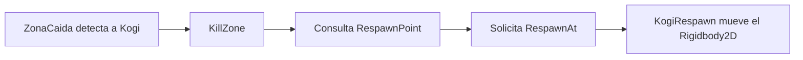

# Sesión 6: detectar una caída y hacer reaparecer a Kogi ♻️

Duración aproximada: **60–75 minutos**.

## 🎯 Objetivo

Al terminar, cuando Kogi caiga fuera del escenario, una zona invisible detectará su entrada y lo devolverá a un punto seguro.

En esta sesión seguiremos el orden: **hacer → observar → entender → comprobar**. Todavía no descontaremos vidas ni mostraremos una interfaz.

## 1. Abrir y comprobar la escena

1. Abre `Kogi` desde **Unity Hub > Projects**.
2. En **Project**, abre `Assets > Kogi > Scenes`.
3. Haz doble clic en `NivelDesierto`.
4. Comprueba que Kogi puede moverse, saltar y recorrer las tres plataformas.
5. Detén ▶️ después de la comprobación.
6. Guarda con `Ctrl + S`.

> 💡 **Qué acabas de comprobar:** comenzamos desde un recorrido funcional antes de añadir una nueva regla.

## 2. Crear el punto de reaparición

1. En **Hierarchy**, haz clic derecho en una zona vacía.
2. Selecciona **Create Empty**.
3. Renombra el nuevo `GameObject` como `RespawnPoint`.
4. Selecciona `RespawnPoint`.
5. En **Inspector > Transform**, establece:

| Propiedad | X | Y | Z |
|---|---:|---:|---:|
| Position | 0 | 0 | 0 |
| Rotation | 0 | 0 | 0 |
| Scale | 1 | 1 | 1 |

`RespawnPoint` debe estar en la raíz de **Hierarchy**, al mismo nivel que Kogi. No lo conviertas en hijo de Kogi.

### ¿Qué es RespawnPoint?

Es un `GameObject` vacío utilizado como marcador. Su `Transform` guarda la posición segura a la que regresará Kogi.

No necesita `Sprite Renderer`, `Collider2D` ni código. Tampoco aparecerá en la ventana **Game**.

```text
RespawnPoint
└── Transform → posición segura (0, 0, 0)
```

> 💡 **Qué acabas de aprender:** un objeto vacío puede guardar una posición importante de la escena sin tener representación visual.

## 3. Crear la zona situada bajo el escenario

1. En **Hierarchy**, haz clic derecho en una zona vacía.
2. Selecciona **Create Empty**.
3. Renombra el objeto como `ZonaCaida`.
4. Selecciona `ZonaCaida`.
5. En **Inspector > Transform**, establece **Position** en `(0, -5, 0)`.
6. Mantén **Rotation** en `(0, 0, 0)` y **Scale** en `(1, 1, 1)`.
7. Pulsa **Add Component**.
8. Busca `Box Collider 2D` y añádelo.
9. Dentro de **Box Collider 2D**, establece **Size** en `(40, 2)`.
10. Marca la casilla **Is Trigger**.
11. Guarda con `Ctrl + S`.

En la ventana **Scene** aparecerá un rectángulo verde bajo el nivel. En **Game** seguirá siendo invisible porque no tiene `Sprite Renderer`.

### ¿Qué cambia al marcar Is Trigger?

Un `Collider2D` sólido impide que otros cuerpos lo atraviesen. Un `Trigger` permite el paso, pero avisa a Unity cuando otro `Collider2D` entra en su zona.

```text
Is Trigger desmarcado → bloquea físicamente
Is Trigger marcado    → detecta la entrada sin bloquear
```

Queremos que Kogi atraviese `ZonaCaida`; la zona debe detectar la caída, no convertirse en otro suelo.

> 💡 **Qué acabas de aprender:** un `Trigger` funciona como un sensor invisible.

## 4. Preparar la carpeta del código del escenario

1. En **Project**, abre `Assets > Kogi > Scripts`.
2. Haz clic derecho en una zona vacía.
3. Selecciona **Create > Folder**.
4. Nombra la carpeta `Environment`.

La estructura debe quedar así:

```text
Scripts
├── Player
└── Environment
```

`Player` contiene comportamientos propios de Kogi. `Environment` contendrá comportamientos de elementos del escenario.

> 💡 **Qué acabas de aprender:** organizamos el código por responsabilidad, no por el orden en que creamos los archivos.

## 5. Crear el componente que hace reaparecer a Kogi

1. En **Project**, abre `Assets > Kogi > Scripts > Player`.
2. Haz clic derecho en una zona vacía.
3. Selecciona **Create > Scripting > MonoBehaviour Script**.
4. Escribe exactamente `KogiRespawn` y pulsa `Enter`.
5. Haz doble clic en `KogiRespawn` para abrirlo en Rider.
6. Reemplaza todo su contenido por este código:

```csharp
using UnityEngine;

namespace Kogi.Scripts.Player
{
    [RequireComponent(typeof(Rigidbody2D))]
    public sealed class KogiRespawn : MonoBehaviour
    {
        private Rigidbody2D body;

        private void Awake()
        {
            body = GetComponent<Rigidbody2D>();
        }

        public void RespawnAt(Vector2 position)
        {
            body.position = position;
            body.linearVelocity = Vector2.zero;
            body.angularVelocity = 0f;
        }
    }
}
```

7. Guarda el archivo con `Ctrl + S`.
8. Regresa a Unity y espera a que termine de compilar.
9. Comprueba en **Console** que no haya errores rojos.

### ¿Qué hace KogiRespawn?

Este componente tiene una única responsabilidad: colocar el `Rigidbody2D` de Kogi en una posición segura y detener su movimiento anterior.

- `body.position = position` cambia la posición física de Kogi.
- `linearVelocity = Vector2.zero` elimina la velocidad de caída y el movimiento horizontal.
- `angularVelocity = 0f` elimina cualquier giro físico pendiente.

Usamos el `Rigidbody2D`, en lugar de modificar directamente el `Transform`, porque Kogi es un cuerpo controlado por la física.

### ¿Por qué RespawnAt es public?

`RespawnAt` debe poder ser llamado por otro componente: la zona de caída. Los demás detalles permanecen `private` porque solo los utiliza `KogiRespawn`.

> 💡 **Qué acabas de aprender:** un método `public` forma parte de lo que un componente permite solicitar desde fuera.

## 6. Añadir KogiRespawn a Kogi

1. En **Hierarchy**, selecciona `Kogi`.
2. En **Inspector**, pulsa **Add Component**.
3. Escribe `Kogi Respawn`.
4. Selecciona el componente **Kogi Respawn**.
5. Comprueba que aparece debajo de los demás componentes de Kogi.

No verás campos para configurar. `KogiRespawn` obtiene por sí mismo el `Rigidbody2D` que ya existe en el mismo `GameObject`.

`[RequireComponent(typeof(Rigidbody2D))]` expresa esa dependencia y evita utilizar el componente sin el cuerpo físico que necesita.

> 💡 **Qué acabas de aprender:** el archivo C# es un recurso de **Project**; al añadirlo a Kogi se convierte en un componente de ese `GameObject`.

## 7. Crear el componente de la zona de caída

1. En **Project**, abre `Assets > Kogi > Scripts > Environment`.
2. Haz clic derecho en una zona vacía.
3. Selecciona **Create > Scripting > MonoBehaviour Script**.
4. Escribe exactamente `KillZone` y pulsa `Enter`.
5. Haz doble clic en `KillZone` para abrirlo en Rider.
6. Reemplaza todo su contenido por este código:

```csharp
using Kogi.Scripts.Player;
using UnityEngine;

namespace Kogi.Scripts.Environment
{
    public sealed class KillZone : MonoBehaviour
    {
        [SerializeField]
        private Transform respawnPoint;

        private void OnTriggerEnter2D(Collider2D other)
        {
            if (!other.TryGetComponent(out KogiRespawn respawn))
            {
                return;
            }

            respawn.RespawnAt(respawnPoint.position);
        }
    }
}
```

7. Guarda con `Ctrl + S`.
8. Regresa a Unity y espera a que termine de compilar.
9. Confirma que **Console** no muestre errores rojos.

### ¿Cuándo se ejecuta OnTriggerEnter2D?

Unity llama a `OnTriggerEnter2D` cuando un `Collider2D` entra en un `Trigger` 2D. No lo llamamos nosotros directamente.

El parámetro `other` representa el `Collider2D` que entró en la zona. En nuestra prueba será el `CapsuleCollider2D` de Kogi.

### ¿Qué hace TryGetComponent?

La zona no depende del nombre `Kogi`. Pregunta si el objeto que entró tiene el componente `KogiRespawn`:

- Si lo tiene, puede hacerlo reaparecer.
- Si no lo tiene, termina el método sin hacer nada.

Esto evita utilizar una comparación frágil con el nombre del `GameObject`.

> 💡 **Qué acabas de aprender:** un componente puede reconocer capacidades de otro objeto comprobando qué componente posee.

## 8. Conectar KillZone con la escena

1. Selecciona `ZonaCaida` en **Hierarchy**.
2. Pulsa **Add Component** en **Inspector**.
3. Busca `Kill Zone` y selecciónalo.
4. Comprueba que aparece el campo **Respawn Point**.
5. Arrastra `RespawnPoint` desde **Hierarchy** hasta ese campo.
6. Verifica que el campo muestre `RespawnPoint` y no `None`.
7. Guarda con `Ctrl + S`.

### ¿Qué acabamos de conectar?

El código declara que necesita un `Transform`. Al arrastrar `RespawnPoint`, Unity guarda una referencia a su `Transform` dentro de la escena.



`KillZone` decide **cuándo** debe ocurrir la reaparición. `KogiRespawn` sabe **cómo** realizarla. Cada componente conserva una responsabilidad concreta.

> 💡 **Qué acabas de aprender:** el **Inspector** permite conectar componentes sin dejar posiciones específicas escritas dentro del código.

## 9. Probar la caída y la reaparición

1. Guarda la escena con `Ctrl + S`.
2. Abre la pestaña **Game**.
3. Pulsa ▶️.
4. Mueve a Kogi hacia la derecha hasta superar el final de `Suelo`.
5. Deja que caiga.
6. Comprueba que desaparece por abajo y reaparece cerca del inicio.
7. Verifica que no conserva la velocidad de la caída.
8. Comprueba que puede volver a caminar y saltar.
9. Detén la ejecución pulsando ▶️ otra vez.

La cámara puede moverse bruscamente cuando Kogi reaparece. Ajustaremos ese detalle cuando trabajemos las transiciones y la presentación del juego.

## 10. Revisar el resultado

1. Comprueba que ▶️ esté detenido.
2. Guarda con `Ctrl + S`.
3. Abre **Window > General > Console**.
4. Confirma que no existan errores rojos.

La sesión está terminada si:

- [ ] `RespawnPoint` existe en la raíz de **Hierarchy**.
- [ ] `ZonaCaida` está debajo del escenario.
- [ ] `ZonaCaida` tiene un `Box Collider 2D` con **Is Trigger** marcado.
- [ ] Kogi tiene el componente `Kogi Respawn`.
- [ ] `ZonaCaida` tiene el componente `Kill Zone`.
- [ ] El campo **Respawn Point** contiene la referencia correcta.
- [ ] Kogi reaparece al caer fuera del escenario.
- [ ] Kogi reaparece sin conservar la velocidad de caída.
- [ ] **Console** no muestra errores rojos.

## 🧰 Problemas frecuentes

- **Kogi atraviesa la zona y continúa cayendo:** confirma que `ZonaCaida` tenga `Kill Zone` y que el script haya compilado.
- **Kogi queda detenido sobre la zona:** marca **Box Collider 2D > Is Trigger**.
- **Aparece NullReferenceException:** comprueba que **Respawn Point** no muestre `None`.
- **Kogi reaparece y sigue cayendo muy rápido:** revisa que `RespawnAt` asigne `Vector2.zero` a `linearVelocity`.
- **Kogi no activa el Trigger:** comprueba que Kogi conserve `Rigidbody2D` y `CapsuleCollider2D`.
- **El script no aparece en Add Component:** corrige primero todos los errores rojos de **Console**.
- **Kogi reaparece dentro del suelo:** verifica que `RespawnPoint` tenga **Position** `(0, 0, 0)`.
- **Los cambios desaparecieron:** configura los objetos con ▶️ detenido y guarda con `Ctrl + S`.

---

[⬅️ Sesión anterior](05-plataformas-reutilizables.md) · [🏠 Inicio](../../README.md) · [Siguiente: tres vidas y reinicio ➡️](07-tres-vidas-y-reinicio.md)
