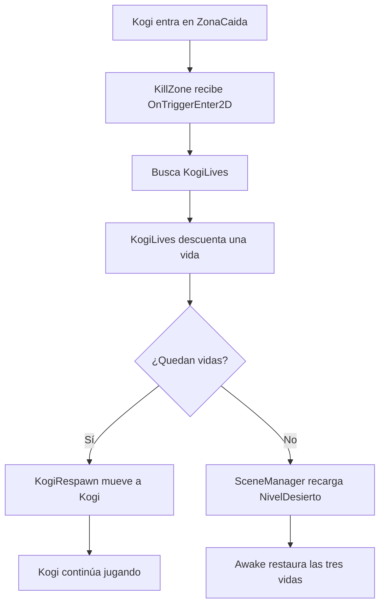

# Sesión 7: añadir tres vidas y reiniciar el nivel ❤️

Duración aproximada: **55–70 minutos**.

## 🎯 Objetivo

Al terminar, Kogi comenzará con tres vidas. Cada caída descontará una vida y lo hará reaparecer. Al perder la tercera, Unity reiniciará `NivelDesierto`.

En esta sesión veremos las vidas en **Console**. Crearemos su representación visual en la sesión siguiente.

## 1. Comprobar la reaparición actual

1. Abre `NivelDesierto`.
2. Pulsa ▶️.
3. Mueve a Kogi hasta el final del suelo y déjalo caer.
4. Comprueba que reaparece en `RespawnPoint`.
5. Detén ▶️.
6. Guarda con `Ctrl + S`.

> 💡 **Qué acabas de comprobar:** antes de contar vidas, la detección de la caída y la reaparición deben funcionar correctamente.

## 2. Incluir NivelDesierto en el juego

1. Confirma que `NivelDesierto` sea la escena abierta.
2. Abre el menú superior **File > Build Profiles**.
3. Busca la sección **Scene List**.
4. Pulsa **Add Open Scenes**.
5. Comprueba que `NivelDesierto` aparece en la lista y tiene marcada su casilla.
6. Cierra **Build Profiles**.

Si `NivelDesierto` ya estaba en la lista, no la añadas otra vez.

### ¿Por qué añadimos la escena?

Unity necesita conocer qué escenas forman parte del juego. Al final de las tres vidas, el código pedirá volver a cargar la escena activa.

El número situado junto a cada escena es su `Build Index`. Si la plantilla añadió `SampleScene`, esta tendrá normalmente el índice `0` y `NivelDesierto` tendrá el índice `1`. Puedes dejar ambas escenas en la lista: no afecta a esta práctica.

Nuestro código no supone que `NivelDesierto` tenga un número concreto. Primero obtiene la escena que está activa y después utiliza su propio índice:

```csharp
Scene activeScene = SceneManager.GetActiveScene();
SceneManager.LoadScene(activeScene.buildIndex);
```

Por tanto, si estás jugando en `NivelDesierto`, Unity recargará `NivelDesierto` tanto si su índice es `0` como si es `1`.

> 💡 **Qué acabas de aprender:** guardar una escena crea su archivo; añadirla a **Build Profiles** permite cargarla durante el juego.

## 3. Crear el componente que administra las vidas

1. En **Project**, abre `Assets > Kogi > Scripts > Player`.
2. Haz clic derecho en una zona vacía.
3. Selecciona **Create > Scripting > MonoBehaviour Script**.
4. Escribe exactamente `KogiLives` y pulsa `Enter`.
5. Haz doble clic en `KogiLives` para abrirlo en Rider.
6. Reemplaza todo su contenido por este código:

```csharp
using UnityEngine;
using UnityEngine.SceneManagement;

namespace Kogi.Scripts.Player
{
    [RequireComponent(typeof(KogiRespawn))]
    public sealed class KogiLives : MonoBehaviour
    {
        [SerializeField, Min(1)]
        private int startingLives = 3;

        private KogiRespawn respawn;
        private int currentLives;

        private void Awake()
        {
            respawn = GetComponent<KogiRespawn>();
            currentLives = startingLives;
        }

        public void LoseLife(Vector2 respawnPosition)
        {
            currentLives--;
            Debug.Log($"Vidas restantes: {currentLives}");

            if (currentLives <= 0)
            {
                Scene activeScene = SceneManager.GetActiveScene();
                SceneManager.LoadScene(activeScene.buildIndex);
                return;
            }

            respawn.RespawnAt(respawnPosition);
        }
    }
}
```

7. Guarda con `Ctrl + S`.
8. Regresa a Unity y espera a que termine de compilar.
9. Abre **Console** y confirma que no existan errores rojos.

### ¿Qué representa cada variable?

| Variable | Tipo | Responsabilidad |
|---|---|---|
| `startingLives` | `int` | Cantidad de vidas con la que comienza el nivel |
| `currentLives` | `int` | Cantidad de vidas que quedan durante la partida |
| `respawn` | `KogiRespawn` | Componente que sabe mover a Kogi al punto seguro |

`int` representa un número entero. Utilizamos `[Min(1)]` para impedir que **Inspector** acepte un valor inicial inferior a una vida.

### ¿Qué ocurre en Awake?

`Awake` se ejecuta cuando Unity carga el componente:

1. Obtiene `KogiRespawn` del mismo `GameObject`.
2. Copia `startingLives` en `currentLives`.

La cantidad inicial es configuración. La cantidad actual cambia durante la partida.

> 💡 **Qué acabas de aprender:** separar el valor inicial del estado actual permite reiniciar el estado cada vez que se carga la escena.

## 4. Entender LoseLife paso a paso

No cambies código en este apartado. Vamos a leer el método que acabas de añadir.

```csharp
currentLives--;
```

`--` resta uno. Si Kogi tenía tres vidas, pasa a tener dos.

```csharp
Debug.Log($"Vidas restantes: {currentLives}");
```

`Debug.Log` escribe información en **Console**. Lo utilizaremos para observar el sistema antes de crear una interfaz visual.

```csharp
if (currentLives <= 0)
```

Esta condición distingue dos caminos:

- Si no quedan vidas, recarga la escena activa.
- Si todavía quedan vidas, llama a `KogiRespawn.RespawnAt`.

`return` termina el método después de solicitar la recarga. Así evitamos intentar reaparecer a Kogi mientras la escena se está reiniciando.

> 💡 **Qué acabas de aprender:** `KogiLives` toma la decisión y delega el movimiento físico en `KogiRespawn`.

## 5. Añadir KogiLives a Kogi

1. Selecciona `Kogi` en **Hierarchy**.
2. En **Inspector**, pulsa **Add Component**.
3. Busca `Kogi Lives`.
4. Selecciona el componente.
5. Comprueba que **Starting Lives** tenga el valor `3`.
6. Guarda con `Ctrl + S`.

No tienes que conectar `KogiRespawn` manualmente. Ambos componentes están en Kogi y `GetComponent<KogiRespawn>()` obtiene la referencia durante `Awake`.

`[RequireComponent(typeof(KogiRespawn))]` expresa que `KogiLives` no puede funcionar sin ese componente.

> 💡 **Qué acabas de aprender:** una dependencia que vive en el mismo `GameObject` puede resolverse con `GetComponent`; una referencia a otro objeto de la escena suele conectarse desde **Inspector**.

## 6. Pedir a KillZone que descuente una vida

1. En **Project**, abre `Assets > Kogi > Scripts > Environment`.
2. Haz doble clic en `KillZone`.
3. Localiza este bloque:

```csharp
if (!other.TryGetComponent(out KogiRespawn respawn))
{
    return;
}

respawn.RespawnAt(respawnPoint.position);
```

4. Sustitúyelo por:

```csharp
if (!other.TryGetComponent(out KogiLives lives))
{
    return;
}

lives.LoseLife(respawnPoint.position);
```

5. El archivo completo debe quedar así:

```csharp
using Kogi.Scripts.Player;
using UnityEngine;

namespace Kogi.Scripts.Environment
{
    public sealed class KillZone : MonoBehaviour
    {
        [SerializeField]
        private Transform respawnPoint;

        private void OnTriggerEnter2D(Collider2D other)
        {
            if (!other.TryGetComponent(out KogiLives lives))
            {
                return;
            }

            lives.LoseLife(respawnPoint.position);
        }
    }
}
```

6. Guarda con `Ctrl + S`.
7. Regresa a Unity y espera a que termine de compilar.
8. Confirma que **Console** no muestre errores rojos.

### ¿Qué cambió en KillZone?

Antes, `KillZone` solicitaba directamente una reaparición. Ahora informa a `KogiLives` de que Kogi cayó.

```text
Antes: caída → reaparecer
Ahora: caída → perder una vida → decidir entre reaparecer o reiniciar
```

`KillZone` continúa sin conocer cuántas vidas tiene Kogi. Solo detecta la entrada y comunica la consecuencia.

> 💡 **Qué acabas de aprender:** añadimos una regla nueva sin trasladar toda la lógica a la zona de caída.

## 7. Comprobar que RespawnPoint sigue conectado

1. Selecciona `ZonaCaida` en **Hierarchy**.
2. Busca **Kill Zone** en **Inspector**.
3. Comprueba que **Respawn Point** muestre `RespawnPoint`.
4. Si muestra `None`, arrastra `RespawnPoint` desde **Hierarchy** hasta ese campo.
5. Guarda con `Ctrl + S`.

Modificar el contenido de `KillZone.cs` no debería borrar una referencia serializada cuyo campo conserva el mismo nombre y tipo. Aun así, siempre comprobamos la escena antes de ejecutar.

> 💡 **Qué acabas de aprender:** el código define el campo y la escena guarda qué objeto concreto está asignado a él.

## 8. Probar las tres vidas

1. Abre **Console**.
2. Desactiva **Collapse** para ver cada mensaje por separado.
3. Guarda la escena con `Ctrl + S`.
4. Abre **Game** y pulsa ▶️.
5. Haz caer a Kogi una vez.
6. Comprueba en **Console**: `Vidas restantes: 2`.
7. Hazlo caer una segunda vez.
8. Comprueba: `Vidas restantes: 1`.
9. Hazlo caer una tercera vez.
10. Comprueba: `Vidas restantes: 0`.
11. Observa que `NivelDesierto` se reinicia y Kogi vuelve a su estado inicial.
12. Hazlo caer otra vez y comprueba que vuelve a mostrar `Vidas restantes: 2`.
13. Detén ▶️.

Al recargar la escena, Unity crea nuevamente `KogiLives` y `Awake` restaura `currentLives` a `3`.

## 9. Comprender el flujo completo



Cada pieza mantiene una responsabilidad:

- `KillZone`: detecta la caída.
- `KogiLives`: conserva las vidas y decide la consecuencia.
- `KogiRespawn`: mueve el cuerpo al punto seguro.
- `SceneManager`: carga o recarga escenas.

## 10. Revisar el resultado

1. Comprueba que ▶️ esté detenido.
2. Guarda con `Ctrl + S`.
3. Confirma que **Console** no tenga errores rojos.

La sesión está terminada si:

- [ ] `NivelDesierto` aparece en **Build Profiles > Scene List**.
- [ ] Existe `KogiLives.cs` dentro de `Scripts/Player`.
- [ ] Kogi tiene el componente `Kogi Lives`.
- [ ] **Starting Lives** vale `3`.
- [ ] Cada caída descuenta una vida en **Console**.
- [ ] Las dos primeras caídas hacen reaparecer a Kogi.
- [ ] La tercera caída reinicia `NivelDesierto`.
- [ ] Una partida nueva comienza otra vez con tres vidas.
- [ ] **Console** no muestra errores rojos.

## 🧰 Problemas frecuentes

- **Cada caída solamente hace reaparecer a Kogi:** confirma que `KillZone` busque `KogiLives` y llame a `LoseLife`.
- **No aparece Kogi Lives en Add Component:** corrige primero los errores rojos de **Console**.
- **La tercera caída produce un error de carga:** añade `NivelDesierto` a **Build Profiles > Scene List**.
- **Aparece UnassignedReferenceException:** selecciona `ZonaCaida` y vuelve a conectar **Respawn Point**.
- **No ves los mensajes:** abre **Console**, activa los mensajes informativos y desactiva **Collapse**.
- **Las vidas empiezan con otro valor:** selecciona Kogi y establece **Starting Lives** en `3` con ▶️ detenido.
- **Kogi no reaparece en las dos primeras caídas:** confirma que Kogi conserve el componente `Kogi Respawn`.
- **Los cambios desaparecieron:** realiza la configuración con ▶️ detenido y guarda con `Ctrl + S`.

---

[⬅️ Sesión anterior](06-caida-y-reaparicion.md) · [🏠 Inicio](../../README.md) · [Siguiente: mostrar las vidas ➡️](08-mostrar-vidas-en-pantalla.md)
