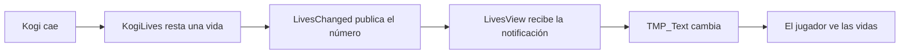

# Sesión 8: mostrar las vidas en pantalla ❤️❤️❤️

Duración aproximada: **65–80 minutos**.

## 🎯 Objetivo

Al terminar, la esquina superior izquierda mostrará las vidas actuales de Kogi. El texto cambiará automáticamente después de cada caída.

En esta sesión aprenderemos `Canvas`, `TextMeshPro` y eventos de C#. La interfaz observará el estado del juego sin controlar su lógica.

## 1. Comprobar el sistema de vidas

1. Abre `NivelDesierto`.
2. Pulsa ▶️.
3. Haz caer a Kogi una vez.
4. Comprueba en **Console** que aparece `Vidas restantes: 2`.
5. Detén ▶️.
6. Guarda con `Ctrl + S`.

> 💡 **Qué acabas de comprobar:** el contador ya funciona internamente. Ahora construiremos una forma visual de mostrarlo.

## 2. Crear el texto de las vidas

1. En el menú superior, abre **GameObject > UI > Text - TextMeshPro**.
2. Si aparece la ventana **TMP Importer**, pulsa **Import TMP Essentials**.
3. Espera a que Unity termine la importación y cierra esa ventana.
4. Observa los nuevos objetos creados en **Hierarchy**.
5. Renombra el objeto de texto como `LivesText`.

Unity habrá creado una estructura similar a esta:

```text
Canvas
└── LivesText

EventSystem
```

### ¿Qué acabamos de crear?

- `Canvas` es la superficie sobre la que Unity dibuja la interfaz.
- `LivesText` es un texto creado con `TextMeshPro`.
- `EventSystem` gestiona interacciones de la interfaz, como clics y selección. Todavía no lo utilizaremos directamente.

El texto es hijo de `Canvas` porque los elementos de interfaz deben pertenecer a un `Canvas` para mostrarse correctamente.

> 💡 **Qué acabas de aprender:** los objetos del nivel viven en el mundo; los elementos de interfaz viven dentro de un `Canvas`.

## 3. Comprobar el modo del Canvas

1. Selecciona `Canvas` en **Hierarchy**.
2. Busca el componente **Canvas** en **Inspector**.
3. Comprueba que **Render Mode** sea `Screen Space - Overlay`.
4. No cambies las demás propiedades.

### ¿Qué significa Screen Space - Overlay?

Este modo dibuja la interfaz directamente sobre la pantalla del jugador. El texto permanece en la esquina aunque `Main Camera` y Kogi se desplacen.

```text
Escenario y Kogi → los muestra Main Camera
Texto de vidas   → Canvas lo dibuja sobre la pantalla
```

> 💡 **Qué acabas de aprender:** el HUD no debe moverse con el escenario ni depender de la posición de la cámara.

## 4. Colocar LivesText en la esquina superior izquierda

1. Selecciona `LivesText` en **Hierarchy**.
2. Busca **Rect Transform** en **Inspector**.
3. Pulsa el pequeño cuadrado de **Anchor Presets**.
4. Mantén pulsadas `Shift + Alt`.
5. Sin soltar las teclas, pulsa el ajuste situado arriba a la izquierda.
6. Haz clic fuera de **Anchor Presets** para cerrar la cuadrícula.
7. En **Rect Transform**, sustituye manualmente los valores actuales por estos:

| Propiedad | Valor |
|---|---:|
| Pos X | 30 |
| Pos Y | -30 |
| Width | 300 |
| Height | 80 |

8. En el componente **TextMeshPro - Text (UI)**, cambia el contenido a `Vidas: 3`.
9. Establece **Font Size** en `36`.
10. En **Alignment**, selecciona alineación horizontal izquierda y vertical superior.
11. Guarda con `Ctrl + S`.

### ¿Qué es Rect Transform?

Los elementos de interfaz utilizan `RectTransform`, una especialización de `Transform` que añade ancho, alto y anclajes.

El anclaje superior izquierdo expresa que la posición del texto debe calcularse desde esa esquina. Si cambia el tamaño de la ventana, conservará su separación de `30` unidades.

> 💡 **Qué acabas de aprender:** los anclajes permiten que la interfaz se adapte a distintas resoluciones de pantalla.

## 5. Comprobar el texto provisional

1. Abre la pestaña **Game**.
2. Comprueba que aparece `Vidas: 3` en en la esquina superior izquierda.
3. Pulsa ▶️.
4. Mueve y haz saltar a Kogi.
5. Observa que el texto permanece fijo en la pantalla.
6. Haz caer a Kogi una vez.
7. Observa que **Console** muestra dos vidas, pero el texto todavía muestra tres.
8. Detén ▶️.

Esto es correcto: por ahora el texto contiene un valor escrito manualmente. En los siguientes pasos conectaremos la interfaz con `KogiLives`.

> 💡 **Qué acabas de comprobar:** crear el texto determina su aspecto, pero todavía no lo conecta con el estado del juego.

## 6. Permitir que KogiLives anuncie los cambios

1. En **Project**, abre `Assets > Kogi > Scripts > Player`.
2. Haz doble clic en `KogiLives`.
3. Añade esta línea antes de `using UnityEngine;`:

```csharp
using System;
```

4. Dentro de la clase, justo antes de `startingLives`, añade:

```csharp
public event Action<int> LivesChanged;

public int CurrentLives => currentLives;
```

5. Dentro de `LoseLife`, inmediatamente después de `currentLives--;`, añade:

```csharp
LivesChanged?.Invoke(currentLives);
```

6. El archivo completo debe quedar así:

```csharp
using System;
using UnityEngine;
using UnityEngine.SceneManagement;

namespace Kogi.Scripts.Player
{
    [RequireComponent(typeof(KogiRespawn))]
    public sealed class KogiLives : MonoBehaviour
    {
        public event Action<int> LivesChanged;

        public int CurrentLives => currentLives;

        [SerializeField, Min(1)]
        private int startingLives = 3;

        private KogiRespawn respawn;
        private int currentLives;

        private void Awake()
        {
            respawn = GetComponent<KogiRespawn>();
            currentLives = startingLives;
        }

        public void LoseLife(Vector2 respawnPosition)
        {
            currentLives--;
            LivesChanged?.Invoke(currentLives);
            Debug.Log($"Vidas restantes: {currentLives}");

            if (currentLives <= 0)
            {
                Scene activeScene = SceneManager.GetActiveScene();
                SceneManager.LoadScene(activeScene.buildIndex);
                return;
            }

            respawn.RespawnAt(respawnPosition);
        }
    }
}
```

7. Guarda con `Ctrl + S`.
8. Regresa a Unity y espera a que termine de compilar.
9. Comprueba que **Console** no tenga errores rojos.

### ¿Qué es un event?

`LivesChanged` es una notificación. `KogiLives` la emite cuando cambia el contador, pero no necesita saber quién está escuchando.

`Action<int>` significa que la notificación transporta un número entero: la cantidad de vidas restante.

```text
KogiLives cambia el estado
          ↓
LivesChanged anuncia el nuevo número
          ↓
Uno o varios componentes pueden reaccionar
```

`?.Invoke` significa: invoca el evento solamente si existe algún componente escuchándolo.

### ¿Para qué sirve CurrentLives?

`CurrentLives` permite consultar la cantidad actual, pero no modificarla desde fuera de `KogiLives`.

Es una propiedad de solo lectura. La variable real `currentLives` continúa siendo privada.

> 💡 **Qué acabas de aprender:** un evento comunica que algo ocurrió sin acoplar la lógica del juego a la interfaz.

## 7. Preparar la carpeta del código de interfaz

1. En **Project**, abre `Assets > Kogi > Scripts`.
2. Haz clic derecho en una zona vacía.
3. Selecciona **Create > Folder**.
4. Nombra la carpeta `UI`.

La estructura debe quedar:

```text
Scripts
├── Environment
├── Player
└── UI
```

> 💡 **Qué acabas de aprender:** el código encargado de mostrar información pertenece a `UI`, no a `Player` ni a `Environment`.

## 8. Crear LivesView

1. Abre `Assets > Kogi > Scripts > UI`.
2. Haz clic derecho en una zona vacía.
3. Selecciona **Create > Scripting > MonoBehaviour Script**.
4. Escribe exactamente `LivesView` y pulsa `Enter`.
5. Haz doble clic en `LivesView` para abrirlo en Rider.
6. Reemplaza todo su contenido por:

```csharp
using Kogi.Scripts.Player;
using TMPro;
using UnityEngine;

namespace Kogi.Scripts.UI
{
    [RequireComponent(typeof(TMP_Text))]
    public sealed class LivesView : MonoBehaviour
    {
        [SerializeField]
        private KogiLives lives;

        private TMP_Text label;

        private void Awake()
        {
            label = GetComponent<TMP_Text>();
        }

        private void OnEnable()
        {
            lives.LivesChanged += Refresh;
        }

        private void Start()
        {
            Refresh(lives.CurrentLives);
        }

        private void OnDisable()
        {
            lives.LivesChanged -= Refresh;
        }

        private void Refresh(int currentLives)
        {
            label.text = $"Vidas: {currentLives}";
        }
    }
}
```

7. Guarda con `Ctrl + S`.
8. Regresa a Unity y espera a que termine de compilar.
9. Confirma que **Console** no tenga errores rojos.

### ¿Qué responsabilidad tiene LivesView?

`LivesView` solo convierte un número en texto visible. No descuenta vidas, no mueve a Kogi y no reinicia la escena.

- `Awake` obtiene el `TMP_Text` del mismo `GameObject`.
- `OnEnable` comienza a escuchar `LivesChanged`.
- `Start` muestra el valor inicial.
- `Refresh` actualiza el texto.
- `OnDisable` deja de escuchar el evento.

### ¿Por qué dejamos de escuchar en OnDisable?

Cada suscripción realizada con `+=` debe retirarse con `-=` cuando el componente deja de estar activo. Esto evita referencias innecesarias y notificaciones duplicadas.

> 💡 **Qué acabas de aprender:** suscribirse y cancelar la suscripción forman un par dentro del ciclo de vida del componente.

## 9. Conectar LivesView

1. Selecciona `LivesText` en **Hierarchy**.
2. Pulsa **Add Component**.
3. Busca `Lives View` y añádelo.
4. Dentro del nuevo componente, localiza el campo **Lives**.
5. Arrastra `Kogi` desde **Hierarchy** hasta el campo **Lives**.
6. Comprueba que muestra `Kogi (Kogi Lives)` y no `None`.
7. Guarda con `Ctrl + S`.

Al arrastrar Kogi, Unity encuentra su componente `KogiLives` porque ese es el tipo solicitado por el campo.

No necesitamos arrastrar el texto: `LivesView` está en el mismo `GameObject` que `TMP_Text` y lo obtiene mediante `GetComponent<TMP_Text>()`.

> 💡 **Qué acabas de aprender:** conectamos desde **Inspector** la dependencia que vive en otro objeto y obtenemos mediante `GetComponent` la que vive en el mismo objeto.

## 10. Probar la interfaz de vidas

1. Guarda la escena con `Ctrl + S`.
2. Abre **Game**.
3. Pulsa ▶️.
4. Comprueba que el texto comienza en `Vidas: 3`.
5. Haz caer a Kogi una vez y comprueba `Vidas: 2`.
6. Hazlo caer otra vez y comprueba `Vidas: 1`.
7. Hazlo caer por tercera vez.
8. Comprueba que la escena se reinicia y el texto vuelve a `Vidas: 3`.
9. Detén ▶️.



## 11. Revisar el resultado

1. Comprueba que ▶️ esté detenido.
2. Guarda con `Ctrl + S`.
3. Confirma que **Console** no tenga errores rojos.

La sesión está terminada si:

- [ ] Existe un `Canvas` con `LivesText`.
- [ ] `LivesText` permanece en la esquina superior izquierda.
- [ ] Existe `Assets/Kogi/Scripts/UI/LivesView.cs`.
- [ ] `KogiLives` publica el evento `LivesChanged`.
- [ ] `LivesView > Lives` referencia el componente de Kogi.
- [ ] El texto comienza mostrando tres vidas.
- [ ] El texto disminuye después de cada caída.
- [ ] Al reiniciar el nivel vuelve a mostrar tres vidas.
- [ ] **Console** no muestra errores rojos.

## 🧰 Problemas frecuentes

- **Aparece UnassignedReferenceException en LivesView:** arrastra Kogi al campo **Lives** del componente situado en `LivesText`.
- **No se reconoce TMPro:** pulsa **Import TMP Essentials** desde **Window > TextMeshPro > Import TMP Essential Resources**.
- **El texto no aparece:** confirma que `LivesText` sea hijo de `Canvas` y que **Canvas > Render Mode** sea `Screen Space - Overlay`.
- **El texto se mueve con la cámara:** comprueba que `LivesText` esté dentro de `Canvas` y no dentro de Kogi o `KogiCamera`.
- **Siempre muestra tres:** confirma que `LivesChanged?.Invoke(currentLives)` esté después de `currentLives--`.
- **Las vidas se actualizan varias veces:** comprueba que `OnDisable` retire exactamente la misma suscripción añadida en `OnEnable`.
- **La tercera caída no reinicia:** verifica que `NivelDesierto` continúe en **Build Profiles > Scene List**.
- **Los cambios desaparecieron:** configura la interfaz con ▶️ detenido y guarda con `Ctrl + S`.

---

[⬅️ Sesión anterior](07-tres-vidas-y-reinicio.md) · [🏠 Inicio](../../README.md) · [Siguiente: primer ataque ➡️](09-primer-ataque.md)
