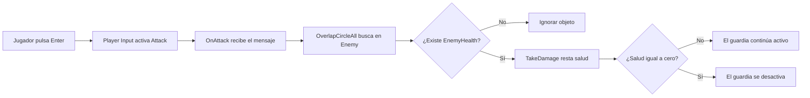

# Sesión 9: realizar el primer ataque ⚔️

Duración aproximada: **75–90 minutos**.

## 🎯 Objetivo

Al terminar, Kogi podrá atacar hacia la derecha con `Enter` o clic izquierdo. Un guardia provisional recibirá tres golpes y desaparecerá al quedarse sin salud.

Utilizaremos figuras simples. Todavía no añadiremos espada visible, animaciones, retroceso ni ataques hacia la izquierda.

## 1. Abrir y comprobar la escena

1. Abre `NivelDesierto`.
2. Comprueba que Kogi puede caminar, saltar y perder vidas.
3. Detén ▶️ después de la comprobación.
4. Guarda con `Ctrl + S`.

> 💡 **Qué acabas de comprobar:** el movimiento y las vidas funcionan antes de añadir el combate.

## 2. Crear la Layer Enemy

1. Selecciona cualquier `GameObject` en **Hierarchy**.
2. En la parte superior de **Inspector**, abre **Layer**.
3. Selecciona **Add Layer...**.
4. Busca la primera fila vacía de **User Layer**.
5. Escribe `Enemy`.
6. Regresa a `NivelDesierto` si Unity cambió la vista de **Inspector**.

### ¿Por qué necesitamos Enemy?

`Enemy` es una categoría técnica. El ataque podrá buscar únicamente `Colliders` pertenecientes a enemigos, sin golpear el suelo, las plataformas o la zona de caída.

```text
Layer Ground → objetos que cuentan como suelo
Layer Enemy  → objetos que pueden recibir ataques
```

> 💡 **Qué acabas de aprender:** una `LayerMask` permite que una consulta física ignore objetos que no pertenecen a las categorías seleccionadas.

## 3. Crear un guardia provisional

1. Abre **GameObject > 2D Object > Sprites > Square**.
2. Renombra el nuevo `GameObject` como `GuardiaPrueba`.
3. Selecciónalo en **Hierarchy**.
4. En **Inspector > Transform**, establece:

| Propiedad | X | Y | Z |
|---|---:|---:|---:|
| Position | 2 | -0.75 | 0 |
| Rotation | 0 | 0 | 0 |
| Scale | 0.8 | 1.5 | 1 |

5. En **Sprite Renderer > Color**, elige un color rojo provisional, por ejemplo `B94A48`.
6. Pulsa **Add Component**.
7. Busca `Capsule Collider 2D` y añádelo.
8. Comprueba que **Is Trigger** esté desmarcado.
9. En la parte superior de **Inspector**, cambia **Layer** a `Enemy`.
10. Guarda con `Ctrl + S`.

### ¿Qué tiene el guardia por ahora?

- `Transform`: posición y tamaño.
- `Sprite Renderer`: representación provisional.
- `CapsuleCollider2D`: superficie que puede detectar el ataque.
- `Layer Enemy`: clasificación utilizada por el ataque.

No necesita `Rigidbody2D` todavía porque permanecerá quieto. En sesiones posteriores añadiremos movimiento y comportamiento enemigo.

> 💡 **Qué acabas de aprender:** primero construimos un objetivo detectable; todavía no le hemos dado salud.

## 4. Crear EnemyHealth

1. En **Project**, abre `Assets > Kogi > Scripts`.
2. Crea una carpeta llamada `Combat`.
3. Abre `Combat`.
4. Haz clic derecho y selecciona **Create > Scripting > MonoBehaviour Script**.
5. Nombra el archivo exactamente `EnemyHealth`.
6. Ábrelo en Rider.
7. Reemplaza todo su contenido por:

```csharp
using UnityEngine;

namespace Kogi.Scripts.Combat
{
    public sealed class EnemyHealth : MonoBehaviour
    {
        [SerializeField, Min(1)]
        private int maximumHealth = 3;

        private int currentHealth;

        private void Awake()
        {
            currentHealth = maximumHealth;
        }

        public void TakeDamage(int damage)
        {
            currentHealth = Mathf.Max(0, currentHealth - damage);
            Debug.Log($"Salud de {name}: {currentHealth}");

            if (currentHealth == 0)
            {
                gameObject.SetActive(false);
            }
        }
    }
}
```

8. Guarda con `Ctrl + S`.
9. Regresa a Unity y espera a que termine de compilar.
10. Comprueba que **Console** no tenga errores rojos.

### ¿Cómo funciona la salud?

- `maximumHealth` contiene la salud inicial configurable.
- `currentHealth` contiene la salud que queda durante la partida.
- `Awake` copia el valor inicial.
- `TakeDamage` recibe la cantidad de daño y la resta.
- `Mathf.Max(0, ...)` impide que la salud sea negativa.
- `SetActive(false)` desactiva el guardia cuando llega a cero.

Desactivar el guardia es una solución provisional. Más adelante reproduciremos una animación de derrota y decidiremos cuándo eliminarlo.

> 💡 **Qué acabas de aprender:** el guardia administra su propia salud; el atacante solo necesita comunicar cuánto daño produce.

## 5. Añadir EnemyHealth al guardia

1. Selecciona `GuardiaPrueba` en **Hierarchy**.
2. Pulsa **Add Component**.
3. Busca `Enemy Health` y añádelo.
4. Comprueba que **Maximum Health** tenga el valor `3`.
5. Guarda con `Ctrl + S`.

Ahora el guardia posee la capacidad que buscará el ataque: `EnemyHealth`.

> 💡 **Qué acabas de aprender:** la `Layer Enemy` permite encontrar candidatos; `EnemyHealth` confirma que el objeto sabe recibir daño.

## 6. Crear el punto desde el que atacará Kogi

1. En **Hierarchy**, haz clic derecho sobre `Kogi`.
2. Selecciona **Create Empty**.
3. Renombra el objeto hijo como `AttackPoint`.
4. Selecciona `AttackPoint`.
5. En **Inspector > Transform**, establece **Position** local en `(0.75, 0, 0)`.
6. Mantén **Rotation** en `(0, 0, 0)` y **Scale** en `(1, 1, 1)`.
7. Guarda con `Ctrl + S`.

La **Hierarchy** debe mostrar:

```text
Kogi
├── GroundCheck
└── AttackPoint
```

### ¿Qué representa AttackPoint?

Es un marcador invisible situado delante de Kogi. El código buscará enemigos alrededor de esa posición.

Es hijo de Kogi para acompañarlo cuando se mueve. Solo necesita `Transform`; no le añadas un `Collider2D`.

> 💡 **Qué acabas de aprender:** separamos la posición del ataque de la posición central del personaje.

## 7. Crear KogiAttack

1. En **Project**, abre `Assets > Kogi > Scripts > Player`.
2. Crea un **MonoBehaviour Script** llamado exactamente `KogiAttack`.
3. Ábrelo en Rider.
4. Reemplaza todo su contenido por:

```csharp
using Kogi.Scripts.Combat;
using UnityEngine;
using UnityEngine.InputSystem;

namespace Kogi.Scripts.Player
{
    public sealed class KogiAttack : MonoBehaviour
    {
        [SerializeField]
        private Transform attackPoint;

        [SerializeField]
        private LayerMask enemyLayer;

        [SerializeField, Min(0f)]
        private float attackRadius = 0.75f;

        [SerializeField, Min(1)]
        private int damage = 1;

        private void OnAttack(InputValue value)
        {
            if (!value.isPressed)
            {
                return;
            }

            Attack();
        }

        private void Attack()
        {
            Collider2D[] hits = Physics2D.OverlapCircleAll(
                attackPoint.position,
                attackRadius,
                enemyLayer);

            foreach (Collider2D hit in hits)
            {
                if (hit.TryGetComponent(out EnemyHealth enemy))
                {
                    enemy.TakeDamage(damage);
                }
            }
        }

        private void OnDrawGizmosSelected()
        {
            if (attackPoint is null)
            {
                return;
            }

            Gizmos.color = Color.yellow;
            Gizmos.DrawWireSphere(attackPoint.position, attackRadius);
        }
    }
}
```

5. Guarda con `Ctrl + S`.
6. Regresa a Unity y espera a que termine de compilar.
7. Confirma que **Console** no muestre errores rojos.

### ¿Por qué se llama OnAttack?

`Player Input` utiliza **Send Messages**. La acción existente `Attack` se transforma en el mensaje `OnAttack`.

En este proyecto, `Attack` ya está vinculada a:

- `Enter` en el teclado.
- Clic izquierdo del ratón.
- Un botón del mando.
- El toque principal en una pantalla táctil.

`value.isPressed` evita ejecutar otro ataque cuando el botón deja de estar presionado.

### ¿Cómo encuentra enemigos?

`Physics2D.OverlapCircleAll` crea una consulta circular invisible:

- Centro: `attackPoint.position`.
- Radio: `attackRadius`.
- Filtro: `enemyLayer`.

Devuelve los `Collider2D` encontrados. El `foreach` recorre el resultado y `TryGetComponent` comprueba cuáles poseen `EnemyHealth`.

### ¿Para qué sirve OnDrawGizmosSelected?

Cuando selecciones Kogi, Unity dibujará en **Scene** un círculo amarillo que representa el alcance. Es una ayuda del Editor y no aparece en el juego terminado.

> 💡 **Qué acabas de aprender:** la consulta detecta objetivos; el `Gizmo` permite visualizar la misma zona durante el desarrollo.

## 8. Añadir y configurar KogiAttack

1. Selecciona `Kogi` en **Hierarchy**.
2. Pulsa **Add Component**.
3. Busca `Kogi Attack` y añádelo.
4. Localiza sus cuatro campos en **Inspector**.
5. Arrastra `AttackPoint` desde **Hierarchy** hasta **Attack Point**.
6. Abre **Enemy Layer** y marca únicamente `Enemy`.
7. Comprueba estos valores:

| Campo | Valor |
|---|---|
| Attack Point | `AttackPoint` |
| Enemy Layer | `Enemy` |
| Attack Radius | `0.75` |
| Damage | `1` |

8. Guarda con `Ctrl + S`.

Al seleccionar Kogi en **Scene**, debe aparecer un círculo amarillo delante de él. Si no lo ves, comprueba que **Gizmos** esté activado en la parte superior de la ventana.

> 💡 **Qué acabas de aprender:** los valores serializados permiten ajustar el alcance y el daño sin cambiar el código.

## 9. Probar el ataque

1. Abre **Console** y desactiva **Collapse**.
2. Guarda la escena.
3. Abre **Game** y pulsa ▶️.
4. Acerca Kogi al lado izquierdo de `GuardiaPrueba`.
5. Pulsa `Enter` una vez.
6. Comprueba en **Console**: `Salud de GuardiaPrueba: 2`.
7. Pulsa `Enter` otra vez y comprueba que baja a `1`.
8. Pulsa por tercera vez.
9. Comprueba que el guardia desaparece.
10. Detén ▶️.

También puedes utilizar el clic izquierdo después de dar foco a la ventana **Game**.

Si atacas lejos del guardia, no debe perder salud. Eso confirma que el alcance espacial está funcionando.

## 10. Comprender el flujo completo



## 11. Revisar el resultado

1. Comprueba que ▶️ esté detenido.
2. Guarda con `Ctrl + S`.
3. Confirma que **Console** no tenga errores rojos.

La sesión está terminada si:

- [ ] Existe la `Layer Enemy`.
- [ ] `GuardiaPrueba` tiene `CapsuleCollider2D`, `Layer Enemy` y `EnemyHealth`.
- [ ] `AttackPoint` es hijo de Kogi.
- [ ] Kogi tiene `KogiAttack`.
- [ ] **Attack Point** referencia el objeto correcto.
- [ ] **Enemy Layer** contiene únicamente `Enemy`.
- [ ] El círculo amarillo aparece delante de Kogi al seleccionarlo.
- [ ] Los ataques le restan `1` de salud al guardia.
- [ ] El tercer ataque desactiva al guardia.
- [ ] Atacar fuera del alcance no produce daño.
- [ ] **Console** no muestra errores rojos.

## 🧰 Problemas frecuentes

- **OnAttack no se ejecuta:** comprueba que `Player Input > Behavior` sea `Send Messages` y que su mapa predeterminado sea `Player`.
- **Aparece UnassignedReferenceException:** conecta `AttackPoint` en **Kogi Attack**.
- **El ataque no encuentra al guardia:** comprueba que `GuardiaPrueba` tenga un `Collider2D`, la `Layer Enemy` y que **Enemy Layer** incluya `Enemy`.
- **El guardia pierde salud desde muy lejos:** revisa la posición local de `AttackPoint` y que **Attack Radius** sea `0.75`.
- **No aparece el círculo amarillo:** selecciona Kogi y activa **Gizmos** en la ventana **Scene**.
- **El guardia desaparece con un solo golpe:** establece **Maximum Health** en `3` y **Damage** en `1`.
- **Kogi no puede acercarse al guardia:** esto puede ocurrir porque ambos `Colliders` son sólidos; el círculo de ataque está diseñado para alcanzarlo desde esa distancia.
- **El script no aparece en Add Component:** corrige primero todos los errores rojos de **Console**.

---

[⬅️ Sesión anterior](08-mostrar-vidas-en-pantalla.md) · [🏠 Inicio](../../README.md)
