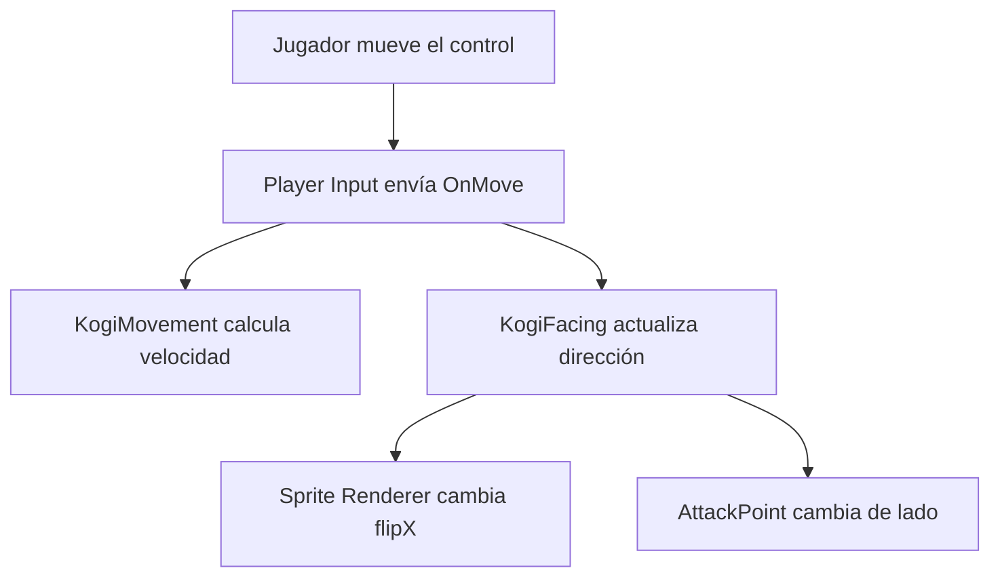

# Sesión 10: mirar y atacar en ambas direcciones ↔️⚔️

Duración aproximada: **60–75 minutos**.

## 🎯 Objetivo

Al terminar, Kogi conservará la dirección en la que camina. Su `AttackPoint` cambiará de lado y podrá golpear enemigos situados tanto a la derecha como a la izquierda.

También convertiremos `GuardiaPrueba` en el primer `Prefab` reutilizable de enemigo: `GuardiaBasico`.

## 1. Comprobar la limitación actual

1. Abre `NivelDesierto`.
2. Selecciona Kogi y observa el círculo amarillo de ataque.
3. Comprueba que el círculo está siempre a su derecha.
4. Pulsa ▶️ y camina hacia la izquierda.
5. Observa que el ataque continúa en el lado derecho.
6. Detén ▶️.

> 💡 **Qué acabas de comprobar:** el movimiento cambia la posición de Kogi, pero todavía no conserva hacia qué lado está mirando.

## 2. Convertir el guardia provisional en GuardiaBasico

1. Selecciona `GuardiaPrueba` en **Hierarchy**.
2. Renómbralo como `GuardiaBasico`.
3. En **Project**, abre `Assets > Kogi > Prefabs`.
4. Crea dentro una carpeta llamada `Enemies`.
5. Abre `Enemies`.
6. Arrastra `GuardiaBasico` desde **Hierarchy** hasta la carpeta `Enemies`.
7. Comprueba que aparece `GuardiaBasico` como `Prefab` en **Project**.
8. Observa que el nombre de la instancia en **Hierarchy** aparece en azul.
9. Guarda con `Ctrl + S`.

La ruta debe quedar:

```text
Assets/Kogi/Prefabs/Enemies/GuardiaBasico
```

### ¿Por qué dejamos de llamarlo GuardiaPrueba?

La mecánica de salud y daño ya está validada. El objeto deja de ser una prueba desechable y pasa a representar un tipo reutilizable de enemigo.

El `Prefab` reúne por ahora:

- Representación provisional.
- `CapsuleCollider2D`.
- `Layer Enemy`.
- `EnemyHealth`.

Más adelante añadiremos movimiento, detección, ataque, animaciones y sonido al mismo tipo de enemigo.

> 💡 **Qué acabas de aprender:** un prototipo puede convertirse en un recurso reutilizable después de validar su comportamiento.

## 3. Colocar un guardia a cada lado

1. Selecciona `GuardiaBasico` en **Hierarchy**.
2. Establece **Transform > Position** en `(2, -0.75, 0)`.
3. Pulsa `Ctrl + D` para duplicar la instancia.
4. Renombra la copia como `GuardiaIzquierda`.
5. Establece su **Position** en `(-2, -0.75, 0)`.
6. Guarda con `Ctrl + S`.

La escena debe tener:

| GameObject | Position |
|---|---|
| `GuardiaBasico` | `(2, -0.75, 0)` |
| `GuardiaIzquierda` | `(-2, -0.75, 0)` |

Ambos son instancias del mismo `Prefab`. Sus posiciones diferentes son `Overrides` propios de la escena.

> 💡 **Qué acabas de aprender:** podemos probar ambos lados sin configurar manualmente otro enemigo desde cero.

## 4. Crear KogiFacing

1. En **Project**, abre `Assets > Kogi > Scripts > Player`.
2. Haz clic derecho y selecciona **Create > Scripting > MonoBehaviour Script**.
3. Nombra el archivo exactamente `KogiFacing`.
4. Ábrelo en Rider.
5. Reemplaza todo su contenido por:

```csharp
using UnityEngine;
using UnityEngine.InputSystem;

namespace Kogi.Scripts.Player
{
    [RequireComponent(typeof(SpriteRenderer))]
    public sealed class KogiFacing : MonoBehaviour
    {
        [SerializeField]
        private Transform attackPoint;

        [SerializeField, Min(0f)]
        private float attackDistance = 0.75f;

        private SpriteRenderer spriteRenderer;

        private void Awake()
        {
            spriteRenderer = GetComponent<SpriteRenderer>();
        }

        private void OnMove(InputValue value)
        {
            float horizontalDirection = value.Get<Vector2>().x;

            if (Mathf.Approximately(horizontalDirection, 0f))
            {
                return;
            }

            bool isFacingLeft = horizontalDirection < 0f;
            spriteRenderer.flipX = isFacingLeft;

            Vector3 attackPosition = attackPoint.localPosition;
            attackPosition.x = isFacingLeft ? -attackDistance : attackDistance;
            attackPoint.localPosition = attackPosition;
        }
    }
}
```

6. Guarda con `Ctrl + S`.
7. Regresa a Unity y espera a que termine de compilar.
8. Confirma que **Console** no muestre errores rojos.

### ¿Qué responsabilidad tiene KogiFacing?

`KogiFacing` únicamente mantiene la dirección visual y coloca el punto de ataque en ese lado.

- `KogiMovement` mueve el `Rigidbody2D`.
- `KogiFacing` decide hacia qué lado mirar.
- `KogiAttack` busca enemigos y les aplica daño.

No añadimos estas tres responsabilidades dentro de una sola clase porque pueden cambiar por motivos diferentes.

> 💡 **Qué acabas de aprender:** varios componentes pequeños pueden colaborar sobre el mismo `GameObject`.

## 5. Entender cómo recibe el movimiento

`Player Input` utiliza **Send Messages** y envía `OnMove` al `GameObject` Kogi.

Kogi tiene ahora dos componentes interesados en ese mensaje:



Los dos métodos pueden llamarse `OnMove` porque pertenecen a componentes diferentes. Cada uno utiliza la misma entrada para cumplir su propia responsabilidad.

> 💡 **Qué acabas de aprender:** un mensaje de `Player Input` puede ser recibido por varios componentes del mismo objeto.

## 6. Entender el cambio de dirección

```csharp
if (Mathf.Approximately(horizontalDirection, 0f))
{
    return;
}
```

Cuando el jugador suelta el control, la dirección vale aproximadamente cero. En ese momento no cambiamos la orientación: Kogi conserva el último lado hacia el que miró.

```csharp
bool isFacingLeft = horizontalDirection < 0f;
spriteRenderer.flipX = isFacingLeft;
```

`flipX` refleja horizontalmente la imagen mostrada por `Sprite Renderer`. No gira el `GameObject`, su `Rigidbody2D` ni su `Collider2D`.

El rectángulo provisional de Kogi es simétrico, por lo que su aspecto será igual después de reflejarlo. El cambio se apreciará claramente cuando añadamos el diseño definitivo; durante esta sesión lo comprobaremos observando el círculo amarillo de ataque.

```csharp
attackPosition.x = isFacingLeft ? -attackDistance : attackDistance;
```

Esta expresión elige:

- `-0.75` cuando Kogi mira a la izquierda.
- `0.75` cuando mira a la derecha.

Utilizamos `localPosition` porque `AttackPoint` es hijo de Kogi y su posición se expresa respecto al personaje.

> 💡 **Qué acabas de aprender:** la dirección visual y la posición relativa del ataque se actualizan juntas.

## 7. Añadir y configurar KogiFacing

1. Selecciona `Kogi` en **Hierarchy**.
2. Pulsa **Add Component**.
3. Busca `Kogi Facing` y añádelo.
4. En el componente, localiza **Attack Point**.
5. Arrastra `AttackPoint` desde **Hierarchy** hasta ese campo.
6. Establece **Attack Distance** en `0.75`.
7. Guarda con `Ctrl + S`.

La configuración debe mostrar:

| Campo | Valor |
|---|---|
| Attack Point | `AttackPoint` |
| Attack Distance | `0.75` |

No necesitas conectar `Sprite Renderer`: está en el mismo `GameObject` y `Awake` lo obtiene mediante `GetComponent<SpriteRenderer>()`.

> 💡 **Qué acabas de aprender:** conectamos desde **Inspector** el objeto hijo; el componente del mismo objeto se obtiene mediante código.

## 8. Observar AttackPoint sin ejecutar

1. Selecciona Kogi.
2. Expande Kogi en **Hierarchy**.
3. Selecciona `AttackPoint` y comprueba que su **Position X** sea `0.75`.
4. Vuelve a seleccionar Kogi.
5. Comprueba que el círculo amarillo esté a la derecha.

La dirección solamente cambiará al recibir movimiento durante ▶️. Los cambios realizados durante la ejecución no se conservarán al detenerla, pero el valor inicial correcto seguirá siendo `0.75`.

## 9. Probar ambas direcciones

1. Abre **Console** y desactiva **Collapse**.
2. Guarda la escena.
3. Abre **Game** y pulsa ▶️.
4. Pulsa brevemente `D` o `→`.
5. Acércate a `GuardiaBasico` y ataca con `Enter`.
6. Comprueba que pierde salud.
7. Regresa al centro y pulsa `A` o `←`.
8. Acércate a `GuardiaIzquierda` y ataca con `Enter`.
9. Comprueba que también pierde salud.
10. Selecciona Kogi durante la ejecución y observa cómo el círculo amarillo cambia de lado al alternar `A` y `D`.
11. Detén ▶️.

Después de detener la ejecución, los guardias volverán a estar activos porque su desactivación ocurrió durante el modo de juego.

## 10. Revisar el resultado

1. Comprueba que ▶️ esté detenido.
2. Guarda con `Ctrl + S`.
3. Confirma que **Console** no tenga errores rojos.

La sesión está terminada si:

- [ ] Existe el `Prefab` `Assets/Kogi/Prefabs/Enemies/GuardiaBasico`.
- [ ] Hay una instancia de guardia a cada lado de Kogi.
- [ ] Existe `KogiFacing.cs`.
- [ ] Kogi tiene el componente `Kogi Facing`.
- [ ] **Attack Point** referencia el objeto correcto.
- [ ] Kogi conserva la última dirección al detenerse.
- [ ] `Sprite Renderer > Flip X` cambia al caminar hacia la izquierda.
- [ ] El círculo amarillo cambia al lado correspondiente.
- [ ] Kogi puede dañar a los guardias de ambos lados.
- [ ] **Console** no muestra errores rojos.

## 🧰 Problemas frecuentes

- **Aparece UnassignedReferenceException:** conecta `AttackPoint` en el componente **Kogi Facing**.
- **Kogi se mueve pero no cambia de dirección:** comprueba que **Player Input > Behavior** sea `Send Messages` y que Kogi tenga `Kogi Facing`.
- **La imagen gira o queda tumbada:** utiliza `Sprite Renderer > flipX`; no cambies la rotación del `Transform`.
- **El círculo no cambia de lado:** confirma que **Attack Distance** sea `0.75` y que `AttackPoint` sea hijo de Kogi.
- **Ataca al lado contrario:** comprueba que la posición inicial de `AttackPoint` sea `(0.75, 0, 0)`.
- **Uno de los guardias no recibe daño:** comprueba que ambas instancias conserven `Layer Enemy`, `CapsuleCollider2D` y `EnemyHealth`.
- **El script no aparece en Add Component:** corrige primero todos los errores rojos de **Console**.
- **Los cambios desaparecieron:** configura los componentes con ▶️ detenido y guarda con `Ctrl + S`.

---

[⬅️ Sesión anterior](09-primer-ataque.md) · [🏠 Inicio](../../README.md) · [Siguiente: agacharse ➡️](11-agacharse.md)
