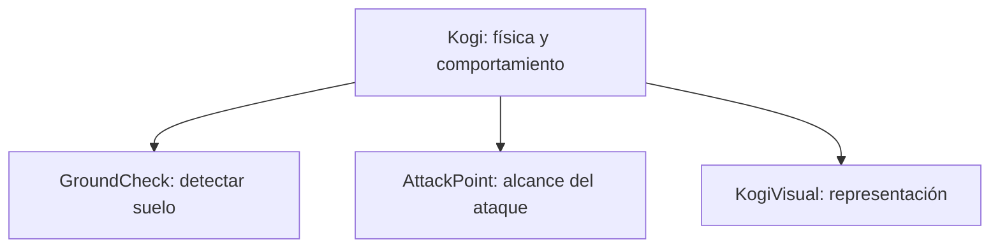
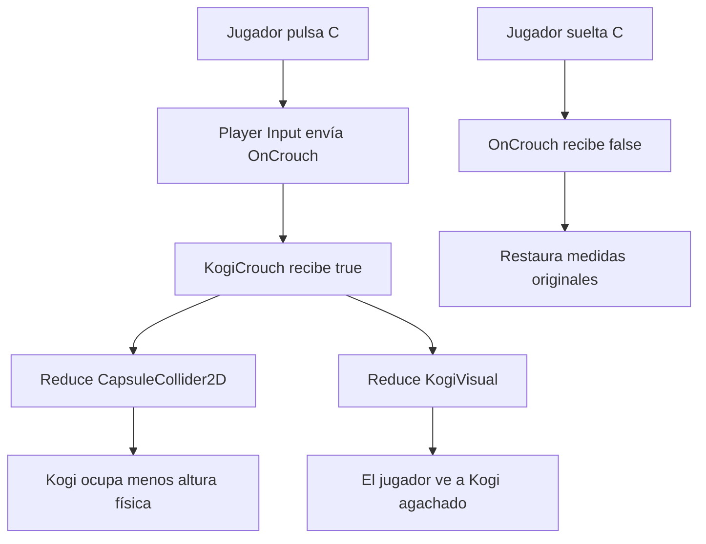

# Sesión 11: hacer que Kogi se agache 🧎

Duración aproximada: **80–95 minutos**.

## 🎯 Objetivo

Al terminar, Kogi podrá agacharse mientras mantengamos pulsada `C`. Su representación y su `CapsuleCollider2D` reducirán la altura sin mover `GroundCheck` ni `AttackPoint`.

Primero separaremos la parte visual del cuerpo físico. Esta estructura también nos preparará para incorporar el personaje y sus animaciones más adelante.

## 1. Comprobar el estado actual

1. Abre `NivelDesierto`.
2. Selecciona Kogi.
3. Comprueba que su **Transform > Scale** sea `(1, 2, 1)`.
4. Comprueba que contiene `Sprite Renderer`, `Rigidbody2D`, `CapsuleCollider2D`, `Kogi Movement`, `Kogi Facing` y `Kogi Attack`.
5. Pulsa ▶️ y verifica movimiento, salto y ataque en ambos sentidos.
6. Detén ▶️ y guarda con `Ctrl + S`.

> 💡 **Qué acabas de comprobar:** actualmente el tamaño visual y el tamaño físico dependen de la escala del mismo `GameObject`.

## 2. Preparar KogiFacing para una representación hija

Antes de mover la representación visual, debemos dejar de buscar `SpriteRenderer` directamente en Kogi.

1. Abre `Assets > Kogi > Scripts > Player > KogiFacing`.
2. Reemplaza todo su contenido por:

```csharp
using UnityEngine;
using UnityEngine.InputSystem;

namespace Kogi.Scripts.Player
{
    public sealed class KogiFacing : MonoBehaviour
    {
        [SerializeField]
        private SpriteRenderer characterRenderer;

        [SerializeField]
        private Transform attackPoint;

        [SerializeField, Min(0f)]
        private float attackDistance = 0.75f;

        private void OnMove(InputValue value)
        {
            float horizontalDirection = value.Get<Vector2>().x;

            if (Mathf.Approximately(horizontalDirection, 0f))
            {
                return;
            }

            bool isFacingLeft = horizontalDirection < 0f;
            characterRenderer.flipX = isFacingLeft;

            Vector3 attackPosition = attackPoint.localPosition;
            attackPosition.x = isFacingLeft ? -attackDistance : attackDistance;
            attackPoint.localPosition = attackPosition;
        }
    }
}
```

3. Guarda con `Ctrl + S`.
4. Regresa a Unity y espera a que termine de compilar.
5. No pulses ▶️ todavía.

### ¿Qué cambió?

Eliminamos `[RequireComponent(typeof(SpriteRenderer))]` y `GetComponent<SpriteRenderer>()`. Ahora `characterRenderer` podrá apuntar a un componente situado en un objeto hijo.

El campo aparecerá temporalmente como `None`. Lo conectaremos después de crear el objeto visual.

> 💡 **Qué acabas de aprender:** cuando una dependencia vive en otro `GameObject`, la declaramos como campo serializado y la conectamos desde **Inspector**.

## 3. Crear KogiVisual

1. En **Hierarchy**, haz clic derecho sobre Kogi.
2. Selecciona **2D Object > Sprites > Square**.
3. Renombra el nuevo objeto hijo como `KogiVisual`.
4. Selecciona `KogiVisual`.
5. En **Transform**, establece:

| Propiedad | X | Y | Z |
|---|---:|---:|---:|
| Position | 0 | 0 | 0 |
| Rotation | 0 | 0 | 0 |
| Scale | 1 | 2 | 1 |

6. Comprueba que `KogiVisual` tenga su propio `Sprite Renderer`.
7. Si Kogi tenía un color distinto de blanco, copia ese color en **KogiVisual > Sprite Renderer > Color**.

La jerarquía debe mostrar:

```text
Kogi
├── GroundCheck
├── AttackPoint
└── KogiVisual
```

### ¿Qué representa KogiVisual?

Kogi continúa siendo el objeto principal con la física y la lógica. `KogiVisual` contiene únicamente lo que verá el jugador.



> 💡 **Qué acabas de aprender:** separar representación y comportamiento permite animar o reemplazar el dibujo sin reconstruir la física.

## 4. Conectar KogiVisual con KogiFacing

1. Selecciona Kogi.
2. Busca **Kogi Facing** en **Inspector**.
3. Localiza el nuevo campo **Character Renderer**.
4. Arrastra `KogiVisual` desde **Hierarchy** hasta ese campo.
5. Comprueba que muestre `KogiVisual (Sprite Renderer)`.
6. Confirma que **Attack Point** continúe mostrando `AttackPoint`.

Unity extrae automáticamente el `SpriteRenderer` solicitado desde el `GameObject` arrastrado.

> 💡 **Qué acabas de aprender:** KogiFacing ya controla la representación hija, no el renderizador antiguo del objeto principal.

## 5. Retirar la representación antigua y normalizar Kogi

Realiza estos pasos con ▶️ detenido.

1. Mantén seleccionado Kogi.
2. En su componente **Sprite Renderer**, abre el menú de tres puntos.
3. Selecciona **Remove Component**.
4. En **Transform**, cambia **Scale** de `(1, 2, 1)` a `(1, 1, 1)`.
5. En **Capsule Collider 2D**, establece:

| Propiedad | X | Y |
|---|---:|---:|
| Size | 1 | 2 |
| Offset | 0 | 0 |

6. Selecciona `GroundCheck` y cambia su **Position** local a `(0, -1, 0)`.
7. Selecciona `AttackPoint` y confirma que su **Position** local sea `(0.75, 0, 0)`.
8. Guarda con `Ctrl + S`.

### ¿Por qué normalizamos la escala?

La escala `(1, 1, 1)` deja el objeto principal en un estado predecible. La altura física se expresa ahora mediante `CapsuleCollider2D.Size`, y la altura visual mediante `KogiVisual.Scale`.

```text
Kogi.Transform.Scale       → (1, 1, 1)
CapsuleCollider2D.Size     → (1, 2)
KogiVisual.Transform.Scale → (1, 2, 1)
```

Movemos `GroundCheck` de `-0.5` a `-1` porque antes la escala vertical de Kogi duplicaba indirectamente esa distancia.

> 💡 **Qué acabas de aprender:** evitamos utilizar la escala del objeto físico como mecanismo de animación.

## 6. Comprobar que la reorganización no rompió nada

1. Pulsa ▶️.
2. Comprueba que Kogi cae y se apoya sobre el suelo.
3. Prueba movimiento y salto.
4. Camina hacia ambos lados y observa el círculo amarillo.
5. Ataca a ambos guardias.
6. Detén ▶️.

Corrige cualquier problema antes de añadir la postura agachada.

## 7. Preparar la acción Crouch para pulsar y soltar

`Crouch` viene configurada como una acción de tipo **Button**. Para que `Player Input` con **Send Messages** nos comunique tanto la pulsación como la liberación, la cambiaremos a **Value**.

1. En la ventana **Project**, abre `Assets > Settings`.
2. Haz doble clic en `InputSystem_Actions`.
3. En la columna izquierda, selecciona el mapa `Player`.
4. En la columna **Actions**, selecciona `Crouch`.
5. En el panel derecho, cambia **Action Type** de `Button` a `Value`.
6. En **Control Type**, selecciona `Digital`.
7. Conserva sus enlaces actuales: `C [Keyboard]` y `Button East [Gamepad]`.
8. Pulsa **Save Asset** si **Auto-Save** no está activado.
9. Cierra la ventana de acciones.

> 💡 **Qué acabas de aprender:** **Action Type: Value** comunica los cambios del valor. Al pulsar, el valor pasa a `1`; al soltar, vuelve a `0`. En esta versión del Input System, **Control Type: Digital** representa una entrada con dos estados, como una tecla pulsada o liberada.

## 8. Crear KogiCrouch

1. En `Assets > Kogi > Scripts > Player`, crea un **MonoBehaviour Script** llamado `KogiCrouch`.
2. Ábrelo en Rider.
3. Reemplaza todo su contenido por:

```csharp
using UnityEngine;
using UnityEngine.InputSystem;

namespace Kogi.Scripts.Player
{
    [RequireComponent(typeof(CapsuleCollider2D))]
    public sealed class KogiCrouch : MonoBehaviour
    {
        private const float CrouchHeightMultiplier = 0.5f;

        [SerializeField]
        private Transform characterVisual;

        private CapsuleCollider2D bodyCollider;
        private Vector2 standingColliderSize;
        private Vector2 standingColliderOffset;
        private Vector3 standingVisualScale;
        private Vector3 standingVisualPosition;

        private void Awake()
        {
            bodyCollider = GetComponent<CapsuleCollider2D>();
            standingColliderSize = bodyCollider.size;
            standingColliderOffset = bodyCollider.offset;
            standingVisualScale = characterVisual.localScale;
            standingVisualPosition = characterVisual.localPosition;
        }

        private void OnCrouch(InputValue value)
        {
            SetCrouching(value.isPressed);
        }

        private void SetCrouching(bool isCrouching)
        {
            float multiplier = isCrouching ? CrouchHeightMultiplier : 1f;

            Vector2 colliderSize = standingColliderSize;
            colliderSize.y *= multiplier;

            float removedColliderHeight = standingColliderSize.y - colliderSize.y;
            Vector2 colliderOffset = standingColliderOffset;
            colliderOffset.y -= removedColliderHeight * 0.5f;

            bodyCollider.size = colliderSize;
            bodyCollider.offset = colliderOffset;

            Vector3 visualScale = standingVisualScale;
            visualScale.y *= multiplier;

            float removedVisualHeight = standingVisualScale.y - visualScale.y;
            Vector3 visualPosition = standingVisualPosition;
            visualPosition.y -= removedVisualHeight * 0.5f;

            characterVisual.localScale = visualScale;
            characterVisual.localPosition = visualPosition;
        }
    }
}
```

4. Guarda con `Ctrl + S`.
5. Regresa a Unity y espera a que compile.
6. Comprueba que **Console** no tenga errores rojos.

### ¿Cómo recibe la postura?

La acción `Crouch` ya está vinculada a la tecla `C` y a un botón del mando. Como `Player Input` utiliza **Send Messages**, Unity llama a `OnCrouch`:

- Al pulsar: `value.isPressed` es `true`.
- Al soltar: `value.isPressed` es `false`.

Por eso Kogi permanece agachado mientras mantenemos la tecla pulsada.

### ¿Por qué cambiamos Size y Offset?

Al reducir solamente `Size.Y`, la cápsula se encogería hacia su centro y sus pies subirían. También desplazamos `Offset.Y` hacia abajo para conservar la base en el suelo.

Hacemos lo mismo con escala y posición de `KogiVisual`.

> 💡 **Qué acabas de aprender:** tamaño y centro son valores diferentes; ajustarlos juntos mantiene los pies en la misma posición.

## 9. Añadir y conectar KogiCrouch

1. Selecciona Kogi.
2. Pulsa **Add Component**.
3. Busca `Kogi Crouch` y añádelo.
4. Localiza el campo **Character Visual**.
5. Arrastra `KogiVisual` desde **Hierarchy** hasta ese campo.
6. Comprueba que muestre `KogiVisual (Transform)`.
7. Guarda con `Ctrl + S`.

No necesitas conectar `CapsuleCollider2D`: está en Kogi y `Awake` lo obtiene mediante `GetComponent`.

## 10. Probar la postura agachada

1. Selecciona Kogi para observar su `CapsuleCollider2D`.
2. Abre **Game** y pulsa ▶️.
3. Mantén pulsada `C`.
4. Comprueba que Kogi reduce su altura y mantiene los pies sobre el suelo.
5. Sin soltar `C`, camina a izquierda y derecha.
6. Suelta `C` y comprueba que recupera la altura original.
7. Repite la prueba sobre una plataforma.
8. Detén ▶️.

Durante esta sesión Kogi todavía puede saltar o atacar agachado. Definiremos esas reglas cuando incorporemos estados y animaciones del personaje.

## 11. Comprender el flujo completo



## 12. Revisar el resultado

1. Comprueba que ▶️ esté detenido.
2. Guarda con `Ctrl + S`.
3. Confirma que **Console** no tenga errores rojos.

La sesión está terminada si:

- [ ] `KogiVisual` es hijo de Kogi y contiene `Sprite Renderer`.
- [ ] Kogi tiene escala `(1, 1, 1)` y ya no contiene `Sprite Renderer`.
- [ ] `CapsuleCollider2D.Size` es `(1, 2)` estando de pie.
- [ ] `GroundCheck.Position` es `(0, -1, 0)`.
- [ ] `Kogi Facing > Character Renderer` referencia `KogiVisual`.
- [ ] Existe `KogiCrouch.cs` y está añadido a Kogi.
- [ ] `Kogi Crouch > Character Visual` referencia `KogiVisual`.
- [ ] Mantener `C` reduce la altura visual y física.
- [ ] Soltar `C` restaura la altura.
- [ ] Movimiento, salto, ataque y vidas continúan funcionando.
- [ ] **Console** no muestra errores rojos.

## 🧰 Problemas frecuentes

- **Unity no permite eliminar Sprite Renderer:** guarda `KogiFacing.cs`, regresa a Unity y espera a que compile antes de intentarlo.
- **Kogi desaparece al ejecutar:** conecta **Character Renderer** en `Kogi Facing`.
- **Aparece UnassignedReferenceException en KogiCrouch:** conecta `KogiVisual` en **Character Visual**.
- **Kogi atraviesa el suelo:** comprueba `CapsuleCollider2D.Size (1, 2)`, `Offset (0, 0)` y que Kogi tenga escala `(1, 1, 1)`.
- **Kogi no puede saltar:** comprueba que `GroundCheck.Position` sea `(0, -1, 0)` y que **Ground Layer** conserve `Ground`.
- **El ataque queda en el lado incorrecto:** comprueba que `AttackPoint.Position.X` comience en `0.75`.
- **Kogi sube al agacharse:** confirma que copiaste las asignaciones de `colliderOffset` y `visualPosition`.
- **Kogi se agacha pero no se levanta al soltar `C`:** abre `InputSystem_Actions`, selecciona `Player > Crouch` y comprueba que **Action Type** sea `Value` y **Control Type** sea `Digital`.
- **La tecla C no responde:** comprueba que `Player Input` use el mapa `Player`, comportamiento `Send Messages` y la acción `Crouch`.

---

[⬅️ Sesión anterior](10-direccion-y-ataque.md) · [🏠 Inicio](../../README.md) · [Siguiente: patrulla del guardia ➡️](12-patrulla-del-guardia.md)
