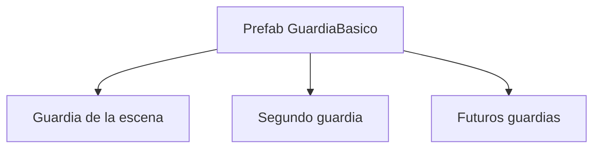
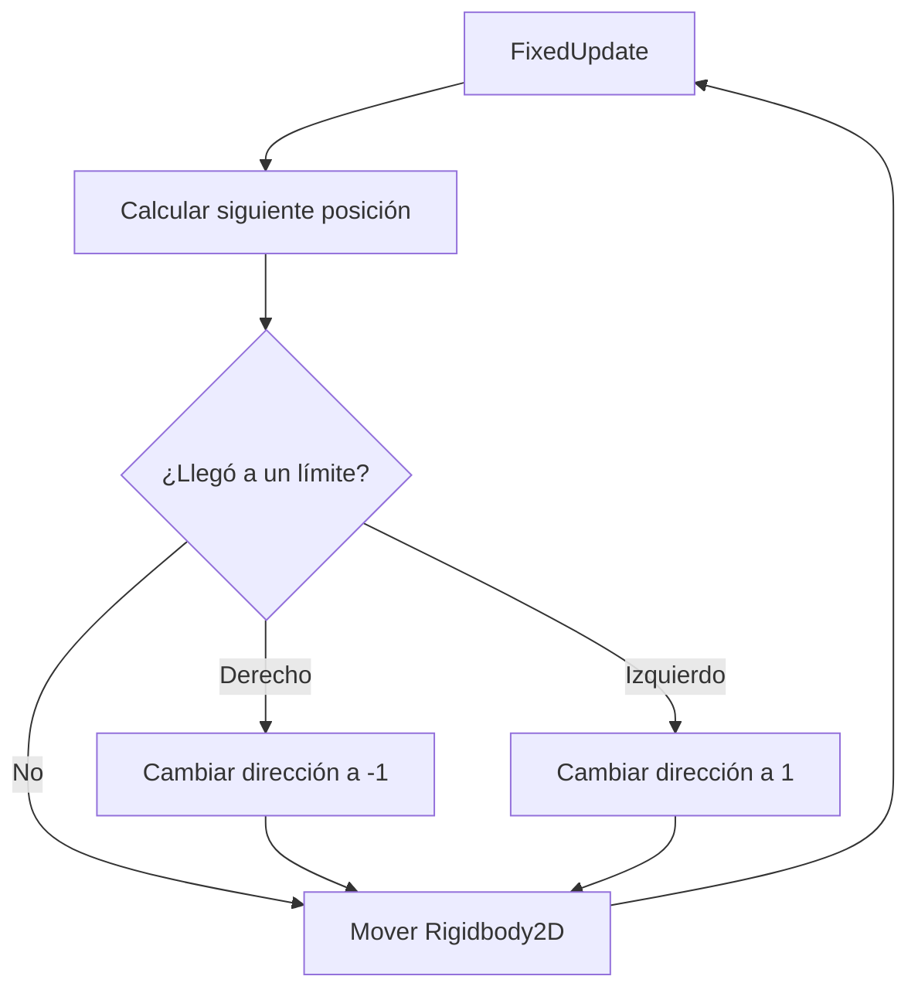

# Sesión 12: hacer que un guardia patrulle 🚶‍♂️

Duración aproximada: **70–85 minutos**.

## 🎯 Objetivo

Al terminar, cada `GuardiaBasico` caminará automáticamente hacia la izquierda y la derecha dentro de su propia zona de patrulla.

Aprenderemos a mover un enemigo con un `Rigidbody2D` cinemático, a cambiar su dirección y a aplicar el comportamiento al `Prefab`. Todavía no perseguirá, disparará ni dañará a Kogi.

## 1. Comprobar el punto de partida

1. Abre la escena `NivelDesierto` desde `Assets > Kogi > Scenes`.
2. Pulsa ▶️.
3. Comprueba que Kogi puede moverse, saltar, agacharse y atacar.
4. Golpea a un guardia y confirma que pierde salud.
5. Detén ▶️.
6. Guarda con `Ctrl + S`.

> 💡 **Qué acabas de comprobar:** partimos de una versión estable antes de incorporar un nuevo comportamiento.

## 2. Abrir el Prefab del guardia

1. En la ventana **Project**, abre `Assets > Kogi > Prefabs > Enemies`.
2. Haz doble clic en `GuardiaBasico`.
3. Comprueba que Unity abre **Prefab Mode**.
4. Mira la parte superior de **Hierarchy**: debe aparecer únicamente `GuardiaBasico` como raíz.

### ¿Por qué modificamos el Prefab?

El `Prefab` es el molde reutilizable del guardia. Si añadimos la patrulla al molde, todas sus instancias podrán compartir el mismo comportamiento.



> 💡 **Qué acabas de aprender:** una mejora realizada en el `Prefab` puede beneficiar a todos los guardias creados a partir de él.

## 3. Añadir Rigidbody2D al guardia

1. Selecciona `GuardiaBasico` en **Hierarchy**.
2. En **Inspector**, pulsa **Add Component**.
3. Busca `Rigidbody 2D` y añádelo.
4. En el componente `Rigidbody2D`, configura:

| Propiedad | Valor |
|---|---|
| Body Type | `Kinematic` |
| Simulated | Activado |
| Collision Detection | `Continuous` |
| Interpolate | `Interpolate` |

Si aparece **Constraints**, activa **Freeze Rotation Z**.

### ¿Qué significa Kinematic?

Un `Rigidbody2D` dinámico, como el de Kogi, responde a gravedad y fuerzas. Uno cinemático no cae por gravedad: nosotros decidimos su movimiento mediante código, pero sigue formando parte del sistema de física 2D.

```text
Kogi    → Rigidbody2D Dynamic   → gravedad y movimiento del jugador
Guardia → Rigidbody2D Kinematic → movimiento controlado por su comportamiento
```

> 💡 **Qué acabas de aprender:** `Rigidbody2D` no siempre significa “objeto que cae”; su `Body Type` define quién controla el movimiento.

## 4. Crear la carpeta de comportamientos enemigos

1. Sal de **Prefab Mode** pulsando la flecha situada arriba de **Hierarchy**.
2. En **Project**, abre `Assets > Kogi > Scripts`.
3. Haz clic derecho en una zona vacía.
4. Selecciona **Create > Folder**.
5. Nombra la carpeta exactamente `Enemies`.
6. Abre la carpeta `Enemies`.

Esta carpeta contendrá los comportamientos propios de los enemigos. `EnemyHealth` permanece en `Combat` porque representa una regla de combate: recibir daño y perder salud.

> 💡 **Qué acabas de aprender:** organizamos el código por responsabilidad, no solamente por el tipo de archivo.

## 5. Crear EnemyPatrol

1. Dentro de `Assets > Kogi > Scripts > Enemies`, haz clic derecho.
2. Selecciona **Create > Scripting > MonoBehaviour Script**.
3. Nombra el archivo exactamente `EnemyPatrol`.
4. Ábrelo en Rider.
5. Reemplaza todo su contenido por:

```csharp
using UnityEngine;

namespace Kogi.Scripts.Enemies
{
    [RequireComponent(typeof(Rigidbody2D))]
    [RequireComponent(typeof(SpriteRenderer))]
    public sealed class EnemyPatrol : MonoBehaviour
    {
        [SerializeField, Min(0f)]
        private float speed = 2f;

        [SerializeField, Min(0f)]
        private float patrolDistance = 2f;

        private Rigidbody2D body;
        private SpriteRenderer characterRenderer;
        private float startingPositionX;
        private int direction = 1;

        private void Awake()
        {
            body = GetComponent<Rigidbody2D>();
            characterRenderer = GetComponent<SpriteRenderer>();
            startingPositionX = body.position.x;
        }

        private void FixedUpdate()
        {
            float nextPositionX = body.position.x + direction * speed * Time.fixedDeltaTime;
            float leftLimit = startingPositionX - patrolDistance;
            float rightLimit = startingPositionX + patrolDistance;

            if (nextPositionX >= rightLimit)
            {
                nextPositionX = rightLimit;
                ChangeDirection(-1);
            }
            else if (nextPositionX <= leftLimit)
            {
                nextPositionX = leftLimit;
                ChangeDirection(1);
            }

            body.MovePosition(new Vector2(nextPositionX, body.position.y));
        }

        private void ChangeDirection(int newDirection)
        {
            direction = newDirection;
            characterRenderer.flipX = direction < 0;
        }
    }
}
```

6. Guarda el archivo con `Ctrl + S`.
7. Regresa a Unity y espera a que termine de compilar.
8. Abre **Console** y comprueba que no haya errores rojos.

## 6. Entender las variables antes de conectarlo

| Variable | Responsabilidad |
|---|---|
| `speed` | Distancia recorrida por segundo. |
| `patrolDistance` | Distancia máxima hacia cada lado desde el punto inicial. |
| `body` | Referencia al `Rigidbody2D` que movemos. |
| `characterRenderer` | Permite voltear la figura cuando cambia de sentido. |
| `startingPositionX` | Guarda dónde comenzó este guardia. |
| `direction` | Usa `1` para derecha y `-1` para izquierda. |

`[RequireComponent]` obliga al objeto a disponer de los componentes necesarios. Si intentamos añadir `EnemyPatrol` sin ellos, Unity también los añadirá.

> 💡 **Qué acabas de aprender:** los campos configurables describen qué tan rápido y lejos patrulla; los campos privados conservan el estado interno del comportamiento.

## 7. Entender el movimiento paso a paso

`FixedUpdate` se ejecuta al ritmo del sistema de física. En cada paso:

1. Calculamos la siguiente posición horizontal.
2. Calculamos el límite izquierdo y el derecho.
3. Comprobamos si el guardia alcanzó uno de ellos.
4. Cambiamos la dirección cuando corresponde.
5. Entregamos la nueva posición a `Rigidbody2D.MovePosition`.

`Time.fixedDeltaTime` hace que `speed` represente unidades por segundo y no unidades por cada actualización física.



> 💡 **Qué acabas de aprender:** el guardia no conoce posiciones absolutas del nivel; calcula sus límites a partir del lugar donde comienza cada instancia.

## 8. Añadir EnemyPatrol al Prefab

1. En **Project**, abre `Assets > Kogi > Prefabs > Enemies`.
2. Haz doble clic en `GuardiaBasico` para abrir **Prefab Mode**.
3. Selecciona `GuardiaBasico` en **Hierarchy**.
4. Pulsa **Add Component**.
5. Busca `Enemy Patrol` y añádelo.
6. En `Enemy Patrol`, configura:

| Propiedad | Valor |
|---|---:|
| Speed | `2` |
| Patrol Distance | `2` |

7. Comprueba que siguen presentes `Sprite Renderer`, `CapsuleCollider2D`, `Enemy Health`, `Rigidbody2D` y `Enemy Patrol`.
8. Guarda con `Ctrl + S`.
9. Sal de **Prefab Mode** con la flecha situada arriba de **Hierarchy**.

> 💡 **Qué acabas de aprender:** el script es la definición del comportamiento; al añadirlo como componente al `Prefab`, ese comportamiento pasa a formar parte del guardia.

## 9. Preparar espacio para la patrulla

Usaremos una superficie concreta para cada guardia. Así no dependeremos de interpretar la cuadrícula ni ignoraremos las plataformas de la escena.

### GuardiaIzquierda: patrulla sobre Suelo

1. Selecciona `GuardiaIzquierda` en **Hierarchy**.
2. En **Inspector > Transform**, configura **Position** como `(-2, -0.75, 0)`.
3. En **Enemy Patrol**, deja **Patrol Distance** en `2`.
4. Este guardia recorrerá desde `X = -4` hasta `X = 0` sobre el `GameObject` llamado `Suelo`.

### GuardiaBasico: patrulla sobre PlataformaBase

1. Localiza `PlataformaBase` en **Hierarchy**.
2. Selecciónala y comprueba en **Transform** que tenga **Position** `(4, -1, 0)` y **Scale** `(3, 0.5, 1)`.
3. Esa plataforma ocupa horizontalmente desde `X = 2.5` hasta `X = 5.5`.
4. Selecciona `GuardiaBasico`.
5. Configura **Transform > Position** como `(4, 0, 0)`. Ahora quedará encima de `PlataformaBase`.
6. En **Enemy Patrol**, cambia **Patrol Distance** a `1` solamente en esta instancia.
7. Su centro recorrerá desde `X = 3` hasta `X = 5`.
8. Como el guardia ocupa aproximadamente `0.4` unidades a cada lado, su cuerpo permanecerá entre `X = 2.6` y `X = 5.4`: dentro de los bordes `2.5` y `5.5` de la plataforma.
9. Guarda con `Ctrl + S`.

| Guardia | Superficie | Posición inicial | Distancia | Recorrido del centro |
|---|---|---:|---:|---:|
| `GuardiaIzquierda` | `Suelo` | `X = -2` | `2` | `-4` a `0` |
| `GuardiaBasico` | `PlataformaBase` | `X = 4` | `1` | `3` a `5` |

> 💡 **Qué acabas de aprender:** la posición `Y` coloca al guardia sobre una superficie concreta; la posición `X`, la anchura de esa superficie y `Patrol Distance` determinan si podrá patrullarla sin salir por sus bordes.

> ⚠️ En esta sesión el guardia cambia de sentido por distancia, no porque detecte el borde. La detección inteligente de paredes y precipicios llegará más adelante.

## 10. Probar la patrulla

1. Abre la ventana **Game**.
2. Pulsa ▶️.
3. No muevas a Kogi durante unos segundos.
4. Comprueba que cada guardia camina hacia un límite, se da la vuelta y regresa.
5. Observa que los guardias pueden compartir el comportamiento aunque comiencen en posiciones diferentes.
6. Acércate y comprueba que Kogi todavía puede golpearlos.
7. Detén ▶️.

Recuerda: los cambios realizados en **Transform** mientras ▶️ está activo se pierden al detener la ejecución.

## 11. Reconocer la configuración diferente de una instancia

Ya hemos configurado una instancia sin modificar todas las demás.

1. Selecciona uno de los guardias en **Hierarchy**.
2. Comprueba que `GuardiaIzquierda` conserva **Patrol Distance = 2**.
3. Selecciona `GuardiaBasico`.
4. Comprueba que muestra **Patrol Distance = 1**.
5. Pulsa ▶️ y compara sus recorridos.
6. Detén ▶️ y guarda con `Ctrl + S`.

El valor modificado aparece resaltado porque es un **Override** del `Prefab`: esa instancia utiliza una configuración diferente del molde.

> 💡 **Qué acabas de aprender:** todas las instancias comparten la estructura del `Prefab`, pero una instancia puede sobrescribir valores concretos.

## 12. Revisar el resultado

1. Guarda la escena con `Ctrl + S`.
2. Abre **Console**.
3. Comprueba que no existan errores rojos.

La sesión estará terminada cuando:

- [ ] Existe `Assets/Kogi/Scripts/Enemies/EnemyPatrol.cs`.
- [ ] `GuardiaBasico` contiene un `Rigidbody2D` de tipo `Kinematic`.
- [ ] `GuardiaBasico` contiene `Enemy Patrol`.
- [ ] Cada guardia patrulla alrededor de su propia posición inicial.
- [ ] El guardia cambia de orientación al cambiar de sentido.
- [ ] Una instancia recorre una distancia diferente mediante un `Override`.
- [ ] Kogi todavía puede golpear y eliminar guardias.
- [ ] **Console** no muestra errores rojos.

## 🧰 Problemas frecuentes

- **Enemy Patrol no aparece en Add Component:** espera a que Unity compile y revisa los errores rojos de **Console**.
- **El guardia cae:** comprueba que su `Rigidbody2D > Body Type` sea `Kinematic`.
- **El guardia no se mueve:** comprueba que `Speed` sea `2`, que el componente esté activado y que ▶️ esté activo.
- **El guardia se mueve muy poco:** comprueba que `Patrol Distance` sea mayor que `0`.
- **El guardia sale de la plataforma:** céntralo mejor o reduce `Patrol Distance` para esa instancia.
- **El guardia no gira visualmente:** comprueba que conserva `Sprite Renderer` en el mismo `GameObject` que `Enemy Patrol`.
- **Los cambios no aparecen en las instancias:** confirma que añadiste los componentes dentro de **Prefab Mode** y guardaste el `Prefab`.
- **Kogi empuja al guardia de forma extraña:** confirma que el guardia es `Kinematic` y que Kogi continúa siendo `Dynamic`.

---

[⬅️ Sesión anterior](11-agacharse.md) · [🏠 Inicio](../../README.md)
