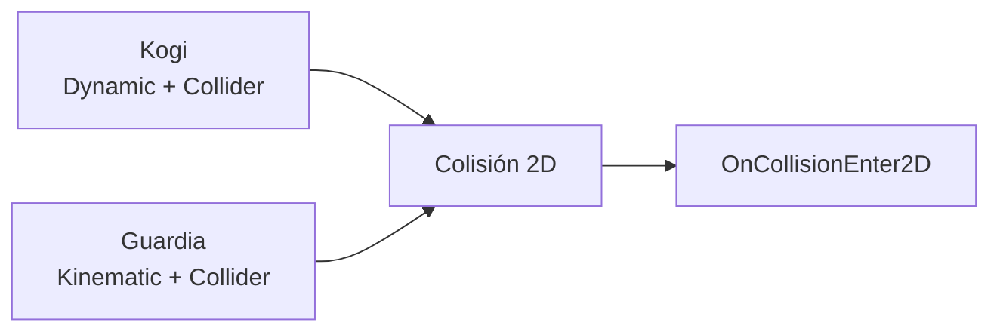
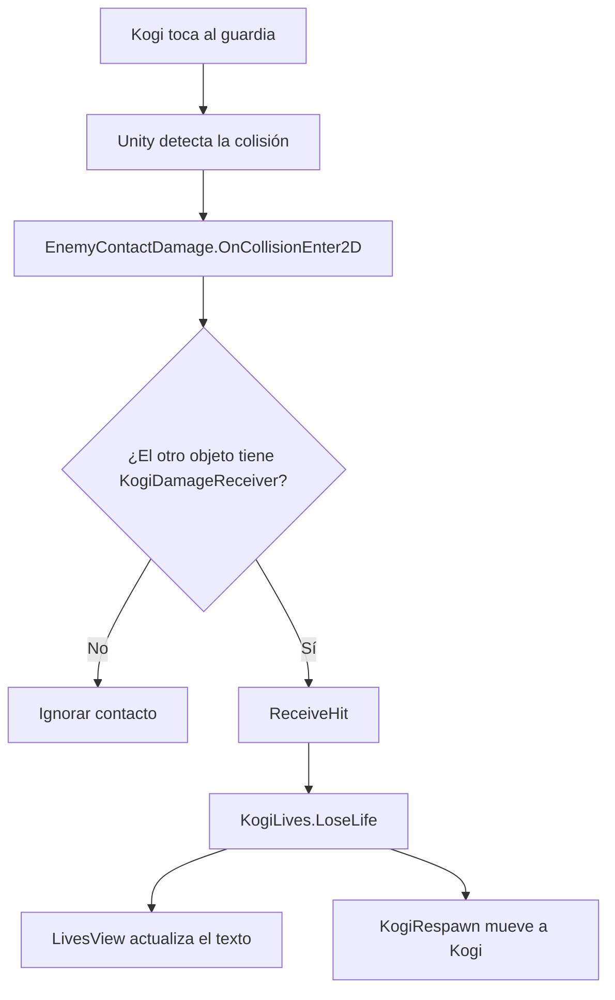

# Sesión 13: hacer que el contacto con un guardia quite una vida 💥❤️

Duración aproximada: **75–90 minutos**.

## 🎯 Objetivo

Al terminar, tocar a un guardia hará que Kogi pierda una vida y reaparezca en un punto seguro. Reutilizaremos las vidas, la interfaz y la reaparición que ya existen.

Crearemos dos responsabilidades separadas:

- El guardia detecta el contacto peligroso.
- Kogi decide cómo recibir el golpe, perder una vida y reaparecer.

Todavía no añadiremos invulnerabilidad temporal, retroceso, animaciones ni efectos de sonido.

## 1. Comprobar el estado actual

1. Abre `NivelDesierto`.
2. Pulsa ▶️.
3. Comprueba que ambos guardias patrullan.
4. Comprueba que Kogi tiene tres vidas.
5. Confirma que caer en `ZonaCaida` quita una vida y hace reaparecer a Kogi.
6. Detén ▶️ y guarda con `Ctrl + S`.

> 💡 **Qué acabas de comprobar:** el nuevo daño reutilizará sistemas que ya funcionan; no volveremos a programar las vidas desde cero.

## 2. Mover RespawnPoint a una posición segura

`GuardiaIzquierda` patrulla hasta `X = 0`. Nuestro `RespawnPoint` también estaba en `X = 0`, por lo que Kogi podría reaparecer encima del guardia.

1. Selecciona `RespawnPoint` en **Hierarchy**.
2. En **Inspector > Transform**, configura **Position** como:

| X | Y | Z |
|---:|---:|---:|
| `1` | `0` | `0` |

3. Selecciona Kogi en **Hierarchy**.
4. Configura también su **Transform > Position** como `(1, 0, 0)`.
5. Comprueba en la ventana **Scene** que ambos quedan sobre `Suelo`, fuera de la patrulla izquierda y antes de `PlataformaBase`.
6. Guarda con `Ctrl + S`.

> 💡 **Qué acabas de aprender:** un punto de reaparición debe estar libre de enemigos, obstáculos y zonas peligrosas.

## 3. Comprender la colisión que utilizaremos

Kogi tiene:

- `Rigidbody2D` de tipo `Dynamic`.
- `CapsuleCollider2D`.

Cada guardia tiene:

- `Rigidbody2D` de tipo `Kinematic`.
- `CapsuleCollider2D`.

Cuando ambos `Colliders` se tocan, el sistema de física puede comunicar el contacto mediante `OnCollisionEnter2D`.



No activaremos **Is Trigger** en ninguno de los guardias. Queremos una colisión física normal, además de recibir el aviso del contacto.

> 💡 **Qué acabas de aprender:** los `Colliders` delimitan los cuerpos y al menos uno de los participantes necesita `Rigidbody2D` para que Unity procese correctamente los eventos físicos.

## 4. Crear KogiDamageReceiver

Este componente representará la capacidad de Kogi para recibir daño.

1. En **Project**, abre `Assets > Kogi > Scripts > Player`.
2. Haz clic derecho en una zona vacía.
3. Selecciona **Create > Scripting > MonoBehaviour Script**.
4. Nombra el archivo exactamente `KogiDamageReceiver`.
5. Ábrelo en Rider.
6. Reemplaza todo su contenido por:

```csharp
using UnityEngine;

namespace Kogi.Scripts.Player
{
    [RequireComponent(typeof(KogiLives))]
    public sealed class KogiDamageReceiver : MonoBehaviour
    {
        [SerializeField]
        private Transform respawnPoint;

        private KogiLives lives;

        private void Awake()
        {
            lives = GetComponent<KogiLives>();
        }

        public void ReceiveHit()
        {
            lives.LoseLife(respawnPoint.position);
        }
    }
}
```

7. Guarda con `Ctrl + S`.
8. Regresa a Unity y espera a que termine la compilación.
9. Comprueba que **Console** no tenga errores rojos.

### ¿Qué hace cada parte?

- `[RequireComponent(typeof(KogiLives))]`: garantiza que el mismo `GameObject` tenga el sistema de vidas.
- `respawnPoint`: referencia al lugar seguro de la escena.
- `lives`: referencia privada al componente `KogiLives` de Kogi.
- `Awake`: obtiene esa referencia una vez al cargar.
- `ReceiveHit`: representa la orden “Kogi ha recibido un golpe”.

`ReceiveHit` es público porque otro componente —el guardia— necesitará llamarlo.

> 💡 **Qué acabas de aprender:** Kogi conoce sus vidas y su reaparición; el enemigo no necesita saber cuántas vidas quedan ni dónde debe reaparecer el jugador.

## 5. Añadir KogiDamageReceiver a Kogi

1. Selecciona Kogi en **Hierarchy**.
2. En **Inspector**, pulsa **Add Component**.
3. Busca `Kogi Damage Receiver` y añádelo.
4. Localiza su campo **Respawn Point**.
5. Arrastra el `GameObject` `RespawnPoint` desde **Hierarchy** hasta ese campo.
6. Comprueba que el campo muestre `RespawnPoint (Transform)`.
7. Guarda con `Ctrl + S`.

### ¿Qué significa arrastrar RespawnPoint al campo?

No estamos copiando el objeto. Estamos guardando una referencia: cuando el código consulte `respawnPoint.position`, leerá la posición actual de ese `GameObject`.

```text
Kogi Damage Receiver
        │
        └── Respawn Point ──► Transform de RespawnPoint
```

> 💡 **Qué acabas de aprender:** un campo `[SerializeField]` permite conectar desde el Inspector un componente con otro objeto de la escena.

## 6. Crear EnemyContactDamage

1. En **Project**, abre `Assets > Kogi > Scripts > Enemies`.
2. Haz clic derecho en una zona vacía.
3. Selecciona **Create > Scripting > MonoBehaviour Script**.
4. Nombra el archivo exactamente `EnemyContactDamage`.
5. Ábrelo en Rider.
6. Reemplaza todo su contenido por:

```csharp
using Kogi.Scripts.Player;
using UnityEngine;

namespace Kogi.Scripts.Enemies
{
    public sealed class EnemyContactDamage : MonoBehaviour
    {
        private void OnCollisionEnter2D(Collision2D collision)
        {
            if (!collision.gameObject.TryGetComponent(out KogiDamageReceiver receiver))
            {
                return;
            }

            receiver.ReceiveHit();
        }
    }
}
```

7. Guarda con `Ctrl + S`.
8. Regresa a Unity y espera a que termine la compilación.
9. Revisa que **Console** no muestre errores rojos.

### ¿Qué recibe OnCollisionEnter2D?

Unity llama automáticamente a `OnCollisionEnter2D` cuando comienza una colisión 2D. Su parámetro contiene información sobre el contacto y sobre el otro `GameObject`.

`TryGetComponent` pregunta:

> “¿El objeto con el que choqué puede recibir daño como Kogi?”

- Si no encuentra `KogiDamageReceiver`, termina con `return`.
- Si lo encuentra, llama a `receiver.ReceiveHit()`.

Esto significa que el guardia puede tocar el suelo, una plataforma u otro objeto sin intentar quitarle vidas.

> 💡 **Qué acabas de aprender:** no identificamos a Kogi por su nombre; buscamos una capacidad concreta mediante un componente.

## 7. Añadir el daño al Prefab GuardiaBasico

1. En **Project**, abre `Assets > Kogi > Prefabs > Enemies`.
2. Haz doble clic en `GuardiaBasico`.
3. Confirma que estás dentro de **Prefab Mode**.
4. Selecciona `GuardiaBasico` en **Hierarchy**.
5. Pulsa **Add Component**.
6. Busca `Enemy Contact Damage` y añádelo.
7. Comprueba que el `Prefab` contiene:

   - `Sprite Renderer`
   - `CapsuleCollider2D`
   - `Enemy Health`
   - `Rigidbody2D`
   - `Enemy Patrol`
   - `Enemy Contact Damage`

8. Guarda con `Ctrl + S`.
9. Sal de **Prefab Mode** usando la flecha situada arriba de **Hierarchy**.

`Enemy Contact Damage` no muestra campos configurables: solamente necesita detectar con qué objeto chocó.

> 💡 **Qué acabas de aprender:** como añadimos el componente al `Prefab`, las dos instancias de guardia reciben el comportamiento sin repetir manualmente la configuración.

## 8. Comprobar las referencias antes de ejecutar

1. Selecciona Kogi.
2. Comprueba que `Kogi Damage Receiver > Respawn Point` muestre `RespawnPoint (Transform)`.
3. Selecciona `RespawnPoint` y confirma **Position** `(1, 0, 0)`.
4. Selecciona Kogi y confirma también **Position** `(1, 0, 0)`.
5. Selecciona un guardia y confirma que tiene `Enemy Contact Damage`.
6. Comprueba que **Is Trigger** esté desactivado en su `CapsuleCollider2D`.
7. Guarda con `Ctrl + S`.

## 9. Probar la pérdida de una vida

1. Abre la ventana **Game**.
2. Pulsa ▶️.
3. Observa que el texto indica tres vidas.
4. Camina hacia `GuardiaIzquierda` hasta tocarlo.
5. Comprueba que las vidas bajan de `3` a `2`.
6. Comprueba que Kogi reaparece cerca de `X = 1`.
7. Espera a que el guardia se aleje antes de volver a acercarte.
8. Tócalo nuevamente y comprueba que las vidas bajan a `1`.
9. Detén ▶️.

No cambies valores durante la ejecución.

> 💡 **Qué acabas de aprender:** un evento de colisión inició una cadena que reutilizó `KogiLives`, `KogiRespawn` y `LivesView`.

## 10. Entender el flujo completo



Observa que cada clase conserva una responsabilidad:

| Componente | Responsabilidad |
|---|---|
| `EnemyContactDamage` | Detectar que un guardia tocó algo dañable. |
| `KogiDamageReceiver` | Traducir el golpe en pérdida de vida. |
| `KogiLives` | Administrar la cantidad de vidas. |
| `KogiRespawn` | Recolocar el cuerpo de Kogi. |
| `LivesView` | Mostrar las vidas en pantalla. |

## 11. Limitación que resolveremos después

Kogi todavía no tiene un período de invulnerabilidad después de recibir daño. La reaparición suele separar inmediatamente los cuerpos y evita pérdidas repetidas, pero un juego completo necesita controlar explícitamente cuánto tiempo debe ignorar nuevos golpes.

Lo añadiremos en otra sesión junto con una respuesta visual. Por ahora, `RespawnPoint` debe permanecer fuera de las patrullas.

## 12. Revisar el resultado

1. Detén ▶️.
2. Guarda la escena con `Ctrl + S`.
3. Abre **Console** y comprueba que no haya errores rojos.

La sesión estará terminada cuando:

- [ ] `RespawnPoint` está en `(1, 0, 0)`.
- [ ] Kogi comienza en `(1, 0, 0)`, fuera de la patrulla izquierda.
- [ ] Existe `KogiDamageReceiver.cs`.
- [ ] Kogi contiene `Kogi Damage Receiver`.
- [ ] Su campo **Respawn Point** está asignado.
- [ ] Existe `EnemyContactDamage.cs`.
- [ ] El `Prefab GuardiaBasico` contiene `Enemy Contact Damage`.
- [ ] Tocar cualquier guardia quita exactamente una vida.
- [ ] Kogi reaparece fuera de la patrulla del guardia.
- [ ] El texto de vidas se actualiza.
- [ ] **Console** no muestra errores rojos.

## 🧰 Problemas frecuentes

- **Kogi toca al guardia y no ocurre nada:** comprueba que Kogi tenga `Kogi Damage Receiver` y el `Prefab` tenga `Enemy Contact Damage`.
- **Aparece UnassignedReferenceException:** asigna `RespawnPoint` al campo **Respawn Point** de `Kogi Damage Receiver`.
- **Pierde una vida, pero reaparece encima del guardia:** confirma que `RespawnPoint` esté en `(1, 0, 0)` y que `GuardiaIzquierda` patrulle solamente hasta `X = 0`.
- **El guardia atraviesa a Kogi sin producir contacto:** confirma que ambos tengan `Collider2D`, que **Is Trigger** esté desactivado y que sus `Rigidbody2D` estén simulados.
- **Solo uno de los guardias hace daño:** abre el `Prefab GuardiaBasico` y verifica que añadiste allí `Enemy Contact Damage`, no únicamente a una instancia.
- **Se pierden varias vidas seguidas:** detén la ejecución y verifica que el punto de reaparición no esté dentro del recorrido de ningún guardia.
- **Enemy Contact Damage no aparece:** espera a que Unity compile y corrige primero cualquier error rojo de **Console**.

---

[⬅️ Sesión anterior](12-patrulla-del-guardia.md) · [🏠 Inicio](../../README.md) · [Siguiente: invulnerabilidad temporal ➡️](14-invulnerabilidad-temporal.md)
