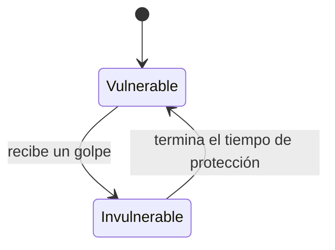
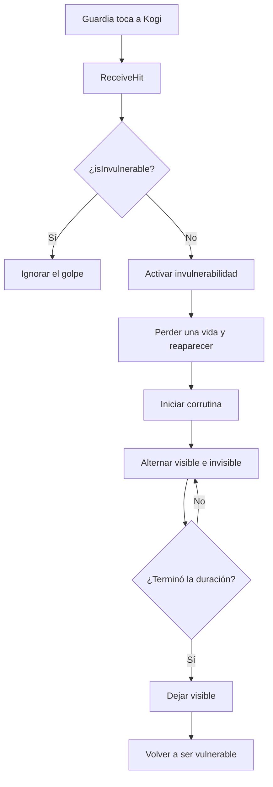

# Sesión 14: añadir invulnerabilidad temporal después de recibir daño ✨🛡️

Duración aproximada: **65–80 minutos**.

## 🎯 Objetivo

Al terminar, Kogi ignorará nuevos golpes durante un breve período después de perder una vida. Mientras esté protegido, su representación parpadeará para comunicarlo visualmente.

Aprenderemos a conservar un estado temporal, utilizar una corrutina y proteger una operación mediante una condición de salida temprana.

Todavía no añadiremos retroceso, animaciones, sonidos ni una barra de salud.

## 1. Comprobar el comportamiento actual

1. Abre `NivelDesierto`.
2. Pulsa ▶️.
3. Acércate a un guardia hasta tocarlo.
4. Comprueba que Kogi pierde una vida y reaparece.
5. Observa que actualmente no existe ninguna señal visual de protección.
6. Detén ▶️.
7. Guarda con `Ctrl + S`.

> 💡 **Qué acabas de comprobar:** el daño ya funciona, pero el jugador no sabe cuándo puede volver a recibirlo.

## 2. Entender el nuevo estado

Hasta ahora, Kogi podía recibir daño siempre. Añadiremos dos estados posibles:



- **Vulnerable:** un golpe puede quitar una vida.
- **Invulnerable:** los golpes se ignoran temporalmente.

La variable `isInvulnerable` conservará cuál de esos estados está activo.

> 💡 **Qué acabas de aprender:** una variable no solo guarda datos; también puede representar el estado actual de una mecánica.

## 3. Comprender qué es una corrutina

Un método normal se ejecuta hasta terminar. Una corrutina puede detenerse temporalmente y continuar más adelante sin bloquear el juego.

```text
Ocultar representación
→ esperar 0.1 segundos
→ mostrar representación
→ esperar 0.1 segundos
→ repetir
```

Durante esas esperas:

- El juego continúa ejecutándose.
- Los guardias siguen patrullando.
- Kogi puede seguir respondiendo al jugador.
- Unity continúa dibujando cada fotograma.

Utilizaremos `yield return new WaitForSeconds(...)` para indicar dónde debe esperar la corrutina.

> 💡 **Qué acabas de aprender:** una corrutina organiza acciones que ocurren a lo largo del tiempo sin detener el resto del juego.

## 4. Actualizar KogiDamageReceiver

1. En **Project**, abre `Assets > Kogi > Scripts > Player`.
2. Haz doble clic en `KogiDamageReceiver`.
3. Reemplaza todo el contenido por:

```csharp
using System.Collections;
using UnityEngine;

namespace Kogi.Scripts.Player
{
    [RequireComponent(typeof(KogiLives))]
    public sealed class KogiDamageReceiver : MonoBehaviour
    {
        [SerializeField]
        private Transform respawnPoint;

        [SerializeField]
        private SpriteRenderer characterRenderer;

        [SerializeField, Min(0.1f)]
        private float invulnerabilityDuration = 1.5f;

        [SerializeField, Min(0.05f)]
        private float flashInterval = 0.1f;

        private KogiLives lives;
        private bool isInvulnerable;

        private void Awake()
        {
            lives = GetComponent<KogiLives>();
        }

        public void ReceiveHit()
        {
            if (isInvulnerable)
            {
                return;
            }

            isInvulnerable = true;
            lives.LoseLife(respawnPoint.position);
            StartCoroutine(ShowInvulnerability());
        }

        private IEnumerator ShowInvulnerability()
        {
            float elapsedTime = 0f;

            while (elapsedTime < invulnerabilityDuration)
            {
                characterRenderer.enabled = !characterRenderer.enabled;
                yield return new WaitForSeconds(flashInterval);
                elapsedTime += flashInterval;
            }

            characterRenderer.enabled = true;
            isInvulnerable = false;
        }
    }
}
```

4. Guarda con `Ctrl + S`.
5. Regresa a Unity y espera a que termine la compilación.
6. Abre **Console** y comprueba que no haya errores rojos.

## 5. Entender los campos nuevos

| Campo | Responsabilidad | Valor inicial |
|---|---|---:|
| `characterRenderer` | Representación que parpadeará. | Se conecta desde el Inspector. |
| `invulnerabilityDuration` | Tiempo total de protección. | `1.5` segundos. |
| `flashInterval` | Tiempo entre cada cambio visible/invisible. | `0.1` segundos. |
| `isInvulnerable` | Indica si debe ignorar nuevos golpes. | `false`. |

`characterRenderer` no apunta al `GameObject` completo de Kogi. Apunta específicamente al componente `SpriteRenderer` de `KogiVisual`.

> 💡 **Qué acabas de aprender:** exponemos en el Inspector solamente las decisiones de configuración; el estado interno permanece privado.

## 6. Entender la condición de protección

Esta parte se denomina una condición de salida temprana o **guard clause**:

```csharp
if (isInvulnerable)
{
    return;
}
```

Significa:

> “Si Kogi ya está protegido, termina el método y no quites otra vida”.

Al recibir un golpe válido, activamos la protección **antes** de perder la vida:

```csharp
isInvulnerable = true;
lives.LoseLife(respawnPoint.position);
```

Ese orden impide que otro golpe procesado inmediatamente pueda entrar como si Kogi siguiera vulnerable.

> 💡 **Qué acabas de aprender:** el orden de las instrucciones puede proteger una regla frente a varios eventos muy próximos.

## 7. Entender el parpadeo

La corrutina cambia repetidamente esta propiedad:

```csharp
characterRenderer.enabled = !characterRenderer.enabled;
```

- Si estaba visible, pasa a invisible.
- Si estaba invisible, pasa a visible.

Después espera:

```csharp
yield return new WaitForSeconds(flashInterval);
```

Al terminar, siempre restauramos un estado seguro:

```csharp
characterRenderer.enabled = true;
isInvulnerable = false;
```

Aunque el número de cambios no termine exactamente con la representación visible, esta restauración garantiza que Kogi vuelva a verse.

> 💡 **Qué acabas de aprender:** una operación temporal debe dejar explícitamente sus objetos en el estado final esperado.

## 8. Conectar KogiVisual

1. Selecciona Kogi en **Hierarchy**.
2. Busca el componente **Kogi Damage Receiver** en **Inspector**.
3. Comprueba que **Respawn Point** todavía muestre `RespawnPoint (Transform)`.
4. Localiza el nuevo campo **Character Renderer**.
5. Despliega Kogi en **Hierarchy** usando la flecha situada a su izquierda.
6. Arrastra `KogiVisual` desde **Hierarchy** hasta **Character Renderer**.
7. Comprueba que el campo muestre `KogiVisual (Sprite Renderer)`.
8. Configura:

| Campo | Valor |
|---|---:|
| Invulnerability Duration | `1.5` |
| Flash Interval | `0.1` |

9. Guarda con `Ctrl + S`.

### ¿Por qué Unity selecciona SpriteRenderer al arrastrar KogiVisual?

El campo solicita un `SpriteRenderer`. Unity examina los componentes de `KogiVisual`, encuentra uno compatible y guarda la referencia a ese componente, no solamente al `GameObject`.

> 💡 **Qué acabas de aprender:** el tipo declarado por un campo determina qué componente compatible puede aceptar el Inspector.

## 9. Probar el parpadeo

1. Abre la ventana **Game**.
2. Pulsa ▶️.
3. Toca a `GuardiaIzquierda`.
4. Comprueba que las vidas bajan de `3` a `2`.
5. Observa que Kogi parpadea después de reaparecer.
6. Comprueba que al terminar queda completamente visible.
7. Detén ▶️.

Si el parpadeo resulta demasiado rápido o lento, no cambies todavía los valores: primero verificaremos la protección.

## 10. Comprobar la protección

Esta comprobación manual puede resultar difícil porque Kogi reaparece lejos del guardia. Puedes acercarte inmediatamente a otro enemigo mientras todavía parpadea:

1. Pulsa ▶️.
2. Recibe un golpe.
3. Mientras Kogi parpadea, intenta tocar otro guardia.
4. Comprueba que no pierde una segunda vida durante esos `1.5` segundos.
5. Espera hasta que deje de parpadear.
6. Toca nuevamente un guardia.
7. Comprueba que ahora sí pierde otra vida.
8. Detén ▶️.

> 💡 **Qué acabas de aprender:** la señal visual y la regla del juego representan el mismo período temporal.

## 11. Comprender el flujo completo



La protección pertenece a `KogiDamageReceiver`, no al guardia. Así funciona de la misma manera frente a cualquier fuente futura de daño: guardias, balas, trampas o el jefe final.

## 12. Experimentar con la configuración

Después de comprobar el funcionamiento básico:

1. Selecciona Kogi.
2. Cambia **Invulnerability Duration** a `2`.
3. Cambia **Flash Interval** a `0.2`.
4. Pulsa ▶️ y observa la diferencia.
5. Detén ▶️.
6. Restaura los valores recomendados:

   - **Invulnerability Duration:** `1.5`
   - **Flash Interval:** `0.1`

7. Guarda con `Ctrl + S`.

> 💡 **Qué acabas de aprender:** los campos serializados nos permiten ajustar la sensación del juego sin recompilar el código.

## 13. Revisar el resultado

1. Detén ▶️.
2. Guarda la escena con `Ctrl + S`.
3. Comprueba que **Console** no muestre errores rojos.

La sesión estará terminada cuando:

- [ ] `KogiDamageReceiver` contiene el estado `isInvulnerable`.
- [ ] `Kogi Damage Receiver > Character Renderer` muestra `KogiVisual (Sprite Renderer)`.
- [ ] **Invulnerability Duration** vale `1.5`.
- [ ] **Flash Interval** vale `0.1`.
- [ ] Un golpe quita una sola vida.
- [ ] Kogi parpadea durante la protección.
- [ ] Los golpes recibidos durante la protección se ignoran.
- [ ] Kogi queda visible al finalizar.
- [ ] Puede volver a recibir daño después de `1.5` segundos.
- [ ] **Console** no muestra errores rojos.

## 🧰 Problemas frecuentes

- **Aparece UnassignedReferenceException:** arrastra `KogiVisual` al campo **Character Renderer** de `Kogi Damage Receiver`.
- **Kogi desaparece y no vuelve:** revisa que al final de `ShowInvulnerability` exista `characterRenderer.enabled = true`.
- **Pierde varias vidas seguidas:** comprueba que `isInvulnerable = true` aparezca antes de `lives.LoseLife(...)`.
- **Nunca vuelve a recibir daño:** confirma que al final de la corrutina exista `isInvulnerable = false`.
- **No parpadea:** comprueba que llamas a `StartCoroutine(ShowInvulnerability())` y que `Flash Interval` sea mayor que `0`.
- **El parpadeo es difícil de ver:** prueba temporalmente **Flash Interval** `0.2` y después restáuralo a `0.1`.
- **Kogi parpadea, pero pierde vidas durante la protección:** revisa la condición `if (isInvulnerable) { return; }`.
- **La consola muestra que falta IEnumerator:** añade `using System.Collections;` al comienzo del archivo.

---

[⬅️ Sesión anterior](13-dano-por-contacto.md) · [🏠 Inicio](../../README.md) · [Siguiente: lanzar una daga ➡️](15-lanzar-daga.md)
