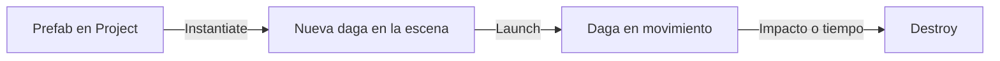
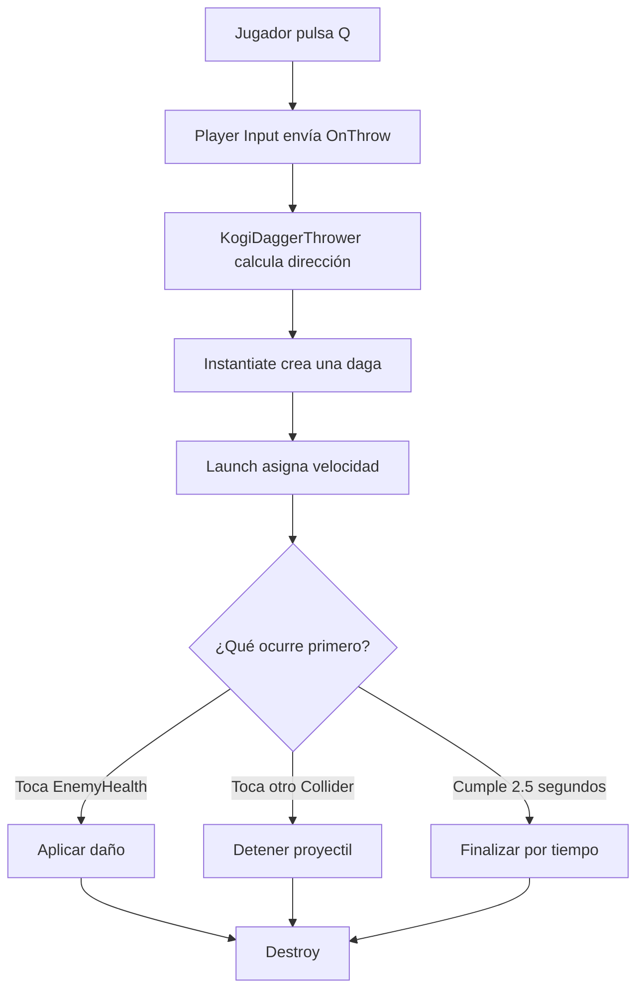

# Sesión 15: lanzar una daga contra los guardias 🗡️💨

Duración aproximada: **90–110 minutos**.

## 🎯 Objetivo

Al terminar, Kogi podrá lanzar una daga pulsando `Q`. La daga viajará en la dirección hacia la que mira, dañará al primer guardia que toque y desaparecerá al impactar o después de un tiempo.

Aprenderemos a crear objetos durante la ejecución con `Instantiate`, representar un proyectil mediante un `Prefab`, iniciarlo con datos y retirarlo con `Destroy`.

Todavía utilizaremos una figura provisional. No añadiremos animaciones, inventario, munición, efectos ni sonidos.

## 1. Comprobar el estado actual

1. Abre `NivelDesierto`.
2. Pulsa ▶️.
3. Comprueba que Kogi puede atacar cuerpo a cuerpo con `Enter`.
4. Comprueba que los guardias pierden salud después de tres golpes.
5. Verifica que el contacto con un guardia quita una vida y activa el parpadeo.
6. Detén ▶️ y guarda con `Ctrl + S`.

> 💡 **Qué acabas de comprobar:** la daga reutilizará `EnemyHealth`; no crearemos un segundo sistema de salud para ataques a distancia.

## 2. Crear la acción Throw

El ataque cuerpo a cuerpo seguirá usando `Attack`. La daga tendrá una acción independiente llamada `Throw`.

1. En **Project**, abre `Assets > Settings`.
2. Haz doble clic en `InputSystem_Actions`.
3. Selecciona el mapa `Player` en la columna izquierda.
4. En la columna **Actions**, pulsa el botón `+` situado a la derecha de su título.
5. Renombra la nueva acción exactamente como `Throw`.
6. Selecciona `Throw` y configura:

| Propiedad | Valor |
|---|---|
| Action Type | `Button` |
| Control Type | `Any` |

7. Pulsa el botón `+` situado a la derecha de `Throw`.
8. Selecciona **Add Binding**.
9. Selecciona el nuevo enlace que aparece debajo de `Throw`.
10. En **Path**, pulsa el desplegable y elige **Keyboard > By Character Mapping > Q**. Si esa ruta no aparece, utiliza **Listen**, pulsa `Q` y selecciona `<Keyboard>/q`.
11. Comprueba que debajo de `Throw` aparezca `Q [Keyboard]`.
12. Pulsa **Save Asset** si **Auto-Save** no está activado.
13. Cierra la ventana de acciones.

### ¿Por qué creamos otra acción?

`Attack` representa el golpe cercano y `Throw` el lanzamiento. Separarlas permite asignar botones diferentes y modificar una mecánica sin afectar la otra.

Con `Player Input > Behavior = Send Messages`, una acción llamada `Throw` buscará un método llamado `OnThrow` en los componentes de Kogi.

> 💡 **Qué acabas de aprender:** el nombre de una acción forma parte del contrato entre `Player Input` y el método que recibirá el mensaje.

## 3. Crear la carpeta de proyectiles

1. En **Project**, abre `Assets > Kogi > Scripts`.
2. Haz clic derecho en una zona vacía.
3. Selecciona **Create > Folder**.
4. Nombra la carpeta exactamente `Projectiles`.
5. Abre la nueva carpeta.

Un proyectil tiene un ciclo de vida propio: aparece, se desplaza, puede impactar y finalmente desaparece. Por eso tendrá un comportamiento separado del jugador.

> 💡 **Qué acabas de aprender:** aunque Kogi crea la daga, no necesita controlar cada paso de su existencia.

## 4. Crear DaggerProjectile

1. Dentro de `Assets > Kogi > Scripts > Projectiles`, haz clic derecho.
2. Selecciona **Create > Scripting > MonoBehaviour Script**.
3. Nombra el archivo exactamente `DaggerProjectile`.
4. Ábrelo en Rider.
5. Reemplaza todo su contenido por:

```csharp
using Kogi.Scripts.Combat;
using UnityEngine;

namespace Kogi.Scripts.Projectiles
{
    [RequireComponent(typeof(Rigidbody2D))]
    [RequireComponent(typeof(BoxCollider2D))]
    public sealed class DaggerProjectile : MonoBehaviour
    {
        [SerializeField, Min(0f)]
        private float speed = 10f;

        [SerializeField, Min(0.1f)]
        private float lifetime = 2.5f;

        [SerializeField, Min(1)]
        private int damage = 1;

        private Rigidbody2D body;
        private GameObject owner;

        private void Awake()
        {
            body = GetComponent<Rigidbody2D>();
        }

        public void Launch(Vector2 direction, GameObject projectileOwner)
        {
            owner = projectileOwner;
            Vector2 normalizedDirection = direction.normalized;
            body.linearVelocity = normalizedDirection * speed;
            transform.right = normalizedDirection;
            Destroy(gameObject, lifetime);
        }

        private void OnTriggerEnter2D(Collider2D other)
        {
            if (other.gameObject == owner)
            {
                return;
            }

            if (other.TryGetComponent(out EnemyHealth enemy))
            {
                enemy.TakeDamage(damage);
                Destroy(gameObject);
                return;
            }

            if (!other.isTrigger)
            {
                Destroy(gameObject);
            }
        }
    }
}
```

6. Guarda con `Ctrl + S`.
7. Regresa a Unity y espera a que termine de compilar.
8. Comprueba que **Console** no muestre errores rojos.

## 5. Entender el ciclo de vida de la daga

| Parte | Responsabilidad |
|---|---|
| `Awake` | Obtiene el `Rigidbody2D`. |
| `Launch` | Recibe la dirección y comienza el movimiento. |
| `linearVelocity` | Mantiene la daga viajando a velocidad constante. |
| `OnTriggerEnter2D` | Detecta qué `Collider2D` atravesó el área de la daga. |
| `Destroy` | Retira la instancia después del impacto o del tiempo máximo. |

`Launch` es público porque Kogi deberá iniciar cada daga recién creada. También recibe `projectileOwner`, que identifica quién la lanzó. Así la daga puede ignorar el `Collider2D` del propio Kogi al aparecer cerca de él.

`direction.normalized` conserva solamente la dirección y evita que la magnitud recibida altere accidentalmente la velocidad configurada.

> 💡 **Qué acabas de aprender:** crear un objeto y ponerlo en movimiento son operaciones distintas; primero existe la instancia y después la inicializamos.

## 6. Entender por qué usamos Trigger

El `BoxCollider2D` de la daga tendrá **Is Trigger** activado. Eso significa que detectará solapamientos sin comportarse como una pared física.

```text
Colisión normal → los cuerpos pueden bloquearse o empujarse
Trigger         → se detecta el contacto sin bloquear el movimiento
```

Cuando la daga toca algo:

- Si encuentra `EnemyHealth`, aplica daño y desaparece.
- Si encuentra otro `Collider2D` que no es `Trigger`, simplemente desaparece.
- Si atraviesa otro `Trigger`, lo ignora.

> 💡 **Qué acabas de aprender:** un `Trigger` sigue perteneciendo al sistema de física, pero se utiliza como zona de detección.

## 7. Crear la representación provisional de la daga

1. Abre `GameObject > 2D Object > Sprites > Square` en el menú superior de Unity.
2. Renombra el nuevo `GameObject` como `DaggerProjectile`.
3. Selecciónalo en **Hierarchy**.
4. En **Inspector > Transform**, configura:

| Propiedad | X | Y | Z |
|---|---:|---:|---:|
| Position | `0` | `3` | `0` |
| Rotation | `0` | `0` | `0` |
| Scale | `0.6` | `0.15` | `1` |

La posición `Y = 3` es solamente un espacio de trabajo temporal; esta figura no formará parte definitiva de la escena.

5. En **Sprite Renderer > Color**, elige un color provisional claro, por ejemplo `D8D8D8`.
6. Guarda con `Ctrl + S`.

> 💡 **Qué acabas de aprender:** la representación provisional permite validar la mecánica antes de invertir tiempo en el arte definitivo.

## 8. Añadir los componentes físicos

1. Con `DaggerProjectile` seleccionado, pulsa **Add Component**.
2. Añade `Rigidbody 2D`.
3. Configura el componente:

| Propiedad | Valor |
|---|---|
| Body Type | `Kinematic` |
| Simulated | Activado |
| Collision Detection | `Continuous` |
| Interpolate | `Interpolate` |

4. Pulsa nuevamente **Add Component**.
5. Añade `Box Collider 2D`.
6. En `BoxCollider2D`, activa **Is Trigger**.
7. Comprueba que el contorno verde se adapta a la figura rectangular.

### ¿Por qué Continuous?

La daga se moverá rápidamente. La detección continua reduce la posibilidad de que avance de un lado al otro de un `Collider` entre dos actualizaciones físicas sin detectarlo.

> 💡 **Qué acabas de aprender:** la velocidad de un objeto influye en la configuración adecuada de sus colisiones.

## 9. Añadir DaggerProjectile al objeto

1. Con `DaggerProjectile` todavía seleccionado, pulsa **Add Component**.
2. Busca `Dagger Projectile` y añádelo.
3. Configura:

| Campo | Valor |
|---|---:|
| Speed | `10` |
| Lifetime | `2.5` |
| Damage | `1` |

4. Comprueba que el objeto contiene:

   - `Transform`
   - `Sprite Renderer`
   - `Rigidbody2D`
   - `BoxCollider2D`
   - `Dagger Projectile`

5. Guarda con `Ctrl + S`.

## 10. Convertir la daga en un Prefab

1. En **Project**, abre `Assets > Kogi > Prefabs`.
2. Haz clic derecho y crea una carpeta llamada `Projectiles`.
3. Abre `Projectiles`.
4. Arrastra `DaggerProjectile` desde **Hierarchy** hasta la zona vacía de esta carpeta.
5. Comprueba que aparece un recurso azul llamado `DaggerProjectile`.
6. Ese recurso es el `Prefab` que utilizaremos como molde.
7. Selecciona el `GameObject DaggerProjectile` que continúa en **Hierarchy**.
8. Pulsa `Delete` y confirma su eliminación de la escena.
9. Guarda con `Ctrl + S`.

### ¿Por qué eliminamos la instancia de la escena?

No queremos una daga esperando en `Y = 3`. El `Prefab` permanecerá en **Project** y el juego creará instancias únicamente cuando el jugador pulse `Q`.

> 💡 **Qué acabas de aprender:** el `Prefab` es el molde persistente; las instancias pueden aparecer y desaparecer durante la ejecución.

## 11. Crear KogiDaggerThrower

1. En **Project**, abre `Assets > Kogi > Scripts > Player`.
2. Crea un **MonoBehaviour Script** llamado exactamente `KogiDaggerThrower`.
3. Ábrelo en Rider.
4. Reemplaza todo su contenido por:

```csharp
using Kogi.Scripts.Projectiles;
using UnityEngine;
using UnityEngine.InputSystem;

namespace Kogi.Scripts.Player
{
    public sealed class KogiDaggerThrower : MonoBehaviour
    {
        [SerializeField]
        private Transform launchPoint;

        [SerializeField]
        private DaggerProjectile daggerPrefab;

        private void OnThrow(InputValue value)
        {
            if (!value.isPressed)
            {
                return;
            }

            ThrowDagger();
        }

        private void ThrowDagger()
        {
            Vector2 direction = launchPoint.localPosition.x < 0f
                ? Vector2.left
                : Vector2.right;

            DaggerProjectile dagger = Instantiate(
                daggerPrefab,
                launchPoint.position,
                Quaternion.identity);

            dagger.Launch(direction, gameObject);
        }
    }
}
```

5. Guarda con `Ctrl + S`.
6. Regresa a Unity y espera a que compile.
7. Comprueba que **Console** no tenga errores rojos.

## 12. Entender Instantiate

Esta instrucción crea una nueva instancia del `Prefab`:

```csharp
DaggerProjectile dagger = Instantiate(
    daggerPrefab,
    launchPoint.position,
    Quaternion.identity);
```

Le entregamos tres datos:

- `daggerPrefab`: el molde que debe copiar.
- `launchPoint.position`: lugar del mundo donde debe aparecer.
- `Quaternion.identity`: rotación inicial sin cambios.

El resultado se guarda en `dagger`, una referencia a la nueva instancia. Inmediatamente después llamamos:

```csharp
dagger.Launch(direction, gameObject);
```



> 💡 **Qué acabas de aprender:** `Instantiate` no mueve el `Prefab` original; crea una copia independiente durante la ejecución.

## 13. Reutilizar AttackPoint como punto de lanzamiento

`AttackPoint` ya cambia de lado cuando Kogi mira a izquierda o derecha. Lo reutilizaremos como punto de aparición de la daga.

1. Selecciona Kogi en **Hierarchy**.
2. Despliega sus hijos.
3. Selecciona `AttackPoint`.
4. Comprueba que su **Local Position X** es `0.75` cuando Kogi mira a la derecha.
5. No añadas ningún componente nuevo a `AttackPoint`.

El signo de su posición local nos permite conocer la dirección:

```text
AttackPoint X positivo → lanzar hacia la derecha
AttackPoint X negativo → lanzar hacia la izquierda
```

> 💡 **Qué acabas de aprender:** un mismo punto espacial puede ser compartido por mecánicas relacionadas, siempre que su significado siga siendo claro.

## 14. Añadir y configurar KogiDaggerThrower

1. Selecciona Kogi en **Hierarchy**.
2. Pulsa **Add Component**.
3. Busca `Kogi Dagger Thrower` y añádelo.
4. En **Launch Point**, arrastra `AttackPoint` desde **Hierarchy**.
5. Comprueba que muestre `AttackPoint (Transform)`.
6. En **Project**, abre `Assets > Kogi > Prefabs > Projectiles`.
7. Arrastra el `Prefab DaggerProjectile` hasta el campo **Dagger Prefab**.
8. Comprueba que muestre `DaggerProjectile (Dagger Projectile)`.
9. Guarda con `Ctrl + S`.

### ¿Qué referencias estamos conectando?

```text
Kogi Dagger Thrower
├── Launch Point  ──► AttackPoint de la escena
└── Dagger Prefab ──► DaggerProjectile de Project
```

Una referencia apunta a un objeto de la escena; la otra apunta a un recurso reutilizable del proyecto.

## 15. Probar el lanzamiento hacia la derecha

1. Coloca a Kogi a la izquierda de un guardia.
2. Abre la ventana **Game**.
3. Pulsa ▶️.
4. Camina ligeramente hacia la derecha para asegurar que Kogi mire en ese sentido.
5. Pulsa `Q` una vez.
6. Comprueba que aparece una daga junto a Kogi y viaja hacia la derecha.
7. Lanza tres dagas contra el guardia.
8. Comprueba que pierde una unidad de salud por impacto y desaparece con la tercera.
9. Detén ▶️.

## 16. Probar el lanzamiento hacia la izquierda

1. Pulsa ▶️.
2. Camina hacia la izquierda para cambiar la orientación de Kogi.
3. Pulsa `Q`.
4. Comprueba que la daga aparece a la izquierda y viaja en esa dirección.
5. Detén ▶️.

Las dagas creadas durante ▶️ desaparecerán al detener la ejecución. Solamente permanece el `Prefab` guardado en **Project**.

## 17. Comprender el flujo completo



Observa las responsabilidades:

| Componente | Responsabilidad |
|---|---|
| `KogiDaggerThrower` | Crear y orientar una daga. |
| `DaggerProjectile` | Moverse, detectar impactos y finalizar. |
| `EnemyHealth` | Recibir y administrar el daño. |

## 18. Revisar el resultado

1. Detén ▶️.
2. Guarda la escena con `Ctrl + S`.
3. Comprueba que **Console** no muestre errores rojos.

La sesión estará terminada cuando:

- [ ] Existe la acción `Throw` vinculada a `Q`.
- [ ] Existe `Assets/Kogi/Scripts/Projectiles/DaggerProjectile.cs`.
- [ ] Existe `Assets/Kogi/Prefabs/Projectiles/DaggerProjectile.prefab`.
- [ ] El `Prefab` contiene `Rigidbody2D`, `BoxCollider2D` y `Dagger Projectile`.
- [ ] `BoxCollider2D > Is Trigger` está activado.
- [ ] Existe `KogiDaggerThrower.cs`.
- [ ] Kogi contiene `Kogi Dagger Thrower`.
- [ ] **Launch Point** referencia `AttackPoint`.
- [ ] **Dagger Prefab** referencia el `Prefab` de la daga.
- [ ] `Q` lanza hacia la dirección que mira Kogi.
- [ ] Cada impacto quita una unidad de salud al guardia.
- [ ] La daga desaparece al impactar o después de `2.5` segundos.
- [ ] **Console** no muestra errores rojos.

## 🧰 Problemas frecuentes

- **Pulsar Q no hace nada:** comprueba que la acción se llame exactamente `Throw`, tenga el enlace `<Keyboard>/q` y `Player Input` use **Send Messages**.
- **Aparece UnassignedReferenceException:** conecta **Launch Point** y **Dagger Prefab** en `Kogi Dagger Thrower`.
- **La daga cae al suelo:** confirma que su `Rigidbody2D > Body Type` sea `Kinematic`.
- **La daga atraviesa al guardia:** comprueba que ambos tengan `Collider2D`, que la daga tenga **Is Trigger** activado y **Collision Detection = Continuous**.
- **La daga desaparece al aparecer junto a Kogi:** comprueba que `Launch` reciba y guarde `projectileOwner`, que `OnTriggerEnter2D` ignore a `owner` y que la llamada sea `dagger.Launch(direction, gameObject)`.
- **Siempre vuela hacia la derecha:** comprueba que `KogiFacing` mueve `AttackPoint` al cambiar de dirección.
- **No causa daño:** comprueba que el guardia conserve `Enemy Health` y pertenezca al `Prefab GuardiaBasico`.
- **Permanece una daga al detener ▶️:** confirma que eliminaste de **Hierarchy** la instancia utilizada para crear el `Prefab`.
- **Dagger Projectile no aparece en Add Component:** corrige primero cualquier error rojo de **Console**.

---

[⬅️ Sesión anterior](14-invulnerabilidad-temporal.md) · [🏠 Inicio](../../README.md)
