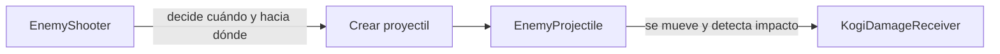
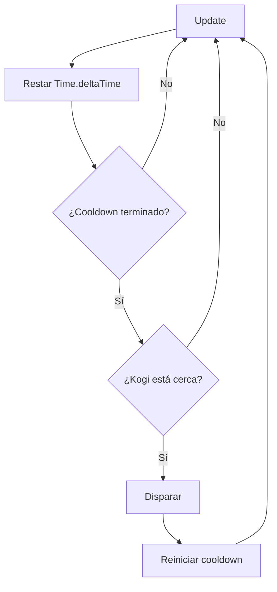
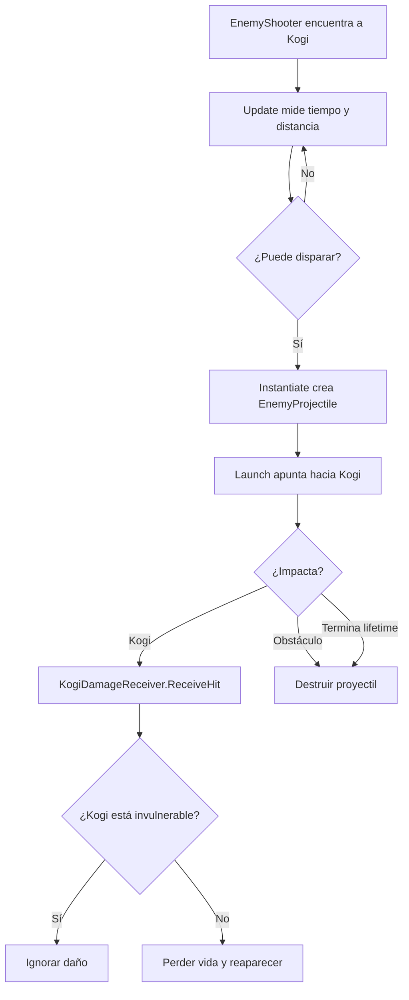

# Sesión 16: hacer que los guardias disparen a Kogi 🔥💨

Duración aproximada: **95–115 minutos**.

## 🎯 Objetivo

Al terminar, cada guardia buscará a Kogi, comprobará si está suficientemente cerca y disparará proyectiles con una cadencia controlada. Los impactos harán perder vidas y respetarán la invulnerabilidad temporal.

Aprenderemos a localizar un objetivo de la escena, medir distancias, controlar una espera mediante un temporizador y dirigir un proyectil hacia una posición.

Todavía no añadiremos línea de visión, animaciones, munición, sonidos ni anticipación visual del disparo.

## 1. Comprobar el estado actual

1. Abre `NivelDesierto`.
2. Pulsa ▶️.
3. Lanza una daga con `Q` y comprueba que daña a un guardia.
4. Toca a un guardia y comprueba que Kogi pierde una vida y parpadea.
5. Detén ▶️ y guarda con `Ctrl + S`.

> 💡 **Qué acabas de comprobar:** el proyectil enemigo reutilizará `KogiDamageReceiver`; no necesita administrar las vidas por su cuenta.

## 2. Comprender las responsabilidades nuevas

Separaremos la decisión de disparar del comportamiento del proyectil:



- `EnemyShooter`: encuentra a Kogi, mide la distancia y controla la cadencia.
- `EnemyProjectile`: se desplaza, detecta el impacto y desaparece.
- `KogiDamageReceiver`: decide si Kogi puede recibir el golpe.

> 💡 **Qué acabas de aprender:** quien decide crear un proyectil y el proyectil creado tienen ciclos de vida y responsabilidades diferentes.

## 3. Crear EnemyProjectile

1. En **Project**, abre `Assets > Kogi > Scripts > Projectiles`.
2. Haz clic derecho en una zona vacía.
3. Selecciona **Create > Scripting > MonoBehaviour Script**.
4. Nombra el archivo exactamente `EnemyProjectile`.
5. Ábrelo en Rider.
6. Reemplaza todo su contenido por:

```csharp
using Kogi.Scripts.Player;
using UnityEngine;

namespace Kogi.Scripts.Projectiles
{
    [RequireComponent(typeof(Rigidbody2D))]
    [RequireComponent(typeof(BoxCollider2D))]
    public sealed class EnemyProjectile : MonoBehaviour
    {
        [SerializeField, Min(0f)]
        private float speed = 7f;

        [SerializeField, Min(0.1f)]
        private float lifetime = 3f;

        private Rigidbody2D body;
        private GameObject owner;

        private void Awake()
        {
            body = GetComponent<Rigidbody2D>();
        }

        public void Launch(Vector2 direction, GameObject projectileOwner)
        {
            owner = projectileOwner;
            Vector2 normalizedDirection = direction.normalized;
            body.linearVelocity = normalizedDirection * speed;
            transform.right = normalizedDirection;
            Destroy(gameObject, lifetime);
        }

        private void OnTriggerEnter2D(Collider2D other)
        {
            if (other.gameObject == owner)
            {
                return;
            }

            if (other.TryGetComponent(out KogiDamageReceiver receiver))
            {
                receiver.ReceiveHit();
                Destroy(gameObject);
                return;
            }

            if (!other.isTrigger)
            {
                Destroy(gameObject);
            }
        }
    }
}
```

7. Guarda con `Ctrl + S`.
8. Regresa a Unity y espera a que compile.
9. Comprueba que **Console** no muestre errores rojos.

### ¿Qué reutilizamos de la daga?

`EnemyProjectile` comparte varias ideas con `DaggerProjectile`:

- `Rigidbody2D` para moverse.
- `Trigger` para detectar impactos.
- `Launch` para recibir dirección y propietario.
- `Destroy` para finalizar.

La diferencia importante es el receptor:

```text
DaggerProjectile → busca EnemyHealth
EnemyProjectile  → busca KogiDamageReceiver
```

> 💡 **Qué acabas de aprender:** dos objetos pueden compartir una estructura parecida y conservar reglas de impacto diferentes.

## 4. Crear la figura provisional del proyectil

1. Abre **GameObject > 2D Object > Sprites > Square** desde el menú superior.
2. Renombra el nuevo `GameObject` como `EnemyProjectile`.
3. En **Inspector > Transform**, configura:

| Propiedad | X | Y | Z |
|---|---:|---:|---:|
| Position | `0` | `3` | `0` |
| Rotation | `0` | `0` | `0` |
| Scale | `0.35` | `0.12` | `1` |

4. En **Sprite Renderer > Color**, utiliza un color naranja provisional, por ejemplo `FF8A2A`.

La posición `Y = 3` es solamente un espacio temporal de montaje.

## 5. Añadir los componentes del proyectil

1. Con `EnemyProjectile` seleccionado, pulsa **Add Component**.
2. Añade `Rigidbody 2D` y configura:

| Propiedad | Valor |
|---|---|
| Body Type | `Kinematic` |
| Simulated | Activado |
| Collision Detection | `Continuous` |
| Interpolate | `Interpolate` |

3. Pulsa **Add Component** nuevamente.
4. Añade `Box Collider 2D`.
5. Activa **Is Trigger**.
6. Pulsa **Add Component**.
7. Añade `Enemy Projectile`.
8. Configura:

| Campo | Valor |
|---|---:|
| Speed | `7` |
| Lifetime | `3` |

9. Guarda con `Ctrl + S`.

> 💡 **Qué acabas de aprender:** el proyectil es cinemático porque su movimiento lo determina el código y no la gravedad.

## 6. Convertir el proyectil en un Prefab

1. En **Project**, abre `Assets > Kogi > Prefabs > Projectiles`.
2. Arrastra `EnemyProjectile` desde **Hierarchy** hasta esa carpeta.
3. Comprueba que aparece un recurso azul llamado `EnemyProjectile`.
4. Selecciona la instancia que permanece en **Hierarchy**.
5. Pulsa `Delete` y confirma.
6. Guarda la escena con `Ctrl + S`.

El molde permanece en **Project**, pero no queda ningún proyectil colocado permanentemente en el nivel.

> 💡 **Qué acabas de aprender:** los proyectiles son instancias temporales creadas a partir de un `Prefab` persistente.

## 7. Crear EnemyShooter

1. En **Project**, abre `Assets > Kogi > Scripts > Enemies`.
2. Crea un **MonoBehaviour Script** llamado exactamente `EnemyShooter`.
3. Ábrelo en Rider.
4. Reemplaza todo su contenido por:

```csharp
using Kogi.Scripts.Player;
using Kogi.Scripts.Projectiles;
using UnityEngine;

namespace Kogi.Scripts.Enemies
{
    public sealed class EnemyShooter : MonoBehaviour
    {
        [SerializeField]
        private Transform firePoint;

        [SerializeField]
        private EnemyProjectile projectilePrefab;

        [SerializeField, Min(0f)]
        private float detectionRange = 6f;

        [SerializeField, Min(0.1f)]
        private float shotCooldown = 2f;

        private Transform target;
        private float remainingCooldown;

        private void Start()
        {
            KogiDamageReceiver receiver = FindFirstObjectByType<KogiDamageReceiver>();

            if (receiver is not null)
            {
                target = receiver.transform;
            }
        }

        private void Update()
        {
            remainingCooldown -= Time.deltaTime;

            if (target is null || remainingCooldown > 0f)
            {
                return;
            }

            Vector2 direction = target.position - firePoint.position;

            if (direction.magnitude > detectionRange)
            {
                return;
            }

            Shoot(direction);
            remainingCooldown = shotCooldown;
        }

        private void Shoot(Vector2 direction)
        {
            Vector3 firePointPosition = firePoint.localPosition;
            firePointPosition.x = Mathf.Abs(firePointPosition.x)
                * Mathf.Sign(direction.x);
            firePoint.localPosition = firePointPosition;

            EnemyProjectile projectile = Instantiate(
                projectilePrefab,
                firePoint.position,
                Quaternion.identity);

            projectile.Launch(direction, gameObject);
        }
    }
}
```

5. Guarda con `Ctrl + S`.
6. Regresa a Unity y espera a que compile.
7. Comprueba que **Console** no tenga errores rojos.

## 8. Entender cómo encuentra a Kogi

En `Start`, cada guardia ejecuta una búsqueda:

```csharp
KogiDamageReceiver receiver = FindFirstObjectByType<KogiDamageReceiver>();
```

No busca un nombre como `"Kogi"`. Busca el primer objeto de la escena con la capacidad `KogiDamageReceiver` y guarda su `Transform` como objetivo.

La búsqueda se realiza una sola vez al comenzar, no en cada fotograma.

> 💡 **Qué acabas de aprender:** una búsqueda global puede ser útil durante el montaje, pero debe evitarse dentro de `Update` porque recorrer la escena repetidamente tiene un coste innecesario.

## 9. Entender el temporizador de disparo

En cada `Update` restamos el tiempo transcurrido:

```csharp
remainingCooldown -= Time.deltaTime;
```

Si todavía es mayor que cero, el guardia espera. Después de disparar lo reiniciamos:

```csharp
remainingCooldown = shotCooldown;
```



> 💡 **Qué acabas de aprender:** una cadencia se puede representar como un contador que disminuye con el tiempo real del juego.

## 10. Entender la dirección hacia el objetivo

Esta resta produce un vector desde el punto de disparo hasta Kogi:

```csharp
Vector2 direction = target.position - firePoint.position;
```

```text
posición destino - posición origen = dirección hacia el destino
```

`direction.magnitude` representa la distancia entre ambos. Si supera `detectionRange`, el guardia no dispara.

Antes de crear el proyectil, movemos `FirePoint` al lado izquierdo o derecho según el signo de `direction.x`.

> 💡 **Qué acabas de aprender:** un vector puede comunicar simultáneamente dirección y distancia.

## 11. Crear FirePoint dentro del Prefab

1. En **Project**, abre `Assets > Kogi > Prefabs > Enemies`.
2. Haz doble clic en `GuardiaBasico`.
3. Confirma que estás en **Prefab Mode**.
4. Haz clic derecho sobre `GuardiaBasico` en **Hierarchy**.
5. Selecciona **Create Empty**.
6. Renombra el hijo exactamente como `FirePoint`.
7. Selecciona `FirePoint`.
8. En su **Transform**, configura la posición local:

| X | Y | Z |
|---:|---:|---:|
| `0.6` | `0` | `0` |

9. Deja **Rotation** `(0, 0, 0)` y **Scale** `(1, 1, 1)`.

`FirePoint` no necesita componentes adicionales. Su `Transform` indica dónde aparecerá el proyectil.

> 💡 **Qué acabas de aprender:** un `GameObject` vacío puede utilizarse como punto espacial dentro de un objeto más complejo.

## 12. Añadir EnemyShooter al Prefab

1. Selecciona la raíz `GuardiaBasico` dentro de **Prefab Mode**.
2. Pulsa **Add Component**.
3. Busca `Enemy Shooter` y añádelo.
4. Arrastra el hijo `FirePoint` hasta el campo **Fire Point**.
5. En **Project**, localiza `Assets > Kogi > Prefabs > Projectiles > EnemyProjectile`.
6. Arrastra ese `Prefab` hasta **Projectile Prefab**.
7. Configura:

| Campo | Valor |
|---|---:|
| Detection Range | `6` |
| Shot Cooldown | `2` |

8. Comprueba que **Fire Point** muestre `FirePoint (Transform)`.
9. Comprueba que **Projectile Prefab** muestre `EnemyProjectile (Enemy Projectile)`.
10. Guarda con `Ctrl + S`.
11. Sal de **Prefab Mode** mediante la flecha situada arriba de **Hierarchy**.

Como modificamos el `Prefab`, las dos instancias de guardia reciben el tirador y su `FirePoint`.

## 13. Comprobar la distancia en la escena

1. Selecciona `GuardiaIzquierda`.
2. Confirma que **Detection Range** vale `6`.
3. Selecciona Kogi y observa su posición inicial `X = 1`.
4. `GuardiaIzquierda` comienza en `X = -2`: la separación inicial es aproximadamente `3`, por debajo del alcance `6`.
5. Por tanto, este guardia podrá disparar desde el comienzo.
6. `GuardiaBasico` comienza en `X = 4`: también se encuentra dentro del alcance inicial.

La distancia real incluye también la diferencia vertical. Unity la calculará mediante el vector completo.

> 💡 **Qué acabas de aprender:** podemos predecir el comportamiento comparando las posiciones de la escena con los valores configurados.

## 14. Probar los disparos

1. Abre la ventana **Game**.
2. Pulsa ▶️.
3. No muevas a Kogi durante unos segundos.
4. Comprueba que los guardias crean proyectiles orientados hacia Kogi.
5. Observa que no disparan continuamente: esperan aproximadamente `2` segundos entre disparos.
6. Deja que un proyectil impacte.
7. Comprueba que las vidas bajan exactamente una unidad.
8. Observa el parpadeo de invulnerabilidad.
9. Comprueba que los proyectiles que coinciden con ese período no quitan vidas adicionales.
10. Detén ▶️.

## 15. Probar el alcance

1. Selecciona `GuardiaBasico` en **Hierarchy**.
2. Cambia temporalmente **Detection Range** a `1` para esa instancia.
3. Pulsa ▶️.
4. Comprueba que ese guardia deja de disparar mientras Kogi está lejos.
5. Acerca a Kogi y observa que comienza a disparar al entrar en el alcance.
6. Detén ▶️.
7. Restaura **Detection Range** a `6`.
8. Guarda con `Ctrl + S`.

El cambio temporal de una instancia aparece como un **Override** del `Prefab`.

## 16. Comprender el flujo completo



## 17. Limitaciones conscientes

Por ahora, el guardia:

- Puede disparar a través de una plataforma o pared si Kogi está dentro del alcance.
- Conoce la posición actual de Kogi en el momento del disparo, pero el proyectil no lo persigue después.
- Dispara inmediatamente al comenzar si Kogi está cerca.
- No muestra una animación previa que permita anticipar el ataque.

Estas limitaciones nos permitirán introducir después línea de visión, estados enemigos y anticipación visual de forma comprensible.

## 18. Revisar el resultado

1. Detén ▶️.
2. Guarda la escena con `Ctrl + S`.
3. Comprueba que **Console** no muestre errores rojos.

La sesión estará terminada cuando:

- [ ] Existe `EnemyProjectile.cs`.
- [ ] Existe `EnemyProjectile.prefab` dentro de `Prefabs/Projectiles`.
- [ ] El proyectil tiene `Rigidbody2D` cinemático y `BoxCollider2D` como `Trigger`.
- [ ] Existe `EnemyShooter.cs`.
- [ ] `GuardiaBasico` contiene un hijo `FirePoint`.
- [ ] El `Prefab GuardiaBasico` contiene `Enemy Shooter`.
- [ ] **Fire Point** y **Projectile Prefab** están conectados.
- [ ] Los dos guardias heredan el nuevo comportamiento.
- [ ] Los guardias solo disparan dentro de `Detection Range`.
- [ ] Respetan aproximadamente `2` segundos de cadencia.
- [ ] El proyectil enemigo hace perder una vida.
- [ ] La invulnerabilidad evita daños repetidos inmediatos.
- [ ] **Console** no muestra errores rojos.

## 🧰 Problemas frecuentes

- **Enemy Shooter no aparece:** espera a que Unity compile y corrige primero los errores rojos de **Console**.
- **Aparece UnassignedReferenceException:** conecta `FirePoint` y `EnemyProjectile` en los campos de `Enemy Shooter` dentro del `Prefab`.
- **Los guardias no disparan:** comprueba que **Detection Range** sea `6`, **Shot Cooldown** sea `2` y Kogi tenga `Kogi Damage Receiver`.
- **El proyectil cae:** confirma que su `Rigidbody2D` sea `Kinematic`.
- **El proyectil atraviesa a Kogi:** comprueba que tenga `BoxCollider2D`, **Is Trigger** activado y **Collision Detection = Continuous**.
- **El proyectil desaparece al nacer:** confirma que `Launch` guarde `projectileOwner` y que `OnTriggerEnter2D` ignore a `owner`.
- **Se pierden muchas vidas inmediatamente:** revisa la sesión 14 y confirma que la invulnerabilidad siga configurada en `1.5` segundos.
- **Solo dispara una instancia:** comprueba que añadiste `Enemy Shooter` y `FirePoint` dentro de **Prefab Mode**.
- **Dispara desde el lado equivocado:** confirma que `FirePoint` comienza en `(0.6, 0, 0)` y que `Shoot` actualiza el signo de su posición local.

---

[⬅️ Sesión anterior](15-lanzar-daga.md) · [🏠 Inicio](../../README.md)
