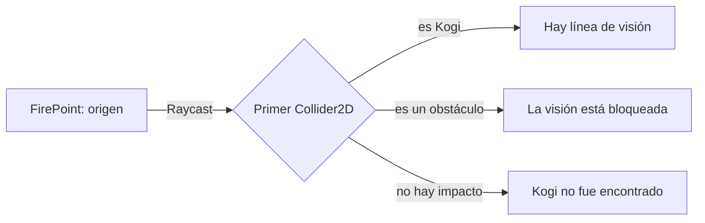
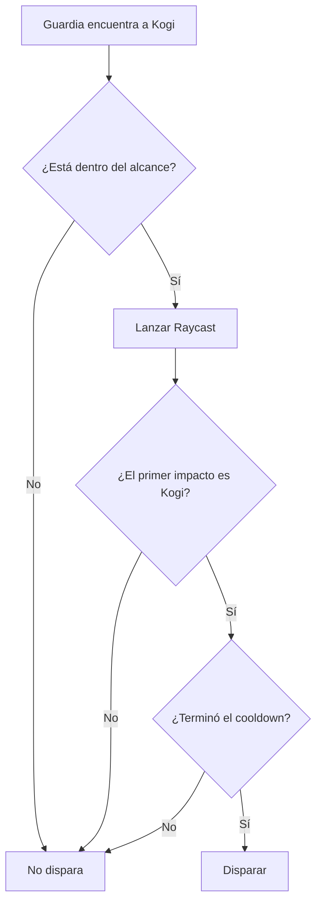
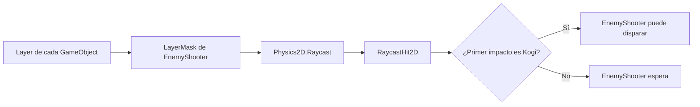

# Sesión 17: comprobar la línea de visión de los guardias 👁️

Duración aproximada: **75–90 minutos**.

## 🎯 Objetivo

Al terminar, un guardia solo disparará cuando Kogi esté dentro de su alcance y no exista una pared o plataforma entre ambos.

Aprenderemos a lanzar un `Raycast`, interpretar su primer impacto, filtrar objetos mediante un `LayerMask` y mostrar el rayo en la ventana **Scene** para entender una decisión que normalmente sería invisible.

Todavía no añadiremos un cono de visión, memoria del jugador, persecución ni estados de alerta.

## 1. Comprobar el estado actual

1. Abre `NivelDesierto`.
2. Pulsa ▶️.
3. Comprueba que los guardias disparan cuando Kogi está dentro de `Detection Range`.
4. Detén ▶️.
5. Guarda con `Ctrl + S`.

> 💡 **Qué acabas de comprobar:** la distancia ya limita el disparo, pero todavía no sabemos si hay un obstáculo entre el guardia y Kogi.

## 2. Comprender qué es un Raycast

Un `Raycast` es una consulta a la física. Unity proyecta una línea invisible desde un origen, en una dirección y hasta una distancia máxima. El resultado informa del primer `Collider2D` encontrado.



La idea importante es **primer impacto**. Si una pared está antes que Kogi, el rayo devuelve la pared y el guardia no debe disparar.

> 💡 **Qué acabas de aprender:** un `Raycast` no es un objeto visible ni un proyectil; es una pregunta instantánea que hacemos al sistema de física.

## 3. Crear la capa Player

Ya utilizamos la capa `Ground` para reconocer superficies. Ahora clasificaremos a Kogi como jugador.

1. Selecciona `Kogi` en **Hierarchy**.
2. En la parte superior de **Inspector**, abre el desplegable **Layer**.
3. Pulsa **Add Layer...**.
4. En la primera fila de usuario disponible, escribe exactamente `Player`.
5. Regresa a `NivelDesierto`.
6. Selecciona nuevamente `Kogi`.
7. Abre **Layer** y elige `Player`.
8. Si Unity pregunta si también quieres cambiar las capas de los objetos hijos, elige **No, this object only**.

Solo la raíz `Kogi` necesita esta capa porque allí se encuentra su `Collider2D`.

### Layer y LayerMask no son lo mismo

- `Layer`: clasificación asignada a un `GameObject`.
- `LayerMask`: filtro que indica qué capas debe considerar una consulta.

En esta sesión el filtro incluirá `Ground` y `Player`. Ignorará las capas de enemigos y proyectiles.

> 💡 **Qué acabas de aprender:** la capa describe qué es un objeto; la máscara decide qué categorías participan en una consulta concreta.

## 4. Añadir la configuración de visión al código

1. En **Project**, abre `Assets > Kogi > Scripts > Enemies`.
2. Abre `EnemyShooter.cs` en Rider.
3. Debajo de `shotCooldown`, añade:

```csharp
[SerializeField]
private LayerMask lineOfSightLayers;
```

Este campo aparecerá en **Inspector** y permitirá seleccionar las capas sin fijarlas directamente en el código.

4. Reemplaza el método `Update` por:

```csharp
private void Update()
{
    remainingCooldown -= Time.deltaTime;

    if (target is null)
    {
        return;
    }

    Vector2 direction = target.position - firePoint.position;

    if (direction.magnitude > detectionRange)
    {
        return;
    }

    bool hasLineOfSight = HasLineOfSight(direction);

    Debug.DrawRay(
        firePoint.position,
        direction.normalized * detectionRange,
        hasLineOfSight ? Color.green : Color.red);

    if (!hasLineOfSight || remainingCooldown > 0f)
    {
        return;
    }

    Shoot(direction);
    remainingCooldown = shotCooldown;
}
```

5. Añade este método justo antes de `Shoot`:

```csharp
private bool HasLineOfSight(Vector2 direction)
{
    RaycastHit2D hit = Physics2D.Raycast(
        firePoint.position,
        direction.normalized,
        detectionRange,
        lineOfSightLayers);

    return hit.collider is not null
        && hit.collider.TryGetComponent(out KogiDamageReceiver _);
}
```

6. Guarda con `Ctrl + S`.
7. Regresa a Unity y espera a que termine la compilación.
8. Comprueba que **Console** no muestre errores rojos.

> 💡 **Qué acabas de aprender:** `HasLineOfSight` oculta el detalle físico y expresa con claridad la pregunta que necesita responder `EnemyShooter`.

## 5. Entender el resultado del Raycast

Esta llamada realiza la consulta:

```csharp
RaycastHit2D hit = Physics2D.Raycast(
    firePoint.position,
    direction.normalized,
    detectionRange,
    lineOfSightLayers);
```

Sus datos son:

| Dato | Significado |
|---|---|
| `firePoint.position` | Lugar donde comienza el rayo |
| `direction.normalized` | Dirección con longitud `1` |
| `detectionRange` | Distancia máxima de la consulta |
| `lineOfSightLayers` | Capas que pueden detener el rayo |
| `RaycastHit2D` | Información sobre el primer impacto |

Después comprobamos que existe un impacto y que el objeto alcanzado contiene `KogiDamageReceiver`:

```csharp
hit.collider is not null
    && hit.collider.TryGetComponent(out KogiDamageReceiver _)
```

No necesitamos conservar el componente encontrado; únicamente saber si existe. Por eso utilizamos `_`.

> 💡 **Qué acabas de aprender:** el guardia no pregunta si el rayo tocó algo; pregunta si **lo primero** que tocó fue Kogi.

## 6. Configurar el LayerMask en el Prefab

1. En **Project**, abre `Assets > Kogi > Prefabs > Enemies`.
2. Haz doble clic en `GuardiaBasico` para entrar en **Prefab Mode**.
3. Selecciona la raíz `GuardiaBasico` en **Hierarchy**.
4. Busca el componente **Enemy Shooter** en **Inspector**.
5. Abre el campo **Line Of Sight Layers**.
6. Marca únicamente estas dos capas:
   - `Ground`
   - `Player`
7. Comprueba que ambas tienen una marca y que no está seleccionado `Everything`.
8. Guarda con `Ctrl + S`.
9. Sal de **Prefab Mode** con la flecha situada arriba de **Hierarchy**.

Como la configuración se realiza en el `Prefab`, sus dos instancias reciben la misma máscara.

> 💡 **Qué acabas de aprender:** `EnemyShooter` contiene la regla, mientras que el `Prefab` proporciona la configuración concreta de esa regla.

## 7. Ver una decisión invisible

`Debug.DrawRay` dibuja una ayuda temporal:

- Verde: el primer objeto encontrado es Kogi.
- Rojo: el rayo encontró un obstáculo o no encontró a Kogi.

1. Abre las ventanas **Scene** y **Game**.
2. Asegúrate de que el botón **Gizmos** de **Scene** está activado.
3. Pulsa ▶️.
4. Observa en **Scene** los rayos que salen de los guardias.
5. Comprueba que son verdes cuando ven a Kogi.
6. Detén ▶️.

El rayo de depuración solo se muestra durante la ejecución. No formará parte del juego final ni aparecerá en una compilación para el jugador.

> 💡 **Qué acabas de aprender:** visualizar datos internos permite comprobar por qué el juego toma una decisión.

## 8. Construir un obstáculo temporal

Vamos a bloquear únicamente al guardia situado a la derecha.

1. En **Hierarchy**, selecciona `GuardiaIzquierda`.
2. Desactiva temporalmente su casilla superior en **Inspector**.
3. En el menú superior, abre **GameObject > 2D Object > Sprites > Square**.
4. Renombra el objeto como `MuroPrueba`.
5. En **Transform**, configura:

| Propiedad | X | Y | Z |
|---|---:|---:|---:|
| Position | `2` | `0` | `0` |
| Rotation | `0` | `0` | `0` |
| Scale | `0.5` | `3` | `1` |

6. Pulsa **Add Component** y añade `Box Collider 2D`.
7. En la parte superior de **Inspector**, asigna la capa `Ground`.
8. Si Unity pregunta por objetos hijos, elige **No, this object only**.
9. Guarda con `Ctrl + S`.

El muro queda entre Kogi, que comienza cerca de `X = 1`, y el guardia derecho, situado cerca de `X = 4`.

> 💡 **Qué acabas de aprender:** cualquier `Collider2D` incluido en la máscara puede bloquear la visión; no necesitamos escribir una regla especial para cada pared.

## 9. Probar la visión bloqueada

1. Pulsa ▶️.
2. No muevas a Kogi.
3. Comprueba que el guardia derecho no dispara a través de `MuroPrueba`.
4. Observa en **Scene** que su rayo es rojo.
5. Detén ▶️.
6. Desactiva temporalmente `MuroPrueba` mediante su casilla superior.
7. Pulsa ▶️ nuevamente.
8. Comprueba que el rayo se vuelve verde y el guardia dispara.
9. Detén ▶️.



## 10. Dejar limpia la escena

1. Detén ▶️.
2. Selecciona `MuroPrueba` y elimínalo con `Delete`.
3. Selecciona `GuardiaIzquierda` y vuelve a activar su casilla.
4. Guarda la escena con `Ctrl + S`.
5. Pulsa ▶️ una última vez.
6. Comprueba que ambos guardias disparan normalmente.
7. Detén ▶️.
8. Revisa que **Console** no tenga errores rojos.

## 11. Responsabilidad de cada elemento



- `Player`: clasifica la raíz de Kogi.
- `Ground`: clasifica las superficies y paredes que bloquean.
- `LayerMask`: elige qué clasificaciones observa el rayo.
- `Physics2D.Raycast`: realiza la consulta.
- `RaycastHit2D`: contiene el resultado.
- `EnemyShooter`: decide si dispara.
- `EnemyProjectile`: solo actúa después de haber sido creado.

La línea de visión pertenece a `EnemyShooter`, no a `EnemyProjectile`, porque responde a una pregunta anterior al disparo.

## 12. Limitaciones conscientes

Por ahora:

- El guardia utiliza una sola línea, no un cono de visión.
- Puede detectar a Kogi aunque esté detrás del guardia.
- No recuerda dónde vio a Kogi por última vez.
- No muestra estados como patrulla, alerta o persecución.
- `Debug.DrawRay` es una ayuda de desarrollo, no un efecto visual del juego.

## ✅ Comprobación final

La sesión estará terminada cuando:

- [ ] Existe la capa `Player`.
- [ ] La raíz `Kogi` utiliza la capa `Player`.
- [ ] `EnemyShooter` contiene un campo `LayerMask`.
- [ ] La máscara del `Prefab GuardiaBasico` incluye `Ground` y `Player`.
- [ ] El guardia dispara cuando el primer impacto del rayo es Kogi.
- [ ] El guardia no dispara cuando un muro con capa `Ground` bloquea el rayo.
- [ ] El rayo verde o rojo puede verse en **Scene** durante ▶️.
- [ ] `MuroPrueba` fue eliminado.
- [ ] `GuardiaIzquierda` quedó activo nuevamente.
- [ ] **Console** no muestra errores rojos.

## 🧰 Problemas frecuentes

- **Line Of Sight Layers muestra Nothing:** abre el campo y marca `Ground` y `Player`.
- **El guardia nunca dispara:** comprueba que la raíz de Kogi tenga la capa `Player` y que su `Collider2D` esté activo.
- **El guardia dispara a través del muro:** confirma que `MuroPrueba` tenga `Box Collider 2D` y capa `Ground`.
- **No veo los rayos:** ejecuta la escena, abre **Scene** y activa **Gizmos**.
- **El rayo alcanza al propio guardia:** confirma que la máscara no incluya la capa `Enemy`.
- **Solo una instancia tiene la configuración:** realiza el cambio abriendo el `Prefab GuardiaBasico`, no únicamente una instancia de la escena.
- **Aparece un error de compilación:** compara exactamente las llaves y nombres del código antes de continuar.

---

[⬅️ Sesión anterior](16-disparo-del-guardia.md) · [🏠 Inicio](../../README.md) · [Sesión siguiente ➡️](18-estados-del-guardia.md)
