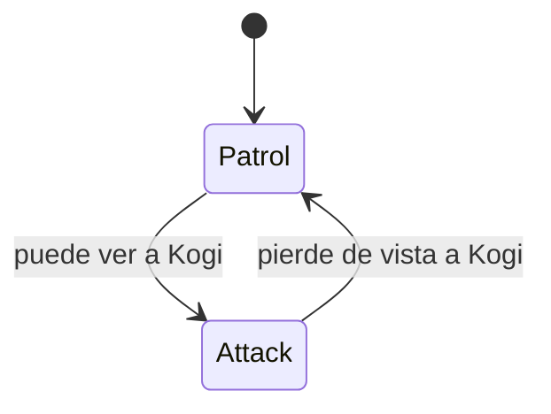
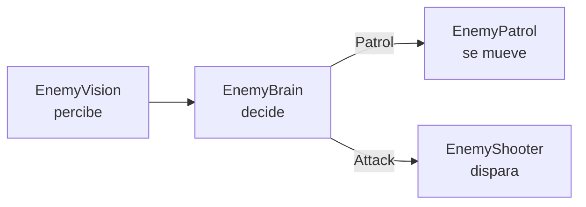
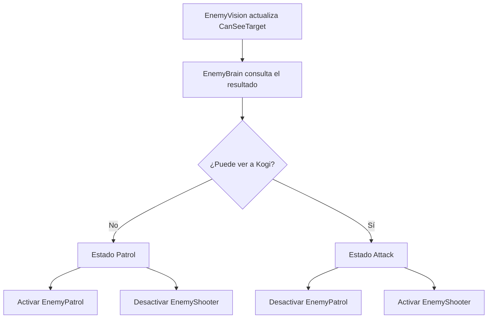

# Sesión 18: organizar al guardia con una máquina de estados 🧠

Duración aproximada: **100–120 minutos**.

## 🎯 Objetivo

Al terminar, el guardia tendrá dos estados claros:

- `Patrol`: recorre su zona cuando no ve a Kogi.
- `Attack`: se detiene y dispara cuando puede verlo.

También separaremos tres responsabilidades que ahora están mezcladas:

- `EnemyVision`: percibe a Kogi.
- `EnemyBrain`: decide el estado.
- `EnemyPatrol` y `EnemyShooter`: ejecutan acciones.

Esta sesión introduce una base de arquitectura que posteriormente permitirá añadir estados como alerta, persecución, daño y muerte sin convertir una sola clase en un bloque difícil de mantener.

## 1. Comprobar el comportamiento actual

1. Abre `NivelDesierto`.
2. Pulsa ▶️.
3. Observa un guardia durante unos segundos.
4. Avanza con Kogi hasta acercarte al guardia derecho.
5. Comprueba que, al entrar en su alcance, patrulla y dispara al mismo tiempo.
6. Detén ▶️.

Ese comportamiento funciona técnicamente, pero el guardia no está tomando una decisión: dos componentes actúan simultáneamente sin coordinarse.

> 💡 **Qué acabas de identificar:** varios componentes independientes necesitan un coordinador cuando sus acciones son mutuamente excluyentes.

## 2. Comprender una máquina de estados

Una máquina de estados representa los modos posibles de un objeto y las condiciones para cambiar entre ellos.



En cada momento el guardia estará en un solo estado:

| Estado | Patrulla | Dispara |
|---|:---:|:---:|
| `Patrol` | Sí | No |
| `Attack` | No | Sí |

> 💡 **Qué acabas de aprender:** un estado expresa qué comportamiento está permitido ahora; una transición expresa cuándo cambia esa situación.

## 3. Separar percepción, decisión y acción

Aplicaremos una organización habitual en sistemas de comportamiento:



- La percepción obtiene información del mundo.
- El cerebro elige qué hacer con esa información.
- Los componentes de acción realizan una tarea concreta.

`EnemyBrain` no calculará rayos ni creará proyectiles. Solo coordinará componentes.

> 💡 **Qué acabas de aprender:** separar responsabilidades reduce dependencias y permite modificar una parte sin reescribir todo el enemigo.

## 4. Crear EnemyVision

1. En **Project**, abre `Assets > Kogi > Scripts > Enemies`.
2. Haz clic derecho en una zona vacía.
3. Selecciona **Create > Scripting > MonoBehaviour Script**.
4. Nombra el archivo exactamente `EnemyVision`.
5. Ábrelo en Rider.
6. Reemplaza todo su contenido por:

```csharp
using Kogi.Scripts.Player;
using UnityEngine;

namespace Kogi.Scripts.Enemies
{
    public sealed class EnemyVision : MonoBehaviour
    {
        [SerializeField]
        private Transform visionPoint;

        [SerializeField, Min(0f)]
        private float detectionRange = 6f;

        [SerializeField]
        private LayerMask visibleLayers;

        private Transform target;

        public bool CanSeeTarget { get; private set; }

        public Vector2 DirectionToTarget => target is null
            ? Vector2.zero
            : target.position - visionPoint.position;

        private void Start()
        {
            KogiDamageReceiver receiver = FindFirstObjectByType<KogiDamageReceiver>();

            if (receiver is not null)
            {
                target = receiver.transform;
            }
        }

        private void Update()
        {
            CanSeeTarget = CalculateLineOfSight();

            if (target is null)
            {
                return;
            }

            Debug.DrawRay(
                visionPoint.position,
                DirectionToTarget.normalized * detectionRange,
                CanSeeTarget ? Color.green : Color.red);
        }

        private bool CalculateLineOfSight()
        {
            if (target is null || DirectionToTarget.magnitude > detectionRange)
            {
                return false;
            }

            RaycastHit2D hit = Physics2D.Raycast(
                visionPoint.position,
                DirectionToTarget.normalized,
                detectionRange,
                visibleLayers);

            return hit.collider is not null
                && hit.collider.TryGetComponent(out KogiDamageReceiver _);
        }
    }
}
```

7. Guarda con `Ctrl + S`.

### ¿Qué trasladamos?

La búsqueda de Kogi, el alcance, el `LayerMask`, el `Raycast` y el dibujo de depuración salen de `EnemyShooter` y pasan a `EnemyVision`.

Las propiedades de solo lectura permiten consultar el resultado desde otras clases:

```csharp
public bool CanSeeTarget { get; private set; }
```

Otras clases pueden leer el valor, pero únicamente `EnemyVision` puede modificarlo.

> 💡 **Qué acabas de aprender:** una propiedad pública con `private set` expone información sin entregar el control de su estado interno.

## 5. Simplificar EnemyShooter

1. Abre `EnemyShooter.cs`.
2. Elimina estos campos:

```csharp
private float detectionRange = 6f;
private LayerMask lineOfSightLayers;
private Transform target;
```

Elimina también los atributos `[SerializeField]` y `[Min]` asociados a esos campos.

3. Añade esta declaración encima de la clase:

```csharp
[RequireComponent(typeof(EnemyVision))]
```

4. Añade este campo debajo de `remainingCooldown`:

```csharp
private EnemyVision vision;
```

5. Reemplaza `Start` por:

```csharp
private void Awake()
{
    vision = GetComponent<EnemyVision>();
}
```

6. Reemplaza `Update` por:

```csharp
private void Update()
{
    remainingCooldown -= Time.deltaTime;

    if (!vision.CanSeeTarget || remainingCooldown > 0f)
    {
        return;
    }

    Shoot(vision.DirectionToTarget);
    remainingCooldown = shotCooldown;
}
```

7. Elimina por completo el método `HasLineOfSight`.
8. No modifiques el método `Shoot`.
9. Guarda con `Ctrl + S`.

`EnemyShooter` ahora solo controla la espera y crea el proyectil cuando `EnemyBrain` le permite estar activo.

> 💡 **Qué acabas de aprender:** refactorizar no significa cambiar el resultado visible; significa redistribuir el código para que cada pieza tenga una responsabilidad clara.

## 6. Crear EnemyBrain

1. En `Assets > Kogi > Scripts > Enemies`, crea otro **MonoBehaviour Script**.
2. Nómbralo exactamente `EnemyBrain`.
3. Ábrelo en Rider.
4. Reemplaza todo su contenido por:

```csharp
using UnityEngine;

namespace Kogi.Scripts.Enemies
{
    [RequireComponent(typeof(EnemyVision))]
    [RequireComponent(typeof(EnemyPatrol))]
    [RequireComponent(typeof(EnemyShooter))]
    public sealed class EnemyBrain : MonoBehaviour
    {
        private enum EnemyState
        {
            Patrol,
            Attack
        }

        private EnemyVision vision;
        private EnemyPatrol patrol;
        private EnemyShooter shooter;
        private EnemyState currentState;
        private bool hasCurrentState;

        private void Awake()
        {
            vision = GetComponent<EnemyVision>();
            patrol = GetComponent<EnemyPatrol>();
            shooter = GetComponent<EnemyShooter>();
        }

        private void Update()
        {
            EnemyState nextState = vision.CanSeeTarget
                ? EnemyState.Attack
                : EnemyState.Patrol;

            ChangeState(nextState);
        }

        private void ChangeState(EnemyState nextState)
        {
            if (hasCurrentState && currentState == nextState)
            {
                return;
            }

            currentState = nextState;
            hasCurrentState = true;

            patrol.enabled = currentState == EnemyState.Patrol;
            shooter.enabled = currentState == EnemyState.Attack;

            Debug.Log($"{name} cambia a {currentState}");
        }
    }
}
```

5. Guarda con `Ctrl + S`.
6. Regresa a Unity y espera a que compile.
7. Comprueba que **Console** no muestre errores rojos.

## 7. Entender enum y estado actual

El `enum` define un conjunto cerrado de opciones válidas:

```csharp
private enum EnemyState
{
    Patrol,
    Attack
}
```

Es más expresivo y seguro que representar los estados con textos como `"patrol"` o números sin significado visible.

`hasCurrentState` permite aplicar el estado inicial una vez. Después evitamos repetir la misma configuración en cada fotograma:

```csharp
if (hasCurrentState && currentState == nextState)
{
    return;
}
```

> 💡 **Qué acabas de aprender:** el patrón de máquina de estados modela reglas del dominio; `enum` representa las posibilidades y `ChangeState` centraliza las transiciones.

## 8. Configurar el Prefab GuardiaBasico

1. En **Project**, abre `Assets > Kogi > Prefabs > Enemies`.
2. Haz doble clic en `GuardiaBasico` para entrar en **Prefab Mode**.
3. Selecciona la raíz `GuardiaBasico`.
4. Pulsa **Add Component**.
5. Añade `Enemy Vision`.
6. En **Enemy Vision**, configura:

| Campo | Valor |
|---|---|
| Vision Point | Arrastra el hijo `FirePoint` |
| Detection Range | `6` |
| Visible Layers | `Ground` y `Player` |

7. Pulsa **Add Component** nuevamente.
8. Añade `Enemy Brain`.
9. Revisa **Enemy Shooter**: ya no debe mostrar `Detection Range` ni `Line Of Sight Layers`.
10. Comprueba que **Fire Point**, **Projectile Prefab** y **Shot Cooldown** siguen configurados.
11. Guarda con `Ctrl + S`.
12. Sal de **Prefab Mode** con la flecha situada arriba de **Hierarchy**.

No arrastramos manualmente componentes a `EnemyBrain`: los obtiene del mismo `GameObject` mediante `GetComponent`.

> 💡 **Qué acabas de aprender:** `[RequireComponent]` expresa dependencias obligatorias y ayuda a evitar configuraciones incompletas en Unity.

## 9. Probar el estado Attack

1. Abre **Game** y **Console**.
2. Pulsa ▶️.
3. Comprueba que al comenzar ninguno de los guardias ataca: ambos están a más de `6` unidades de Kogi.
4. Avanza hacia la derecha hasta situar a Kogi aproximadamente en `X = 6`.
5. Comprueba que `GuardiaBasico`, situado en `X = 11`, se detiene al ver a Kogi.
6. Comprueba que dispara aproximadamente cada `2` segundos.
7. Busca en **Console** un mensaje similar a:

```text
GuardiaBasico cambia a Attack
```

8. Detén ▶️.

> 💡 **Qué acabas de comprobar:** `EnemyBrain` desactiva `EnemyPatrol` y mantiene activo `EnemyShooter` durante `Attack`.

## 10. Probar la transición a Patrol

1. Crea temporalmente un cuadrado llamado `MuroPrueba`.
2. Configura su posición como `(9, 0, 0)` y su escala como `(0.5, 3, 1)`.
3. Añade `Box Collider 2D`.
4. Asígnale la capa `Ground`.
5. Pulsa ▶️.
6. Avanza con Kogi hasta aproximadamente `X = 6`.
7. Comprueba que el guardia derecho no dispara a través del muro.
8. Comprueba que continúa patrullando.
9. Busca en **Console** el estado `Patrol`.
10. Detén ▶️.
11. Elimina `MuroPrueba`.
12. Guarda con `Ctrl + S`.

## 11. Comprender el flujo completo



La transición puede tardar como máximo un fotograma en reflejar la percepción porque los componentes actualizan su información durante `Update`. Para este comportamiento esa diferencia es imperceptible y aceptable.

## 12. Limitaciones conscientes

Por ahora, el guardia:

- Cambia inmediatamente de `Patrol` a `Attack`.
- Vuelve a patrullar en cuanto pierde la visión.
- No tiene tiempo de reacción ni animación de aviso.
- No persigue a Kogi.
- No recuerda su última posición conocida.
- Escribe mensajes de estado en **Console** para facilitar el aprendizaje.

Más adelante podremos añadir nuevos estados sin mezclar sus reglas con el disparo o la patrulla.

## ✅ Comprobación final

La sesión estará terminada cuando:

- [ ] Existe `EnemyVision.cs`.
- [ ] Existe `EnemyBrain.cs`.
- [ ] `EnemyVision` concentra el alcance, el `LayerMask` y el `Raycast`.
- [ ] `EnemyShooter` utiliza la información de `EnemyVision`.
- [ ] El `Prefab GuardiaBasico` contiene `Enemy Vision` y `Enemy Brain`.
- [ ] **Vision Point** referencia a `FirePoint`.
- [ ] **Visible Layers** contiene `Ground` y `Player`.
- [ ] El guardia patrulla cuando no ve a Kogi.
- [ ] El guardia se detiene y dispara cuando lo ve.
- [ ] Las transiciones aparecen en **Console**.
- [ ] El muro temporal fue eliminado.
- [ ] Los dos guardias quedaron activos.
- [ ] **Console** no muestra errores rojos.

## 🧰 Problemas frecuentes

- **Enemy Vision no aparece:** espera a que Unity termine de compilar y corrige primero los errores rojos.
- **El guardia siempre patrulla:** conecta `FirePoint` en **Vision Point** y marca `Ground` y `Player` en **Visible Layers**.
- **El guardia nunca patrulla:** comprueba que el `Raycast` realmente se bloquea con un `Collider2D` de capa `Ground`.
- **El guardia patrulla y dispara simultáneamente:** confirma que añadiste `Enemy Brain` a la raíz del `Prefab`.
- **Aparece MissingComponentException:** revisa que `Enemy Vision`, `Enemy Patrol` y `Enemy Shooter` estén en el mismo `GameObject` que `Enemy Brain`.
- **El guardia no dispara:** revisa que `Enemy Shooter` conserve `FirePoint`, el `Prefab` del proyectil y `Shot Cooldown = 2`.
- **Solo cambia un guardia:** realiza los cambios dentro de `Prefab Mode`, no únicamente sobre una instancia.

---

[⬅️ Sesión anterior](17-linea-de-vision.md) · [🏠 Inicio](../../README.md)
