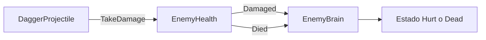
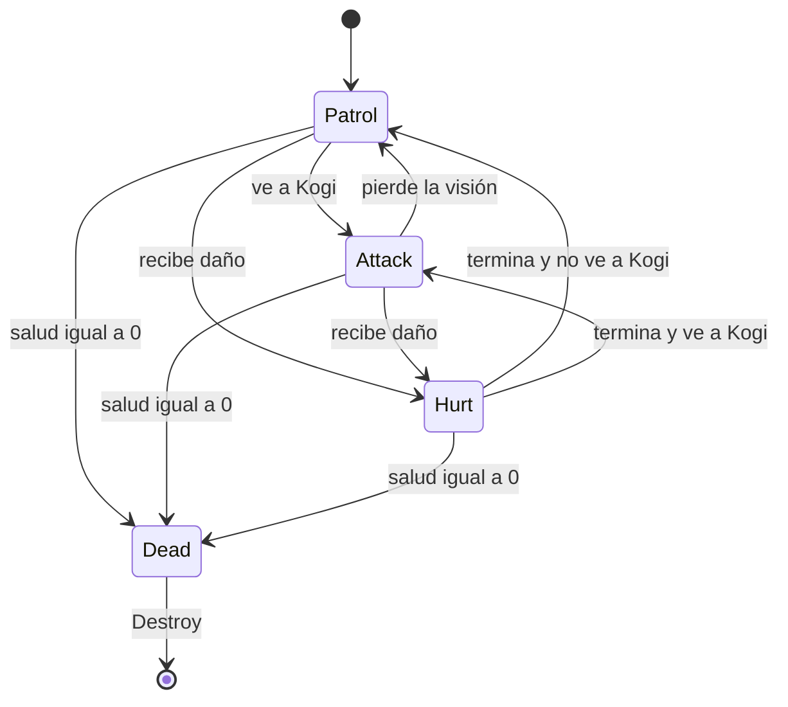

# Sesión 19: integrar daño y muerte en los estados del guardia 💥

Duración aproximada: **90–110 minutos**.

## 🎯 Objetivo

Al terminar, recibir daño y morir serán decisiones coordinadas con la máquina de estados:

- Una daga cambia temporalmente al guardia a `Hurt`.
- Durante `Hurt`, el guardia no patrulla ni dispara.
- Al quedarse sin salud cambia a `Dead`.
- Durante `Dead`, deja de moverse, disparar y colisionar.
- Después de una espera breve, desaparece de la escena.

También aprenderemos a comunicar componentes mediante eventos de C#, evitando que `EnemyHealth` conozca directamente a `EnemyBrain`.

## 1. Comprobar el punto de partida

1. Abre `NivelDesierto`.
2. Pulsa ▶️.
3. Acércate a un guardia.
4. Lánzale tres dagas con `Q`.
5. Comprueba que desaparece inmediatamente con el tercer impacto.
6. Detén ▶️.

Actualmente `EnemyHealth` desactiva el `GameObject` por su cuenta. Funciona, pero no permite que el resto del enemigo reaccione de forma ordenada.

> 💡 **Qué acabas de identificar:** el componente que administra la salud debe anunciar lo ocurrido; el cerebro debe decidir cómo responde el guardia.

## 2. Comprender la comunicación mediante eventos

Aplicaremos este flujo:



`EnemyHealth` publicará dos eventos:

- `Damaged`: el guardia recibió daño y conserva salud.
- `Died`: la salud llegó a cero.

`EnemyBrain` se suscribirá para reaccionar. Ninguno necesitará buscar al otro en cada impacto.

> 💡 **Qué acabas de aprender:** un evento permite anunciar que algo sucedió sin obligar al emisor a conocer quién reaccionará.

## 3. Modificar EnemyHealth

1. En **Project**, abre `Assets > Kogi > Scripts > Combat`.
2. Abre `EnemyHealth.cs` en Rider.
3. Reemplaza todo su contenido por:

```csharp
using System;
using UnityEngine;

namespace Kogi.Scripts.Combat
{
    public sealed class EnemyHealth : MonoBehaviour
    {
        public event Action Damaged;
        public event Action Died;

        public int CurrentHealth { get; private set; }

        [SerializeField, Min(1)]
        private int maximumHealth = 3;

        private void Awake()
        {
            CurrentHealth = maximumHealth;
        }

        public void TakeDamage(int damage)
        {
            if (CurrentHealth == 0)
            {
                return;
            }

            CurrentHealth = Mathf.Max(0, CurrentHealth - damage);
            Debug.Log($"Salud de {name}: {CurrentHealth}");

            if (CurrentHealth == 0)
            {
                Died?.Invoke();
                return;
            }

            Damaged?.Invoke();
        }
    }
}
```

4. Guarda con `Ctrl + S`.

### ¿Qué cambió?

`EnemyHealth` ya no ejecuta:

```csharp
gameObject.SetActive(false);
```

Ahora publica un evento. El operador `?.` solo ejecuta `Invoke` cuando existe algún suscriptor.

La propiedad `CurrentHealth` puede leerse desde fuera, pero solo modificarse dentro de `EnemyHealth`.

> 💡 **Qué acabas de aprender:** la salud representa datos y reglas de salud; no debería decidir por sí sola cómo se mueve o desaparece un enemigo.

## 4. Añadir Hurt y Dead a EnemyBrain

1. Abre `Assets > Kogi > Scripts > Enemies > EnemyBrain.cs`.
2. Añade esta instrucción al comienzo:

```csharp
using Kogi.Scripts.Combat;
```

3. Añade la dependencia de salud encima de la clase:

```csharp
[RequireComponent(typeof(EnemyHealth))]
```

4. Amplía `EnemyState`:

```csharp
private enum EnemyState
{
    Patrol,
    Attack,
    Hurt,
    Dead
}
```

5. Añade estos campos después de los componentes existentes:

```csharp
private EnemyHealth health;
private Rigidbody2D body;
private Collider2D bodyCollider;

[SerializeField, Min(0f)]
private float hurtDuration = 0.25f;

[SerializeField, Min(0f)]
private float deathDelay = 0.5f;

private float remainingHurtTime;
```

6. Añade estas asignaciones dentro de `Awake`:

```csharp
health = GetComponent<EnemyHealth>();
body = GetComponent<Rigidbody2D>();
bodyCollider = GetComponent<Collider2D>();
```

> 💡 **Qué acabas de aprender:** `Hurt` representa una interrupción temporal; `Dead` representa un estado terminal del que el guardia no regresa.

## 5. Suscribirse y cancelar la suscripción

1. Debajo de `Awake`, añade:

```csharp
private void OnEnable()
{
    health.Damaged += HandleDamaged;
    health.Died += HandleDied;
}

private void OnDisable()
{
    health.Damaged -= HandleDamaged;
    health.Died -= HandleDied;
}
```

`+=` registra la reacción y `-=` la elimina cuando el componente deja de estar activo.

Cancelar la suscripción evita referencias antiguas y reacciones duplicadas si el objeto se vuelve a activar.

> 💡 **Qué acabas de aprender:** toda suscripción asociada al ciclo de vida de un componente debe tener una cancelación equivalente.

## 6. Dar prioridad a Hurt y Dead

1. Reemplaza `Update` por:

```csharp
private void Update()
{
    if (currentState == EnemyState.Dead)
    {
        return;
    }

    if (remainingHurtTime > 0f)
    {
        remainingHurtTime -= Time.deltaTime;
        ChangeState(EnemyState.Hurt);
        return;
    }

    EnemyState nextState = vision.CanSeeTarget
        ? EnemyState.Attack
        : EnemyState.Patrol;

    ChangeState(nextState);
}
```

El orden importa:

1. `Dead` tiene prioridad absoluta.
2. `Hurt` interrumpe temporalmente otras acciones.
3. Solo después se decide entre `Attack` y `Patrol`.

## 7. Reaccionar al daño y a la muerte

1. Añade estos métodos antes de `ChangeState`:

```csharp
private void HandleDamaged()
{
    remainingHurtTime = hurtDuration;
    ChangeState(EnemyState.Hurt);
}

private void HandleDied()
{
    ChangeState(EnemyState.Dead);
    body.linearVelocity = Vector2.zero;
    body.simulated = false;
    bodyCollider.enabled = false;
    Destroy(gameObject, deathDelay);
}
```

2. Guarda con `Ctrl + S`.
3. Regresa a Unity y espera a que compile.
4. Comprueba que **Console** no muestre errores rojos.

Al morir desactivamos la simulación física y el `Collider2D` antes de destruir el objeto. Así no puede seguir chocando o dañando a Kogi durante `deathDelay`.

> 💡 **Qué acabas de aprender:** `Destroy` puede retrasarse; por eso el estado `Dead` debe neutralizar inmediatamente los comportamientos y la física.

## 8. Verificar la configuración del Prefab

1. En **Project**, abre `Assets > Kogi > Prefabs > Enemies`.
2. Haz doble clic en `GuardiaBasico`.
3. Selecciona la raíz del `Prefab`.
4. Busca **Enemy Brain** en **Inspector**.
5. Configura:

| Campo | Valor |
|---|---:|
| Hurt Duration | `0.25` |
| Death Delay | `0.5` |

6. Comprueba que la raíz también contiene `Enemy Health`, `Rigidbody 2D` y `Capsule Collider 2D`.
7. Guarda con `Ctrl + S`.
8. Sal de **Prefab Mode**.

## 9. Probar el estado Hurt

1. Pulsa ▶️.
2. Acércate al guardia derecho.
3. Lanza una sola daga con `Q`.
4. Comprueba en **Console** esta secuencia aproximada:

```text
Salud de GuardiaBasico: 2
GuardiaBasico cambia a Hurt
GuardiaBasico cambia a Attack
```

Si Kogi deja de estar visible, el último estado será `Patrol` en lugar de `Attack`.

Durante los `0.25` segundos de `Hurt`, patrulla y disparo permanecen desactivados.

## 10. Probar el estado Dead

1. Lanza dos dagas adicionales al mismo guardia.
2. Comprueba que la salud llega a `0`.
3. Comprueba que aparece el cambio a `Dead`.
4. Verifica que deja de moverse y disparar inmediatamente.
5. Comprueba que desaparece después de aproximadamente `0.5` segundos.
6. Detén ▶️.



## 11. Responsabilidad final de cada componente

| Componente | Responsabilidad |
|---|---|
| `DaggerProjectile` | Comunicar el daño causado |
| `EnemyHealth` | Administrar la salud y publicar eventos |
| `EnemyVision` | Determinar si Kogi es visible |
| `EnemyBrain` | Elegir el estado y coordinar acciones |
| `EnemyPatrol` | Ejecutar la patrulla |
| `EnemyShooter` | Ejecutar los disparos |

`EnemyHealth` no referencia a `EnemyBrain`, pero ambos colaboran mediante eventos. Esto reduce el acoplamiento entre componentes.

## ✅ Comprobación final

La sesión estará terminada cuando:

- [ ] `EnemyHealth` publica `Damaged` y `Died`.
- [ ] `EnemyHealth` ya no desactiva directamente el `GameObject`.
- [ ] `EnemyBrain` contiene `Patrol`, `Attack`, `Hurt` y `Dead`.
- [ ] `EnemyBrain` se suscribe y cancela su suscripción a los eventos.
- [ ] Una daga cambia temporalmente al guardia a `Hurt`.
- [ ] Durante `Hurt`, el guardia no patrulla ni dispara.
- [ ] La tercera daga cambia al guardia a `Dead`.
- [ ] Durante `Dead`, la física y el `Collider2D` quedan desactivados.
- [ ] El guardia desaparece después de `0.5` segundos.
- [ ] Los dos guardias conservan sus posiciones iniciales documentadas.
- [ ] **Console** no muestra errores rojos.

## 🧰 Problemas frecuentes

- **El guardia no reacciona al daño:** comprueba que `EnemyBrain` se suscriba a `health.Damaged` y `health.Died`.
- **Desaparece inmediatamente:** elimina `gameObject.SetActive(false)` de `EnemyHealth`.
- **Continúa disparando durante Hurt:** confirma que `ChangeState` desactive `EnemyShooter` para todos los estados excepto `Attack`.
- **Continúa caminando durante Hurt:** confirma que `EnemyPatrol` solo esté activo durante `Patrol`.
- **Puede dañar a Kogi después de morir:** revisa que `bodyCollider.enabled` cambie a `false`.
- **NullReferenceException en OnEnable:** confirma que `health = GetComponent<EnemyHealth>()` esté dentro de `Awake`.
- **No aparecen mensajes de estados:** revisa que `Debug.Log` siga dentro de `ChangeState`.

---

[⬅️ Sesión anterior](18-estados-del-guardia.md) · [🏠 Inicio](../../README.md)
