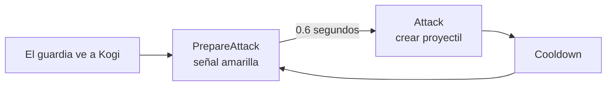
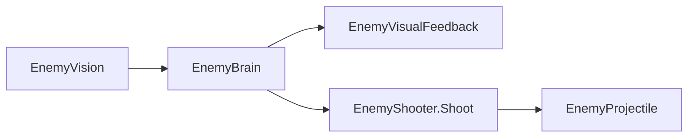
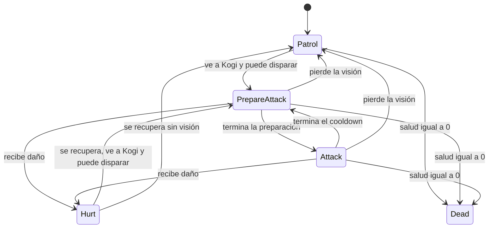

# Sesión 20: avisar antes de que el guardia dispare ⚠️

Duración aproximada: **90–110 minutos**.

## 🎯 Objetivo

Al terminar, el guardia no disparará inmediatamente después de ver a Kogi:

1. Se detendrá.
2. Cambiará temporalmente a amarillo.
3. Esperará `0.6` segundos.
4. Disparará.
5. Respetará su tiempo de recarga antes de preparar otro disparo.

Aprenderemos qué es la anticipación de un ataque, añadiremos el estado `PrepareAttack` y separaremos la presentación visual de la lógica del enemigo.

## 1. Comprender por qué debemos avisar

Un ataque puede ser técnicamente correcto y aun así sentirse injusto. Si el disparo aparece sin aviso, el jugador solo puede reaccionar después de recibirlo.

Una señal previa se conoce como **telegraph** o anticipación del ataque. Puede ser una postura, un sonido, una luz o una animación.



> 💡 **Qué acabas de aprender:** el tiempo de reacción forma parte del diseño del combate, no es solamente un detalle visual.

## 2. Separar decisión, acción y presentación

La responsabilidad quedará distribuida así:

- `EnemyBrain`: decide cuándo preparar y ordenar el disparo.
- `EnemyShooter`: comprueba su recarga y crea el proyectil.
- `EnemyVisualFeedback`: muestra el estado mediante colores provisionales.

`EnemyShooter` dejará de decidir por sí mismo observando a Kogi. Recibirá una orden explícita de `EnemyBrain`.



> 💡 **Qué acabas de aprender:** una acción reutilizable resulta más sencilla cuando recibe una orden y no contiene también toda la decisión de juego.

## 3. Crear EnemyVisualFeedback

1. En **Project**, abre `Assets > Kogi > Scripts > Enemies`.
2. Crea un **MonoBehaviour Script** llamado `EnemyVisualFeedback`.
3. Ábrelo en Rider.
4. Reemplaza todo su contenido por:

```csharp
using UnityEngine;

namespace Kogi.Scripts.Enemies
{
    [RequireComponent(typeof(SpriteRenderer))]
    public sealed class EnemyVisualFeedback : MonoBehaviour
    {
        [SerializeField]
        private Color attackPreparationColor = Color.yellow;

        [SerializeField]
        private Color hurtColor = Color.white;

        [SerializeField]
        private Color deadColor = Color.gray;

        private SpriteRenderer characterRenderer;
        private Color normalColor;

        private void Awake()
        {
            characterRenderer = GetComponent<SpriteRenderer>();
            normalColor = characterRenderer.color;
        }

        public void ShowNormal()
        {
            characterRenderer.color = normalColor;
        }

        public void ShowAttackPreparation()
        {
            characterRenderer.color = attackPreparationColor;
        }

        public void ShowHurt()
        {
            characterRenderer.color = hurtColor;
        }

        public void ShowDead()
        {
            characterRenderer.color = deadColor;
        }
    }
}
```

5. Guarda con `Ctrl + S`.

Los colores son provisionales. Más adelante estos métodos podrán activar animaciones, partículas o materiales sin cambiar las decisiones de `EnemyBrain`.

> 💡 **Qué acabas de aprender:** encapsular la presentación permite sustituir una señal provisional por arte definitivo sin reescribir la máquina de estados.

## 4. Convertir EnemyShooter en una acción

1. Abre `EnemyShooter.cs`.
2. Elimina esta línea situada encima de la clase:

```csharp
[RequireComponent(typeof(EnemyVision))]
```

3. Elimina el campo:

```csharp
private EnemyVision vision;
```

4. Elimina por completo `Awake` y `Update`.
5. Sustituye el campo `remainingCooldown` por:

```csharp
private float nextShotTime;
```

6. Añade esta propiedad justo después:

```csharp
public bool IsReady => Time.time >= nextShotTime;
```

7. Cambia el método `Shoot` para que sea público y controle su propia recarga:

```csharp
public void Shoot(Vector2 direction)
{
    if (!IsReady)
    {
        return;
    }

    Vector3 firePointPosition = firePoint.localPosition;
    firePointPosition.x = Mathf.Abs(firePointPosition.x)
        * Mathf.Sign(direction.x);
    firePoint.localPosition = firePointPosition;

    EnemyProjectile projectile = Instantiate(
        projectilePrefab,
        firePoint.position,
        Quaternion.identity);

    projectile.Launch(direction, gameObject);
    nextShotTime = Time.time + shotCooldown;
}
```

8. Guarda con `Ctrl + S`.

### ¿Por qué usamos un momento futuro?

`nextShotTime` almacena el instante a partir del cual se permite el próximo disparo:

```text
momento actual + cooldown = próximo momento permitido
```

La propiedad `IsReady` compara ese instante con `Time.time`.

> 💡 **Qué acabas de aprender:** un tiempo absoluto evita mantener un contador en `Update` cuando el componente solo necesita saber si ya llegó un momento.

## 5. Añadir PrepareAttack a EnemyBrain

1. Abre `EnemyBrain.cs`.
2. Añade la dependencia:

```csharp
[RequireComponent(typeof(EnemyVisualFeedback))]
```

3. Añade `PrepareAttack` al `enum`:

```csharp
private enum EnemyState
{
    Patrol,
    PrepareAttack,
    Attack,
    Hurt,
    Dead
}
```

4. Añade estos campos:

```csharp
private EnemyVisualFeedback visualFeedback;

[SerializeField, Min(0f)]
private float attackPreparationDuration = 0.6f;

private float remainingAttackPreparation;
```

5. Dentro de `Awake`, añade:

```csharp
visualFeedback = GetComponent<EnemyVisualFeedback>();
```

## 6. Controlar la preparación en Update

1. Reemplaza `Update` por:

```csharp
private void Update()
{
    if (currentState == EnemyState.Dead)
    {
        return;
    }

    if (remainingHurtTime > 0f)
    {
        remainingHurtTime -= Time.deltaTime;
        ChangeState(EnemyState.Hurt);
        return;
    }

    if (!vision.CanSeeTarget)
    {
        ChangeState(EnemyState.Patrol);
        return;
    }

    if (currentState == EnemyState.PrepareAttack)
    {
        remainingAttackPreparation -= Time.deltaTime;

        if (remainingAttackPreparation <= 0f)
        {
            shooter.Shoot(vision.DirectionToTarget);
            ChangeState(EnemyState.Attack);
        }

        return;
    }

    if (shooter.IsReady)
    {
        remainingAttackPreparation = attackPreparationDuration;
        ChangeState(EnemyState.PrepareAttack);
        return;
    }

    ChangeState(EnemyState.Attack);
}
```

Si el guardia pierde de vista a Kogi mientras prepara el ataque, vuelve a `Patrol` y no dispara.

> 💡 **Qué acabas de aprender:** las condiciones se ordenan por prioridad para que muerte, daño y pérdida de visión puedan interrumpir una preparación.

## 7. Mostrar cada estado

1. En `ChangeState`, elimina esta línea:

```csharp
shooter.enabled = currentState == EnemyState.Attack;
```

`EnemyShooter` permanecerá activo, pero solo disparará cuando `EnemyBrain` llame a `Shoot`.

2. Después de configurar `patrol.enabled`, añade:

```csharp
switch (currentState)
{
    case EnemyState.PrepareAttack:
        visualFeedback.ShowAttackPreparation();
        break;
    case EnemyState.Hurt:
        visualFeedback.ShowHurt();
        break;
    case EnemyState.Dead:
        visualFeedback.ShowDead();
        break;
    default:
        visualFeedback.ShowNormal();
        break;
}
```

3. Al comienzo de `HandleDamaged`, añade:

```csharp
remainingAttackPreparation = 0f;
```

4. Al comienzo de `HandleDied`, añade la misma línea.
5. Guarda con `Ctrl + S`.
6. Regresa a Unity y espera a que compile.
7. Comprueba que **Console** no muestre errores rojos.

## 8. Configurar el Prefab

1. Abre `Assets > Kogi > Prefabs > Enemies > GuardiaBasico`.
2. Selecciona la raíz en **Prefab Mode**.
3. Añade el componente `Enemy Visual Feedback`.
4. En **Enemy Brain**, configura:

| Campo | Valor |
|---|---:|
| Attack Preparation Duration | `0.6` |
| Hurt Duration | `0.25` |
| Death Delay | `0.5` |

5. En **Enemy Visual Feedback**, conserva:

| Campo | Color |
|---|---|
| Attack Preparation Color | Amarillo |
| Hurt Color | Blanco |
| Dead Color | Gris |

6. Guarda con `Ctrl + S`.
7. Sal de **Prefab Mode**.

## 9. Probar la anticipación

1. Pulsa ▶️.
2. Comprueba que los guardias comienzan lejos y no atacan.
3. Avanza hacia el guardia derecho.
4. Al entrar en su visión, comprueba esta secuencia:
   - El guardia se detiene.
   - Se vuelve amarillo.
   - Espera aproximadamente `0.6` segundos.
   - Dispara.
   - Recupera su color normal.
5. Comprueba que vuelve a mostrar la señal antes de cada nuevo disparo.
6. Aléjate o coloca una plataforma entre ambos durante la preparación.
7. Comprueba que cancela el ataque y regresa a `Patrol`.

## 10. Probar interrupciones

1. Espera a que el guardia se vuelva amarillo.
2. Golpéalo con una daga durante la preparación.
3. Comprueba que cambia a `Hurt` y no dispara.
4. Cuando termine `Hurt`, debe volver a decidir según su visión y recarga.
5. Derrótalo con las dagas restantes.
6. Comprueba que `Dead` interrumpe definitivamente cualquier preparación.
7. Detén ▶️.



## ✅ Comprobación final

- [ ] Existe `EnemyVisualFeedback.cs`.
- [ ] `EnemyShooter` expone `IsReady` y `Shoot`.
- [ ] `EnemyBrain` contiene `PrepareAttack`.
- [ ] El `Prefab` contiene `Enemy Visual Feedback`.
- [ ] La preparación dura `0.6` segundos.
- [ ] El guardia se vuelve amarillo antes de disparar.
- [ ] No patrulla durante la preparación.
- [ ] Perder la visión cancela el ataque.
- [ ] Recibir daño cancela el ataque.
- [ ] Cada disparo nuevo tiene su propia anticipación.
- [ ] Los guardias mantienen sus posiciones documentadas.
- [ ] **Console** no muestra errores rojos.

## 🧰 Problemas frecuentes

- **Dispara inmediatamente:** confirma que `EnemyBrain` llame a `Shoot` solo cuando finaliza `remainingAttackPreparation`.
- **Permanece amarillo:** revisa que `Attack` y `Patrol` ejecuten `ShowNormal` mediante el caso `default`.
- **Sigue patrullando mientras prepara:** `patrol.enabled` debe ser verdadero únicamente durante `Patrol`.
- **No vuelve a disparar:** confirma que `Shoot` actualice `nextShotTime` después de crear el proyectil.
- **Dispara aunque pierda la visión:** la comprobación `!vision.CanSeeTarget` debe aparecer antes del bloque `PrepareAttack`.
- **No cambia de color:** añade `Enemy Visual Feedback` a la raíz del `Prefab`, donde está `Sprite Renderer`.
- **NullReferenceException en visualFeedback:** comprueba que la asignación con `GetComponent` esté dentro de `Awake`.

---

[⬅️ Sesión anterior](19-dano-y-muerte-del-guardia.md) · [🏠 Inicio](../../README.md)
