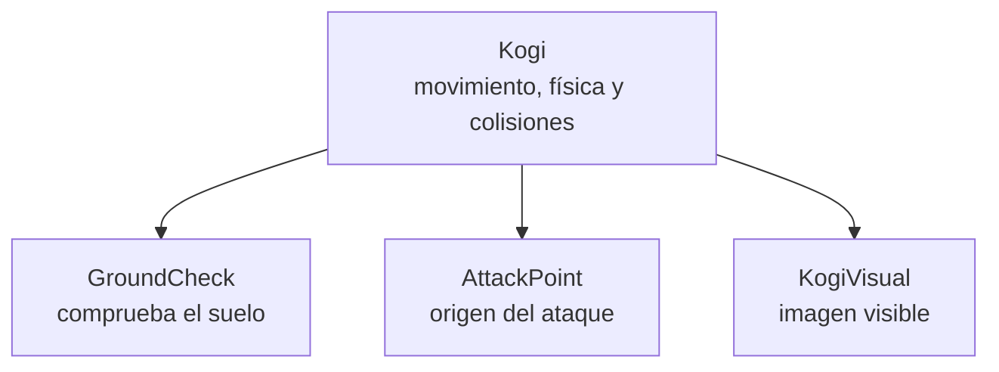
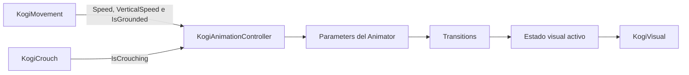
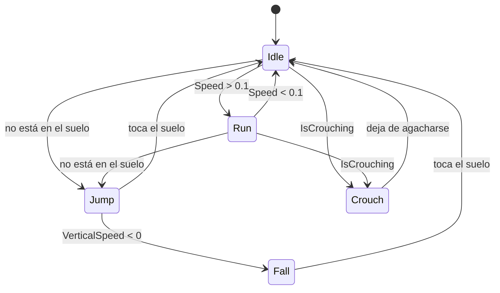

# Sesión 21: conectar las acciones de Kogi con Animator 🎭

Duración aproximada: **90–120 minutos**.

## 🎯 Objetivo

Al terminar, Unity reconocerá cinco estados visuales de Kogi:

- `Idle`: está quieto.
- `Run`: camina.
- `Jump`: asciende durante un salto.
- `Fall`: está cayendo.
- `Crouch`: está agachado.

Todavía usamos un rectángulo, por eso cada estado tendrá un color provisional. Más adelante sustituiremos esos colores por animaciones dibujadas sin cambiar la física ni los controles.

## 1. Separar jugabilidad y representación visual

En **Hierarchy**, Kogi ya tiene esta organización:



El objeto raíz `Kogi` conserva `Rigidbody2D`, `CapsuleCollider2D` y los scripts. El hijo `KogiVisual` es lo único que debe cambiar de apariencia.

> 💡 **Qué acabas de aprender:** el aspecto del personaje puede cambiar sin alterar su cuerpo físico ni las reglas del juego.

## 2. Entender Animator

Un componente `Animator` reproduce un `Animator Controller`. Este recurso contiene:

- **States**: situaciones visuales como `Idle` o `Jump`.
- **Parameters**: datos que el código entrega al Animator.
- **Transitions**: reglas para cambiar de un estado a otro.
- **Animation Clips**: aquello que se modifica visualmente en cada estado.



El `Animator` no mueve al personaje por el escenario. Solo representa lo que la jugabilidad ya está haciendo.

> 💡 **Qué acabas de aprender:** el código gobierna la jugabilidad; el Animator traduce su estado a una presentación visual.

## 3. Exponer el estado de movimiento

1. En **Project**, abre `Assets > Kogi > Scripts > Player`.
2. Abre `KogiMovement` en Rider.
3. Después de sus variables privadas, añade:

```csharp
public float HorizontalSpeed => Mathf.Abs(body.linearVelocity.x);

public float VerticalSpeed => body.linearVelocity.y;

public bool IsGrounded { get; private set; }
```

Estas propiedades son de solo lectura para los demás componentes:

- `HorizontalSpeed` indica la rapidez horizontal sin importar la dirección.
- `VerticalSpeed` es positiva al subir y negativa al caer.
- `IsGrounded` indica si Kogi toca una superficie del `Ground Layer`.

4. Al principio de `FixedUpdate`, guarda la comprobación:

```csharp
IsGrounded = CheckIsGrounded();
```

5. Usa `IsGrounded` en la condición del salto.
6. Renombra el antiguo método privado `IsGrounded()` como `CheckIsGrounded()`.

> 💡 **Qué acabas de aprender:** una propiedad pública de solo lectura permite consultar un dato sin permitir que otro componente lo modifique libremente.

## 4. Exponer el estado de agachado

1. Abre `KogiCrouch`.
2. Añade esta propiedad después de sus variables privadas:

```csharp
public bool IsCrouching { get; private set; }
```

3. Como primera línea de `SetCrouching`, asigna:

```csharp
IsCrouching = isCrouching;
```

Ahora el componente sigue siendo el dueño del agachado, pero otros componentes pueden consultarlo.

> 💡 **Qué acabas de aprender:** cada componente conserva una responsabilidad y expone solamente la información que otros necesitan.

## 5. Crear KogiAnimationController

1. En `Assets > Kogi > Scripts > Player`, crea un **MonoBehaviour Script** llamado `KogiAnimationController`.
2. Reemplaza todo su contenido por:

```csharp
using UnityEngine;

namespace Kogi.Scripts.Player
{
    [RequireComponent(typeof(Animator))]
    [RequireComponent(typeof(KogiMovement))]
    [RequireComponent(typeof(KogiCrouch))]
    public sealed class KogiAnimationController : MonoBehaviour
    {
        private static readonly int SpeedParameter = Animator.StringToHash("Speed");
        private static readonly int VerticalSpeedParameter = Animator.StringToHash("VerticalSpeed");
        private static readonly int IsGroundedParameter = Animator.StringToHash("IsGrounded");
        private static readonly int IsCrouchingParameter = Animator.StringToHash("IsCrouching");

        private Animator animator;
        private KogiMovement movement;
        private KogiCrouch crouch;

        private void Awake()
        {
            animator = GetComponent<Animator>();
            movement = GetComponent<KogiMovement>();
            crouch = GetComponent<KogiCrouch>();
        }

        private void Update()
        {
            animator.SetFloat(SpeedParameter, movement.HorizontalSpeed);
            animator.SetFloat(VerticalSpeedParameter, movement.VerticalSpeed);
            animator.SetBool(IsGroundedParameter, movement.IsGrounded);
            animator.SetBool(IsCrouchingParameter, crouch.IsCrouching);
        }
    }
}
```

`Animator.StringToHash` calcula una vez el identificador de cada nombre. Así evitamos repetir búsquedas de texto en cada fotograma.

`Update` es apropiado aquí porque sincroniza la presentación visual cada fotograma. El movimiento físico continúa en `FixedUpdate`.

> 💡 **Qué acabas de aprender:** `KogiAnimationController` funciona como adaptador entre los componentes de jugabilidad y el sistema visual de Unity.

## 6. Crear las carpetas y los clips provisionales

1. En **Project**, abre `Assets > Kogi`.
2. Crea la carpeta `Animations`.
3. Dentro, crea `Provisional`.
4. En `Provisional`, crea cinco **Animation Clips**:

| Clip | Color provisional | Significado |
| --- | --- | --- |
| `KogiIdle` | Blanco | Quieto |
| `KogiRun` | Azul claro | En movimiento |
| `KogiJump` | Amarillo | Subiendo |
| `KogiFall` | Violeta claro | Cayendo |
| `KogiCrouch` | Verde claro | Agachado |

Cada clip modifica únicamente `KogiVisual > Sprite Renderer > Color`. No animes el `Transform` de la raíz `Kogi`.

> 💡 **Qué acabas de aprender:** un clip puede modificar propiedades de un objeto; aquí usamos colores para observar los estados antes de tener dibujos definitivos.

## 7. Crear el Animator Controller

1. En `Assets > Kogi > Animations`, haz clic derecho en un espacio vacío.
2. Elige **Create > Animator Controller**.
3. Llámalo `Kogi`.
4. Haz doble clic sobre el recurso para abrir la ventana **Animator**.
5. Arrastra los cinco clips dentro de la cuadrícula.
6. Comprueba que `Idle` sea el estado naranja inicial.

En la pestaña **Parameters**, crea exactamente:

| Nombre | Tipo |
| --- | --- |
| `Speed` | `Float` |
| `VerticalSpeed` | `Float` |
| `IsGrounded` | `Bool` |
| `IsCrouching` | `Bool` |

Los nombres distinguen mayúsculas y minúsculas y deben coincidir con el código.

> 💡 **Qué acabas de aprender:** los parámetros forman el contrato entre C# y el Animator Controller.

## 8. Configurar las transiciones

Para cada transición:

1. Haz clic derecho sobre el estado de origen.
2. Selecciona **Make Transition**.
3. Pulsa el estado de destino.
4. Selecciona la flecha creada.
5. Desmarca **Has Exit Time**.
6. Usa una duración corta, por ejemplo `0.05`.
7. Añade la condición indicada.

| Origen | Destino | Condición |
| --- | --- | --- |
| `Idle` | `Run` | `Speed` mayor que `0.1` |
| `Run` | `Idle` | `Speed` menor que `0.1` |
| `Idle` | `Jump` | `IsGrounded` falso |
| `Run` | `Jump` | `IsGrounded` falso |
| `Jump` | `Fall` | `VerticalSpeed` menor que `0` |
| `Jump` | `Idle` | `IsGrounded` verdadero |
| `Fall` | `Idle` | `IsGrounded` verdadero |
| `Idle` | `Crouch` | `IsCrouching` verdadero |
| `Run` | `Crouch` | `IsCrouching` verdadero |
| `Crouch` | `Idle` | `IsCrouching` falso |



> 💡 **Qué acabas de aprender:** una transición describe cuándo cambia la presentación; no ejecuta la mecánica que causó el cambio.

## 9. Conectar el Animator a Kogi

1. En **Hierarchy**, selecciona el objeto raíz `Kogi`, no `KogiVisual`.
2. En **Inspector**, pulsa **Add Component**.
3. Añade `Animator`.
4. Arrastra `Assets > Kogi > Animations > Kogi` al campo **Controller**.
5. Pulsa otra vez **Add Component**.
6. Añade `KogiAnimationController`.
7. Guarda la escena mediante el menú superior **File > Save** o `Ctrl + S`.

`KogiAnimationController` no presenta campos para arrastrar: obtiene los componentes requeridos del mismo GameObject mediante `GetComponent`.

> 💡 **Qué acabas de aprender:** el componente `Animator` ejecuta el recurso; nuestro script alimenta sus parámetros.

## 10. Probar los estados

1. Abre `NivelDesierto`.
2. Pulsa ▶️.
3. Comprueba los cambios provisionales:

| Acción | Estado esperado | Color esperado |
| --- | --- | --- |
| No pulsar nada | `Idle` | Blanco |
| Moverse | `Run` | Azul claro |
| Subir en un salto | `Jump` | Amarillo |
| Caer | `Fall` | Violeta claro |
| Mantener `C` | `Crouch` | Verde claro |

4. Con el juego ejecutándose, abre **Window > Animation > Animator**.
5. Selecciona `Kogi` en **Hierarchy**.
6. Observa cómo el estado activo se resalta mientras juegas.
7. Detén la ejecución.
8. Comprueba que **Console** no tenga errores rojos.

## ✅ Comprobación final

- [ ] Existe `Assets/Kogi/Animations/Kogi.controller`.
- [ ] Existen cinco clips dentro de `Animations/Provisional`.
- [ ] Kogi tiene `Animator` y `Kogi Animation Controller`.
- [ ] El Controller contiene los cuatro parámetros con el nombre exacto.
- [ ] `KogiMovement` expone velocidad y contacto con el suelo como solo lectura.
- [ ] `KogiCrouch` expone `IsCrouching` como solo lectura.
- [ ] El color provisional cambia al moverse, saltar, caer y agacharse.
- [ ] El movimiento, las colisiones y los ataques siguen funcionando.
- [ ] **Console** no muestra errores rojos.

## 🧰 Problemas frecuentes

- **Todos los estados permanecen grises:** entra en modo ▶️ y selecciona el objeto `Kogi` que contiene el Animator.
- **No cambia de `Idle`:** comprueba que el componente `Kogi Animation Controller` esté en la raíz `Kogi`.
- **Falta un parámetro:** revisa su tipo, mayúsculas y nombre exacto.
- **Kogi cambia de tamaño inesperadamente:** el clip está animando el `Transform`; elimina esas propiedades y conserva solo el color de `KogiVisual`.
- **El agachado dejó de funcionar:** no animes la escala ni la posición de `KogiVisual`, porque `KogiCrouch` ya las controla.
- **Missing Controller:** arrastra `Kogi.controller` al campo **Controller** del componente Animator.
- **Error rojo de compilación:** confirma que el archivo se llame `KogiAnimationController.cs` y la clase tenga el mismo nombre.

---

[⬅️ Sesión anterior](20-anticipacion-del-disparo.md) · [🏠 Inicio](../../README.md) · [Siguiente sesión ➡️](22-primer-sprite-de-kogi.md)
