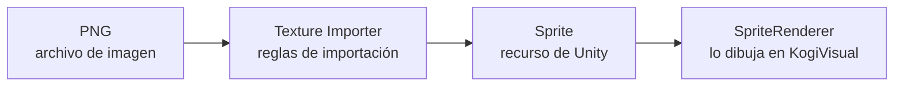
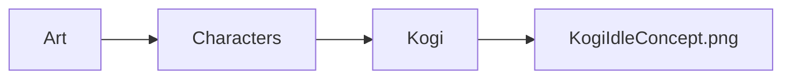
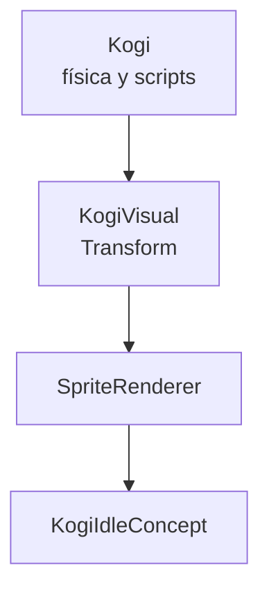
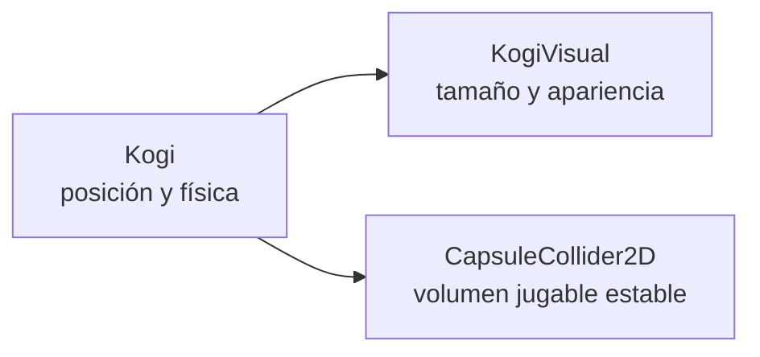
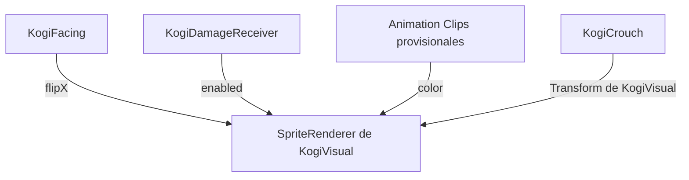

# Sesión 22: importar la primera identidad visual de Kogi 🧑‍🎨

Duración aproximada: **60–90 minutos**.

## 🎯 Objetivo

Sustituiremos el rectángulo blanco por la primera ilustración jugable de Kogi. Aprenderemos el recorrido completo de un recurso gráfico externo hasta convertirse en un `Sprite` visible en Unity.

Esta ilustración define una primera dirección visual, pero no es todavía el modelo definitivo ni una animación cuadro por cuadro.

## 1. Distinguir archivo, Sprite y representación en escena

El mismo personaje pasa por tres etapas diferentes:



- El `.png` contiene los píxeles y la transparencia.
- El `Texture Importer` indica cómo debe interpretar Unity el archivo.
- El `Sprite` es el recurso 2D resultante.
- El `SpriteRenderer` muestra ese recurso en la escena.

> 💡 **Qué acabas de aprender:** copiar una imagen dentro de `Assets` no basta; Unity la importa siguiendo una configuración y crea una representación utilizable por sus componentes.

## 2. Definir la primera identidad de Kogi

La imagen provisional conserva estas decisiones:

- Aventurero ágil de fantasía inspirada en el desierto.
- Vestimenta azul oscuro, arena y bronce envejecido.
- Rostro parcialmente cubierto y ojos visibles.
- Lazo mágico enrollado con un pequeño brillo cian.
- Dagas como armas secundarias.
- Silueta completa y legible de perfil hacia la derecha.
- Acabado ilustrado con contornos oscuros.

La imagen fue generada mediante la skill `imagegen`, utilizando las referencias visuales del proyecto solo como guía de ambiente, vestuario y silueta. Después se corrigió el fondo para obtener transparencia real.

> 💡 **Qué acabas de aprender:** antes de producir animaciones conviene fijar una dirección visual repetible: silueta, paleta, accesorios y personalidad.

## 3. Guardar el recurso en una estructura clara

La imagen se guarda en:

```text
Assets/Kogi/Art/Characters/Kogi/KogiIdleConcept.png
```

La carpeta describe de lo general a lo particular:



No guardamos arte propio dentro de `Scripts`, `Scenes` ni `Settings`, porque cada carpeta representa una responsabilidad diferente.

> 💡 **Qué acabas de aprender:** una estructura estable facilita encontrar y reemplazar cientos de recursos cuando el proyecto crece.

## 4. Configurar la importación como Sprite

1. En **Project**, abre `Assets > Kogi > Art > Characters > Kogi`.
2. Selecciona `KogiIdleConcept`.
3. En **Inspector**, configura:

| Propiedad | Valor | Motivo |
| --- | --- | --- |
| `Texture Type` | `Sprite (2D and UI)` | Se utilizará en un juego 2D |
| `Sprite Mode` | `Single` | El archivo contiene una sola imagen |
| `Pixels Per Unit` | `600` | Convención inicial para el arte de Kogi |
| `Alpha Is Transparency` | Activado | Respeta el fondo transparente |
| `Generate Mip Maps` | Desactivado | No necesitamos versiones lejanas en esta escena 2D |
| `Filter Mode` | `Bilinear` | Suaviza el arte ilustrado al escalarlo |
| `Compression` | `High Quality` | Conserva mejor los detalles |

4. Pulsa **Apply** en la parte inferior del Inspector.

### ¿Qué significa Pixels Per Unit?

`Pixels Per Unit`, abreviado `PPU`, indica cuántos píxeles de la imagen representan una unidad del mundo de Unity.

```text
600 píxeles = 1 unidad de Unity
```

La imagen mide aproximadamente `1239 × 1269` píxeles. Con `600 PPU`, el Sprite ocupa cerca de `2.07 × 2.12` unidades antes de aplicar la escala del `Transform`.

Un PPU mayor hace que la imagen se vea más pequeña en el mundo; uno menor hace que se vea más grande. No elimina píxeles del archivo.

> 💡 **Qué acabas de aprender:** el PPU convierte medidas de imagen en medidas del mundo; no representa la resolución de la pantalla.

## 5. Asignar el Sprite a KogiVisual

1. Abre `NivelDesierto`.
2. En **Hierarchy**, despliega el objeto raíz `Kogi`.
3. Selecciona su hijo `KogiVisual`.
4. En **Inspector**, localiza el componente `Sprite Renderer`.
5. Arrastra `KogiIdleConcept` desde **Project** hasta el campo **Sprite**.
6. Comprueba que `Color` sea blanco para ver los colores originales cuando el estado es `Idle`.

No añadas otro `SpriteRenderer`: reutilizamos el que antes mostraba el cuadrado.



> 💡 **Qué acabas de aprender:** cambiar el recurso del campo `Sprite` sustituye la apariencia sin reemplazar el GameObject ni sus demás componentes.

## 6. Ajustar solo la representación visual

Con `KogiVisual` seleccionado, configura su `Transform`:

| Propiedad | X | Y | Z |
| --- | ---: | ---: | ---: |
| `Position` | `0` | `0` | `0` |
| `Scale` | `0.5` | `0.95` | `1` |

El tamaño visible aproximado queda en `1.03 × 2.01` unidades, equivalente al volumen provisional anterior.

No cambies la escala del objeto raíz `Kogi`. Tampoco adaptes el `CapsuleCollider2D` a cada parte suelta de la ropa: el collider representa el volumen jugable, no todo el contorno artístico.



> 💡 **Qué acabas de aprender:** el arte puede sobresalir ligeramente del collider; las colisiones deben sentirse justas y permanecer estables.

## 7. Comprobar que los sistemas anteriores siguen conectados

La nueva imagen continúa utilizando el mismo `SpriteRenderer`, por lo que conservamos:

- `KogiFacing` y su propiedad `flipX` para mirar a ambos lados.
- `KogiDamageReceiver` para parpadear durante la invulnerabilidad.
- `KogiCrouch` para reducir temporalmente `KogiVisual`.
- El `Animator` para aplicar los colores provisionales de sus estados.



Cada sistema modifica una propiedad diferente. Esto reduce interferencias entre ellos.

> 💡 **Qué acabas de aprender:** reemplazar el Sprite mantiene las referencias porque no eliminamos el componente que los demás scripts ya conocían.

## 8. Probar la primera identidad visual

1. Guarda la escena con `Ctrl + S`.
2. Pulsa ▶️.
3. Comprueba que Kogi aparezca con fondo transparente.
4. Muévete a la derecha y a la izquierda.
5. Confirma que la imagen se voltee según la dirección.
6. Salta y comprueba los colores provisionales de `Jump` y `Fall`.
7. Mantén `C` y comprueba que Kogi se agache y después recupere su tamaño.
8. Recibe daño y verifica el parpadeo de invulnerabilidad.
9. Ataca y lanza una daga para confirmar que las mecánicas siguen funcionando.
10. Detén la ejecución y revisa que **Console** no muestre errores rojos.

## 9. Qué es provisional y qué conservaremos

| Elemento | Estado actual | Futuro |
| --- | --- | --- |
| Diseño y paleta | Primera dirección visual | Podrán refinarse |
| Sprite | Una ilustración estática | Será sustituido por cuadros animados |
| Colores del Animator | Ayuda de diagnóstico | Se retirarán |
| Estados del Animator | Estructura válida | Se conservarán y ampliarán |
| Física y controles | Independientes del arte | Se conservarán |
| `KogiVisual` | Contenedor visual | Se conservará |

Esta separación permite iterar sobre el arte sin reconstruir el personaje jugable.

## ✅ Comprobación final

- [ ] Existe `Assets/Kogi/Art/Characters/Kogi/KogiIdleConcept.png`.
- [ ] El archivo está importado como `Sprite (2D and UI)` y `Single`.
- [ ] Usa `600 Pixels Per Unit` y transparencia real.
- [ ] `KogiVisual` conserva un solo `SpriteRenderer`.
- [ ] El campo `Sprite` contiene `KogiIdleConcept`.
- [ ] La escala de `KogiVisual` es `(0.5, 0.95, 1)`.
- [ ] Kogi mira en ambas direcciones.
- [ ] Movimiento, salto, caída, agachado, daño y ataques siguen funcionando.
- [ ] **Console** no muestra errores rojos.

## 🧰 Problemas frecuentes

- **Aparece una cuadrícula gris y blanca:** el patrón está dibujado en el PNG; no es transparencia real. Utiliza la versión corregida del recurso.
- **La imagen tiene un rectángulo negro o blanco:** activa `Alpha Is Transparency` y pulsa **Apply**.
- **Kogi se ve gigante o diminuto:** confirma `600` en `Pixels Per Unit` y la escala de `KogiVisual`.
- **No mira a la izquierda:** revisa que `KogiFacing > Character Renderer` siga apuntando al `SpriteRenderer` de `KogiVisual`.
- **Ya no cambia de color:** los clips provisionales deben seguir animando `KogiVisual > Sprite Renderer > Color`.
- **La física cambió:** restaura el `Transform` de la raíz `Kogi`; el ajuste pertenece únicamente a `KogiVisual`.
- **La imagen se deforma al agacharse:** es el comportamiento provisional de esta etapa; una animación de agachado dibujada lo sustituirá más adelante.

---

[⬅️ Sesión anterior](21-animator-de-kogi.md) · [🏠 Inicio](../../README.md)
