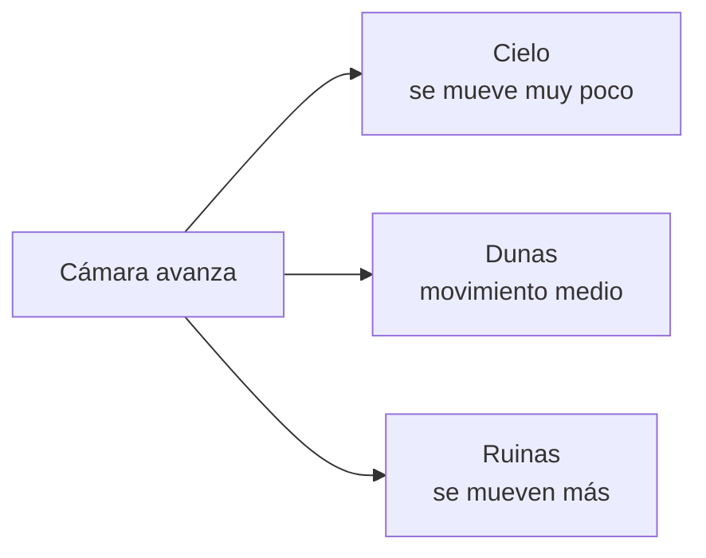
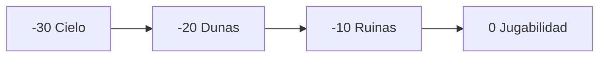
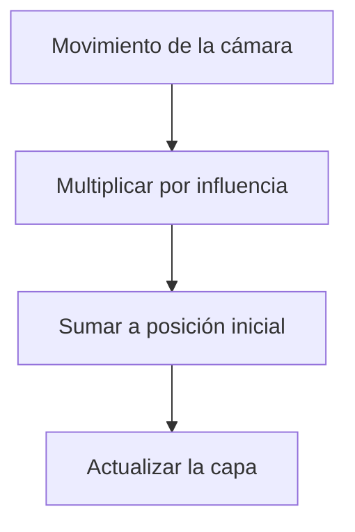

# Sesión 23: crear profundidad con un fondo parallax 🌙

Duración aproximada: **90–120 minutos**.

## 🎯 Objetivo

Transformaremos el fondo plano de `NivelDesierto` en un escenario nocturno compuesto por tres planos:

1. Cielo lejano.
2. Dunas a media distancia.
3. Ruinas cercanas.

Cada plano se moverá a una velocidad distinta cuando avance la cámara. Ese efecto se llama `parallax` y produce sensación de profundidad en una escena 2D.

## 1. Entender la profundidad sin utilizar 3D

Cuando avanzamos, los objetos cercanos parecen desplazarse rápidamente y los elementos lejanos apenas cambian de posición.



Las imágenes siguen siendo planas. La diferencia de velocidad engaña al ojo y construye profundidad.

> 💡 **Qué acabas de aprender:** `parallax` no convierte la escena en 3D; simula distancia mediante movimiento relativo.

## 2. Separar el escenario en recursos independientes

Los archivos utilizados son:

```text
Assets/Kogi/Art/Environment/Desert/
├── DesertSky.png
├── DistantDunes.png
└── AncientRuins.png
```

- `DesertSky` contiene el cielo, las estrellas, la luna y montañas muy lejanas.
- `DistantDunes` contiene únicamente dunas con transparencia alrededor.
- `AncientRuins` contiene columnas y muros con espacios transparentes.

Las tres imágenes fueron generadas mediante `imagegen`, siguiendo las referencias visuales del proyecto. Las dunas y las ruinas tienen transparencia real para poder superponerlas.

> 💡 **Qué acabas de aprender:** un fondo preparado por capas permite mover, colorear y reemplazar cada distancia de manera independiente.

## 3. Importar las imágenes como Sprite

1. En **Project**, abre `Assets > Kogi > Art > Environment > Desert`.
2. Selecciona cada imagen.
3. En **Inspector**, usa estos valores comunes:

| Propiedad | Valor |
| --- | --- |
| `Texture Type` | `Sprite (2D and UI)` |
| `Sprite Mode` | `Single` |
| `Alpha Is Transparency` | Activado |
| `Generate Mip Maps` | Desactivado |
| `Filter Mode` | `Bilinear` |
| `Compression` | `High Quality` |

4. Configura el tamaño:

| Recurso | `Pixels Per Unit` |
| --- | ---: |
| `DesertSky` | `65` |
| `DistantDunes` | `85` |
| `AncientRuins` | `85` |

5. Pulsa **Apply** después de modificar cada recurso.

El cielo usa un PPU menor para cubrir toda la cámara. Las dos capas anchas utilizan el mismo PPU para mantener una escala comparable.

> 💡 **Qué acabas de aprender:** la configuración de importación forma parte del recurso y no del GameObject que después lo muestra.

## 4. Comprender el orden de dibujo

Un `SpriteRenderer` ofrece dos controles relacionados:

- `Sorting Layer`: grupo general de dibujo.
- `Order in Layer`: orden numérico dentro del grupo.

En esta sesión todos permanecen en `Default`, pero usamos órdenes negativos:

| Objeto | `Order in Layer` |
| --- | ---: |
| `FarSky` | `-30` |
| `MiddleDunes` | `-20` |
| `NearRuins` | `-10` |
| Personajes y plataformas | `0` |

Unity dibuja primero los números menores. Por eso el cielo queda detrás de todo y la jugabilidad permanece delante.



> 💡 **Qué acabas de aprender:** la posición en la jerarquía no determina qué Sprite queda delante; esa responsabilidad pertenece al orden de dibujo.

## 5. Crear ParallaxLayer

1. En **Project**, abre `Assets > Kogi > Scripts > Environment`.
2. Crea un **MonoBehaviour Script** llamado `ParallaxLayer`.
3. Reemplaza su contenido por:

```csharp
using UnityEngine;

namespace Kogi.Scripts.Environment
{
    public sealed class ParallaxLayer : MonoBehaviour
    {
        [SerializeField]
        private Transform cameraTransform;

        [SerializeField, Range(0f, 1f)]
        private float horizontalInfluence;

        [SerializeField, Range(0f, 1f)]
        private float verticalInfluence;

        private Vector3 initialLayerPosition;
        private Vector3 initialCameraPosition;

        private void Awake()
        {
            initialLayerPosition = transform.position;
            initialCameraPosition = cameraTransform.position;
        }

        private void LateUpdate()
        {
            Vector3 cameraMovement = cameraTransform.position - initialCameraPosition;

            transform.position = initialLayerPosition + new Vector3(
                cameraMovement.x * horizontalInfluence,
                cameraMovement.y * verticalInfluence,
                0f);
        }
    }
}
```

### Qué hace el código

- `Awake` recuerda el punto de partida de la cámara y la capa.
- `LateUpdate` espera a que la cámara termine de actualizarse durante el fotograma.
- `cameraMovement` calcula cuánto se movió la cámara desde el inicio.
- Las influencias deciden qué parte de ese movimiento copia la capa.

Una influencia cercana a `1` acompaña casi por completo a la cámara y parece muy lejana. Una influencia menor permanece más fija en el mundo y cruza la pantalla más deprisa, por lo que parece cercana.

> 💡 **Qué acabas de aprender:** utilizamos `LateUpdate` porque el fondo depende de la posición que la cámara haya calculado ese mismo fotograma.

## 6. Construir la jerarquía del fondo

1. Abre `NivelDesierto`.
2. En **Hierarchy**, crea un GameObject vacío llamado `DesertBackground`.
3. Dentro crea tres GameObjects, en este orden:

```text
DesertBackground
├── FarSky
├── MiddleDunes
└── NearRuins
```

4. A cada hijo añade:

- Un componente `SpriteRenderer`.
- Un componente `ParallaxLayer`.

5. Asigna los sprites y valores:

| Objeto | Sprite | Position | Order | Influencia X | Influencia Y |
| --- | --- | --- | ---: | ---: | ---: |
| `FarSky` | `DesertSky` | `(1, 0, 0)` | `-30` | `0.95` | `0.95` |
| `MiddleDunes` | `DistantDunes` | `(1, -0.5, 0)` | `-20` | `0.65` | `0.75` |
| `NearRuins` | `AncientRuins` | `(1, -0.5, 0)` | `-10` | `0.35` | `0.50` |

6. En el campo `Camera Transform` de cada `ParallaxLayer`, arrastra `Main Camera` desde **Hierarchy**.
7. Guarda mediante el menú superior **File > Save** o `Ctrl + S`.

> 💡 **Qué acabas de aprender:** agrupamos elementos relacionados bajo una raíz para que la escena siga siendo legible sin convertir esa raíz en parte de la lógica.

## 7. Visualizar el cálculo

Si la cámara avanza cuatro unidades hacia la derecha:

| Capa | Cálculo horizontal | Se desplaza |
| --- | --- | ---: |
| Cielo | `4 × 0.95` | `3.8` unidades |
| Dunas | `4 × 0.65` | `2.6` unidades |
| Ruinas | `4 × 0.35` | `1.4` unidades |

Visto desde la cámara, el cielo cambia poco y las ruinas recorren más pantalla.



> 💡 **Qué acabas de aprender:** el valor no representa velocidad propia; representa cuánto movimiento hereda cada capa de la cámara.

## 8. Probar el efecto

1. Pulsa ▶️.
2. Avanza con Kogi hacia la derecha.
3. Observa una referencia del cielo, una duna y una columna.
4. Comprueba que las ruinas crucen la pantalla más deprisa que las dunas.
5. Comprueba que el cielo parezca casi inmóvil.
6. Salta y confirma que el movimiento vertical también conserva profundidad.
7. Verifica que fondo y ruinas no bloqueen a Kogi: no tienen colliders.
8. Comprueba que plataformas, guardias, proyectiles y Kogi permanezcan delante.
9. Detén la ejecución.
10. Revisa que **Console** no muestre errores rojos.

## ✅ Comprobación final

- [ ] Existen los tres PNG dentro de `Art/Environment/Desert`.
- [ ] Dunas y ruinas tienen transparencia real.
- [ ] Existe `ParallaxLayer.cs`.
- [ ] `DesertBackground` contiene tres hijos.
- [ ] Cada hijo tiene `SpriteRenderer` y `ParallaxLayer`.
- [ ] Cada capa apunta a `Main Camera`.
- [ ] Los órdenes son `-30`, `-20` y `-10`.
- [ ] Las influencias horizontales son `0.95`, `0.65` y `0.35`.
- [ ] Las capas se mueven a velocidades distintas.
- [ ] El fondo no modifica colisiones ni mecánicas.
- [ ] **Console** no muestra errores rojos.

## 🧰 Problemas frecuentes

- **El fondo tapa a Kogi:** comprueba los valores negativos de `Order in Layer`.
- **Una capa no se mueve:** asigna `Main Camera` en su campo `Camera Transform`.
- **Todo se mueve igual:** revisa que cada capa tenga una influencia diferente.
- **Aparece un rectángulo negro:** activa `Alpha Is Transparency` en dunas y ruinas y pulsa **Apply**.
- **El cielo no llena la pantalla:** confirma `65 Pixels Per Unit` y escala `(1, 1, 1)`.
- **Las imágenes bloquean el paso:** elimina cualquier collider añadido accidentalmente al fondo.
- **NullReferenceException en Awake:** falta la referencia a `Main Camera`.

---

[⬅️ Sesión anterior](22-primer-sprite-de-kogi.md) · [🏠 Inicio](../../README.md) · [Siguiente sesión ➡️](24-limites-de-camara.md)
