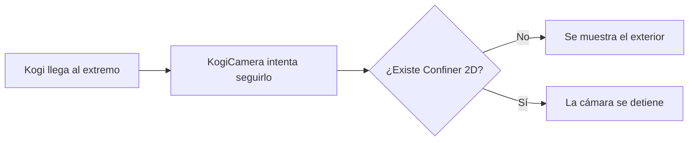
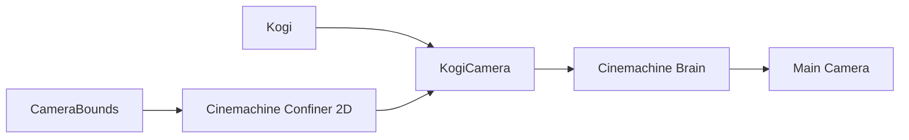
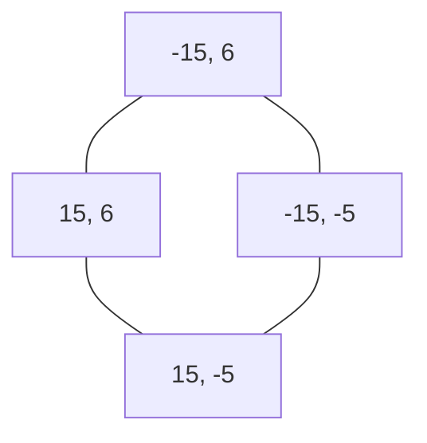
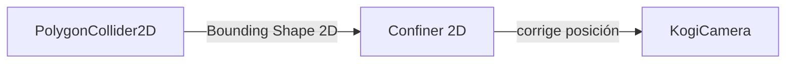
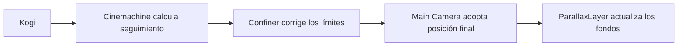

# Sesión 24: limitar la cámara dentro del nivel 🎥

Duración aproximada: **60–80 minutos**.

## 🎯 Objetivo

Impediremos que la cámara muestre zonas situadas fuera de `NivelDesierto`. Kogi podrá acercarse a los extremos del suelo, pero `Main Camera` se detendrá antes de enseñar el vacío exterior.

Utilizaremos dos componentes oficiales:

- `PolygonCollider2D`: describe la superficie completa que la cámara puede mostrar.
- `Cinemachine Confiner 2D`: obliga a la cámara de Cinemachine a permanecer dentro de esa superficie.

No crearemos un script C# nuevo en esta sesión.

## 1. Entender el problema

El suelo ocupa desde `X = -15` hasta `X = 15`. Sin límites, una cámara centrada cerca de un extremo puede mostrar el exterior del nivel.



La frontera no indica dónde puede caminar Kogi. Indica qué región completa puede ser encuadrada por la cámara.

> 💡 **Qué acabas de aprender:** limitar al personaje y limitar la vista son dos responsabilidades diferentes.

## 2. Diferenciar tres cámaras y responsabilidades

En nuestra escena participan:

- `KogiCamera`: la `Cinemachine Camera` que calcula el encuadre deseado.
- `Cinemachine Brain`: aplica ese resultado.
- `Main Camera`: dibuja la imagen final.

Añadiremos el Confiner a `KogiCamera` porque forma parte de la decisión del encuadre.



> 💡 **Qué acabas de aprender:** `Main Camera` representa la cámara real; las extensiones de `KogiCamera` modifican cómo Cinemachine calcula su posición.

## 3. Crear CameraBounds

1. Abre `NivelDesierto`.
2. Comprueba que ▶️ esté detenido.
3. En **Hierarchy**, haz clic derecho sobre un espacio vacío.
4. Selecciona **Create Empty**.
5. Renombra el nuevo GameObject como `CameraBounds`.
6. Selecciónalo y establece su `Transform`:

| Propiedad | X | Y | Z |
| --- | ---: | ---: | ---: |
| `Position` | `0` | `0` | `0` |
| `Rotation` | `0` | `0` | `0` |
| `Scale` | `1` | `1` | `1` |

`CameraBounds` no necesita `SpriteRenderer`: será invisible durante el juego.

> 💡 **Qué acabas de aprender:** un GameObject puede representar una regla espacial sin tener apariencia visual.

## 4. Añadir PolygonCollider2D

1. Con `CameraBounds` seleccionado, pulsa **Add Component**.
2. Busca `Polygon Collider 2D`.
3. Añade el componente.
4. Activa **Is Trigger**.
5. Pulsa **Edit Collider**.
6. Ajusta los cuatro vértices para formar este rectángulo:

| Vértice | X | Y |
| --- | ---: | ---: |
| Inferior izquierdo | `-15` | `-5` |
| Inferior derecho | `15` | `-5` |
| Superior derecho | `15` | `6` |
| Superior izquierdo | `-15` | `6` |

El resultado tiene:

- Centro: `(0, 0.5)`.
- Ancho: `30` unidades.
- Alto: `11` unidades.



### ¿Por qué usamos un collider si no queremos una colisión?

Cinemachine necesita una forma geométrica cerrada. Reutiliza un `Collider2D` como descripción de esa forma.

Activamos `Is Trigger` para que la frontera no se comporte como una pared física para Kogi, guardias o proyectiles.

> 💡 **Qué acabas de aprender:** un componente geométrico puede utilizarse como dato para otro sistema, no solamente para producir choques.

## 5. Añadir Cinemachine Confiner 2D

1. Selecciona `KogiCamera` en **Hierarchy**.
2. En el componente **Cinemachine Camera**, localiza **Add Extension**.
3. Abre el desplegable.
4. Selecciona **Cinemachine Confiner 2D**.

También puede aparecer como un componente adicional en la parte inferior del Inspector. Es una extensión oficial del paquete Cinemachine `3.1.7`, no una clase creada por nosotros.

> 💡 **Qué acabas de aprender:** una extensión añade una regla a la cámara existente sin sustituir su seguimiento ni su `Position Composer`.

## 6. Conectar la frontera

En el nuevo componente **Cinemachine Confiner 2D**:

1. Localiza **Bounding Shape 2D**.
2. Arrastra `CameraBounds` desde **Hierarchy** hasta ese campo.
3. Configura:

| Propiedad | Valor |
| --- | ---: |
| `Damping` | `0.5` |
| `Slowing Distance` | `1` |

- `Bounding Shape 2D` indica qué collider contiene el encuadre.
- `Damping` suaviza la corrección al tocar un límite.
- `Slowing Distance` permite reducir la velocidad antes de llegar al borde.

4. Guarda con `Ctrl + S`.



> 💡 **Qué acabas de aprender:** arrastrar `CameraBounds` no copia su collider; entrega al Confiner una referencia al componente geométrico existente.

## 7. Entender por qué la cámara no llega a X = 15

La frontera llega hasta `X = 15`, pero la cámara muestra una zona ancha alrededor de su centro. Cinemachine mantiene dentro del polígono **todo el rectángulo visible**, no únicamente el punto central.

Con la vista actual:

- La cámara muestra aproximadamente `25.06` unidades de ancho.
- La mitad de ese ancho es aproximadamente `12.53`.
- El límite derecho del centro es `15 - 12.53 = 2.47`.
- El límite izquierdo del centro es `-15 + 12.53 = -2.47`.

```text
Frontera completa:   -15 ├──────────────────────────────┤ 15
Cámara en el borde:       ├──────────────┤
Centro máximo:                              X = 2.47
```

Si la resolución o la relación de aspecto cambia, también puede cambiar el límite horizontal del centro.

> 💡 **Qué acabas de aprender:** el Confiner contiene el volumen visible de la cámara, no solo su `Transform`.

## 8. Probar el límite derecho

1. Pulsa ▶️.
2. Haz clic dentro de **Game**.
3. Avanza hacia la derecha.
4. Observa que Kogi puede acercarse al extremo del nivel.
5. Comprueba que la cámara deja de avanzar y no muestra espacio exterior.
6. Observa que Kogi puede alejarse del centro cuando la cámara ya no puede seguirlo.

No interpretes esa separación como un fallo: es el comportamiento esperado en el extremo de un nivel lateral.

## 9. Probar el límite izquierdo y vertical

1. Regresa hacia la izquierda.
2. Comprueba que la cámara tampoco muestra el exterior izquierdo.
3. Salta cerca de ambos extremos.
4. Confirma que el borde superior del encuadre permanece dentro de `Y = 6`.
5. Detén ▶️.
6. Revisa que **Console** no muestre errores rojos.

## 10. Relación con el fondo parallax

El Confiner limita `Main Camera`. Las capas de la sesión anterior siguen observando el movimiento final de esa cámara:



Cuando la cámara se detiene en un límite, el fondo también deja de recibir desplazamiento. Esto evita que aparezcan huecos fuera de las imágenes.

> 💡 **Qué acabas de aprender:** el orden entre sistemas importa: el parallax reacciona a la cámara después de que Cinemachine y el Confiner hayan resuelto su posición.

## ✅ Comprobación final

- [ ] Existe `CameraBounds` en la raíz de `Hierarchy`.
- [ ] Su `Transform` conserva posición cero, rotación cero y escala uno.
- [ ] Contiene un `PolygonCollider2D` con cuatro vértices.
- [ ] El collider tiene **Is Trigger** activado.
- [ ] Sus límites abarcan de `(-15, -5)` a `(15, 6)`.
- [ ] `KogiCamera` contiene `Cinemachine Confiner 2D`.
- [ ] `Bounding Shape 2D` apunta a `CameraBounds`.
- [ ] `Damping` vale `0.5` y `Slowing Distance` vale `1`.
- [ ] La cámara se detiene aproximadamente en `X = ±2.47` con la vista actual.
- [ ] Kogi y los proyectiles no chocan con la frontera.
- [ ] El fondo parallax continúa funcionando.
- [ ] **Console** no muestra errores rojos.

## 🧰 Problemas frecuentes

- **No aparece Confiner 2D:** utiliza **Add Extension** dentro de `KogiCamera`; confirma que Cinemachine esté instalado.
- **Bounding Shape 2D muestra None:** arrastra `CameraBounds` desde **Hierarchy** al campo.
- **Kogi choca con un muro invisible:** activa **Is Trigger** en `PolygonCollider2D`.
- **La cámara sigue saliendo del nivel:** comprueba que el polígono esté cerrado y que el Confiner esté activado.
- **La cámara queda inmóvil:** la vista puede ser más grande que la frontera; usa una relación de aspecto normal y confirma `Orthographic Size = 5`.
- **Las esquinas cambian y no se actualizan:** en el menú del componente Confiner, ejecuta la opción para invalidar o actualizar la caché de la forma.
- **El fondo deja huecos:** confirma que las capas visuales cubran toda el área permitida por el Confiner.

---

[⬅️ Sesión anterior](23-fondo-parallax-del-desierto.md) · [🏠 Inicio](../../README.md)
