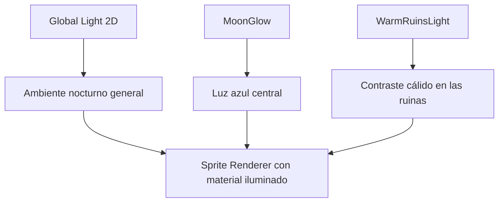
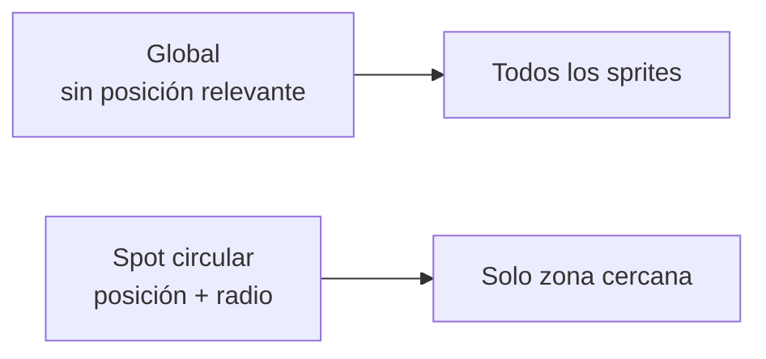
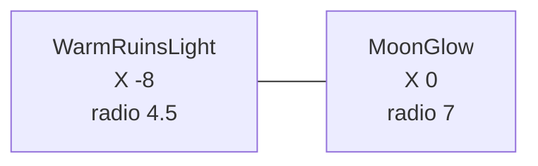
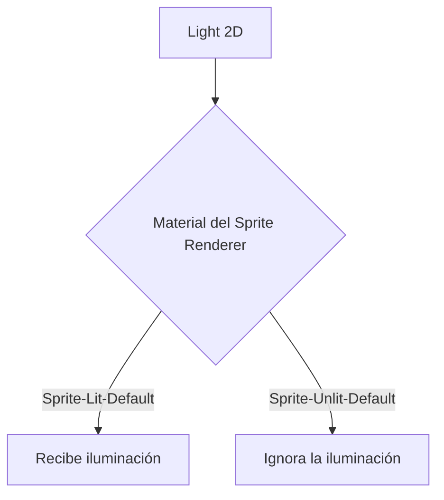
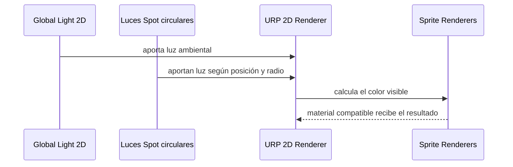

# Sesión 25: crear iluminación 2D ambiental 🌙

Duración aproximada: **60–80 minutos**.

## 🎯 Objetivo

Transformaremos la iluminación plana de `NivelDesierto` en una escena nocturna con ambiente frío y dos focos locales. Aprenderemos a diferenciar una luz global de una luz puntual y veremos cómo URP 2D combina ambas sobre los sprites.

En esta sesión no escribiremos C#. Utilizaremos el componente oficial `Light 2D` de URP.

## 1. Entender qué vamos a cambiar

Hasta ahora, `Global Light 2D` ilumina toda la escena con la misma fuerza. Eso permite ver los objetos, pero no dirige la mirada ni crea profundidad.

Construiremos tres responsabilidades:



> 💡 **Qué acabas de aprender:** iluminar no significa únicamente hacer visible la escena; también comunica hora, lugar y zonas importantes.

## 2. Conocer Light 2D

`Light 2D` es un componente de **Universal Render Pipeline (URP)**. Calcula cómo reciben luz los sprites que utilizan un material compatible, como `Sprite-Lit-Default`.

Usaremos dos tipos:

- `Global`: afecta de forma uniforme a toda la escena.
- `Spot`: nace en una posición y pierde fuerza al alejarse. Aunque Unity lo llame `Spot` en el Inspector, con un ángulo de `360°` funciona como una luz puntual circular.



Una luz no tiene una apariencia visible por sí misma. Veremos su efecto sobre los sprites, pero necesitaremos arte o partículas en otra sesión si queremos dibujar una llama.

> 💡 **Qué acabas de aprender:** `Light 2D` modifica la apariencia de otros objetos; no es un sprite ni una bombilla dibujada.

## 3. Oscurecer la luz global

1. Abre `NivelDesierto` y comprueba que ▶️ esté detenido.
2. En **Hierarchy**, selecciona `Global Light 2D`.
3. En **Inspector**, localiza su componente `Light 2D`.
4. Confirma que **Light Type** sea `Global`.
5. Configura estos valores:

| Propiedad | Valor |
| --- | --- |
| `Color` | azul grisáceo `#6B79A6` |
| `Intensity` | `0.45` |

Al reducir la intensidad, toda la escena se oscurece. No la dejamos completamente negra porque esta luz representa el brillo ambiental de la noche.

> 💡 **Qué acabas de aprender:** la luz global establece la base; las luces locales se sumarán después sobre ella.

## 4. Crear un contenedor para las luces

1. En un espacio vacío de **Hierarchy**, haz clic derecho.
2. Selecciona **Create Empty**.
3. Renombra el GameObject como `EnvironmentLighting`.
4. En su `Transform`, usa posición `(0, 0, 0)`, rotación `(0, 0, 0)` y escala `(1, 1, 1)`.

Este objeto no ilumina por sí mismo. Solo organiza las luces ambientales como objetos hijos.

> 💡 **Qué acabas de aprender:** un GameObject vacío también puede utilizarse como carpeta organizativa dentro de una escena.

## 5. Crear MoonGlow

1. Haz clic derecho sobre `EnvironmentLighting`.
2. Selecciona **Create Empty**.
3. Renómbralo como `MoonGlow`.
4. Confirma que aparece indentado debajo de `EnvironmentLighting` en **Hierarchy**.
5. Configura su posición mundial como `(0, 2.5, 0)`.
6. Pulsa **Add Component**.
7. Busca y añade `Light 2D`.
8. Configura:

| Propiedad | Valor |
| --- | --- |
| `Light Type` | `Spot` |
| `Color` | azul cian `#63C7FF` |
| `Intensity` | `0.85` |
| `Inner Radius` | `1.5` |
| `Outer Radius` | `7` |
| `Inner/Outer Angle` | `360°` |
| `Falloff Intensity` | `0.6` |

- Dentro del radio interior, la luz mantiene mayor fuerza.
- Entre el radio interior y el exterior, disminuye gradualmente.
- Fuera del radio exterior, deja de afectar.

> 💡 **Qué acabas de aprender:** la posición importa para una luz puntual y su radio determina el área de influencia.

## 6. Crear WarmRuinsLight

1. Selecciona `MoonGlow` en **Hierarchy**.
2. Pulsa `Ctrl + D` para duplicarlo.
3. Renombra la copia como `WarmRuinsLight`.
4. Déjalo como hijo de `EnvironmentLighting`.
5. Cambia su posición mundial a `(-8, 0, 0)`.
6. En `Light 2D`, configura:

| Propiedad | Valor |
| --- | --- |
| `Light Type` | `Spot` |
| `Color` | naranja suave `#FF9A55` |
| `Intensity` | `1.1` |
| `Inner Radius` | `0.8` |
| `Outer Radius` | `4.5` |
| `Inner/Outer Angle` | `360°` |
| `Falloff Intensity` | `0.75` |

La escena tendrá ahora una base fría y una zona cálida a la izquierda. Este contraste ayuda a separar planos y puede atraer al jugador hacia un punto narrativo.



> 💡 **Qué acabas de aprender:** distintas luces pueden superponerse; URP calcula el color final combinando sus contribuciones.

## 7. Entender qué sprites reaccionan

1. Selecciona un objeto visible como `Kogi`, `Suelo` o una plataforma.
2. Abre su componente `Sprite Renderer`.
3. Busca el campo **Material**.
4. Si utiliza `Sprite-Lit-Default`, debe reaccionar a `Light 2D`.
5. Si un sprite utiliza `Sprite-Unlit-Default`, conservará su color sin importar las luces.



La interfaz `Canvas`, como el texto de las vidas, debe continuar legible y no depende de estas luces del mundo.

> 💡 **Qué acabas de aprender:** la luz necesita un receptor compatible; no todos los materiales reaccionan a ella.

## 8. Probar el resultado

1. Guarda la escena con `Ctrl + S`.
2. Pulsa ▶️.
3. Mueve a Kogi de izquierda a derecha.
4. Observa el tono cálido cerca de `X = -8`.
5. Observa el tono azul alrededor del centro.
6. Confirma que las luces no modifican el movimiento, las colisiones ni los ataques.
7. Detén ▶️.
8. Revisa que **Console** no muestre errores rojos.

Las luces son visuales: no detectan al jugador, no producen daño y no reemplazan los colliders.

> 💡 **Qué acabas de aprender:** presentación y lógica de juego son sistemas distintos, aunque ambos trabajen sobre la misma escena.

## 9. Leer la jerarquía final

La parte nueva debe verse así:

```text
NivelDesierto
├── Global Light 2D
└── EnvironmentLighting
    ├── MoonGlow
    └── WarmRuinsLight
```

- `EnvironmentLighting` organiza.
- Cada hijo aporta un foco local.
- `Global Light 2D` permanece separado porque afecta a todo el nivel.

## 10. Qué hemos construido realmente



En una versión artística posterior podremos añadir sprites de lámparas, llamas animadas, partículas y sombras. La estructura de iluminación creada aquí seguirá siendo útil.

## ✅ Comprobación final

- [ ] `Global Light 2D` usa color `#6B79A6` e intensidad `0.45`.
- [ ] Existe `EnvironmentLighting` en la raíz de la escena.
- [ ] `MoonGlow` y `WarmRuinsLight` son hijos de ese contenedor.
- [ ] Ambas luces utilizan `Light Type = Spot` con ángulo de `360°`.
- [ ] `MoonGlow` está en `(0, 2.5, 0)` y su radio exterior es `7`.
- [ ] `WarmRuinsLight` está en `(-8, 0, 0)` y su radio exterior es `4.5`.
- [ ] Los sprites iluminados reaccionan a los colores.
- [ ] El texto de vidas continúa legible.
- [ ] Movimiento, salto, combate y cámara siguen funcionando.
- [ ] **Console** no muestra errores rojos.

## 🧰 Problemas frecuentes

- **Todo sigue completamente blanco:** comprueba que el material de los sprites sea `Sprite-Lit-Default` y que el `Light Type` sea correcto.
- **Toda la escena queda demasiado oscura:** revisa que `Global Light 2D` esté activo y tenga intensidad `0.45`.
- **No encuentro Inner/Outer Radius:** confirma que el tipo de la luz sea `Spot`; esos campos no aparecen en una luz global.
- **La luz aparece en otro lugar:** revisa el `Transform` del objeto y recuerda que debe ser hijo de `EnvironmentLighting`.
- **El texto de vidas cambia de color:** confirma que sigue dentro del `Canvas` y que no lo convertiste en un sprite del mundo.
- **El fondo no reacciona igual que Kogi:** cada capa puede utilizar un material diferente; eso puede ser intencional para conservar profundidad.

---

[⬅️ Sesión anterior](24-limites-de-camara.md) · [🏠 Inicio](../../README.md) · [Siguiente sesión ➡️](26-sombras-2d.md)
