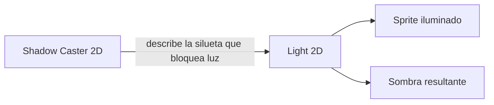
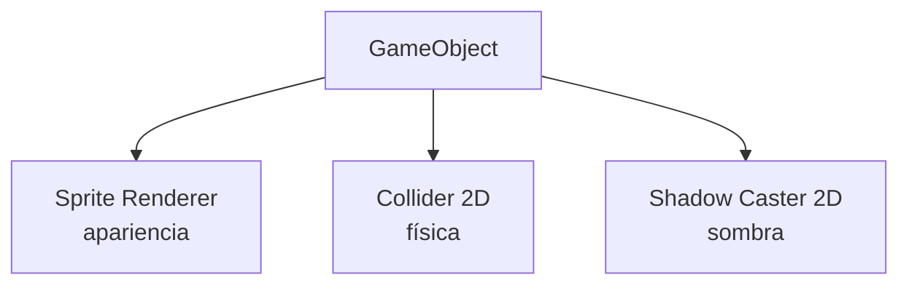
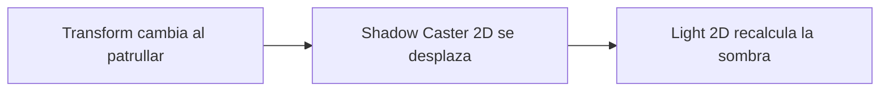
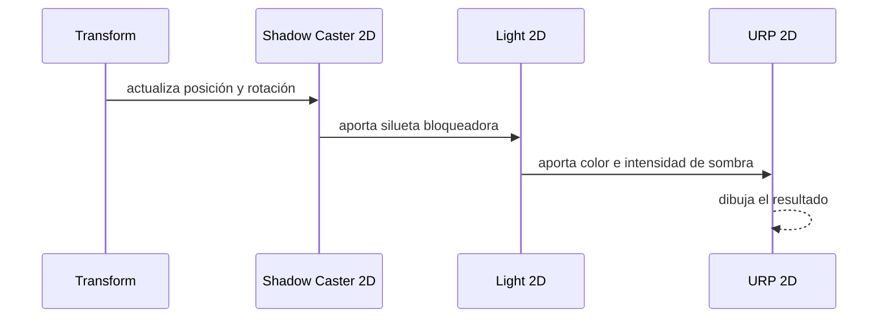

# Sesión 26: proyectar sombras con Shadow Caster 2D 🌑

Duración aproximada: **60–80 minutos**.

## 🎯 Objetivo

Haremos que Kogi, los guardias y las plataformas bloqueen parcialmente las luces locales de la escena. Para ello añadiremos el componente oficial `Shadow Caster 2D` de URP.

No escribiremos C# ni cambiaremos la física del juego.

## 1. Entender qué falta en la iluminación

En la sesión anterior creamos luces, pero una luz no sabe automáticamente qué objetos deben bloquearla. Un sprite puede recibir iluminación sin proyectar ninguna sombra.



> 💡 **Qué acabas de aprender:** recibir luz y bloquear luz son responsabilidades distintas.

## 2. Conocer Shadow Caster 2D

`Shadow Caster 2D` es un componente de URP que entrega al sistema de iluminación una forma o silueta. Cuando una luz local encuentra esa forma, calcula una zona oscura detrás de ella.

No es:

- Un collider físico.
- Una imagen de sombra.
- Un script nuestro.
- Un obstáculo para el movimiento.

Sí es una descripción geométrica utilizada exclusivamente por el renderizador 2D.



> 💡 **Qué acabas de aprender:** el mismo GameObject puede tener una geometría visual, otra física y otra dedicada a las sombras.

## 3. Preparar las luces que reciben sombras

1. Abre `NivelDesierto` y comprueba que ▶️ esté detenido.
2. En **Hierarchy**, abre `EnvironmentLighting`.
3. Selecciona `MoonGlow`.
4. En su componente `Light 2D`, configura:

| Propiedad | Valor |
|---|---:|
| `Shadow Intensity` | `0.65` |
| `Shadow Softness` | `0.25` |

5. Selecciona `WarmRuinsLight` y configura:

| Propiedad | Valor |
|---|---:|
| `Shadow Intensity` | `0.75` |
| `Shadow Softness` | `0.2` |

- `Shadow Intensity` determina cuánto oscurece la sombra.
- `Shadow Softness` suaviza su borde.

No modificaremos `Global Light 2D`: las sombras de esta práctica nacen de los focos locales.

> 💡 **Qué acabas de aprender:** la luz controla la apariencia general de todas las sombras que produce.

## 4. Añadir sombra a Kogi

1. Selecciona `Kogi` en **Hierarchy**.
2. Baja hasta el final de **Inspector**.
3. Pulsa **Add Component**.
4. Escribe `Shadow Caster 2D`.
5. Selecciona el componente que pertenece a **Rendering / 2D**.
6. Comprueba:

| Propiedad | Valor |
|---|---|
| `Casts Shadows` | Activado |
| `Self Shadows` | Desactivado |

Al añadirlo, Unity obtiene una forma inicial a partir del objeto. `Casts Shadows` permite proyectar sombra sobre otros sprites. Dejamos `Self Shadows` desactivado para que la silueta provisional de Kogi no se oscurezca a sí misma.

> 💡 **Qué acabas de aprender:** añadir el componente registra a Kogi como bloqueador de luz; no cambia su movimiento ni sus colliders.

## 5. Añadir sombra a los guardias

Repite el mismo procedimiento en:

1. `GuardiaIzquierda`.
2. `GuardiaBasico`.

En ambos confirma:

- `Casts Shadows`: activado.
- `Self Shadows`: desactivado.

Los guardias podrán seguir patrullando, viendo, disparando y recibiendo daño exactamente igual. Su sombra se moverá porque el componente utiliza el `Transform` actual del GameObject.



> 💡 **Qué acabas de aprender:** al compartir el mismo GameObject, la sombra acompaña automáticamente al personaje.

## 6. Añadir sombra a las plataformas

Añade `Shadow Caster 2D` a estas tres instancias de **Hierarchy**:

1. `PlataformaBase`.
2. `Plataforma02`.
3. `Plataforma03`.

Mantén `Casts Shadows` activado y `Self Shadows` desactivado.

No lo añadas a `Suelo` en esta práctica. Es una pieza muy ancha y su sombra quedaría principalmente fuera de la zona jugable, debajo del escenario, sin aportar información visual útil.

> 💡 **Qué acabas de aprender:** no todos los objetos visibles necesitan proyectar sombras; se eligen según su aportación visual y su coste.

## 7. Entender la forma de la sombra

El componente contiene una silueta editable. Para nuestros rectángulos provisionales, la forma automática es suficiente.

Cuando tengamos arte definitivo:

- La silueta podrá seguir mejor el contorno del personaje.
- Una forma con demasiados puntos costará más de calcular.
- Conviene usar una aproximación sencilla que visualmente resulte convincente.

```text
Sprite detallado:       /\/\/\__
Silueta de sombra:      /\____/
Objetivo: aproximar, no copiar cada píxel
```

No pulses **Edit Shape** todavía: conservar una forma simple facilita esta primera comprobación.

> 💡 **Qué acabas de aprender:** la geometría de sombra puede ser más sencilla que el dibujo visible.

## 8. Probar una sombra estática

1. Guarda con `Ctrl + S`.
2. Sin ejecutar, selecciona `WarmRuinsLight`.
3. Observa en **Scene** su círculo de influencia alrededor de `X = -8`.
4. Comprueba que `GuardiaIzquierda` se encuentra dentro de ese radio.
5. Pulsa ▶️.
6. Observa cómo la plataforma o el guardia interrumpen la iluminación cálida según su posición.

La sombra puede ser discreta porque todavía usamos rectángulos provisionales y existe luz ambiental global.

## 9. Probar sombras en movimiento

1. Acerca a Kogi a la iluminación azul central.
2. Camina y salta.
3. Comprueba que su sombra se desplaza con él.
4. Observa al `GuardiaIzquierda` durante su patrulla.
5. Confirma que la sombra no detiene ni empuja ningún objeto.
6. Detén ▶️.
7. Revisa que **Console** no muestre errores rojos.



> 💡 **Qué acabas de aprender:** la sombra es un resultado visual calculado cada fotograma a partir de la luz y la silueta.

## 10. Separar las tres geometrías

Recuerda esta diferencia fundamental:

| Componente | Pregunta que responde |
|---|---|
| `Sprite Renderer` | ¿Qué dibujo se ve? |
| `Collider 2D` | ¿Con qué puede chocar? |
| `Shadow Caster 2D` | ¿Qué forma bloquea la luz? |

Cambiar el collider no garantiza que cambie la sombra. Cambiar el sprite tampoco reemplaza automáticamente una silueta personalizada. Son sistemas relacionados, pero independientes.

## ✅ Comprobación final

- [ ] `MoonGlow` tiene intensidad de sombra `0.65` y suavidad `0.25`.
- [ ] `WarmRuinsLight` tiene intensidad de sombra `0.75` y suavidad `0.2`.
- [ ] Kogi contiene `Shadow Caster 2D`.
- [ ] Ambos guardias contienen `Shadow Caster 2D`.
- [ ] Las tres plataformas contienen `Shadow Caster 2D`.
- [ ] Los seis componentes tienen `Casts Shadows` activado.
- [ ] Los seis componentes tienen `Self Shadows` desactivado.
- [ ] `Suelo` no contiene `Shadow Caster 2D`.
- [ ] Movimiento, patrulla, combate, cámara e iluminación continúan funcionando.
- [ ] **Console** no muestra errores rojos.

## 🧰 Problemas frecuentes

- **No aparece Shadow Caster 2D:** confirma que buscas el componente dentro de Rendering/2D y que el proyecto utiliza URP 2D.
- **No veo ninguna sombra:** comprueba que el objeto esté dentro del radio de `MoonGlow` o `WarmRuinsLight` y que `Shadow Intensity` sea mayor que cero.
- **El propio sprite queda oscuro:** desactiva `Self Shadows`.
- **La sombra tiene una forma extraña:** abre la forma del Shadow Caster y confirma que rodea aproximadamente al sprite.
- **La sombra no acompaña al objeto:** verifica que el componente esté en el mismo GameObject que se mueve, no en un objeto independiente.
- **El juego dejó de colisionar correctamente:** Shadow Caster no debe sustituir ni eliminar los componentes `Collider 2D` existentes.

---

[⬅️ Sesión anterior](25-iluminacion-2d-ambiental.md) · [🏠 Inicio](../../README.md)
