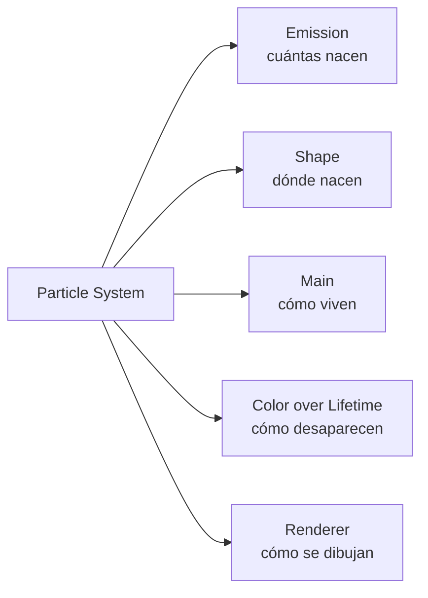
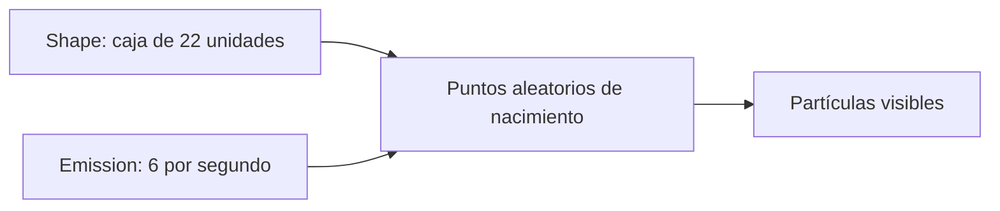
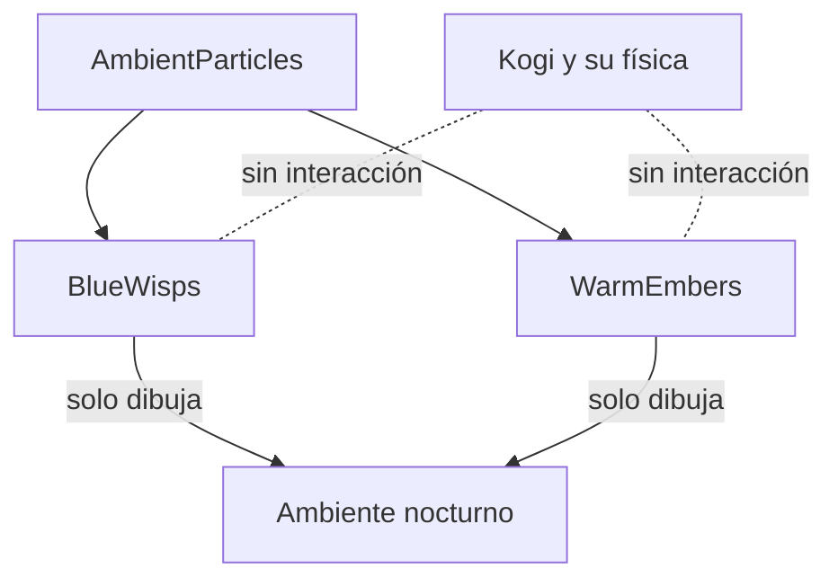

# Sesión 27: crear partículas ambientales ✨

Duración aproximada: **60–80 minutos**.

## 🎯 Objetivo

Añadiremos pequeñas motas azules al ambiente nocturno y brasas cálidas cerca de las ruinas. Aprenderemos a usar `Particle System`, un componente que genera muchas imágenes pequeñas durante un tiempo limitado.

No añadiremos daño, colisiones, viento ni código C#. Las partículas serán únicamente decorativas.

## 1. Entender qué es un Particle System

Un `Particle System` administra muchas partículas sin obligarnos a crear un GameObject distinto para cada una. Cada partícula posee temporalmente posición, tamaño, color, velocidad y tiempo de vida.

Cuando termina el tiempo de vida, Unity reutiliza internamente ese espacio para nuevas partículas. Nosotros configuramos el emisor, no administramos cada mota individual.

> 💡 **Qué acabas de aprender:** un sistema de partículas es un emisor configurable, no una colección de GameObjects colocados a mano.

## 2. Crear el contenedor ambiental

1. Abre `Assets > Kogi > Scenes > NivelDesierto`.
2. Comprueba que ▶️ esté detenido.
3. Haz clic derecho en un espacio vacío de **Hierarchy**.
4. Selecciona **Create Empty**.
5. Renómbralo `AmbientParticles`.
6. En `Transform`, abre el menú de tres puntos y pulsa **Reset**.
7. Comprueba `Position (0, 0, 0)`, `Rotation (0, 0, 0)` y `Scale (1, 1, 1)`.

Este objeto solo organiza los emisores que añadiremos debajo. No dibuja nada por sí mismo.

> 💡 **Qué acabas de aprender:** un GameObject vacío puede actuar como carpeta dentro de la escena.

## 3. Crear las motas azules

1. Haz clic derecho sobre `AmbientParticles` en **Hierarchy**.
2. Selecciona **Effects > Particle System**.
3. Renombra el hijo como `BlueWisps`.
4. En su `Transform`, escribe `Position (0, 0.5, 0)`.
5. No cambies el `Transform` del objeto padre.

Al seleccionar `BlueWisps`, verás el componente `Particle System` dividido en módulos desplegables. La casilla situada a la izquierda del nombre de un módulo lo activa o desactiva.

> 💡 **Qué acabas de aprender:** `BlueWisps` es el GameObject y `Particle System` es el componente que vive en él.

## 4. Configurar la vida de las motas

Abre el módulo principal, que aparece en la parte superior del componente, y utiliza:

| Propiedad | Valor |
|---|---:|
| `Duration` | `3` |
| `Looping` | Activado |
| `Start Lifetime` | `3` |
| `Start Speed` | `0` |
| `Start Size` | `Random Between Two Constants`: `0.12` y `0.28` |
| `Start Color` | `#63C7FF` |
| `Simulation Space` | `World` |
| `Max Particles` | `50` |
| `Play On Awake` | Activado |

- `Lifetime` es el número de segundos que existe una mota.
- `Start Speed = 0` evita una dirección inicial aleatoria; definiremos el ascenso después.
- `World` hace que una partícula ya emitida no sea arrastrada si movemos el emisor.
- `Max Particles` limita el coste máximo.

> 💡 **Qué acabas de aprender:** el módulo principal establece las reglas generales de vida del efecto.

## 5. Elegir cuántas nacen y desde dónde

1. Abre **Emission**.
2. Configura `Rate over Time = 6`.
3. Abre **Shape**.
4. Elige `Shape = Box`.
5. En `Scale`, configura `(22, 1, 0.1)`.

La caja cubre horizontalmente la zona actual del nivel. El valor de emisión significa aproximadamente seis motas nuevas por segundo, no seis partículas totales.

> 💡 **Qué acabas de aprender:** `Shape` define el espacio de nacimiento y `Emission` define el ritmo.

## 6. Hacer que asciendan y se desvanezcan

1. Activa y abre **Velocity over Lifetime**.
2. Configura `Space = World`.
3. En `Linear X`, elige `Random Between Two Constants`: `-0.08` y `0.08`.
4. En `Linear Y`, elige `Random Between Two Constants`: `0.2` y `0.55`.
5. Deja `Linear Z = 0`.
6. Activa y abre **Color over Lifetime**.
7. Abre el degradado de color.
8. Conserva el azul y configura la transparencia para que comience en `0`, suba aproximadamente a `0.85` y termine en `0`.

El movimiento ascendente procede de `Velocity over Lifetime`; el desvanecimiento procede del canal alfa del degradado.

> 💡 **Qué acabas de aprender:** los módulos modifican una partícula mientras envejece, sin necesitar `Update()` ni un script propio.

## 7. Configurar cómo se dibujan

1. Abre **Renderer**, al final del componente.
2. Comprueba `Render Mode = Billboard`.
3. Configura `Order in Layer = -1`.
4. En la propiedad **Material**, asigna `Assets > Kogi > Art > Effects > AmbientParticle`.

`Billboard` mantiene cada partícula orientada hacia la cámara. El orden `-1` coloca las motas detrás de Kogi y de los elementos principales que usan el orden normal `0`.

`AmbientParticle` utiliza un shader compatible con URP 2D y la textura circular `SoftParticleTexture`. La textura convierte el rectángulo interno con el que Unity dibuja cada partícula en una mota de borde suave. Sin un material compatible, Unity muestra cuadrados fucsias para avisar que el shader falta o no puede utilizarse.

`Renderer` no decide dónde nace ni cómo se mueve una partícula: solo decide cómo se representa.

> 💡 **Qué acabas de aprender:** simulación y dibujo son responsabilidades separadas también dentro de Particle System.

## 8. Crear las brasas cálidas

1. Haz clic derecho sobre `AmbientParticles`.
2. Elige **Effects > Particle System**.
3. Renómbralo `WarmEmbers`.
4. Configura `Position (-8, 0, 0)`.
5. En el módulo principal utiliza:

| Propiedad | Valor |
|---|---:|
| `Duration` | `2` |
| `Start Lifetime` | `1.8` |
| `Start Speed` | `0` |
| `Start Size` | Entre `0.08` y `0.18` |
| `Start Color` | `#FFB56B` |
| `Simulation Space` | `World` |
| `Max Particles` | `25` |

6. En **Emission**, configura `Rate over Time = 4`.
7. En **Shape**, elige `Box` y `Scale (4, 0.5, 0.1)`.
8. En **Velocity over Lifetime**, usa `X` entre `-0.06` y `0.06`, e `Y` entre `0.35` y `0.75`.
9. En **Color over Lifetime**, haz que el alfa pase de `0` a `0.9` y vuelva a `0`.
10. En **Renderer**, usa `Billboard`, `Order in Layer = -1` y el material `AmbientParticle`.

Estas brasas nacen cerca de `WarmRuinsLight`, pero no producen luz real. La luz y las partículas son dos efectos independientes colocados juntos para contar la misma idea visual.

> 💡 **Qué acabas de aprender:** combinar sistemas independientes puede crear un efecto coherente sin acoplarlos técnicamente.

## 9. Probar el resultado

1. Guarda la escena con `Ctrl + S`.
2. Pulsa ▶️.
3. Comprueba que las motas azules aparecen repartidas por el nivel.
4. Acércate a `X = -8` y comprueba que allí aparecen brasas cálidas.
5. Camina, salta, ataca y agáchate.
6. Confirma que ninguna partícula bloquea, empuja o daña a Kogi.
7. Detén ▶️.
8. Revisa que **Console** no contenga errores rojos.

> 💡 **Qué acabas de aprender:** un efecto visual puede enriquecer el escenario sin formar parte de las reglas jugables.

## 10. Distinguir los módulos

| Módulo | Pregunta que responde |
|---|---|
| `Main` | ¿Cuánto viven y qué tamaño inicial tienen? |
| `Emission` | ¿Cuántas nacen? |
| `Shape` | ¿Dónde nacen? |
| `Velocity over Lifetime` | ¿Cómo se mueven mientras viven? |
| `Color over Lifetime` | ¿Cómo cambia su color o transparencia? |
| `Renderer` | ¿Cómo y en qué orden se dibujan? |

No activamos `Collision`: por eso las partículas atraviesan el escenario y no participan en la física.

## ✅ Comprobación final

- [ ] Existe `AmbientParticles` en la raíz de la escena.
- [ ] Contiene `BlueWisps` y `WarmEmbers`.
- [ ] `BlueWisps` emite `6` partículas por segundo en una caja de `(22, 1, 0.1)`.
- [ ] `WarmEmbers` emite `4` partículas por segundo en una caja de `(4, 0.5, 0.1)`.
- [ ] Las partículas ascienden y aparecen/desaparecen suavemente.
- [ ] Ambos renderizadores utilizan `Billboard` y orden `-1`.
- [ ] Ambos renderizadores tienen asignado el material `AmbientParticle`.
- [ ] Ningún emisor contiene un collider.
- [ ] Movimiento, combate, enemigos, cámara, luces y sombras siguen funcionando.
- [ ] **Console** no muestra errores rojos.

## 🧰 Problemas frecuentes

- **No veo partículas:** selecciona el emisor y confirma que `Emission` esté activo, que `Rate over Time` sea mayor que cero y que `Play On Awake` esté marcado.
- **Aparecen como cuadrados fucsias:** abre `Renderer > Material` y asigna `Assets/Kogi/Art/Effects/AmbientParticle`. El fucsia es la señal de Unity para un shader ausente o incompatible.
- **Todas se mueven exactamente igual:** utiliza `Random Between Two Constants` en tamaño y velocidad.
- **Las partículas tapan a Kogi:** confirma `Order in Layer = -1`.
- **Se mueven al desplazar el emisor:** comprueba `Simulation Space = World`.
- **Kogi choca con ellas:** los emisores no deben tener `Collider 2D` ni debe estar activo el módulo `Collision`.
- **Hay demasiadas partículas:** revisa `Rate over Time` y `Max Particles`; son controles diferentes.

---

[⬅️ Sesión anterior](26-sombras-2d.md) · [🏠 Inicio](../../README.md) · [Siguiente sesión ➡️](28-posprocesado-global.md)
