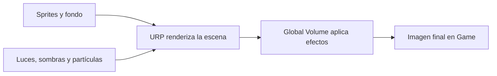
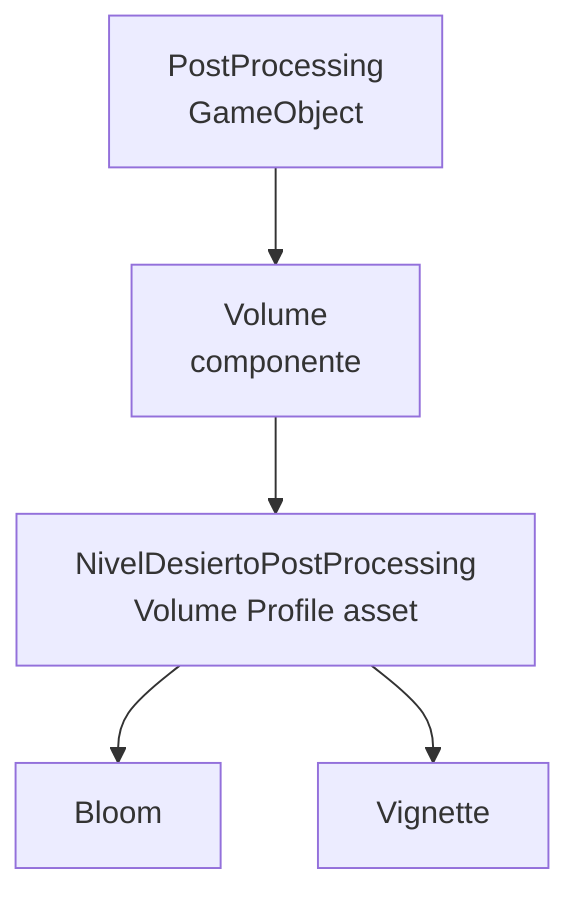
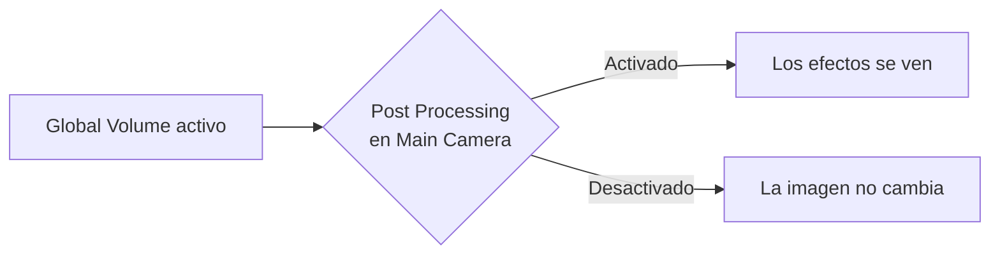

# Sesión 28: aplicar posprocesado con Global Volume ✨

Duración aproximada: **60–80 minutos**.

## 🎯 Objetivo

Aplicaremos dos efectos suaves sobre la imagen final de `NivelDesierto`:

- `Bloom` para extender ligeramente el brillo de luces y partículas.
- `Vignette` para oscurecer los bordes y dirigir la mirada hacia la zona jugable.

Usaremos un `Global Volume` de URP. No cambiaremos física, combate, inteligencia artificial ni sprites.

## 1. Entender el posprocesado

Unity primero dibuja la escena y después puede transformar la imagen completa antes de mostrarla en **Game**. A esa etapa final se le llama posprocesado.

El posprocesado no modifica los objetos originales. Es parecido a aplicar un filtro sobre la fotografía final, aunque sus efectos se calculan continuamente durante el juego.

> 💡 **Qué acabas de aprender:** el posprocesado actúa sobre la imagen de la cámara, no sobre las reglas ni los GameObjects físicos.

## 2. Crear el Global Volume

1. Abre `Assets > Kogi > Scenes > NivelDesierto`.
2. Comprueba que ▶️ esté detenido.
3. En la barra superior de Unity, abre **GameObject**.
4. Selecciona **Volume > Global Volume**.
5. En **Hierarchy**, renombra el nuevo objeto como `PostProcessing`.
6. En `Transform`, usa **Reset** para dejarlo en `(0, 0, 0)`.

El componente `Volume` puede ser local o global:

- Un volumen local necesita un collider y afecta solamente una región.
- Un volumen global afecta toda la escena y no necesita collider.

Comprueba que `Is Global` esté activado, `Weight = 1` y `Priority = 0`.

> 💡 **Qué acabas de aprender:** un Volume es un contenedor de ajustes visuales; `Is Global` determina que se apliquen en cualquier posición de la cámara.

## 3. Crear el perfil de efectos

1. Selecciona `PostProcessing`.
2. En el componente `Volume`, localiza `Profile`.
3. Pulsa **New** para crear un perfil.
4. Guarda el asset como `NivelDesiertoPostProcessing` dentro de `Assets/Kogi/Settings/PostProcessing`.

El GameObject contiene el componente `Volume`, pero los valores de los efectos viven en un asset independiente llamado `Volume Profile`.

Esto permite reutilizar un perfil en varias escenas o cambiar de ambiente sustituyendo una sola referencia.

> 💡 **Qué acabas de aprender:** el Volume decide dónde y con qué peso se aplica; el perfil guarda qué efectos se aplican y sus valores.

## 4. Añadir Bloom

1. En el perfil, pulsa **Add Override**.
2. Abre **Post-processing**.
3. Selecciona **Bloom**.
4. Marca la casilla de cada propiedad que vas a sobrescribir.
5. Configura:

| Propiedad | Valor |
|---|---:|
| `Threshold` | `0.75` |
| `Intensity` | `0.3` |
| `Scatter` | `0.65` |

- `Threshold` establece desde qué luminosidad comienza el brillo.
- `Intensity` determina cuánto brillo adicional aparece.
- `Scatter` controla cuánto se extiende alrededor de la fuente.

Los valores son deliberadamente moderados. Bloom debe reforzar la luz, no convertir toda la pantalla en una mancha brillante.

> 💡 **Qué acabas de aprender:** Bloom no crea una luz nueva; extiende visualmente los píxeles que ya son suficientemente luminosos.

## 5. Añadir Vignette

1. Vuelve a pulsar **Add Override**.
2. Abre **Post-processing**.
3. Selecciona **Vignette**.
4. Activa y configura:

| Propiedad | Valor |
|---|---:|
| `Color` | `#080B1A` |
| `Intensity` | `0.22` |
| `Smoothness` | `0.45` |
| `Rounded` | Desactivado |

La viñeta oscurece progresivamente los bordes. Un valor suave ayuda a centrar la atención sin ocultar plataformas o enemigos.

> 💡 **Qué acabas de aprender:** Vignette es una decisión de composición visual, no una sombra producida por un objeto.

## 6. Activar el posprocesado en la cámara

1. Selecciona `Main Camera` en **Hierarchy**.
2. En **Inspector**, localiza `Universal Additional Camera Data` o la sección **Rendering** de `Camera`.
3. Activa **Post Processing**.

El perfil puede estar perfectamente configurado y aun así no verse si la cámara no permite ejecutar el posprocesado.

> 💡 **Qué acabas de aprender:** el Volume ofrece efectos y la cámara decide si los procesa.

## 7. Comparar antes y después

1. Guarda con `Ctrl + S`.
2. Abre la ventana **Game**.
3. Pulsa ▶️.
4. Observa las partículas azules, las brasas y las zonas iluminadas.
5. Con `PostProcessing` seleccionado, desactiva temporalmente la casilla del componente `Volume`.
6. Compara la imagen.
7. Vuelve a activar el componente antes de detener ▶️.

Durante esta comparación deberías notar:

- Un halo discreto alrededor de los elementos luminosos.
- Bordes algo más oscuros.
- El centro jugable continúa siendo legible.

Recuerda que los cambios hechos durante ▶️ pueden perderse. Esta desactivación solo sirve para comparar.

> 💡 **Qué acabas de aprender:** aislar temporalmente un efecto es una forma práctica de evaluar si realmente mejora la escena.

## 8. Comprender qué no cambia

`Global Volume` no:

- Aumenta el radio de `Light 2D`.
- Modifica `Shadow Caster 2D`.
- Convierte partículas en luces.
- Cambia el color almacenado en un sprite.
- Añade colliders ni afecta el rendimiento de la física.

Sí añade un coste gráfico. Por eso utilizamos pocos efectos y valores prudentes, algo especialmente importante si Kogi termina ejecutándose en móviles.

## 9. Probar el juego completo

1. Camina y salta por el nivel.
2. Comprueba las plataformas y la zona de caída.
3. Acércate a ambos guardias.
4. Ataca y recibe daño.
5. Observa la cámara, las luces, las sombras y las partículas.
6. Confirma que la interfaz de vidas continúa siendo legible.
7. Detén ▶️.
8. Revisa que **Console** no muestre errores rojos.

> 💡 **Qué acabas de aprender:** una mejora de presentación debe verificarse junto con la jugabilidad y la legibilidad de la interfaz.

## 10. Relacionar los nuevos objetos

| Elemento | Función |
|---|---|
| `PostProcessing` | GameObject organizador dentro de la escena |
| `Volume` | Componente que aplica un perfil globalmente |
| `Volume Profile` | Asset que almacena efectos y valores |
| `Bloom` | Extiende visualmente las zonas brillantes |
| `Vignette` | Oscurece suavemente los bordes |
| `Main Camera` | Produce la imagen y ejecuta el posprocesado |

## ✅ Comprobación final

- [ ] Existe `PostProcessing` en la raíz de `NivelDesierto`.
- [ ] Contiene un `Volume` con `Is Global` activado, `Weight = 1` y `Priority = 0`.
- [ ] El perfil está guardado como `NivelDesiertoPostProcessing`.
- [ ] Bloom usa Threshold `0.75`, Intensity `0.3` y Scatter `0.65`.
- [ ] Vignette usa color `#080B1A`, Intensity `0.22` y Smoothness `0.45`.
- [ ] `Main Camera` tiene activado **Post Processing**.
- [ ] El HUD continúa siendo legible.
- [ ] Movimiento, combate, enemigos, cámara y partículas siguen funcionando.
- [ ] **Console** no muestra errores rojos.

## 🧰 Problemas frecuentes

- **No aparece ningún efecto:** comprueba `Is Global`, que el perfil esté asignado y que la cámara tenga activado `Post Processing`.
- **Bloom no se nota:** observa las partículas y luces; el ajuste es intencionadamente suave. Confirma que las propiedades del override estén marcadas.
- **Toda la escena parece borrosa:** reduce `Bloom > Intensity` y confirma que `Threshold` no sea demasiado bajo.
- **Los bordes quedan casi negros:** revisa que `Vignette > Intensity` sea `0.22`, no `2.2`.
- **El HUD se oscurece:** la viñeta también afecta la imagen final de la interfaz; no aumentes su intensidad en esta sesión.
- **El perfil aparece vacío:** el GameObject y el asset son elementos distintos; selecciona el perfil asignado dentro del componente `Volume`.

---

[⬅️ Sesión anterior](27-particulas-ambientales.md) · [🏠 Inicio](../../README.md) · [Siguiente sesión ➡️](29-kogi-modular.md)
