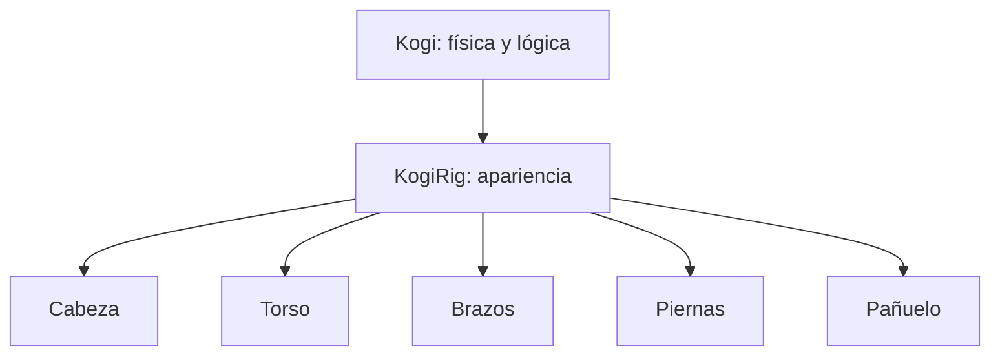

# Sesión 29: preparar a Kogi como personaje modular 🧩

Duración aproximada: **60–90 minutos**.

## 🎯 Objetivo

Sustituiremos la ilustración rígida por una lámina con piezas separadas: cabeza, torso, brazos, piernas y pañuelo. Todavía no las animaremos.

## 1. Comprender el cambio

Una imagen completa se mueve como una sola placa. Un personaje modular divide la apariencia sin dividir la física.

> 💡 **Qué acabas de aprender:** separar el dibujo no significa crear varios jugadores; sigue existiendo un solo GameObject `Kogi`.

## 2. Revisar la lámina

1. Abre `Assets > Kogi > Art > Characters > Kogi`.
2. Selecciona `KogiPartsSheet.png`.
3. Comprueba que tiene fondo transparente.
4. Observa que las piezas no se tocan y tienen prolongaciones en las articulaciones.

Las prolongaciones quedan ocultas debajo de otra pieza y evitan huecos al girar.

## 3. Preparar la importación

1. En el Inspector del PNG, usa `Texture Type = Default`.
2. Activa `Alpha Is Transparency` y `Read/Write`.
3. Desactiva mipmaps.
4. Usa `Compression = None` y pulsa **Apply**.

En esta práctica las piezas se crean como subassets de `KogiRigParts.asset`; por eso la textura se mantiene legible y no usa el corte manual de Sprite Editor.

> 💡 **Qué acabas de aprender:** la textura contiene píxeles; el asset de partes define qué rectángulo se utiliza como cada sprite.

## 4. Conocer KogiRigParts

Abre `Assets/Kogi/Art/Characters/Kogi/Rig/KogiRigParts.asset`. Debe contener once sprites internos. Cada sprite referencia una región de la misma textura, sin duplicar el PNG once veces.

## 5. Comprobar la escena

1. Abre `NivelDesierto`.
2. Expande `Kogi`.
3. Confirma que existe `KogiRig`.
4. El antiguo `KogiVisual` debe estar desactivado.
5. Pulsa ▶️ y confirma que ves un solo Kogi.

## ✅ Comprobación final

- [ ] La lámina tiene transparencia real.
- [ ] `KogiRigParts.asset` contiene once piezas.
- [ ] Existe un solo jugador físico.
- [ ] `KogiRig` es hijo de `Kogi`.
- [ ] Console no muestra errores rojos.

## 🧰 Problemas frecuentes

- **Veo un tablero gris:** el patrón quedó grabado en el PNG; no es transparencia real.
- **Veo dos personajes:** desactiva el Sprite Renderer antiguo de `KogiVisual`.
- **Una pieza aparece blanca:** confirma que su Sprite Renderer tiene un sprite asignado.

---

[⬅️ Sesión anterior](28-posprocesado-global.md) · [🏠 Inicio](../../README.md) · [Siguiente sesión ➡️](30-rig-cutout.md)
