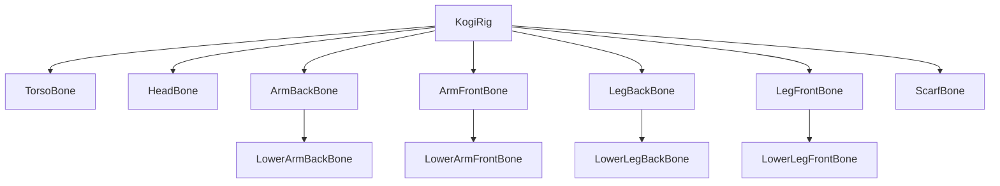

# Sesión 30: construir el rig cutout de Kogi 🦴

Duración aproximada: **60–90 minutos**.

## 🎯 Objetivo

Organizaremos las piezas bajo articulaciones `Transform`. Este sistema se llama rig cutout: rota piezas rígidas alrededor de hombros, codos, caderas y rodillas.

## 1. Rig, hueso y Sprite Skin

En Unity un “hueso” 2D suele ser un `Transform` usado como articulación. `Sprite Skin` deforma una malla flexible alrededor de varios huesos. Como nuestras piezas ya están separadas, usaremos cutout y no necesitamos deformarlas todavía.

| Técnica | Resultado |
|---|---|
| Cutout | Cada pieza rota rígidamente |
| Sprite Skin | Una malla se dobla mediante pesos |

> 💡 **Qué acabas de aprender:** rig es el sistema de articulaciones; Sprite Skin es una técnica posible, no un requisito de todos los rigs.

## 2. Revisar la jerarquía

Expande `Kogi > KogiRig` y localiza:

- `ScarfBone`
- `LegBackBone > LowerLegBackBone`
- `ArmBackBone > LowerArmBackBone`
- `TorsoBone`
- `LegFrontBone > LowerLegFrontBone`
- `ArmFrontBone > LowerArmFrontBone`
- `HeadBone`

## 3. Entender pivotes y parentesco

1. Selecciona `ArmFrontBone`.
2. Gíralo unos grados en Z sin ▶️.
3. Observa que el antebrazo lo acompaña.
4. Deshaz con `Ctrl + Z`.

El hijo hereda la transformación del padre. El pivote del sprite queda cerca de la articulación para que el giro parezca anatómico.

## 4. Orden de dibujo

Las piezas traseras usan órdenes negativos; torso usa `0`; piezas delanteras y cabeza usan valores positivos. Esto decide qué parte tapa a cuál, no su distancia física.

> 💡 **Qué acabas de aprender:** jerarquía controla movimiento heredado; Sorting Order controla superposición visual.

## ✅ Comprobación final

- [ ] Cada antebrazo es hijo de su brazo.
- [ ] Cada pierna inferior es hija de su muslo.
- [ ] Los giros no mueven el collider.
- [ ] Las piezas delanteras se dibujan delante del torso.
- [ ] Console no muestra errores rojos.

## 🧰 Problemas frecuentes

- **Se separa una articulación:** revisa posición local y pivote.
- **Una pierna tapa el torso:** revisa `Order in Layer`.
- **El collider gira:** estás rotando `Kogi`, no un Bone dentro de `KogiRig`.

---

[⬅️ Sesión anterior](29-kogi-modular.md) · [🏠 Inicio](../../README.md) · [Siguiente sesión ➡️](31-animacion-reposo-carrera.md)
