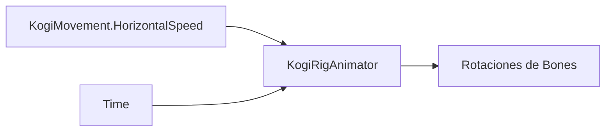

# Sesión 31: animar reposo y carrera 🏃

Duración aproximada: **60–80 minutos**.

## 🎯 Objetivo

Usaremos `KogiRigAnimator` para aplicar movimiento respiratorio en reposo y un ciclo coordinado al correr.

## 1. Entender la animación procedural

En lugar de almacenar fotogramas, un script calcula pequeños giros a partir del tiempo y de la velocidad real.

> 💡 **Qué acabas de aprender:** `Animator Controller` y animación procedural son alternativas compatibles; elegimos la segunda para ajustar rápidamente un rig cutout.

## 2. Reposo

Con velocidad horizontal cercana a cero, el torso oscila `1.2°`, la cabeza compensa `1.8°` y la escala vertical cambia aproximadamente `1.2 %`. El movimiento debe sentirse vivo, no tembloroso.

## 3. Carrera

1. Pulsa ▶️.
2. Mantén izquierda o derecha.
3. Observa brazos y piernas alternados.
4. Comprueba la pequeña elevación del cuerpo.
5. Suelta la dirección: debe regresar al reposo.

Los miembros opuestos usan el mismo seno con signo contrario. Así se obtiene un ciclo continuo sin saltos bruscos.

> 💡 **Qué acabas de aprender:** una fase compartida mantiene coordinado todo el cuerpo.

## ✅ Comprobación final

- [ ] Kogi respira suavemente quieto.
- [ ] Brazos y piernas alternan al correr.
- [ ] Volver a reposo no cambia la física.
- [ ] Funciona mirando a ambos lados.
- [ ] Console no muestra errores rojos.

## 🧰 Problemas frecuentes

- **No se mueve el rig:** comprueba el componente `Kogi Rig Animator`.
- **El ciclo es exagerado:** revisa que la escala de `KogiRig` sea la acordada.
- **Camina pero parece quieto:** confirma que `KogiMovement` esté asignado al animador del rig.

---

[⬅️ Sesión anterior](30-rig-cutout.md) · [🏠 Inicio](../../README.md) · [Siguiente sesión ➡️](32-animacion-aerea-agachado.md)
