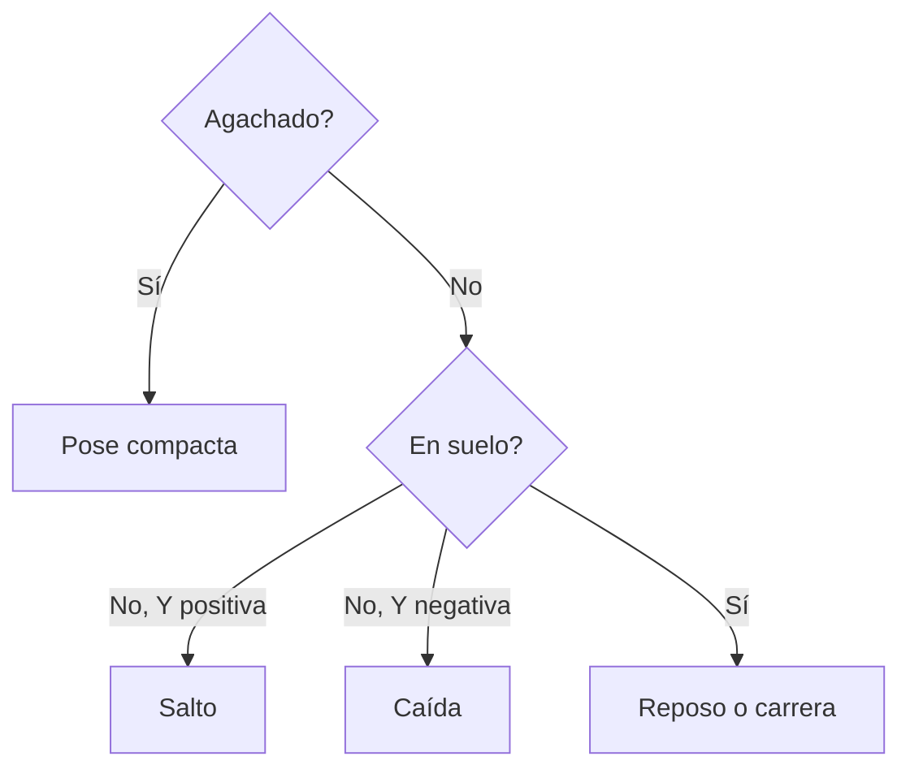

# Sesión 32: animar salto, caída y agachado 🤸

Duración aproximada: **60–80 minutos**.

## 🎯 Objetivo

Crearemos poses distintas según `IsGrounded`, `VerticalSpeed` e `IsCrouching`.

## 1. Elegir el estado

El orden importa: agachado tiene prioridad sobre reposo y carrera; en el aire la velocidad vertical separa subida y bajada.

## 2. Salto y caída

1. Pulsa ▶️ y salta.
2. Durante la subida, observa el cuerpo ligeramente alargado.
3. Durante la caída, observa el cambio de brazos y piernas.
4. Confirma que el collider sigue siendo quien resuelve el aterrizaje.

## 3. Agachado

Mantén `C`. El rig baja `0.22` unidades y reduce su altura visual al `72 %`; el collider se reduce independientemente mediante `KogiCrouch`.

> 💡 **Qué acabas de aprender:** pose visual y tamaño físico pueden reaccionar al mismo estado sin ser el mismo sistema.

## ✅ Comprobación final

- [ ] Subida y caída tienen poses diferentes.
- [ ] Agacharse compacta dibujo y collider.
- [ ] Soltar `C` recupera la pose.
- [ ] Kogi aterriza sin atravesar el suelo.
- [ ] Console no muestra errores rojos.

## 🧰 Problemas frecuentes

- **La pose aérea nunca aparece:** revisa `IsGrounded` y `GroundCheck`.
- **Queda aplastado:** comprueba que `Crouch` sea una acción Button.
- **Se hunde en el suelo:** no cambies el Transform raíz de `Kogi` para animar.

---

[⬅️ Sesión anterior](31-animacion-reposo-carrera.md) · [🏠 Inicio](../../README.md) · [Siguiente sesión ➡️](33-animacion-ataque.md)
