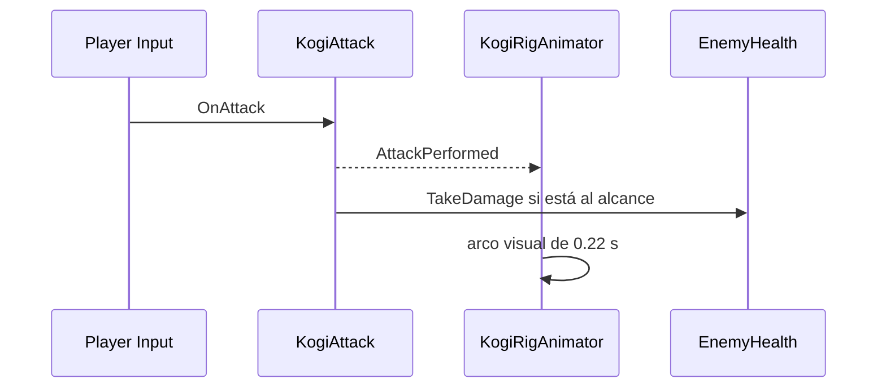

# Sesión 33: animar el ataque de Kogi ⚔️

Duración aproximada: **60–80 minutos**.

## 🎯 Objetivo

Conectaremos el ataque jugable con una pose visual breve mediante un evento C#.

## 1. Publicar un evento

`KogiAttack` ejecuta el daño y emite `AttackPerformed`. `KogiRigAnimator` escucha ese aviso sin duplicar la detección de enemigos.

> 💡 **Qué acabas de aprender:** un evento permite que jugabilidad, animación y sonido reaccionen a la misma acción sin mezclarse.

## 2. Probar el arco

1. Pulsa ▶️.
2. Presiona `Enter`.
3. El brazo delantero debe describir un arco y regresar.
4. Ataca mirando a ambos lados.
5. Confirma que el radio de ataque no cambió.

## 3. Prioridad

Durante `0.22 s`, ataque tiene prioridad visual sobre carrera, aire y agachado. Al finalizar, se recalcula el estado actual y no una pose anterior guardada.

## ✅ Comprobación final

- [ ] Enter sigue dañando al guardia.
- [ ] El brazo delantero realiza el gesto.
- [ ] Funciona a izquierda y derecha.
- [ ] Movimiento y collider no se detienen.
- [ ] Console no muestra errores rojos.

## 🧰 Problemas frecuentes

- **Hay daño pero no gesto:** revisa la referencia `KogiAttack` en `KogiRigAnimator`.
- **El gesto se queda fijo:** confirma que el temporizador disminuya con `Time.deltaTime`.
- **El alcance cambió:** la animación no debe mover `AttackPoint`.

---

[⬅️ Sesión anterior](32-animacion-aerea-agachado.md) · [🏠 Inicio](../../README.md) · [Siguiente sesión ➡️](34-respuesta-visual-dano.md)
