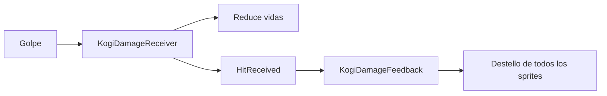

# Sesión 34: añadir respuesta visual al daño 💥

Duración aproximada: **50–70 minutos**.

## 🎯 Objetivo

Haremos que todas las piezas de Kogi destellen en rojo al recibir daño, conservando la invulnerabilidad temporal existente.

## 1. Separar daño y respuesta

`KogiDamageReceiver` resta vida y publica `HitReceived`. `KogiDamageFeedback` modifica temporalmente el color de todos los Sprite Renderer del rig.

> 💡 **Qué acabas de aprender:** feedback comunica una regla al jugador, pero no debe convertirse en la regla que intenta representar.

## 2. Probar el destello

1. Pulsa ▶️.
2. Acércate a un guardia o proyectil.
3. Al perder vida, las piezas cambian entre blanco y rojo durante `0.35 s`.
4. Confirma que la invulnerabilidad completa sigue durando `1.5 s`.
5. Comprueba que todas las piezas reaparecen blancas.

## 3. Entender el grupo visual

El array `Renderers` contiene once Sprite Renderer. Tratar el conjunto evita que solo destelle el torso mientras las extremidades permanecen normales.

## ✅ Comprobación final

- [ ] Un golpe reduce una sola vida.
- [ ] Todo Kogi destella, no una única pieza.
- [ ] El color vuelve a blanco.
- [ ] La invulnerabilidad continúa funcionando.
- [ ] Console no muestra errores rojos.

## 🧰 Problemas frecuentes

- **Solo cambia una pieza:** revisa el array `Renderers`.
- **Kogi permanece rojo:** la corrutina debe restaurar `Color.white`.
- **Pierde muchas vidas seguidas:** no elimines la protección `isInvulnerable`.

---

[⬅️ Sesión anterior](33-animacion-ataque.md) · [🏠 Inicio](../../README.md) · [Siguiente sesión ➡️](35-sonidos-de-kogi.md)
