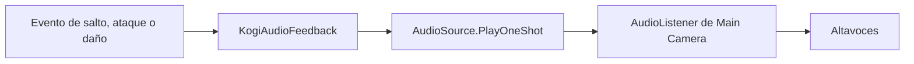

# Sesión 35: añadir sonidos a las acciones 🔊

Duración aproximada: **60–80 minutos**.

## 🎯 Objetivo

Reproduciremos sonidos provisionales al saltar, atacar y recibir daño mediante un `AudioSource` y eventos.

## 1. Conocer AudioListener y AudioSource

| Componente | Responsabilidad |
|---|---|
| `AudioListener` | Representa los oídos del jugador; normalmente está en Main Camera |
| `AudioSource` | Reproduce uno o varios AudioClip desde un GameObject |
| `AudioClip` | Contiene el sonido importado |

> 💡 **Qué acabas de aprender:** AudioClip es el recurso; AudioSource lo reproduce; AudioListener recibe el resultado.

## 2. Revisar los clips

Abre `Assets/Kogi/Audio/SFX/Player`. Encontrarás `KogiJump`, `KogiAttack` y `KogiHurt`. Son tonos sintetizados provisionales para aprender el flujo; serán sustituidos durante producción de sonido.

## 3. Revisar Kogi

1. Selecciona `Kogi`.
2. Comprueba que contiene `Audio Source`.
3. `Play On Awake` debe estar desactivado.
4. `Spatial Blend` debe ser `0` para sonido 2D.
5. Comprueba `Kogi Audio Feedback` y sus tres clips.

Usamos `PlayOneShot` para que un ataque pueda sonar aunque otro clip corto todavía esté terminando.

## 4. Probar

1. Pulsa ▶️.
2. Salta: debe sonar un tono ascendente corto.
3. Ataca con Enter: debe sonar un golpe breve.
4. Recibe daño: debe sonar un tono descendente.
5. Confirma que cada acción ocurre una sola vez por pulsación o golpe.

## ✅ Comprobación final

- [ ] Main Camera conserva un solo AudioListener.
- [ ] Kogi tiene un AudioSource 2D.
- [ ] Los tres clips están asignados.
- [ ] Salto, ataque y daño producen sonidos distintos.
- [ ] La jugabilidad funciona igual con el volumen silenciado.
- [ ] Console no muestra errores rojos.

## 🧰 Problemas frecuentes

- **No se oye nada:** revisa el icono de altavoz de Game y el volumen del sistema.
- **Suena al comenzar:** desactiva `Play On Awake` en Audio Source.
- **Unity avisa de dos listeners:** deja AudioListener únicamente en Main Camera.
- **El sonido cambia al mover la cámara:** usa `Spatial Blend = 0` para estos efectos de interfaz jugable.

---

[⬅️ Sesión anterior](34-respuesta-visual-dano.md) · [🏠 Inicio](../../README.md)
