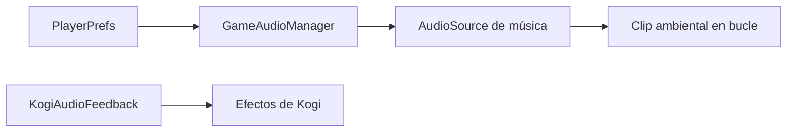

# Sesión 36: música ambiental y mezcla de audio 🎵

Duración aproximada: 45–60 minutos.

## 🎯 Objetivo

Separar conceptualmente la música de los efectos, reproducir un ambiente nocturno continuo y conservar los volúmenes elegidos.

## ⭐ Lo nuevo

- Un **gestor persistente** sobrevive a los cambios de escena con `DontDestroyOnLoad`.
- `AudioSource` reproduce un `AudioClip`; no son el mismo objeto.
- Música y efectos necesitan volúmenes independientes.
- `PlayerPrefs` conserva preferencias pequeñas entre ejecuciones.

## 1. Comprender el flujo

`GameAudioManager` se crea antes de cargar la escena. Su música no depende de Kogi ni de un nivel concreto.

> 💡 **Qué acabas de aprender:** los servicios globales representan reglas compartidas por todo el juego.

## 2. Crear el gestor

1. Abre `Assets > Kogi > Scripts > Audio`.
2. Crea `GameAudioManager.cs`.
3. Declara una instancia estática `Instance`.
4. Créala con `RuntimeInitializeOnLoadMethod`.
5. Llama a `DontDestroyOnLoad` para conservarla.
6. Añade internamente un `AudioSource` 2D, en bucle y sin `Play On Awake`.

No arrastramos este script a la escena: el atributo de inicialización lo crea automáticamente.

## 3. Separar los volúmenes

1. Define `MusicVolume` y `EffectsVolume` entre `0` y `1`.
2. Usa `SetMusicVolume` para modificar el `AudioSource` musical.
3. Usa `SetEffectsVolume` como referencia para los sonidos de acciones.
4. Guarda ambos valores mediante `PlayerPrefs`.

Un valor `0` significa silencio y `1` representa el volumen completo del canal.

> 💡 **Qué acabas de aprender:** mezclar audio consiste en equilibrar categorías, no solamente en subir el volumen general.

## 4. Probar

1. Abre `NivelDesierto`.
2. Pulsa ▶️.
3. Escucha un tono ambiental grave y discreto.
4. Cambia de escena cuando exista un portal: la música no debe reiniciarse.
5. Comprueba que salto, ataque y daño continúan sonando.

## ✅ Comprobación final

- [ ] Existe un solo `GameAudioManager` durante la ejecución.
- [ ] La música se reproduce en bucle.
- [ ] El gestor sobrevive a los cambios de escena.
- [ ] Música y efectos tienen valores independientes.
- [ ] Console no muestra errores rojos.

## 🧰 Problemas frecuentes

- **Se crean dos gestores:** conserva la comprobación de `Instance` dentro de `Awake`.
- **La música vuelve a empezar:** confirma `DontDestroyOnLoad`.
- **El ambiente tapa los efectos:** reduce el volumen musical; el valor inicial es `0.32`.
- **No se oye nada:** comprueba que Game no esté silenciado y que exista un `AudioListener` en Main Camera.

---

[⬅️ Sesión anterior](35-sonidos-de-kogi.md) · [🏠 Inicio](../../README.md) · [Siguiente sesión ➡️](37-pausa.md)
